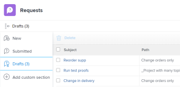

# Verzoeken maken op basis van concepten

 de benadrukte informatie op deze pagina verwijst naar functionaliteit nog niet algemeen beschikbaar. Het is beschikbaar slechts in het milieu van de Sandbox van de Voorproef.

Naast het gebruik van de beschikbare concepten die Workfront u voorstelt wanneer u een nieuw verzoek invoert, kunt u ook een conceptverzoek vanuit de sectie Concepten openen en de aanvraag van daaruit voltooien.

## Toegangsvereisten

+++ Breid uit om de toegangseisen voor de functionaliteit in dit artikel weer te geven.

<table style="table-layout:auto"> 
 <col> 
 <col> 
 <tbody> 
  <tr> 
   <td role="rowheader">Adobe Workfront-pakket</td> 
   <td> 
Alle 
 </td> 
  </tr> 
  <tr> 
   <td role="rowheader">Adobe Workfront-licentie</td> 
   <td> 
Medewerker of hoger

   
Aanvraag of hoger

    </td> 
  </tr> 
  <tr> 
   <td role="rowheader">Configuraties op toegangsniveau</td> 
   <td> 
Toegang tot problemen bewerken
  </td> 
  </tr> 
  <tr> 
   <td role="rowheader"> Product</td> 
   <td> <ul><li>Adobe Workfront</li><li>U moet Adobe Workfront Planning hebben om de verzoeken van de Planning te bekijken of om formulieren te verzoeken</td> 
  </tr> 
 </tbody> 
</table>

Voor informatie, zie [&#x200B; vereisten van de Toegang in de documentatie van Workfront &#x200B;](/help/quicksilver/administration-and-setup/add-users/access-levels-and-object-permissions/access-level-requirements-in-documentation.md).

+++

## Vereisten voor het maken van aanvragen van concepten

U moet het volgende doen alvorens u een verzoek van een ontwerp kunt tot stand brengen:

* Start met het maken van een aanvraag. Hiermee slaat u het verzoek automatisch als een concept op in de sectie Concepten.

  Voor informatie over het creëren van verzoeken, zie [&#x200B; Adobe Workfront verzoeken &#x200B;](../../../manage-work/requests/create-requests/create-submit-requests.md) creëren en voorleggen.

## Verzoeken maken op basis van concepten

De procedure voor het maken van verzoeken vanuit concepten verschilt tussen de nieuwe ervaring die u opvraagt en de ervaring die u hebt opgedaan.

* [&#x200B; creeer verzoeken van concepten in nieuwe het vragen ervaring &#x200B;](#create-requests-from-drafts-in-the-new-requesting-experience)
* [Verzoeken maken op basis van concepten uit de oudere aanvraagervaring](#create-requests-from-drafts-in-the-legacy-requesting-experience)

### Verzoeken maken op basis van concepten in de nieuwe ervaring die u opvraagt

1. Open het concept.

   U vindt concepten op de volgende locaties:

   * In de lijst met verzoeken op het gebied Verzoeken
   * In de lijst met verzoeken in de widget Mijn verzoeken thuis
   * In het dialoogvenster Nieuw verzoek (bevat alleen concepten van verzoeken die zijn gemaakt met het geselecteerde formulier)

   >[!NOTE]
   >
   >Concepten die zijn gemaakt in de oudere aanvraagervaring, zijn niet beschikbaar in de nieuwe aanvraagervaring.

1. Werk de informatie voor het verzoek bij zoals die in [&#x200B; wordt beschreven leidt tot en legt verzoeken van Adobe Workfront &#x200B;](../../../manage-work/requests/create-requests/create-submit-requests.md) voor.
1. (Facultatief en voorwaardelijk) op om het even welk punt tijdens het ingaan van het verzoek, klik **verwerpen** ontwerp als u het ontwerp wilt schrappen. Hiermee verwijdert u het concept.

   Als u uw ontwerp door fout hebt verworpen, kunt u **&#x200B;**&#x200B;in het bericht bij de bodem van het scherm onmiddellijk klikken ongedaan maken. Deze optie is slechts enkele seconden beschikbaar.

   Voor meer informatie over het schrappen van concepten, zie [&#x200B; een voorgelegd verzoek of verzoekontwerp &#x200B;](../../../manage-work/requests/create-requests/delete-request-draft.md) schrappen.

1. (Optioneel) Als u wijzigingen in het concept wilt opslaan zonder het te verzenden, laat u de pagina Nieuw verzoek achter. Wijzigingen worden automatisch opgeslagen.

1. Na de voltooiing van de informatie voor het verzoek, klik **voorleggen**.

   Wanneer u het verzoek indient, wordt het concept verwijderd en kan het niet worden hersteld.

### Verzoeken maken op basis van concepten uit de oudere aanvraagervaring

{{step1-to-requests}}

1. Selecteer **Concepten** in het linkerpaneel.

   Een ontwerp voor elk rijonderwerp van elke verzoekrij toont in deze lijst.

   

1. (Optioneel) Klik op een kolomkop om de lijst op die kolom te sorteren.

1. Controleer de informatie over elk concept in de volgende kolommen van de lijst Concepten:

   | Onderwerp | Dit is de naam die u hebt opgegeven bij het maken van uw verzoek. |
   | --- | --- |
   | Pad | De naam van de verzoekrij, onderwerpgroepen, en rijonderwerpen waar u oorspronkelijk van plan was om het verzoek voor te leggen. |
   | Invoerdatum | De datum waarop u het maken van de aanvraag hebt gestart. |
   | Datum laatste update | De laatste van uw laatste update. Als u het niet bijwerkte aangezien u eerst het verzoek begon, zouden de Datum van de Ingang en de Laatste Datum van de Update het zelfde moeten zijn. |

   {style="table-layout:auto"}

1. (Facultatief) Gebruikend de snelle filter in de hoger-juiste hoek van de lijst van Concepten, begin de naam van een opgesteld verzoek, verzoekrij, rijonderwerp, of onderwerpgroep te typen, dan klik de naam van een ontwerp om het te openen.

   >[!TIP]
   >
   >U kunt geen permanente filters toepassen in de sectie Concepten van het gebied Verzoeken. Bovendien zijn er geen opties om de weergave van de lijst met concepten te wijzigen of te wijzigen.

1. Werk de informatie voor het verzoek bij zoals die in [&#x200B; wordt beschreven leidt tot en legt verzoeken van Adobe Workfront &#x200B;](../../../manage-work/requests/create-requests/create-submit-requests.md) voor.
1. (Facultatief en voorwaardelijk) op om het even welk punt tijdens het ingaan van het verzoek, klik **verwerpen** ontwerp als u het ontwerp wilt schrappen. Hiermee verwijdert u het concept dat niet kan worden hersteld. Voor meer informatie over het schrappen van concepten, zie [&#x200B; een verzoekontwerp &#x200B;](../../../manage-work/requests/create-requests/delete-request-draft.md) schrappen.

1. (Facultatief) klik **annuleert** in de laag-linkerhoek van de pagina als u uw actie wilt terugkeren en het ontwerp houden.

1. Voer een van de volgende handelingen uit nadat u de informatie voor het verzoek hebt voltooid:

   * Klik **voorleggen** als u bereid bent om het verzoek voor te leggen. De aanvraag wordt opgeslagen in de sectie Verzenden. Afhankelijk van de Verpletterende Regel van de Rij van het Verzoek, zou dit verzoek aan een verschillend project dan kunnen worden verpletterd die als Rij van het Verzoek wordt aangewezen. Voor informatie over het verpletteren van regels, zie [&#x200B; het Verpletteren van Regels &#x200B;](../../../manage-work/requests/create-and-manage-request-queues/create-routing-rules.md) creëren.

     of

     Klik **dicht** als u niet behoorlijk bereid bent om het voor te leggen en u zou kunnen terugkomen en het later beëindigen. Uw verzoek wordt opgeslagen in de sectie Concepten. De volgende keer dat u een aanvraag voor deze aanvraagwachtrij verzendt, is deze beschikbaar.

     

     Wanneer u het verzoek indient, wordt het concept verwijderd en kan het niet worden hersteld.

