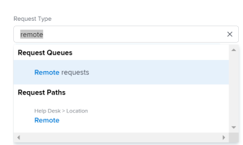

# Aanvragen maken en verzenden

 de benadrukte informatie op deze pagina verwijst naar functionaliteit nog niet algemeen beschikbaar. Het is beschikbaar slechts in het milieu van de Sandbox van de Voorproef.

<!--Audited: 12/2023-->

<!--

(NOTE: Linked to the UI - do not change/ remove; THIS IS NOW SPLIT IN THREE ARTICLES>> MAKE SURE THE TRANSITION TO THE OTHER TWO IS CLEAR SINCE THIS IS LINKED TO UI)

(NOTE: If they come out with templates AND drafts, consider splitting this article to keep Create in one and Working with Drafts and Requests in another??)

(NOTE: this article is linked from Submitting Workfront Requests from Salesforce) 

-->

Geplande werkzaamheden worden in Adobe Workfront vertegenwoordigd door projecten en taken. U kunt echter werken in een omgeving waar ongeplande werkzaamheden, in de vorm van verzoeken, op elk moment kunnen worden uitgevoerd. Workfront biedt een workflow voor het aanpassen van dit type omgeving via het gebruik van Request Queues.

Nadat u een verzoek in een Rij van het Verzoek creeert, kunt u of het toewijzen om worden voltooid of u kunt het in een taak of een project omzetten.\
Voor meer informatie over het omzetten van kwesties in een taak of een project, zie het artikel [&#x200B; Overzicht van het omzetten van kwesties in Adobe Workfront &#x200B;](../../../manage-work/issues/convert-issues/convert-issues.md).

U kunt op de volgende manieren een Workfront-aanvraag maken:

* Geheel opnieuw, zoals beschreven in dit artikel.
* Van concepten. Voor informatie, zie [&#x200B; verzoeken van concepten &#x200B;](../../../manage-work/requests/create-requests/create-requests-from-drafts.md) creëren.
* Van een bestaand verzoek, door een exemplaar te kopiëren en voor te leggen. Voor informatie, zie [&#x200B; Exemplaar en leg verzoeken &#x200B;](../../../manage-work/requests/create-requests/copy-and-submit-requests.md) voor.

U kunt op de volgende manieren een Workfront-planningsverzoek helemaal zelf maken om records te maken in Workfront Planning:

* Via een koppeling naar een aanvraagformulier voor Workfront-planning.

* Vanuit een formulier voor planningsaanvragen van Workfront in het gebied Verzoeken van Workfront.

  Uw organisatie moet een pakket voor Workfront-planning aanschaffen. Voor informatie, zie [&#x200B; de Verzoeken van de Planning van Adobe Workfront voorleggen om verslagen &#x200B;](/help/quicksilver/planning/requests/submit-requests.md) tot stand te brengen.

## Toegangsvereisten

+++ Breid uit om de toegangseisen voor de functionaliteit in dit artikel weer te geven.

<table style="table-layout:auto"> 
 <col> 
 <col> 
 <tbody> 
 <tbody> 
  <tr> 
   <td role="rowheader">Adobe Workfront-pakket</td> 
   <td> 
Alle 
 </td> 
  </tr> 
  <tr> 
   <td role="rowheader">Adobe Workfront-licentie</td> 
   <td> 
Medewerker of hoger

   
Aanvraag of hoger

    </td> 
  </tr> 
  <tr> 
   <td role="rowheader">Configuraties op toegangsniveau</td> 
   <td> 
Toegang tot problemen bewerken
  </td> 
  </tr> 
  <tr> 
   <td role="rowheader"> Product</td> 
   <td> <ul><li>Adobe Workfront</li><li>U moet Adobe Workfront Planning hebben om de verzoeken van de Planning te bekijken of om formulieren te verzoeken</td> 
  </tr> 
 </tbody> 
</table>

Voor informatie, zie [&#x200B; vereisten van de Toegang in de documentatie van Workfront &#x200B;](/help/quicksilver/administration-and-setup/add-users/access-levels-and-object-permissions/access-level-requirements-in-documentation.md).

+++

## Vereisten voor het gebruik van aanvraagwachtrijen

Een Workfront-beheerder moet aanvraagwachtrijen maken en beschikbaar stellen aan gebruikers voordat deze functie kan worden gebruikt. Een gebruiker met een Planner-licentie en met de machtiging Bewerken tot projecten en Beheren voor een specifiek project kan ook aanvraagwachtrijen maken.

Voor informatie over hoe te om de Rijen van Verzoeken tot stand te brengen, zie het artikel [&#x200B; een Rij van het Verzoek &#x200B;](../../../manage-work/requests/create-and-manage-request-queues/create-request-queue.md) creëren.

Een Workfront-beheerder moet de volgende componenten van een aanvraagwachtrij maken:

* Een project in Huidige status, die als Rij van het Verzoek van de Hulp wordt gepubliceerd.
* De Onderwerpen van de rij.\
  Voor meer informatie, zie het artikel [&#x200B; leidt tot de Onderwerpen van de Rij &#x200B;](../../../manage-work/requests/create-and-manage-request-queues/create-queue-topics.md).

* Verpletterend Regels.\
  Voor meer informatie, zie het artikel [&#x200B; het Verpletteren van Regels &#x200B;](../../../manage-work/requests/create-and-manage-request-queues/create-routing-rules.md) creëren.

* (Optioneel) Onderwerpgroepen.\
  Voor meer informatie, zie het artikel [&#x200B; creëren de Groepen van het Onderwerp &#x200B;](../../../manage-work/requests/create-and-manage-request-queues/create-topic-groups.md).

* (Optioneel) Aangepast formulier aanvragen.\
  Voor meer informatie, zie het artikel [&#x200B; een douaneformulier &#x200B;](/help/quicksilver/administration-and-setup/customize-workfront/create-manage-custom-forms/form-designer/design-a-form/design-a-form.md) creëren.

* (Optioneel) Verzoek om goedkeuring.\
  Voor meer informatie, zie het artikel [&#x200B; een goedkeuringsproces voor het werkpunten &#x200B;](../../../administration-and-setup/customize-workfront/configure-approval-milestone-processes/create-approval-processes.md) creëren.

## Verzoeken maken en concepten genereren in de Workfront-webapp

Wanneer u een verzoek maakt in de Workfront-webapp, slaat Workfront het verzoek op als een concept voordat u het verzendt. Workfront maakt een concept zodra je de wachtrij met aanvragen hebt geselecteerd en gegevens voor de wachtrij hebt ingevoerd.

U kunt doorgaan met het verzenden van de aanvraag, of u kunt alle beschikbare gegevens invullen en er vanaf navigeren om deze later te voltooien. Workfront bewaart het opgestelde verzoek dat u in de omslag van Concepten  of in de verzoekenlijst begon.

>[!IMPORTANT]
>
>Houd rekening met het volgende wanneer u werkt met concepten:
>
>* Workfront maakt geen conceptaanvragen wanneer u deze vanuit een externe toepassing verzendt, zoals ze naar Workfront verzendt of ze met een andere toepassing maakt. Wanneer u een aanvraag indient van buiten de Workfront-webtoepassing, wordt de aanvraag opgeslagen in de sectie Verzenden.
>* Als de structuur van een aanvraagwachtrij verandert, hebt u geen toegang meer tot bestaande concepten. Bijvoorbeeld, als een rijonderwerp wordt verwijderd, of een onderwerpgroep wordt toegevoegd, zijn de bewaarde concepten niet meer toegankelijk.
>

Voor informatie over het creëren van verzoeken van bestaande concepten, zie [&#x200B; verzoeken van concepten &#x200B;](../../../manage-work/requests/create-requests/create-requests-from-drafts.md) creëren. Voor informatie over het schrappen van verzoekconcepten, zie ook [&#x200B; Schrapping een verzoekontwerp &#x200B;](../../../manage-work/requests/create-requests/delete-request-draft.md).

Een aanvraag maken in de Workfront-webapp:

{{step1-to-requests}}

1. (Facultatief en voorwaardelijk) selecteer de **Schakelaar aan nieuwe ervaring** plaatsend in het hoger-recht van het scherm.

1. Klik **Nieuw Verzoek** in de hoger-juiste hoek van de pagina.

   >[!TIP]
   >
   >* U kunt tot de Nieuwe verzoekoptie van om het even welke sectie op het gebied van Verzoeken toegang hebben.
   >* De optie Nieuw verzoek is grijs als u geen toegang hebt om uitgaven te maken.

   Het **Nieuwe verzoek** vakje opent.

1. (Voorwaardelijk) Als u naar de nieuwe ervaring bent overgeschakeld, selecteert u een van de paden of formulieren in de wachtrij voor Workfront-aanvragen of klikt u op de zoekbalk.

   Wanneer u op de zoekbalk klikt, wordt een vervolgkeuzelijst weergegeven met de laatst gebruikte wachtrijen en formulieren. Selecteer een item in de lijst of typ een item en selecteer de wachtrij of het formulier wanneer deze wordt weergegeven.

   >[!NOTE]
   >
   >Overweeg het volgende met betrekking tot de nieuwe ervaring die u opvraagt:
   >* De lijst bevat zowel aanvraagrijen voor Workfront als aanvraagformulieren voor Workfront Planning.
   >* U kunt de lijst filteren op objecttype.
   >*  in de nieuwe het vragen ervaring, worden de ontwerpen gevonden in de zelfde lijst zoals voorgelegde verzoeken .

1. (Voorwaardelijk) als u op de nieuwe ervaring schakelde, uw onderwerpgroepen en rijonderwerpen selecteert en blijft het formulier bijwerken.

   Anders, klik binnen het **gebied van het Type van Verzoek** en doe één van het volgende:

   * Van de **Recente sectie van Wegen**, selecteer een weg u onlangs gebruikte om een verzoekrij te openen. Een weg omvat de verzoekrij, de onderwerpgroepen, en het rijonderwerp dat u onlangs indiende. De laatste drie paden worden standaard weergegeven.

     >[!NOTE]
     >
     >Workfront slaat alleen een pad op als je er een aanvraag voor hebt ingediend. Er worden geen paden voor opgestelde verzoeken gemaakt.

     

   * Van de **sectie van de Vragen van het Verzoek**, selecteer een verzoekrij.
   * Voer een trefwoord in dat bij een eerder geopend pad hoort om naar een aanvraagwachtrij te zoeken.

     Bijvoorbeeld, als u een verzoekrij genoemd &quot;Helpdesk&quot;met een Groep van het Onderwerp genoemd &quot;Plaats&quot;en een Onderwerp van de Rij genoemd &quot;Verre&quot;hebt, kunt u &quot;ver&quot;en alle verzoekrijen typen die &quot;ver&quot;in om het even welk element van hun wegvertoning bevatten.

     >[!TIP]
     >
     >Wanneer u een naam typt die een speciaal karakter bevat, de verzoekrij, het rijonderwerp, of de vertoning van de onderwerpgroep zelfs wanneer u het typen van het karakter weglaat.

     

     De lijst met beschikbare aanvraagrijen en recente paden wordt dynamisch bijgewerkt en bevat alleen paden die het trefwoord bevatten dat in de resultaten is gemarkeerd.

     De resultaten van de zoekopdracht worden weergegeven in de volgende gebieden:

     <table style="table-layout:auto"> 
      <col> 
      <col> 
      <tbody> 
       <tr> 
        <td role="rowheader">Wachtrijen aanvragen</td> 
        <td>De rijen van het verzoek die het sleutelwoord in hun naam bevatten</td> 
       </tr> 
       <tr> 
        <td role="rowheader">Paden aanvragen</td> 
        <td> 
Paden (die aanvraagrijen, onderwerpgroepen, rijonderwerpen omvatten) die het sleutelwoord in om het even welke namen van hun elementen bevatten
 </td> 
       </tr> 
      </tbody> 
     </table>

   >[!TIP]
   >
   >* De eerste 200 verzoekrijen tonen door gebrek, in alfabetische orde.
   >* De naam van de verzoekrij is de naam van het project dat als Rij van het Verzoek van de Hulp is gepubliceerd.
   >* De beschrijving van het project dat als de geselecteerde vertoningen van de verzoekrij aan het recht van de naam van de verzoekrij wordt gevormd.
   >   
   >Voor meer informatie over hoe te om een project als Rij van het Verzoek van de Hulp te publiceren, zie het artikel [&#x200B; een Rij van het Verzoek &#x200B;](../../../manage-work/requests/create-and-manage-request-queues/create-request-queue.md) creëren.

1. In de **Nieuwe verzoek** vorm, doe één van het volgende:

   * (Voorwaardelijk) selecteer een beschikbaar ontwerp van het berichtbericht dat onder het gebied van het Type van Verzoek wordt getoond.

     Dit gebied wordt alleen weergegeven als u concepten hebt opgeslagen voordat u ze verzendt.

     De drie meest recente concepten van drie verschillende rijonderwerpen worden standaard weergegeven.

     

   * Voer een nieuwe aanvraag in de geselecteerde wachtrij in.

     Een nieuw concept wordt automatisch voor u opgeslagen in de sectie Concepten nadat u informatie voor het nieuwe verzoek hebt ingevoerd en u het verzoek een naam geeft in het veld Onderwerp.

1. (Optioneel) Als uw aanvraagwachtrij onderwerpgroepen bevat, selecteert u de naam van de onderwerpgroep in het eerste vervolgkeuzeveld. Anders, selecteer een Onderwerp van de Rij.

   >[!TIP]
   >
   >Wanneer u over een Onderwerpgroep of een Onderwerp van de Rij beweegt, toont het gebied van de Beschrijving aan het recht. Dit bevat extra informatie over de onderwerpgroep of het rijonderwerp.
   >
   >
   >
   >

   U kunt tot 10 rijen van Onderwerpgroepen hebben die in uw Rij van het Verzoek worden gebouwd.\
   Voor meer informatie over hoe te om tot de Groepen van het Onderwerp te leiden, zie het artikel [&#x200B; tot de Groepen van het Onderwerp &#x200B;](../../../manage-work/requests/create-and-manage-request-queues/create-topic-groups.md). Voor meer informatie over het creëren van de Onderwerpen van de Rij, zie het artikel [&#x200B; de Onderwerpen van de Rij &#x200B;](../../../manage-work/requests/create-and-manage-request-queues/create-queue-topics.md) creëren.

   >[!TIP]
   >
   >Als u een concept of een vorig pad hebt geselecteerd, zijn de onderwerpgroepen en de rijonderwerpen al geselecteerd. U kunt desgewenst een andere selectie maken.

1. Afhankelijk van welke gebieden de beheerder van Workfront in de **Nieuwe sectie van de Uitgave van Velden** van de **Details van de Rij** subtab op het project werd toegelaten, zou u om het even welke volgende gebieden kunnen vinden wanneer u een nieuw verzoek indient:

   <table style="table-layout:auto"> 
    <col> 
    <col> 
    <tbody> 
     <tr> 
      <td role="rowheader"><strong> Onderwerp </strong> </td> 
      <td>Geef een naam op voor uw aanvraag. Dit is een verplicht veld.</td> 
     </tr> 
     <tr> 
      <td role="rowheader"><strong> Beschrijving </strong> </td> 
      <td>Geef een beschrijving op voor uw aanvraag.</td> 
     </tr> 
     <tr> 
      <td role="rowheader"><strong> URL </strong> </td> 
      <td> 
Geef een URL op die betrekking kan hebben op uw verzoek.
 </td> 
     </tr> 
     <tr> 
      <td role="rowheader"><strong> Prioriteit </strong> </td> 
      <td> 
Geef een prioriteit voor uw verzoek op. De prioriteit moet bepalen hoe snel u vindt dat dit verzoek moet worden opgelost. De standaardopties zijn: 
 
       <ul> 
        <li>Geen</li> 
        <li>Laag </li> 
        <li>Normaal</li> 
        <li>Hoog</li> 
        <li>Dringend</li> 
       </ul> 
Uw systeembeheerder kan de namen van prioriteiten wijzigen.
 </td> 
     </tr> 
     <tr> 
      <td role="rowheader"><strong> Ernst </strong> </td> 
      <td> 
Geef de ernst van uw verzoek op. De ernst moet bepalen welke invloed dit verzoek op uw werk heeft als het niet op tijd wordt opgelost. De standaardopties zijn:
 
       <ul> 
        <li>Cosmetisch</li> 
        <li>Verwardheid</li> 
        <li>Fout met tijdelijke oplossing</li> 
        <li>Fout zonder tijdelijke oplossing</li> 
        <li>Fatale fout</li> 
       </ul> 
De systeembeheerder kan de namen van de bestandscontroles wijzigen.
 </td> 
     </tr> 
     <tr> 
      <td role="rowheader"><strong> Primair Contact </strong> </td> 
      <td>De primaire contactpersoon van een verzoek blijft standaard bij u, aangezien u de puntpersoon bent die vragen met betrekking tot het verzoek behandelt. U kunt dit echter wijzigen in elke andere Workfront-gebruiker.</td> 
     </tr> 
     <tr data-mc-conditions="QuicksilverOrClassic.Quicksilver"> 
      <td role="rowheader"><strong> Taken </strong> </td> 
      <td> 
 specificeer de naam van een actieve gebruiker, baanrol, of een team dat het verzoek zou moeten worden toegewezen aan. 
 
U kunt slechts één team opgeven.

   
 Afhankelijk van hoe de verzoekrij opstelling was, zou u één of twee soorten middel aan het verzoek kunnen slechts toewijzen, in plaats van alle drie (bijvoorbeeld, zou u het verzoek aan gebruikers kunnen slechts kunnen toewijzen).

   
Als een verpletterende regel ook aan de verzoekrij wordt geassocieerd en het het verzoek aan een verschillend type van middel (bijvoorbeeld, een team) automatisch leidt, wordt uw verzoek toegewezen aan zowel de entiteit die u manueel wanneer het voorleggen van het verzoek (gebruikers) en het middel specificeert in de verpletterende regel (het team). 

   
 Raadpleeg de volgende artikelen voor meer informatie:
 
      <ul> 
      <li> 
<a href="../../../manage-work/requests/create-and-manage-request-queues/create-request-queue.md" class="MCXref xref"> creeer een Rij van het Verzoek </a> 
 </li> 
      <li> 
<a href="../../../manage-work/requests/create-and-manage-request-queues/create-routing-rules.md" class="MCXref xref"> creeer Verpletterend Regels </a>   
 </li> 
      </ul> 

   
 wij adviseren het gebruiken van het Verpletteren van Regels voor uw Opeenvolging van het Verzoek zodat zij automatisch aan de aangewezen middelen kunnen worden verpletterd. 
 </td> 
     </tr>

   <tr> 
      <td role="rowheader"><strong> Geplande Uren </strong> </td> 
      <td> 
Schatting hoeveel uren het voor dit verzoek om voltooien zou vergen.
 </td> 
     </tr> 
     <tr> 
      <td role="rowheader"><strong> Geplande Datum van het Begin </strong> </td> 
      <td> 
Geef de datum op waarop de werkzaamheden aan dit verzoek moeten beginnen.
 </td> 
     </tr> 
     <tr> 
      <td role="rowheader"><strong> Geplande de Datum van de Voltooiing </strong> </td> 
      <td>Geef de datum op waarop u dit verzoek wilt laten oplossen.</td> 
     </tr> 
     <tr> 
      <td role="rowheader"><strong> Status </strong> </td> 
      <td>De standaardstatus van een nieuw verzoek is "Nieuw." Mogelijk is de naam van deze status gewijzigd door uw systeembeheerder. U kunt de status ook wijzigen in iets anders vanuit dit keuzemenu.</td> 
     </tr> 
     <tr> 
      <td role="rowheader"><strong> Documenten </strong> </td> 
      <td> 
Voeg documenten toe aan uw verzoek. 
 
 Afhankelijk van hoe de verzoekrij opstelling was, zou de sectie van Documenten vóór of na de douanevelden kunnen tonen. 
 
Documenten die u uploadt naar Workfront worden 24 uur lang opgeslagen in een geschreven aanvraag. Daarna, moet u hen opnieuw aanhalen wanneer u terugkeert om het ontwerp uit te geven en voor te leggen. Documenten die via andere stations zijn gekoppeld, worden permanent in het concept opgeslagen. 
 </td> 
     </tr> 
    </tbody> 
   </table>

1. (Optioneel) Als uw Workfront-beheerder een aangepast formulier heeft gekoppeld aan de aanvraagwachtrij of het onderwerp van de wachtrij, geeft u de velden in het aangepaste formulier op.\
   Aangepaste formulieren verschillen voor elk Workfront-exemplaar.
1. (Facultatief en voorwaardelijk) op om het even welk punt tijdens het ingaan van het verzoek, klik [!UICONTROL **verwerpen ontwerp**] als u het ontwerp wilt schrappen dat automatisch wordt gecreeerd. Hiermee verwijdert u het concept dat niet kan worden hersteld. Er wordt een bevestigingsbericht weergegeven om te bevestigen dat u het concept verwijdert.

1. (Facultatief) klik [!UICONTROL **ongedaan maken**] op het bevestigingsbericht als u uw actie wilt terugkeren en het ontwerp houden.

1. Voer een van de volgende handelingen uit:

   * Klik **voorleggen** als u bereid bent om het verzoek voor te leggen. De aanvraag wordt opgeslagen in de sectie Verzenden. Afhankelijk van de Verpletterende Regel van de Rij van het Verzoek, zou dit verzoek aan een verschillend project dan kunnen worden verpletterd die als Rij van het Verzoek wordt aangewezen. Voor informatie over het verpletteren van regels, zie [&#x200B; het Verpletteren van Regels &#x200B;](../../../manage-work/requests/create-and-manage-request-queues/create-routing-rules.md) creëren.

     of

     Klik **dicht** als u niet behoorlijk bereid bent om het voor te leggen en u zou kunnen terugkomen en het later beëindigen. Uw verzoek wordt opgeslagen in de sectie Concepten. De volgende keer dat u een aanvraag voor deze aanvraagwachtrij verzendt, is deze beschikbaar.

     

   Wanneer u het verzoek indient, wordt het concept automatisch verwijderd en kan het niet worden hersteld.

   Voorgelegde verzoeken worden vermeld in de **Voorgelegde** sectie van het gebied van Verzoeken. Als u de nieuwe ervaring gebruikt, voorlegde Workfront verzoeken vertoning op het **Workfront** lusje van het gebied van Verzoeken.

   Voor informatie over het richten van inkomende verzoeken, zie het artikel [&#x200B; werk en teamverzoeken &#x200B;](../../../people-teams-and-groups/work-with-team-requests/manage-work-and-team-requests.md) leiden.

   Voor informatie over de plaats bepalen van voorgelegde of opgestelde verzoeken, zie ook [&#x200B; plaats voorgelegde verzoeken &#x200B;](../../../manage-work/requests/create-requests/locate-submitted-requests.md).

## Verzoeken maken van buiten Workfront

U kunt een directe koppeling naar een aanvraagwachtrij delen wanneer u een nieuwe aanvraag indient en deze insluiten in andere toepassingen. Gebruikers die via internet of andere toepassingen toegang krijgen tot deze koppeling, moeten zich ook aanmelden met een actieve Workfront-account om toegang te krijgen tot deze wachtrij en aanvragen naar deze wachtrij te kunnen verzenden. Voor informatie, zie [&#x200B; een verbinding aan een verzoekrij &#x200B;](../../../manage-work/requests/create-requests/share-link-to-request-queue.md) delen.

## Verzoeken maken via e-mail naar Workfront

Als uw aanvraagwachtrij is ingeschakeld voor het ontvangen van aanvragen via e-mail, kunt u uw aanvragen rechtstreeks verzenden naar het e-mailadres dat is gekoppeld aan de wachtrij met aanvragen.

De hoofdtekst van de e-mail wordt toegevoegd als de aanvraagbeschrijving.

>[!NOTE]
>
>HTML-opmaak wordt verwijderd wanneer de aanvraag Workfront binnengaat, maar handtekeningen en bestaande inhoud van de Reply-to-thread worden niet verwijderd en weergegeven in de beschrijving van de aanvraag.

Voor informatie over hoe te om een Rij van het Verzoek toe te laten om verzoeken door e-mail te ontvangen, zie [&#x200B; gebruikers toelaten om een kwestie in een project van de Rij van het Verzoek te e-mailen &#x200B;](../../../manage-work/requests/create-requests/enable-email-issues-into-projects.md).

## Verzoeken maken met de mobiele Workfront-app

U kunt aanvragen verzenden via de mobiele app op uw smartphone. U kunt een nieuwe aanvraag maken en deze verzenden naar de aanvraagwachtrij die u in de webtoepassing kunt bekijken.

Raadpleeg de sectie Verzoeken in de artikelen voor informatie over het verzenden van aanvragen via de mobiele app:

* [&#x200B; Adobe Workfront voor Android &#x200B;](../../../workfront-basics/mobile-apps/using-the-workfront-mobile-app/workfront-for-android.md#requests)
* [Adobe Workfront voor iOS](../../../workfront-basics/mobile-apps/using-the-workfront-mobile-app/workfront-for-ios.md#requests)

## Verzoeken maken vanuit andere toepassingen

U kunt aanvragen verzenden met alle toepassingen die zijn geïntegreerd met Workfront:

* U kunt een aangepaste integratie maken tussen Workfront en een andere toepassing waarmee u aanvragen naar Workfront kunt verzenden vanuit de andere toepassing.\
  Voor meer informatie over de integratie van douaneWorkfront, zie de artikel [&#x200B; integratie van Adobe Workfront &#x200B;](../../../administration-and-setup/configure-integrations/workfront-integrations-1.md).

## Verzoeken maken met een Workfront-aanvraagformulier voor planning

U kunt een Workfront-planningsverzoek toevoegen met behulp van een formulier voor planningsaanvragen. Het toevoegen van de verzoeken van de Planning van Workfront zou tot verslagen van de Planning kunnen leiden, als het verzoekformulier wordt goedgekeurd of als het geen goedkeuring vereist.

Uw organisatie moet een Workfront-planningspakket aanschaffen om planningsaanvragen te kunnen indienen.

Raadpleeg de volgende artikelen voor meer informatie:

* [&#x200B; creeer en beheer een verzoekvorm in de Planning van Adobe Workfront &#x200B;](/help/quicksilver/planning/requests/create-request-form.md).
* [&#x200B; legt de Verzoeken van de Planning van Adobe Workfront voor om verslagen &#x200B;](/help/quicksilver/planning/requests/submit-requests.md) tot stand te brengen.

## Verzonden aanvragen zoeken

Voor informatie over de plaats bepalen van voorgelegde of opgestelde verzoeken, zie [&#x200B; plaats voorgelegde verzoeken &#x200B;](../../../manage-work/requests/create-requests/locate-submitted-requests.md).
