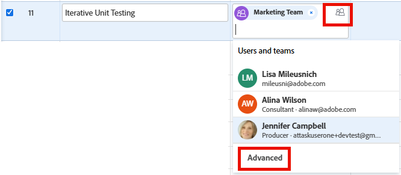

# Geavanceerde toewijzingen maken

<!-- Audited: 11/2025-->

<!--remove the bullet indicated when we get rid of the new/old experience of editing tasks-->

<!--
 

The highlighted information on this page refers to functionality not yet generally available. It is available only in the Preview environment for all customers. The same features will also be available in the Production environment for all customers starting with  a week from the Preview release.      

For more information, see [Interface modernization](/help/quicksilver/product-announcements/product-releases/interface-modernization/interface-modernization.md).  

 -->

U kunt taken beheren of taken uitgeven gebruikend Geavanceerde Toewijzingen.

U kunt de volgende toewijzingsgegevens aanpassen bij het maken van geavanceerde toewijzingen:

* Wijs gebruikers aan de taak of de kwestie toe (dit kan buiten een geavanceerde taak worden verwezenlijkt).
* Pas het aantal uren aan dat elke toegewezen persoon is toegewezen en verdeel dit aantal.
* Bepaal welke gebruiker als eigenaar of primaire ontvanger van de taak of kwestie zou moeten worden aangewezen.
* Geef op welke rol elke gebruiker vervult wanneer hij of zij aan de taak of kwestie werkt.
  <!--* Override the billing rate for a job role.-->

>[!NOTE]
>
>Wanneer gebruikers aan het werk worden toegewezen, heeft hun beschikbaarheid volgens hun programma&#39;s invloed op de geplande en verwachte datum van taken en problemen. Voor informatie over programma&#39;s, zie [ een programma ](../../../administration-and-setup/set-up-workfront/configure-timesheets-schedules/create-schedules.md) creëren.

## Gebieden in Adobe Workfront waar u geavanceerde toewijzingen kunt maken

In dit artikel wordt beschreven hoe u toegang krijgt tot Geavanceerde toewijzingen in de taak- of uitgiftekop.

Bovendien kunt u geavanceerde toewijzingen maken in de volgende gebieden van Workfront:

* In lijsten en rapporten wanneer het gebied van Toewijzingen in de mening toont.
* In de sectie Toewijzingen wanneer u een taak bewerkt. Voor meer informatie, zie [ taken ](../../../manage-work/tasks/manage-tasks/edit-tasks.md) uitgeven. <!--When we remove the old/ new experience: take this bullet out completely; in the new Edit Task experience, this is no longer possible-->
* In de taak of de uitgiftekopbal, in het gebied van Taken.
* In het werklastevenwicht. Voor meer informatie, zie [ werk manueel toewijzen gebruikend de Balancer van de Werkbelasting ](../../../resource-mgmt/workload-balancer/assign-work-in-workload-balancer-manually.md).

## Toegangsvereisten

+++ Breid uit om de toegangseisen voor de functionaliteit in dit artikel weer te geven.

<table style="table-layout:auto"> 
 <col> 
 <col> 
 <tbody> 
  <tr> 
   <td>Adobe Workfront-pakket</td> 
   <td> 
Alle
 </td> 
  </tr> 
  <tr> 
   <td>Adobe Workfront-licentie</td> 
   <td> 
Standard

   
Werk of hoger

   </td> 
  </tr> 
  <tr> 
   <td role>Configuraties op toegangsniveau</td> 
   <td> 
Toegang tot taken en problemen bewerken
  </td> 
  </tr> 
  <tr> 
   <td>Objectmachtigingen</td> 
   <td> 
Contribute of hoger machtigingen voor de taak of uitgave
</td> 
  </tr> 
 </tbody> 
</table>

Voor informatie, zie [ vereisten van de Toegang in de documentatie van Workfront ](/help/quicksilver/administration-and-setup/add-users/access-levels-and-object-permissions/access-level-requirements-in-documentation.md).

+++

## Geavanceerde toewijzingen maken

1. Ga naar het project waar u een taak of een kwestie wilt toewijzen.
1. Klik **Taken** of **Kwesties** in het linkerpaneel, dan klik de naam van een taak of kwestie in de lijst.

   >[!TIP]
   >
   >U kunt geavanceerde taken rechtstreeks in de taak- of uitgavelijst plaatsen. Klik binnen het **gebied van Taken** op de zelfde lijn zoals de taak of de kwestie, dan klik **Geavanceerd** bij de bodem van de lijst, of het **pictogram van Mensen** in de hoger-juiste hoek van de toewijzingsdoos, om het Geavanceerde venster van Toewijzingen te openen. Ga verder met stap 5 om door te gaan met het maken van geavanceerde toewijzingen.
   >

1. Klik **toewijzen aan** in het **3} gebied van Taken {in de kopbal van de taak of de kwestie**

   of

   Klik op een van de toegewezen namen als de taak of uitgave al is toegewezen.

1. Klik **Geavanceerd**.

   

1. Op de **mensen van het Onderzoek, de rol en het teamgebied**, begin de naam van een gebruiker, een rol, of een team te typen, dan de naam te klikken wanneer het in de drop-down lijst verschijnt.

   >[!NOTE]
   >
   >Als de naam van de gebruiker een speciaal teken bevat, moet u het speciale teken in het zoekveld opnemen.

1. (Optioneel) Ga door met het toevoegen van toewijzingen in het **vak Personen, Rol en Teams** om meerdere bronnen aan de taak of kwestie toe te voegen.

   >[!TIP]
   >
   >* U kunt meerdere gebruikers, taakrollen of teams toewijzen. U kunt alleen actieve gebruikers, taakrollen en teams toewijzen.
   >
   >
   >* Wanneer u een gebruikerstoewijzing toevoegt, ziet u de avatar, de primaire rol van de gebruiker of hun e-mailadres om onderscheid te maken tussen gebruikers met identieke namen.
   >Gebruikers moeten aan ten minste één taakrol zijn gekoppeld om deze te kunnen bekijken terwijl u ze toevoegt.
   >De instelling Contactinfo weergeven moet zijn ingeschakeld op uw toegangsniveau zodat gebruikers de e-mails van gebruikers kunnen bekijken. Voor informatie, zie [ toegang van de Verlening tot gebruikers ](../../../administration-and-setup/add-users/configure-and-grant-access/grant-access-other-users.md).
   >
   >
   >* Als een gebruiker, een baanrol, of een team werden toegewezen alvorens zij werden gedeactiveerd, blijven zij toegewezen aan het het werkpunt. In dit geval raden we het volgende aan:
   >   
   >   * Wijs het werkitem opnieuw toe aan actieve bronnen.
   >   * Koppel de gebruikers in een gedeactiveerd team aan een actief team en wijs het het werkpunt aan het actieve team opnieuw toe.

1. Voor elke gebruiker in de **Assignee** kolom, specificeer de volgende informatie:

   * **Eigenaar**: Beweeg over de naam van toegewezen en klik **Primair maken** op het gebied van de Eigenaar als u toegewezen als taak of uitgeverseigenaar wilt merken. Een groen selectievakje geeft aan dat de opgegeven gebruiker de primaire contactpersoon van de taak of uitgave is. Adobe Workfront markeert de eerste gebruiker of baanrol die u aan een taak of kwestie als Eigenaar of Primaire Toewijzing toewijst. Een team kan niet worden aangewezen als primaire eigenaar van een taak of uitgave.

     >[!IMPORTANT]
     >
     >Afhankelijk van hoe uw Workfront-beheerder of groepsbeheerder uw projectvoorkeuren heeft ingesteld, kan Workfront het schema van de taakeigenaar gebruiken om de tijdlijn van de taak te berekenen wanneer meerdere gebruikers aan de taak zijn toegewezen. Voor informatie over veelvoudige taaktoegewezen, zie &quot;veelvoudige gebruikers aan een taak&quot;sectie in het artikel toewijzen [ taken ](../../../manage-work/tasks/assign-tasks/assign-tasks.md) toewijzen.

   * **Toewijzingen**: Wanneer het Type van Duur van een taak Eenvoudig is, specificeer het aantal uren elke gebruiker of baanrol aan de taak zou moeten worden toegewezen. De som van alle toegewezen uren voor elke gebruiker is gelijk aan het aantal op het **Geplande Uren** gebied bij de bodem van de kolom van Toewijzingen. In alle andere gevallen geeft u het percentage aan tijd (of toewijzing) op dat de toegewezen persoon moet besteden aan het oplossen van de taak of kwestie.

     >[!TIP]
     >   
     >   * Nadat u de toewijzing van taken handmatig hebt gewijzigd, kunnen de geplande uren van de taken dienovereenkomstig worden bijgewerkt. Voor meer informatie, zie de sectie &quot;de taak Geplande Uren van de Update wanneer het beheren van gebruikerstoewijzingen&quot;in het artikel [ Geplande overzicht van Uren ](../../../manage-work/tasks/task-information/planned-hours.md).
     >   * U kunt toewijzingen niet handmatig wijzigen bij uitgaven.
     >   * U kunt toewijzingen voor teams die aan taken zijn toegewezen niet handmatig wijzigen.

   * **Rol van de Ontvanger:** selecteer de rol de gebruiker zou moeten gebruiken wanneer het vervullen van deze taak.  Standaard wordt de primaire rol van de gebruiker weergegeven. Klik in het **vakje van de Rol van 0} toewijzen {om een andere rol te selecteren.** Wanneer u eerst de taak of de kwestie aan een rol toewijst, en dan een gebruiker toevoegt die die rol als tweede taak kan vervullen, wordt de lijst van voorgestelde gebruikers gefiltreerd voor de gebruikers die de rollen kunnen vervullen die reeds aan de taak en de kwestie worden toegewezen.

     

   <!--

   * **Location**: The location comes from the rate card, if a rate card attached to the project uses locations with the job roles. The location can't be changed. 

   * **Billing Rates**: The billing rate for a user comes from the system rate for the user or their associated job role. The billing rate for a job role comes from the system rate or from the rate card, if a rate card is attached to the project. Existing billing rates are not displayed in this field. Click in the field to change the billing rate for this specific task assignment.

   
-->

   * **Type van Duur**: Dit is slechts beschikbaar voor taken. Klik de naam van het Type van Duur en selecteer een Type van Duur van het drop-down menu. Voor informatie over de Types van Duur, zie [ Overzicht van het Type van Duur en van de Duur van de Taak ](../../../manage-work/tasks/taskdurtn/task-duration-and-duration-type.md).

   * **Duur:** u kunt dit gebied voor een taak bijwerken wanneer u beheertoestemmingen aan de taak hebt.

     Voor meer informatie, zie [ Overzicht van het Type van Duur en van de Duur van de Taak ](../../../manage-work/tasks/taskdurtn/task-duration-and-duration-type.md). Bij het bewerken van grote hoeveelheden toewijzingsgegevens wordt een vergelijkbaar dialoogvenster weergegeven waarin gebruikers, uren, toewijzing en taakeigenaar worden toegewezen.

   * **Geplande Uren**: Wanneer het Type van Duur Toewijzing of Eenvoudig wordt berekend, werk het aantal Geplande Uren bij. De toewijzingspercentages of de uren voor elke bron worden als gevolg hiervan gelijkmatig verdeeld. Workfront berekent de geplande uren wanneer het Duur-type Berekend Werk of Gedreven Inspanning is. Voor meer informatie, zie [ Overzicht van het Type van Duur en van de Duur van de Taak ](../../../manage-work/tasks/taskdurtn/task-duration-and-duration-type.md).

1. Klik **sparen**.
