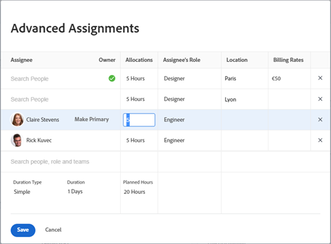

# Geavanceerde toewijzingen maken

{{highlighted-preview}}

>[!IMPORTANT]
>
>De functie voor het overschrijven van de toewijzingssnelheid is tijdelijk uitgeschakeld in Voorvertoning op 30 juni 2023.

U kunt taken beheren of taken uitgeven door Geavanceerde Toewijzingen te gebruiken.

U kunt de volgende toewijzingsgegevens aanpassen bij het maken van geavanceerde toewijzingen:

* Wijs gebruikers aan de taak of de kwestie toe (dit kan buiten een geavanceerde taak worden verwezenlijkt).
* Pas het aantal uren aan dat elke toegewezen persoon is toegewezen en verdeel dit aantal.
* Bepaal welke gebruiker als eigenaar of primaire ontvanger van de taak of kwestie zou moeten worden aangewezen.
* Geef op welke rol elke gebruiker vervult wanneer hij of zij aan de taak of kwestie werkt.
* Overschrijf de factureringssnelheid voor een taakrol.

>[!NOTE]
>
>Wanneer gebruikers aan het werk worden toegewezen, heeft hun beschikbaarheid volgens hun programma&#39;s invloed op de geplande en verwachte datum van taken en problemen. Voor informatie over programma&#39;s, zie [Een schema maken](../../../administration-and-setup/set-up-workfront/configure-timesheets-schedules/create-schedules.md).

## Gebieden in Adobe Workfront waar u geavanceerde toewijzingen kunt maken

In dit artikel wordt beschreven hoe u Geavanceerde toewijzingen kunt openen in de taak- of uitgiftekop.

Bovendien kunt u geavanceerde toewijzingen maken in de volgende gebieden van Workfront:

* In lijsten en rapporten wanneer het gebied van Toewijzingen in de mening toont.
* In de sectie Toewijzingen wanneer u een taak bewerkt. Zie voor meer informatie [Taken bewerken](../../../manage-work/tasks/manage-tasks/edit-tasks.md).
* In de taak of uitgiftekopbal, in het gebied van Taken.
* In het werklastevenwicht. Zie voor meer informatie [Handmatig werk toewijzen met Workload Balancer](../../../resource-mgmt/workload-balancer/assign-work-in-workload-balancer-manually.md).

## Toegangsvereisten

U moet de volgende toegang hebben om de stappen in dit artikel uit te voeren:

<table style="table-layout:auto"> 
 <col> 
 <col> 
 <tbody> 
  <tr> 
   <td role="rowheader">Adobe Workfront-abonnement*</td> 
   <td> 
Alle
 </td> 
  </tr> 
  <tr> 
   <td role="rowheader">Adobe Workfront-licentie*</td> 
   <td> 
Werk of hoger
 </td> 
  </tr> 
  <tr> 
   <td role="rowheader">Configuraties op toegangsniveau*</td> 
   <td> 
Toegang tot taken en problemen bewerken
 
<b>OPMERKING</b>

Als u nog steeds geen toegang hebt, vraagt u de Workfront-beheerder of deze aanvullende beperkingen op uw toegangsniveau instelt. Voor informatie over hoe een beheerder van Workfront uw toegangsniveau kan wijzigen, zie <a href="../../../administration-and-setup/add-users/configure-and-grant-access/create-modify-access-levels.md" class="MCXref xref">Aangepaste toegangsniveaus maken of wijzigen</a>.
 </td>
</tr> 
  <tr> 
   <td role="rowheader">Objectmachtigingen</td> 
   <td> 
Contribute of hoger machtigingen voor een taak of uitgave
 
Voor informatie over het aanvragen van aanvullende toegang raadpleegt u <a href="../../../workfront-basics/grant-and-request-access-to-objects/request-access.md" class="MCXref xref">Toegang tot objecten aanvragen </a>.
 </td> 
  </tr> 
 </tbody> 
</table>

&#42;Neem contact op met uw Workfront-beheerder om te weten te komen welk plan, licentietype of toegang u hebt.

## Geavanceerde toewijzingen maken

1. Ga naar het project waar u een taak of een kwestie wilt toewijzen.
1. Klikken **Taken** of **Problemen** klikt u in het linkerdeelvenster op de naam van een taak of uitgave in de lijst.

   >[!TIP]
   >
   >U kunt geavanceerde taken rechtstreeks op de taak of de lijst van de kwestie maken als er twee of meer toegewezen mensen zijn. Klik in het dialoogvenster **Toewijzingen** veld op dezelfde regel als de taak of uitgave en klik vervolgens op de knop **Personenpictogram** om het venster Geavanceerde toewijzingen te openen. Ga verder met stap 5 om door te gaan met het maken van geavanceerde toewijzingen.\
   >
   >

1. Klikken **Toewijzen aan** in de **Toewijzingen** veld in de koptekst van de taak of uitgave

   of

   Klik op de naam van de toewijzingen als de taak of uitgave al is toegewezen.

1. Klikken **Geavanceerd**.

   

1. In de **Personen, rollen en teams zoeken** , typt u de naam van een gebruiker, rol of team en klikt u vervolgens op de naam wanneer deze wordt weergegeven in de vervolgkeuzelijst.

   >[!NOTE]
   >
   >Als de naam van de gebruiker een speciaal teken bevat, moet u het speciale teken in het zoekveld opnemen.

1. (Optioneel) Ga door met het toevoegen van toewijzingen in het dialoogvenster **Personen, rollen of teams zoeken** om meerdere bronnen aan de taak of uitgave toe te voegen.

   >[!TIP]
   >
   >* U kunt meerdere gebruikers, taakrollen of teams toewijzen. U kunt alleen actieve gebruikers, taakrollen en teams toewijzen.
   >
   >
   >* Wanneer u een gebruikerstoewijzing toevoegt, ziet u de avatar, de primaire rol van de gebruiker of hun e-mailadres om onderscheid te maken tussen gebruikers met identieke namen. Gebruikers moeten aan ten minste één taakrol zijn gekoppeld om deze te kunnen bekijken terwijl u ze toevoegt.
   >
   >
   >* Wanneer u een taakroltoewijzing toevoegt, kunt u zoeken naar de taakrol of -locatie. Selecteer Systeem/StandaardRol van de Taak om het standaardfactureringspercentage voor de taak te gebruiken, of selecteer een Rol van de Kaart van het Tarief om het tarief op het taakniveau met voeten te treden. Voor meer informatie over tariefkaarten raadpleegt u [Creditcards beheren](/help/quicksilver/administration-and-setup/set-up-workfront/configure-system-defaults/manage-rate-cards.md).
   >
   >
   >* Als een gebruiker, een baanrol, of een team werd toegewezen alvorens zij werden gedeactiveerd, blijven zij toegewezen aan het het werkpunt. In dit geval raden we het volgende aan:
   >   
   >   * Wijs het werkitem opnieuw toe aan actieve bronnen.
   >   * Koppel de gebruikers in een gedeactiveerd team aan een actief team en wijs het het werkpunt aan het actieve team opnieuw toe.
   >   
   >

1. Voor elke gebruiker in het dialoogvenster **Geadresseerde** de volgende gegevens opgeven:

   * **Eigenaar**: Houd de aanwijzer boven de naam van de ontvanger en klik op **Primair maken** in het veld Eigenaar als u de toegewezen persoon wilt markeren als de taak of uitgifteeigenaar. Een groen selectievakje geeft aan dat de opgegeven gebruiker de primaire contactpersoon van de taak of uitgave is. Adobe Workfront markeert de eerste gebruiker of baanrol die u aan een taak of kwestie als Eigenaar of Primaire Toewijzing toewijst. Een team kan niet worden aangewezen als primaire eigenaar van een taak of uitgave.

     >[!IMPORTANT]
     >
     >Afhankelijk van hoe uw Workfront-beheerder of groepsbeheerder uw projectvoorkeuren heeft ingesteld, kan Workfront het schema van de taakeigenaar gebruiken om de tijdlijn van de taak te berekenen wanneer meerdere gebruikers aan de taak zijn toegewezen. Voor informatie over veelvoudige taaktoegewezen, zie de &quot;toewijzen veelvoudige gebruikers aan een taak&quot;sectie in het artikel [Taken toewijzen](../../../manage-work/tasks/assign-tasks/assign-tasks.md).

   * **Toewijzingen** : Wanneer het Type van Duur van een taak Eenvoudig is, specificeer het aantal uren elke gebruiker of baanrol aan de taak zou moeten worden toegewezen. De som van alle toegewezen uren voor elke gebruiker is gelijk aan het getal in het deelvenster **Geplande uren** onder aan de kolom Toewijzingen. In alle andere gevallen geeft u het percentage aan tijd (of toewijzing) op dat de toegewezen persoon moet besteden aan het oplossen van de taak of kwestie.

     <!--   
     
(NOTE: make sure this is right in the new UI for both classic and QS???)
   
     -->

     >[!TIP]
     >
     >
     >   
     >   
     >   * Nadat u de toewijzingen voor taken handmatig hebt gewijzigd, kunnen de geplande uren van de taken dienovereenkomstig worden bijgewerkt. Raadpleeg voor meer informatie de sectie &quot;Taak geplande uren bijwerken bij het beheren van gebruikerstoewijzingen&quot; in het artikel [Overzicht van geplande uren](../../../manage-work/tasks/task-information/planned-hours.md).
     >   * U kunt toewijzingen niet handmatig wijzigen bij uitgaven.
     >   * U kunt toewijzingen voor teams die aan taken zijn toegewezen niet handmatig wijzigen.
     >   
     >

   * **Rol van de gemachtigde:** Selecteer de rol die de gebruiker moet gebruiken bij het uitvoeren van deze toewijzing.  Standaard wordt de primaire rol van de gebruiker weergegeven. Klik in het vak Rol van de ontvanger om een andere rol te selecteren.  Wanneer u eerst de taak of de kwestie aan een rol toewijst, en dan een gebruiker toevoegt die die rol als tweede taak kan vervullen, wordt de lijst van voorgestelde gebruikers gefiltreerd voor de gebruikers die de rollen kunnen vervullen die reeds aan de taak en de kwestie worden toegewezen.

     

   

   * **Locatie**: De plaats komt uit de tariefkaart, als een tariefkaart in bijlage aan het project plaatsen met de baanrollen gebruikt. De locatie kan niet worden gewijzigd.

   * **Factureringstarieven**: De factureringssnelheid voor een gebruiker is gebaseerd op de systeemsnelheid voor de gebruiker of de bijbehorende taakrol. Het factureringspercentage voor een functie is afkomstig van het systeemtarief of van de tariefkaart, als een tariefkaart aan het project is gekoppeld. Bestaande factureringssnelheden worden niet weergegeven in dit veld. Klik in het veld om de factureringssnelheid voor deze specifieke taaktoewijzing te wijzigen.

   

   * **Duur**: Dit is alleen beschikbaar voor taken. Klik de naam van het Type van Duur en selecteer een Type van Duur van het drop-down menu. Voor informatie over de Types van Duur, zie [Overzicht van het Type van Duur en van de Duur van de Taak](../../../manage-work/tasks/taskdurtn/task-duration-and-duration-type.md).

   * **Duur:** U kunt dit veld bijwerken voor een taak als u beheerdersmachtigingen voor de taak hebt.

     Zie voor meer informatie [Overzicht van het Type van Duur en van de Duur van de Taak](../../../manage-work/tasks/taskdurtn/task-duration-and-duration-type.md). Bij het bewerken van grote hoeveelheden toewijzingsgegevens wordt een vergelijkbaar dialoogvenster weergegeven waarin gebruikers, uren, toewijzing en taakeigenaar worden toegewezen.

   * **Geplande uren**: Wanneer het Type van Duur wordt Berekend Toewijzing of Eenvoudig, werk het aantal Geplande Uren bij. De toewijzingspercentages of de uren voor elke bron worden als gevolg hiervan gelijkmatig verdeeld. Workfront berekent de geplande uren wanneer het Duur-type Berekend Werk of Gedreven Inspanning is. Zie voor meer informatie [Overzicht van het Type van Duur en van de Duur van de Taak](../../../manage-work/tasks/taskdurtn/task-duration-and-duration-type.md).

     Voorbeeldafbeelding in de productieomgeving:

     

     

     Voorbeeldafbeelding in de voorvertoningsomgeving:

     

     

1. Klikken **Opslaan**.
