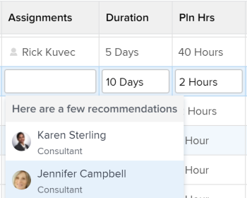

# Overzicht van slimme toewijzingen

Bij het beheren van taken en uitgaven kunt u slimme toewijzingen gebruiken om te bepalen wie de beste gebruiker het werk moet voltooien. De slimme taken zijn suggesties die Adobe Workfront aan u voorstelt wanneer u het werkpunten aan middelen toewijst die op een algoritme worden gebaseerd dat het meest aangewezen middel voor de baan bepaalt.

>[!NOTE]
>
>Bij slimme toewijzingen wordt geen rekening gehouden met de beschikbaarheid van de gebruiker. De beschikbaarheid volgens de planning is echter van invloed op de geplande en verwachte datum van taken en problemen wanneer deze worden toegewezen. Raadpleeg het artikel voor informatie over schema&#39;s [Een schema maken](../../../administration-and-setup/set-up-workfront/configure-timesheets-schedules/create-schedules.md).

Dit artikel bevat algemene informatie over slimme toewijzingen. Voor informatie over het gebruiken van slimme taken om taken en kwesties aan gebruikers toe te wijzen, zie [Slimme toewijzingen maken](../../../manage-work/tasks/assign-tasks/make-smart-assignments.md).

## Overzicht van slimme toewijzingen

Houd rekening met het volgende wanneer u werkt met slimme toewijzingen:

* Het algoritme werkt onafhankelijk voor taken en kwesties. Dit betekent dat de lijst met voorgestelde gebruikers voor problemen kan afwijken van de lijst met voorgestelde gebruikers voor een taak, omdat Workfront de lijsten samenstelt op basis van criteria die betrekking hebben op problemen en taken afzonderlijk.
* De slimme taken adviseren baanrollen of teams niet. In plaats daarvan zijn dit suggesties van gebruikers die het meest geschikt zijn om een taak of een probleem te voltooien.
* De voorgestelde toewijzingen zijn altijd actieve gebruikers.
* De eerst vermelde gebruiker zou de beste gelijke voor de taak moeten zijn.

## Suggesties voor slimme toewijzingen zoeken

U kunt slimme toewijzingen weergeven op de volgende plaatsen waar u taken of problemen kunt toewijzen:

* Een taak- of uitgiftenlijst of rapport

   

* Een taak- of uitgiftekop

   

* Het deelvenster Overzicht van taken of uitgaven

   

* Het veld Toewijzingen voor een item dat wordt vermeld in het gebied Home

   

<!--removed for scheduling deprecation: 

* Resource Scheduling

  

  >[!CAUTION]
  >
  >Resource Scheduling is a deprecated feature. For more information, see [Deprecation of Resource Scheduling tools in Adobe Workfront](../../../resource-mgmt/resource-mgmt-overview/deprecate-resource-scheduling.md).

-->
* Werklastverdeling

   

## Criteria voor slimme toewijzingen

De slimme taken tonen de hoogste 50 aanbevelingen die op een merkgebonden algoritme worden gebaseerd.

De gebruikers worden geadviseerd in de slimme drop-down lijst van Toewijzingen die op een combinatie van de volgende criteria (die in orde van belangrijkst tot minst belangrijk worden vermeld) wordt gebaseerd:

* Gebruikers die in de afgelopen 30 dagen aan andere werkitems zijn toegewezen door de gebruiker die de toewijzing maakt. De eerste 50 gebruikers die aan deze criteria voldoen, worden weergegeven. De gebruiker die het vaakst wordt toegewezen toont eerst.

   Als het het werkpunt aan een team of een rol wordt toegewezen, wordt de lijst van voorgestelde gebruikers gefiltreerd verder rekening houdend met de bestaande taken hieronder. In dit geval worden alleen de volgende gebruikers weergegeven in de lijst met suggesties:

   * Gebruikers van wie het Team van het Huis het team is dat aan het het werkpunt wordt toegewezen.
   * Gebruikers waarvan de primaire rol de rol is die aan het werkitem is toegewezen.

      >[!TIP]
      >
      >* Indien <!--you're not part of any team and --> er is geen rol of team toegewezen aan de taak of uitgave, Workfront geeft alle gebruikers weer die de afgelopen 30 dagen zijn toegewezen, tot 50 gebruikers.
      >* Als u geen taken in de afgelopen 30 dagen hebt gemaakt, slechts gebruikers die tot of het toegewezen team behoren of de rol hebben die aan het het werkpunt wordt toegewezen tonen in de slimme lijst van taken.

<!--the commented out piece in the tip above was live before but I am not totally sure that smart assignments look at your team. I think they look JUST at the team/ role assigned to the work item; see this help site request for more info: https://experience.adobe.com/#/@adobeinternalworkfront/so:hub-Hub/workfront/issue/62fd222200037eb87572c5b6ad6bf53e/overview -->
<!--

<h3>Smart assignments criteria for the Production environment</h3>

(NOTE: drafted,this was the case BEFORE we updated the logic in the WB - with the 21.4 release)

Smart assignments display on tasks and issues when the following conditions are met:

<ul>
<li>The task or issue is subordinate to a parent task or issue that has a user, team, or job role currently assigned. </li>
</ul>

Smart assignments display the top twenty recommendations based on a proprietary algorithm that uses your own team information.

Users are recommended in the smart assignments drop-down list based on a combination of the following criteria (listed in order from most important to least important):

<ul>
<li>The user has the team assigned to the task or issue designated as their Home Team</li>
<li>The user is also assigned to the parent task</li>
<li>The user has the same primary job role as is currently assigned to the task or issue</li>
<li>The user has the team assigned to the parent task or issue designated as their Home Team</li>
<li>The user is associated with the same primary job role currently assigned to the parent task</li>
<li>The user is a member of the same team as the user who assigned the task or issue and the team is designated as their Home Team</li>
<li>The user is a member of the same Home Group as the user who is assigning the task or issue</li>
<li>The user has the same primary job role as the user who is assigning the task or issue.</li>
</ul>

-->

<!--

<h2>Make smart assignments</h2>

(NOTE:&nbsp;this was moved to its own article: make-smart-assignments.) 

Smart assignments are available in most locations where you can make assignments in Workfront.

You can use smart assignments on tasks and issues that have previously been assigned to a job role or a team.
 <note type="note">
You must have a Plan or a Work license and have at least Contribute permissions to a task or an issue to be able to make assignments to the task or the issue. You must have the Make Assignments option enabled in your permission level to make assignments.
</note>

To use smart assignments:

<ol>
<li value="1">Navigate to an issue or a task and click one of the following fields to edit them:  
<ul>
<li>
The <strong>Assignments</strong> field in the task or issue header
</li>
<li>The <strong>Assignments</strong> field of a task or issue list using in-line editing in a task or issue list. </li>
<li>The <strong>Assignee</strong> field after you have clicked <strong>Advanced</strong> from a task or an issue. </li>
</ul></li>
<li value="2"> 
Place your cursor in the assignment field, and wait for two seconds, then the <strong>Suggestions</strong> list is displayed.
 
Users displayed in this list are the smart assignment suggestions for the task or the issue. 
 
  
 </li>
<li value="3"> 
Select the user in the recommendations list by clicking their name. 
 
If there are no suggestions, the suggestion list does not open.
 </li>
<li value="4">(Optional) If you do not want to use one of the recommended users from the smart assignments list, start typing the name of the desired user and select the name when it appears in the list.</li>
<li value="5">Click <strong>Enter</strong> to make the assignment. </li>
</ol>

-->
