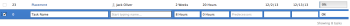

# Taken maken in een project

U kunt taken in een project slechts tot stand brengen nadat u het project creeerde.

Bijvoorbeeld, na het creëren van een project, zou u taken kunnen willen toevoegen en hen wijzigen om het projectplan te organiseren. Voor meer informatie over het creëren van een project, zie [Een project maken](../../../manage-work/projects/create-projects/create-project.md).

Voor informatie over het creëren van persoonlijke taken die niet in een project zijn, zie de &quot;Create een persoonlijke taak&quot;sectie in het artikel [Werkitems maken vanuit het gebied Home](../../../workfront-basics/using-home/using-the-home-area/create-work-items-in-home.md).

In dit artikel wordt beschreven hoe u geheel nieuwe taken maakt. U kunt taken ook op de volgende manieren maken:

* Door bestaande taken te kopiëren of te dupliceren. Zie voor meer informatie [Taken kopiëren en dupliceren](../../../manage-work/tasks/manage-tasks/copy-and-duplicate-tasks.md).
* Door taken van het ene project naar het andere te verplaatsen. Zie voor meer informatie [Taken verplaatsen](../../../manage-work/tasks/manage-tasks/move-tasks.md).

## Toegangsvereisten

<!--drafted for P&P - replace the table:

<table style="table-layout:auto"> 
 <col> 
 <col> 
 <tbody> 
  <tr> 
   <td role="rowheader">Adobe Workfront plan*</td> 
   <td> 
Any
 </td> 
  </tr> 
  <tr> 
   <td role="rowheader"> 
Adobe Workfront license*
 </td> 
   <td>
Current license: Standard
 
   Or
   
Legacy license: Work or higher
 </td> 
  </tr> 
  <tr> 
   <td role="rowheader">Access level configurations*</td> 
   <td> 
Edit access to Tasks and Projects
 
Note: If you still don't have access, ask your Workfront administrator if they set additional restrictions in your access level. For information about access to tasks, see <a href="../../../administration-and-setup/add-users/configure-and-grant-access/grant-access-tasks.md" class="MCXref xref">Grant access to tasks</a>. For information on how a Workfront administrator can change your access level, see <a href="../../../administration-and-setup/add-users/configure-and-grant-access/create-modify-access-levels.md" class="MCXref xref">Create or modify custom access levels</a>. 
 </td> 
  </tr> 
  <tr> 
   <td role="rowheader">Object permissions</td> 
   <td> 
Contribute permissions to the project with ability to Add Tasks or higher
 
When you create a task you automatically receive Manage permissions to the task
 
 For information about task permissions, see <a href="../../../workfront-basics/grant-and-request-access-to-objects/share-a-task.md" class="MCXref xref">Share a task </a>. 
 
For information on requesting additional permissions, see <a href="../../../workfront-basics/grant-and-request-access-to-objects/request-access.md" class="MCXref xref">Request access to objects </a>.
 </td> 
  </tr> 
 </tbody> 
</table>
-->
U moet de volgende toegang hebben om de stappen in dit artikel uit te voeren:

<table style="table-layout:auto"> 
 <col> 
 <col> 
 <tbody> 
  <tr> 
   <td role="rowheader">Adobe Workfront-abonnement*</td> 
   <td> 
Alle
 </td> 
  </tr> 
  <tr> 
   <td role="rowheader"> 
Adobe Workfront-licentie*
 </td> 
   <td> 
Werk of hoger
 </td> 
  </tr> 
  <tr> 
   <td role="rowheader">Configuraties op toegangsniveau*</td> 
   <td> 
Toegang tot taken en projecten bewerken
 
Opmerking: Als u nog steeds geen toegang hebt, vraagt u de Workfront-beheerder of deze aanvullende beperkingen op uw toegangsniveau instelt. Voor informatie over toegang tot taken raadpleegt u <a href="../../../administration-and-setup/add-users/configure-and-grant-access/grant-access-tasks.md" class="MCXref xref">Toegang verlenen tot taken</a>. Voor informatie over hoe een beheerder van Workfront uw toegangsniveau kan veranderen, zie <a href="../../../administration-and-setup/add-users/configure-and-grant-access/create-modify-access-levels.md" class="MCXref xref">Aangepaste toegangsniveaus maken of wijzigen</a>. 
 </td> 
  </tr> 
  <tr> 
   <td role="rowheader">Objectmachtigingen</td> 
   <td> 
Contribute-machtigingen voor het project met de mogelijkheid om taken of hoger toe te voegen
 
Als u een taak maakt, ontvangt u automatisch beheermachtigingen voor de taak
 
 Voor informatie over taaktoestemmingen, zie <a href="../../../workfront-basics/grant-and-request-access-to-objects/share-a-task.md" class="MCXref xref">Een taak delen </a>. 
 
Voor informatie over het aanvragen van aanvullende machtigingen raadpleegt u <a href="../../../workfront-basics/grant-and-request-access-to-objects/request-access.md" class="MCXref xref">Toegang tot objecten aanvragen </a>.
 </td> 
  </tr> 
 </tbody> 
</table>

&#42;Neem contact op met uw Workfront-beheerder om te weten te komen welk plan, licentietype of toegang u hebt.

## Taken maken in een project

1. Ga naar het project waar u een taak wilt creëren.
1. Klikken **Taken** in het linkerdeelvenster.
1. (Voorwaardelijk) Als u de takenlijst momenteel in een flexibele weergave bekijkt, klikt u op de knop **Lijstweergave** pictogram  in de rechterbovenhoek om de takenlijst weer te geven.
1. (Optioneel) Klik op de knop **Abonnementsmodus** pictogram  en selecteert u **Handmatig opslaan** Selecteer vervolgens een van de **Standaard** of **Tijdlijnplanning**. Hiermee schakelt u het **Automatisch opslaan** Deze optie is standaard ingeschakeld.

   

   >[!TIP]
   >
   >U kunt uw wijzigingen ongedaan maken wanneer u Handmatig opslaan selecteert.

1. Maak een nieuwe taak door een van de volgende handelingen uit te voeren:

   * Klikken **Nieuwe taak** boven aan de takenlijst
   * Klikken **Meer taken toevoegen** onder aan de takenlijst

   

1. (Voorwaardelijk) Als u hebt geklikt **Nieuwe taak** Ga als volgt te werk:

   1. Geef een van de velden op in de beperkte lijst met velden in het dialoogvenster **Nieuwe taak** en klik vervolgens op **Taak maken** als u snel een taak wilt maken.

      of

      Als u alle velden voor de taak wilt bijwerken, klikt u op **Meer opties** om de **Taak maken** doos.

      

      De **Taak maken** wordt geopend.

      

       

      >[!NOTE]
      >
      >Afhankelijk van de manier waarop uw Workfront-beheerder onze lay-outsjabloon instelt, kunnen in de velden in het vak Taak maken verschillende velden in uw omgeving worden weergegeven. Zie voor meer informatie [De weergave Details aanpassen met een lay-outsjabloon](../../../administration-and-setup/customize-workfront/use-layout-templates/customize-details-view-layout-template.md).

   1. Geef informatie op voor de volgende gebieden in het linkerdeelvenster van het vak Taak maken:

      * Taaknaam
      * Overzicht
      * Toewijzingen
      * Aangepaste Forms
      * Financiën
      * Instellingen

        Voor informatie over het definiëren van alle taakgerelateerde velden op een taak raadpleegt u [Taken bewerken](../../../manage-work/tasks/manage-tasks/edit-tasks.md).

   1. (Voorwaardelijk en optioneel) Als u de taak wilt herhalen, werkt u de **Herhalingsfrequentie** veld. Voor meer informatie over het creëren van terugkomende taken, zie [Herhalende taken maken](../../../manage-work/tasks/create-tasks/create-recurring-tasks.md).
   1. (Optioneel) Klik op **Documenten** in het linkerpaneel om een document aan de nieuwe taak vast te maken, dan klik **Bestanden toevoegen of koppelen** om een document aan de taak van uw computer, een andere dienst toe te voegen, of documenten en omslagen van uw computer of een andere dienst te verbinden.

1. (Voorwaardelijk) Als u hebt geklikt **Meer taken toevoegen** in stap 5, begin de taakinformatie in te gaan gebruikend in-lijn het uitgeven, dan druk binnengaan.

   <!--
   
(NOTE: ensure this stays accurate)

   -->

   We raden u aan deze optie vooral te gebruiken wanneer u meerdere taken aan de lijst toevoegt.

   

1. (Voorwaardelijk) Voer een van de volgende handelingen uit:

   * Als u hebt geklikt **Nieuwe taak** in stap 5 klikt u op **Taak maken** om uw wijzigingen op te slaan en de nieuwe taak toe te voegen aan uw project.

     <!--   
     
(NOTE: is this step still right?)
   
     -->

   * Als u hebt geklikt **Meer taken toevoegen** Voer in stap 5 de volgende handelingen uit:

     <!--   
     
(NOTE: is this step still right?) 
   
     -->

      1. Klik ergens in de browser om de wijzigingen te verzenden of druk op Enter.
      1. (Optioneel) Selecteer in de takenlijst de nieuwe taak en klik vervolgens op **Inspringen**.

         Dit maakt van de nieuwe taak een kind of subtaak van de vorige taak.

         Voor meer informatie over kindertaken raadpleegt u [Overzicht van taken](../../../manage-work/tasks/task-information/tasks-overview.md).

      1. (Voorwaardelijk) Als u de optie **Automatisch opslaan** optie na het indrukken **Meer taken toevoegen** kunt u het volgende doen:

         * Klikken **Ongedaan maken** op elk moment om de laatste wijziging om te keren, of **Annuleren** om alle wijzigingen in de takenlijst om te keren.
         * Als u eerder hebt geklikt **Ongedaan maken**, klikt u op **Opnieuw** om de laatste geannuleerde wijziging opnieuw toe te passen.
         * Klikken **Opslaan** om uw wijzigingen in de takenlijst op te slaan.
