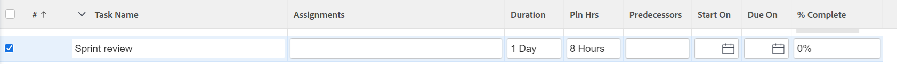
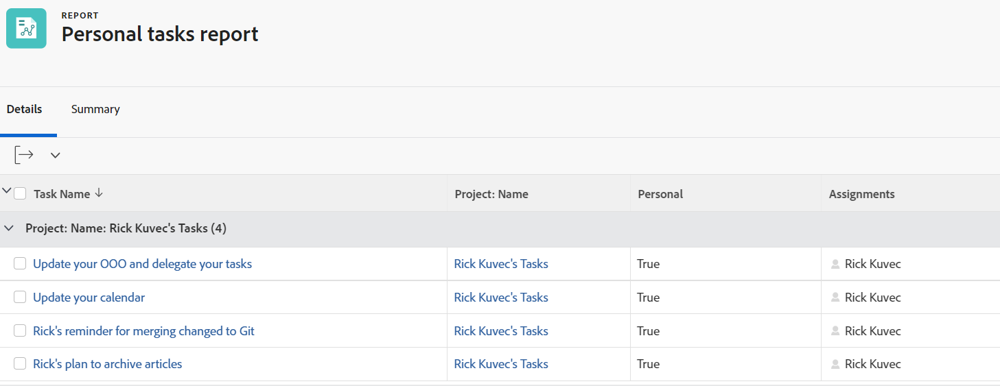

# Taken maken in een project

<!-- Audited: 10/2024 -->

U kunt taken in Adobe Workfront op de volgende manieren maken:

* Maak een geheel nieuwe taak in een project nadat het project is gemaakt.

  Na het creëren van een project, kunt u taken toevoegen en hen wijzigen om het projectplan te organiseren. Voor meer informatie over het creëren van een project, zie [ een project ](../../../manage-work/projects/create-projects/create-project.md) creëren.

* Maak taken door een sjabloon aan een project toe te voegen.

  Voor informatie, zie [ een malplaatje aan een project ](/help/quicksilver/manage-work/projects/create-and-manage-templates/attach-template-to-project.md) vastmaken.

* Persoonlijke taken maken en deze naar een project verplaatsen.

  U kunt persoonlijke taken maken door een van de volgende handelingen uit te voeren:

   * Een ad-hocaanvraag maken en deze naar een gebruiker sturen
   * Een uit te voeren item maken in het gebied Home

  Voor informatie over het creëren van persoonlijke taken die niet op een project zijn, zie [ persoonlijke taken ](/help/quicksilver/workfront-basics/updating-work-items-and-viewing-updates/create-personal-tasks.md) creëren.

  U kunt persoonlijke taken naar een project verplaatsen en deze worden werktaken.

In dit artikel wordt beschreven hoe u geheel nieuwe taken maakt en hoe u persoonlijke taken naar een project kunt verplaatsen.

U kunt taken ook op de volgende manieren maken:

* Door bestaande taken te kopiëren of te dupliceren. Voor informatie, zie [ het Exemplaar en dupliceert taken ](../../../manage-work/tasks/manage-tasks/copy-and-duplicate-tasks.md).
* Door taken van het ene project naar het andere te verplaatsen. Voor informatie, zie [ de taken van de Beweging ](../../../manage-work/tasks/manage-tasks/move-tasks.md).

## Toegangsvereisten

+++ Breid uit om de toegangseisen voor de functionaliteit in dit artikel weer te geven.

<table style="table-layout:auto"> 
 <col> 
 <col> 
 <tbody> 
  <tr> 
   <td role="rowheader">Adobe Workfront-pakket</td> 
   <td> 
Alle
 </td> 
  </tr> 
  <tr> 
   <td role="rowheader">Adobe Workfront-licentie</td> 
   <td> 
Standard
 
   
Werk of hoger
 </td> 
  </tr> 
  <tr> 
   <td role="rowheader">Configuraties op toegangsniveau</td> 
   <td> 
Toegang tot taken en projecten bewerken
 </td> 
  </tr> 
  <tr> 
   <td role="rowheader">Objectmachtigingen</td> 
   <td> 
Contribute-machtigingen voor het project met de mogelijkheid om taken of hoger toe te voegen
 
   
Als u een taak maakt, ontvangt u automatisch beheermachtigingen voor de taak
 
    </td> 
  </tr> 
 </tbody> 
</table>

Voor meer informatie, zie [ vereisten van de Toegang in de documentatie van Workfront ](/help/quicksilver/administration-and-setup/add-users/access-levels-and-object-permissions/access-level-requirements-in-documentation.md).

+++

<!--Old:

<table style="table-layout:auto"> 
 <col> 
 <col> 
 <tbody> 
  <tr> 
   <td role="rowheader">Adobe Workfront plan</td> 
   <td> 
Any
 </td> 
  </tr> 
  <tr> 
   <td role="rowheader"> 
Adobe Workfront license
 </td> 
   <td>
Standard
 
   
Work or higher

   </td> 
  </tr> 
  <tr> 
   <td role="rowheader">Access level configurations*</td> 
   <td> 
Edit access to Tasks and Projects
</td> 
  </tr> 
  <tr> 
   <td role="rowheader">Object permissions</td> 
   <td> 
Contribute permissions to the project with ability to Add Tasks or higher
 
When you create a task you automatically receive Manage permissions to the task
 
 For information about task permissions, see <a href="../../../workfront-basics/grant-and-request-access-to-objects/share-a-task.md" class="MCXref xref">Share a task </a>. 
 
For information on requesting additional permissions, see <a href="../../../workfront-basics/grant-and-request-access-to-objects/request-access.md" class="MCXref xref">Request access to objects. </a>
 </td> 
  </tr> 
 </tbody> 
</table>
-->

## Taken maken in een project

Het creëren van taken in een project is gelijkaardig aan het creëren van taken op een malplaatje. U kunt de hieronder beschreven stappen volgen wanneer u sjabloontaken aan een sjabloon toevoegt.

U kunt als volgt taken voor een project maken:

1. Ga naar het project waar u een taak wilt tot stand brengen.
1. Klik **Taken** in het linkerpaneel.
1. (Voorwaardelijk) als u momenteel de taaklijst in een Gelijke mening bekijkt, klik de **pictogram van de Mening van de Lijst** van de Lijst in Gelijke mening voor taken 
1. (Facultatief) klik het **pictogram van de Wijze van het Plan** pictogram van het Plan voor taaklijst  Handboek sparen **, dan selecteren of** Standaard **of** Chronologie Planning **.** Dit maakt **Autosave** optie onbruikbaar die door gebrek wordt toegelaten.

   

   >[!TIP]
   >
   >U kunt uw wijzigingen ongedaan maken wanneer u Handmatig opslaan selecteert.

1. Maak een nieuwe taak door een van de volgende handelingen uit te voeren:

   * Klik **Nieuwe Taak** bij de bovenkant van de taaklijst.
   * Klik **toevoegen Meer Taken** bij de bodem van de taaklijst.

   

1. (Voorwaardelijk) als u **Nieuwe Taak** klikte doe het volgende:

   1. Specificeer om het even welke gebieden op de beperkte lijst van gebieden binnen de **Nieuwe doos van de Taak**, dan klik **creeer Taak** als u een taak snel wilt creëren.

      of

      Om alle gebieden voor de taak bij te werken, klik **Meer Opties** om **te openen creeer Taakdoos**.

      

      **creeer de doos van de Taak** opent.

      

      >[!NOTE]
      >
      >Afhankelijk van de manier waarop uw Workfront-beheerder onze lay-outsjabloon instelt, kunnen in de velden in het vak Taak maken verschillende velden in uw omgeving worden weergegeven. Voor informatie, zie [ de mening van Details aanpassen gebruikend een lay-outmalplaatje ](../../../administration-and-setup/customize-workfront/use-layout-templates/customize-details-view-layout-template.md).

   1. Geef informatie op voor de volgende gebieden in het linkerdeelvenster van het vak Taak maken:

      * Taaknaam
      * Overzicht
      * Toewijzingen
      * Aangepaste Forms
      * Financiën
      * Instellingen

        Voor informatie over het bepalen van alle taak-verwante gebieden op een taak, zie [ taken ](../../../manage-work/tasks/manage-tasks/edit-tasks.md) uitgeven.

   1. (Voorwaardelijk en facultatief) als u de taak wilt terugkomen, werk het **gebied van de Frequentie van de Terugkeer bij 0}.** Voor meer informatie over het creëren van terugkomende taken, zie [ terugkomende taken ](../../../manage-work/tasks/create-tasks/create-recurring-tasks.md) creëren.
   1. (Facultatief) klik **Documenten** in het linkerpaneel om een document aan de nieuwe taak vast te maken, dan **voegt toe of verbindt dossiers** om een document aan de taak van uw computer, een andere dienst toe te voegen, of om documenten en omslagen van uw computer of een andere dienst te verbinden.

1. (Voorwaardelijk) als u **klikte voeg Meer Taken** in stap 5 toe, begin de taakinformatie gebruikend in-lijn het uitgeven in, dan druk binnengaan.

   <!--
   
(NOTE: ensure this stays accurate)

   -->

   We raden u aan deze optie vooral te gebruiken wanneer u meerdere taken aan de lijst toevoegt.

   

1. (Voorwaardelijk) Voer een van de volgende handelingen uit:

   * Als u **Nieuwe Taak** in stap 5 klikte, **creeer taak** om uw veranderingen te bewaren en de nieuwe taak toe te voegen aan uw project.

     <!--   
     
(NOTE: is this step still right?)
   
     -->

   * Als u **klikte voeg Meer Taken** in stap 5 toe doet het volgende:

     <!--   
     
(NOTE: is this step still right?) 
   
     -->

      1. Klik ergens in de browser om de wijzigingen te verzenden of druk op Enter.
      1. (Facultatief) in de taaklijst, selecteer de pas gecreëerde taak, dan klik **Inspringen**.

         Dit maakt van de nieuwe taak een kind of subtaak van de vorige taak.

         Voor meer informatie over kindtaken, zie de sectie &quot;subtasks van de taakSubtasks sectie&quot;in artikel [ creëren subtasks ](/help/quicksilver/manage-work/tasks/create-tasks/create-subtasks.md).

      1. (Voorwaardelijk) als u **Autosave** optie na het drukken **onbruikbaar maakte voeg Meer Taken** toe, kunt u het volgende doen:

         * Klik **ongedaan maken** op elk ogenblik om uw laatste verandering om te keren, of **annuleert** om alle veranderingen in te keren u aan de taaklijst aanbracht.
         * Als u eerder **** klikte ongedaan maken, klik **opnieuw** om de laatste verandering toe te passen u geannuleerd.
         * Klik **sparen** om uw veranderingen in de taaklijst te bewaren.
   1. (Facultatief) in een taaklijst, klik de **sectie van de Predecessor** om predecessors aan de taak toe te voegen. Voor meer informatie, zie [ een voorgangersverhouding creëren gebruikend het gebied van Voorgangers ](/help/quicksilver/manage-work/tasks/use-prdcssrs/create-predecessors-in-predecessors-area.md).
   1. (Facultatief) in een taaklijst, klik de **Subtasks** sectie om kindtaken toe te voegen. Voor meer informatie, zie [ subtasks ](/help/quicksilver/manage-work/tasks/create-tasks/create-subtasks.md) creëren.

## Taken maken door een persoonlijke taak naar een project te verplaatsen

1. (Voorwaardelijk) Zorg ervoor dat u of andere gebruikers persoonlijke taken hebben gemaakt.

   Voor informatie, zie [ persoonlijke taken ](/help/quicksilver/workfront-basics/updating-work-items-and-viewing-updates/create-personal-tasks.md) creëren.
1. Maak een filter voor persoonlijke taken en pas dit toe op een taakrapport of lijst.

   Voor informatie, zie [ Filter: persoonlijke taken ](/help/quicksilver/reports-and-dashboards/reports/custom-view-filter-grouping-samples/filter-personal-tasks.md).

   
1. Klik op een taaknaam in het persoonlijke taakrapport om het te openen.

   Workfront slaat persoonlijke taken op in een niet-vermeld persoonlijk project dat altijd een naam heeft op basis van dit patroon: &quot;&lt; Volledige naam van gebruiker > Taken. Bijvoorbeeld, zou een persoonlijk project &quot;Taken van Rick&quot;kunnen worden genoemd.

1. Van de taakpagina, klik het **Meer menu** , dan klik **Beweging**. Voor meer informatie over het bewegen van taken, zie [ de taken van de Beweging ](/help/quicksilver/manage-work/tasks/manage-tasks/move-tasks.md).

   Nadat u de taak hebt verplaatst, wordt de taak weergegeven in het project dat u hebt geselecteerd. De tijdlijn van het project kan worden beïnvloed door de tijdlijn van de nieuwe taak.
