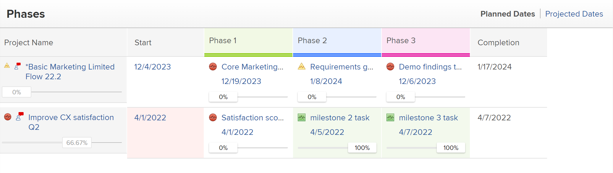

# Mijlpalen koppelen aan taken

<!--Audited: 01/2024-->

U kunt mijlpalen met taken associëren om erop te wijzen wanneer u belangrijke stappen in het leven van het project bereikt.

## Toegangsvereisten

+++ Breid uit om de toegangseisen voor de functionaliteit in dit artikel weer te geven.

<table style="table-layout:auto"> 
 <col> 
 <col> 
 <tbody> 
  <tr> 
   <td role="rowheader">Adobe Workfront-pakket</td> 
   <td> 
Alle
 </td> 
  </tr> 
  <tr> 
   <td role="rowheader">Adobe Workfront-licentie</td> 
   <td> 
Standard
 
   
Werk of hoger
 
   </td> 
  </tr> 
  <tr> 
   <td role="rowheader">Configuraties op toegangsniveau</td> 
   <td> 
Toegang tot taken bewerken
</td> 
  </tr> 
  <tr> 
   <td role="rowheader">Objectmachtigingen</td> 
   <td> 
Rechten voor de taak beheren
</td> 
  </tr> 
 </tbody> 
</table>

Voor meer informatie, zie [ vereisten van de Toegang in de documentatie van Workfront ](/help/quicksilver/administration-and-setup/add-users/access-levels-and-object-permissions/access-level-requirements-in-documentation.md).

+++

<!--Old:

<table style="table-layout:auto"> 
 <col> 
 <col> 
 <tbody> 
  <tr> 
   <td role="rowheader">Adobe Workfront plan*</td> 
   <td> 
Any
 </td> 
  </tr> 
  <tr> 
   <td role="rowheader">Adobe Workfront license*</td> 
   <td> 
New license: Standard
 
   
Current license: Work or higher
 
   </td> 
  </tr> 
  <tr> 
   <td role="rowheader">Access level configurations*</td> 
   <td> 
Edit access to Tasks
 
<b>NOTE</b>
   
   If you don't have access, ask your Workfront administrator if they set additional restrictions in your access level. For information on how a Workfront administrator can modify your access level, see <a href="../../../administration-and-setup/add-users/configure-and-grant-access/create-modify-access-levels.md" class="MCXref xref">Create or modify custom access levels</a>.
 </td> 
  </tr> 
  <tr> 
   <td role="rowheader">Object permissions</td> 
   <td> 
Manage permissions to the task
 
For information on requesting additional access, see <a href="../../../workfront-basics/grant-and-request-access-to-objects/request-access.md" class="MCXref xref">Request access to objects </a>.
 </td> 
  </tr> 
 </tbody> 
</table>-->

## Vereisten

Voordat u een mijlpaal aan een taak kunt koppelen, moet het volgende bestaan:

* De beheerder van Workfront moet een milestone weg tot stand brengen, zoals die in [ wordt beschreven leidt tot een milestone weg ](../../../administration-and-setup/customize-workfront/configure-approval-milestone-processes/create-milestone-path.md).

* U moet een Weg van de Mijlpaal aan een project associëren.

  Voor informatie, zie [ projecten ](/help/quicksilver/manage-work/projects/manage-projects/edit-projects.md) uitgeven.

* Om een mijlpaden met een project te associëren, moet het project in Planning of Huidige status zijn.

  >[!TIP]
  >
  >Om het beste overzicht van de vooruitgang van mijlpalen in uw projecten te krijgen gebruikend de mening van de Mijlpaal, zou u oudertaken moeten creëren en hen associëren met elke belangrijke fase van uw project. Vervolgens associeert u deze bovenliggende taken met elk van de mijlpalen van uw mijlpaden.

## Een mijlpaal koppelen aan een taak

Nadat een mijlpaden aan een project wordt geassocieerd, kunnen de taken een mijlpaal worden toegewezen.

1. Ga naar een taak, dan klik het **Meer** pictogram  aan het recht van de taaknaam, dan **geeft** uit.

   De taken en de Mijlpalen hebben een 1 :1 verhouding. U kunt niet dezelfde mijlpaal aan meerdere taken koppelen. Elke taak kan aan één enkele mijlpaal worden gekoppeld, of elke mijlpaal kan aan één taak worden toegewezen.

1. Klik **Montages**, dan selecteer een mijlpaal op het **3} gebied van de Mijlpaal {voor de taak.**
1. Klik **sparen**.
1. (Facultatief) in een lijst van taken, voeg de **kolom van de Status van 0} toe om te identificeren welke taken mijlpalen hebben.** De indicator Mijlsteen ruitje wordt weergegeven in de kolom Statuspictogrammen.

   Voor informatie, zie [ meningen in Adobe Workfront ](/help/quicksilver/reports-and-dashboards/reports/reporting-elements/create-edit-views.md) creëren of uitgeven.

   

1. (Facultatief) ga naar een lijst van projecten, selecteer de **Mijlpaal** mening om de vooruitgang van uw milestone taken te identificeren.

   
