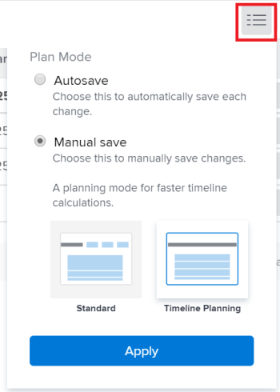

# Taken in een lijst bewerken {#edit-tasks-in-a-list}

U kunt de taakgegevens in een takenlijst bewerken door de velden in de lijst te bewerken. Voor informatie over andere manieren om taken uit te geven, zie [ taken ](../../../manage-work/tasks/manage-tasks/edit-tasks.md) uitgeven.

## Toegangsvereisten

U moet de volgende toegang hebben om de stappen in dit artikel uit te voeren:

<table style="table-layout:auto"> 
 <col> 
 <col> 
 <tbody> 
  <tr> 
   <td role="rowheader">Adobe Workfront-abonnement*</td> 
   <td> 
Alle
 </td> 
  </tr> 
  <tr> 
   <td role="rowheader">Adobe Workfront-licentie*</td> 
   <td> 
Werk of hoger
 </td> 
  </tr> 
  <tr> 
   <td role="rowheader">Configuraties op toegangsniveau*</td> 
   <td> 
Toegang tot taken en projecten bewerken
 
Opmerking: als u nog steeds geen toegang hebt, vraag dan aan de Workfront-beheerder of deze aanvullende beperkingen op uw toegangsniveau heeft ingesteld. Voor informatie over hoe een beheerder van Workfront uw toegangsniveau kan veranderen, zie <a href="../../../administration-and-setup/add-users/configure-and-grant-access/create-modify-access-levels.md" class="MCXref xref"> tot douanetoegangsniveaus </a> leiden of wijzigen.
 </td> 
  </tr> 
  <tr> 
   <td role="rowheader">Objectmachtigingen</td> 
   <td> 
Contribute of hogere machtigingen voor de taak en het project
 
Voor informatie bij het vragen van om extra toegang, zie <a href="../../../workfront-basics/grant-and-request-access-to-objects/request-access.md" class="MCXref xref"> de toegang van het Verzoek tot voorwerpen </a>.
 </td> 
  </tr> 
 </tbody> 
</table>

&#42; om te weten te komen welk plan, vergunningstype, of toegang u hebt, contacteer uw beheerder van Workfront.

## Overwegingen bij het bewerken van taken in een lijst {#considerations-about-editing-tasks-in-a-list}

Het uitgeven van taken in een lijst is een snelle manier om veranderingen in veelvoudige taken gelijktijdig aan te brengen, met een duidelijke mening van hoe uw veranderingen de projectchronologie zouden kunnen beïnvloeden.

Houd rekening met het volgende wanneer u taken in een lijst bewerkt:

* In tegenstelling tot het gebruik van de machtiging Beheren voor de taak wanneer u deze bewerkt in het bewerkingsvak, kunt u een taak in een lijst alleen bewerken met Contribute-machtigingen voor de taak. Hierdoor kunt u de volgende beperkte informatie voor de taak bewerken:

   * Beschrijving
   * Status
   * Percentage voltooid
   * Aangepaste formuliergegevens

     >[!NOTE]
     >
     >U kunt een taakaangepast veld alleen in een lijst bewerken als u machtigingen hebt om het veld bij te werken.

   * Logboekuren
   * Toewijzingen wijzigen
   * Financiële informatie weergeven
   * Voeg uitgaven, taken of kwesties toe

* U kunt een taak in de volgende lijsten bewerken:

   * De sectie van Taken van het project
   * De subtakensectie van het project
   * Een taakrapport

     >[!NOTE]
     >
     >Standaard slaat Workfront uw wijzigingen in taken automatisch op in de sectie Subtaken of in een taakrapport.

* U kunt bepalen wanneer Workfront de wijzigingen opslaat die u in de taken in een lijst aanbrengt. De wijzigingen kunnen automatisch worden opgeslagen of u kunt ze handmatig opslaan.

  Voor informatie over het vormen wanneer Workfront veranderingen opslaat u aan taken in een lijst aanbrengt, zie [ Uitgezochte sparen optie wanneer het uitgeven van taken in een lijst ](#select-a-save-option-when-editing-tasks-in-a-list) sectie in dit artikel.

* Andere gebruikers moeten hun pagina&#39;s vernieuwen voordat ze de updates die u voor een taak maakt, kunnen bekijken.

## Selecteer een optie voor opslaan wanneer u taken in een lijst bewerkt {#select-a-save-option-when-editing-tasks-in-a-list}

U kunt bepalen waar de wijzigingen die u in taken in een lijst aanbrengt, automatisch worden opgeslagen, zoals ze zich voordoen, of u wilt elke wijziging handmatig opslaan.

>[!IMPORTANT]
>
>Afhankelijk van of u de taken automatisch of manueel opslaat, zou u de informatie van iemand anders kunnen beschrijven aangezien u taken in een lijst uitgeeft. Voor informatie over hoe Workfront veranderingen op taken opslaat die u gelijktijdig met andere gebruikers aanbrengt, zie [ Overzicht van het bewaren van gezamenlijke veranderingen binnen een taaklijst ](../../../manage-work/tasks/manage-tasks/save-concurrent-changes-in-a-task-list.md).

Wanneer u uw veranderingen in een lijst voor een project opslaat dat of Automatisch of bij Verandering als Type van Update wordt geselecteerd, werkt Workfront de projectchronologie, samen met alle in-project en dwars-projectgebiedsdelen bij. De berekeningen van de Chronologie kunnen lange tijd vergen als het project groot is of als er veel gebiedsdelen zijn. Sommige methoden voor het bewerken van een takenlijst zijn mogelijk sneller dan andere, afhankelijk van de methode die u selecteert om uw wijzigingen op te slaan.

U kunt bepalen wanneer Workfront de wijzigingen opslaat die u in de taken in een lijst aanbrengt. De volgende scenario&#39;s bestaan: 

* Workfront kan de wijzigingen na elke update automatisch laten opslaan.

  Voor informatie, zie de sectie [ taken in een lijst uitgeven en automatisch veranderingen ](#edit-tasks-in-a-list-and-automatically-save-changes) in dit artikel opslaan.

* Met de knop Opslaan kunt u zelf bepalen wanneer u meerdere wijzigingen tegelijk toepast.

  Voor informatie, zie de sectie [ taken in een lijst uitgeven en manueel sparen veranderingen ](#edit-tasks-in-a-list-and-manually-save-changes) in dit artikel.

### Taken in een lijst bewerken en wijzigingen automatisch opslaan {#edit-tasks-in-a-list-and-automatically-save-changes}

>[!TIP]
>
>Het opslaan van uw veranderingen en alle projectgebiedsdelen zou langzamer kunnen zijn als uw project meer dan 2000 taken heeft of als het veel gebiedsdelen heeft.

Houd rekening met het volgende wanneer u uw takenlijst automatisch opslaat:

* U kunt een aangepaste weergave toepassen op de takenlijst en alle taakgerelateerde velden bewerken die u kunt bijwerken.
* U kunt automatisch opgeslagen wijzigingen niet ongedaan maken. Dit is de standaardinstelling.
* Workfront berekent automatisch de chronologie van het project en alle in-project en dwars-projecten gebiedsdelen na elke verandering opnieuw, wanneer het Type van projectupdate Automatisch of Automatisch en bij Verandering is. Voor informatie over het Type van projectupdate, zie [ het Type van projectupdate ](../../../manage-work/projects/manage-projects/select-project-update-type.md) selecteren.

Taken in een lijst bewerken en wijzigingen automatisch opslaan:

1. Ga naar het project, dan klik de **sectie van Taken**.
1. Klik het **de wijzemenu van het Plan**  bij de bovenkant van de lijst en zorg ervoor dat de **Autosave** optie wordt geselecteerd.

   

1. Bewerk elk veld dat u gemachtigd bent om handmatig bij te werken.

   

1. (Facultatief) Pers **Escape** om uw veranderingen te annuleren.
1. Druk op Enter om uw wijzigingen in de taken en de projecttijdlijn op te slaan.
1. (Optioneel) Klik met de rechtermuisknop op een taak die u wilt wijzigen.

   of

   Klik **Meer** menu  rechts van de taaknaam.

1. (Optioneel) Kies een van de volgende opties:

   <table style="table-layout:auto"> 
    <col> 
    <col> 
    <tbody> 
     <tr> 
      <td role="rowheader"><strong>Openen in een nieuw tabblad</strong></td> 
      <td>Hiermee opent u de taak in een nieuw browsertabblad. </td> 
     </tr> 
     <tr> 
      <td role="rowheader"><strong>Bewerken</strong></td> 
      <td>
Opent <strong> uitgeven de doos van de Taak </strong>, waar u de taak kunt uitgeven.

Voor informatie over het uitgeven van een taak, zie <a href="#edit-tasks-in-a-list" class="MCXref xref"> taken in een lijst </a> uitgeven.
</td> 
     </tr> 
     <tr> 
      <td role="rowheader">Verwijderen</td> 
      <td>
Hiermee verwijdert u de taak.

Voor informatie over het schrappen van taken, zie <a href="../../../manage-work/tasks/manage-tasks/delete-tasks.md" class="MCXref xref"> de taken van de Schrapping </a>.
</td> 
     </tr> 
     <tr> 
      <td role="rowheader">Inspringen</td> 
      <td>
Hiermee wordt de taak op één niveau ingesprongen. 

Deze optie wordt alleen weergegeven bij zelfstandige taken.
</td> 
     </tr> 
     <tr> 
      <td role="rowheader">Uitspringen</td> 
      <td>
Hiermee wordt de taak één niveau uitgespreid. 

Deze optie wordt alleen weergegeven bij onderliggende taken. 
</td> 
     </tr> 
     <tr> 
      <td role="rowheader">Taak invoegen boven</td> 
      <td>Hiermee voegt u een taak in boven de geselecteerde taak.</td> 
     </tr> 
     <tr> 
      <td role="rowheader">Taak invoegen onder</td> 
      <td>Hiermee voegt u een taak in onder de geselecteerde taak</td> 
     </tr> 
     <tr> 
      <td role="rowheader">Dupliceren</td> 
      <td>
Hiermee maakt u een gedupliceerde versie van de taak in hetzelfde project. 
</td> 
     </tr> 
     <tr> 
      <td role="rowheader">Kopiëren naar</td> 
      <td>
Kopieert de taak naar een ander project.

Voor informatie over het kopiëren en het dupliceren van taken, zie <a href="../../../manage-work/tasks/manage-tasks/copy-and-duplicate-tasks.md" class="MCXref xref"> Kopiëren en dupliceren taken </a>.
</td> 
     </tr> 
     <tr> 
      <td role="rowheader">Verplaatsen naar</td> 
      <td>
Verplaatst de taak naar een ander project.

Voor informatie over het bewegen van taken, zie <a href="../../../manage-work/tasks/manage-tasks/move-tasks.md" class="MCXref xref"> de taken van de Beweging </a>.
</td> 
     </tr> 
    </tbody> 
   </table>

   Wijzigingen worden automatisch opgeslagen en u kunt ze niet omkeren.

### Taken in een lijst bewerken en wijzigingen handmatig opslaan {#edit-tasks-in-a-list-and-manually-save-changes}

U kunt wijzigingen die u aanbrengt in taken in een lijst handmatig opslaan. Als u wijzigingen op deze manier opslaat, hebt u de flexibiliteit om deze om te keren voordat u ze opslaat.

>[!TIP]
>
>* U kunt wijzigingen die u aanbrengt in taken in een lijst niet omkeren wanneer u deze bewerkt in de sectie Subtaken of in een taakrapport.
>* Er gelden geen beperkingen voor het aantal wijzigingen dat u kunt terugdraaien. U kunt ze allemaal een voor een omkeren totdat u de oorspronkelijke staat van de taken bereikt.
>

Houd rekening met het volgende wanneer u wijzigingen handmatig opslaat in een takenlijst:

* Als u wijzigingen in de takenlijst handmatig wilt opslaan, hebt u machtigingen nodig om zowel de taken als het project te beheren.
* U kunt het project niet bewerken. De optie om het project te bewerken is uitgeschakeld.
* U kunt geen informatie in de kopbal van het project bijwerken. U kunt alleen het volgende doen wanneer u de wijzigingen handmatig opslaat in de takenlijst:

   * Abonneren op het project.
   * Voeg het project toe aan uw lijst met favorieten.
   * Open een taak door op de naam ervan in de lijst te klikken.

* Geef de taken in bulk uit. Het pictogram Bewerken is uitgeschakeld wanneer u meerdere taken selecteert.
* Workfront activeert alleen meldingen over de wijzigingen die u in de taken aanbrengt nadat u de wijzigingen hebt opgeslagen.

U kunt wijzigingen in taken in een lijst op twee manieren handmatig opslaan. Deze twee manieren worden hieronder beschreven.

* [ sparen veranderingen in een taaklijst manueel wanneer u het Handboek sparen de optie Standaard ](#save-changes-in-a-task-list-manually-when-you-select-the-manual-save-standard-option) selecteert
* [Wijzigingen handmatig opslaan in een takenlijst wanneer u de optie Tijdlijnplanning handmatig opslaan selecteert](#save-changes-in-a-task-list-manually-when-you-select-the-manual-save-timeline-planning-option)

#### Wijzigingen handmatig opslaan in een takenlijst wanneer u de optie Handmatig opslaan kiest {#save-changes-in-a-task-list-manually-when-you-select-the-manual-save-standard-option}

>[!TIP]
>
>Als uw project meer dan 2000 taken heeft, of als het veel gebiedsdelen heeft, zou het een tijdje kunnen nemen om visueel de veranderingen te identificeren u aan uw taken aanbrengt en hoe deze veranderingen alle projectgebiedsdelen beïnvloeden. In dit geval, zou het bewaren van uw veranderingen langer kunnen duren als uw project meer dan 2000 taken heeft of als het veel gebiedsdelen heeft.

Houd rekening met het volgende wanneer u taken in een lijst bijwerkt nadat u de optie Standaard handmatig opslaan hebt geselecteerd:

* U kunt een aangepaste weergave toepassen op de takenlijst en alle taakgerelateerde velden bewerken die u in die weergave hebt gemachtigd om te beheren.
* Workfront berekent de chronologie van het project en alle in-project en dwars-project gebiedsdelen nadat u sparen klikt, wanneer het Type van projectupdate Automatisch of Automatisch en bij Verandering is. Voor informatie over het Type van projectupdate, zie [ het Type van projectupdate ](../../../manage-work/projects/manage-projects/select-project-update-type.md) selecteren.

Taken in een lijst bewerken wanneer u de optie Handmatig opslaan kiest:

1. Ga naar een project, dan klik de **sectie van Taken**.
1. Klik de **menu  van de Wijze van het 0} Plan bij de bovenkant van de lijst en selecteer** Handmatig sparen **, dan klik** Standaard **>** **van toepassing zijn.**

   

   Er wordt een werkbalkinstelling weergegeven met opties voor het ongedaan maken, opnieuw uitvoeren en opslaan van de wijzigingen.

   

1. Klik in een veld waarvoor u gemachtigd bent om handmatig bij te werken. Het veld wordt bewerkbaar en u kunt de wijzigingen aanbrengen.

   

1. Druk op Enter om de aangebrachte wijzigingen tijdelijk op te slaan.
1. (Facultatief) klik **ongedaan maken pictogram**  om een verandering om te keren en een gebied op zijn originele staat terug te keren.
1. (Facultatief en voorwaardelijk) klik **opnieuw pictogram**  om de verandering te herstellen u hebt omgekeerd.

1. (Optioneel) Klik met de rechtermuisknop op een taak die u wilt wijzigen.

   of

   Klik **Meer** menu .

1. (Optioneel) Kies een van de volgende opties:

   <table style="table-layout:auto"> 
    <col> 
    <col> 
    <tbody> 
     <tr> 
      <td role="rowheader"><strong> Open in een nieuw lusje </strong> </td> 
      <td>Hiermee opent u de taak in een nieuw browsertabblad. </td> 
     </tr> 
     <tr> 
      <td role="rowheader">Verwijderen</td> 
      <td>Voor informatie over het schrappen van taken, zie <a href="../../../manage-work/tasks/manage-tasks/delete-tasks.md" class="MCXref xref"> de taken van de Schrapping </a>.</td> 
     </tr> 
     <tr> 
      <td role="rowheader">Inspringen</td> 
      <td> 
Hiermee wordt de taak op één niveau ingesprongen. 
 
Deze optie wordt alleen weergegeven bij zelfstandige taken.
 </td> 
     </tr> 
     <tr> 
      <td role="rowheader">Uitspringen</td> 
      <td> 
Hiermee wordt de taak één niveau uitgespreid. 
 
Deze optie wordt alleen weergegeven bij onderliggende taken. 
 </td> 
     </tr> 
     <tr> 
      <td role="rowheader">Taak invoegen boven</td> 
      <td>Hiermee voegt u een taak in boven de geselecteerde taak.</td> 
     </tr> 
     <tr> 
      <td role="rowheader">Taak invoegen onder</td> 
      <td>Hiermee voegt u een taak in onder de geselecteerde taak</td> 
     </tr> 
     <tr> 
      <td role="rowheader">Dupliceren</td> 
      <td> 
Hiermee maakt u een gedupliceerde versie van de taak in hetzelfde project. 
 
Voor informatie over het kopiëren en het dupliceren van taken, zie <a href="../../../manage-work/tasks/manage-tasks/copy-and-duplicate-tasks.md" class="MCXref xref"> Kopiëren en dupliceren taken </a>.
 </td> 
     </tr> 
    </tbody> 
   </table>

1. Workfront werkt alle in-project en dwars-project gebiedsdelen bij wanneer u veranderingen in de chronologie van taken aanbrengt.
1. Klik **sparen** wanneer u uw taakveranderingen permanent wilt houden en de chronologie van het project bewaren.

#### Wijzigingen handmatig opslaan in een takenlijst wanneer u de optie Tijdlijnplanning handmatig opslaan selecteert {#save-changes-in-a-task-list-manually-when-you-select-the-manual-save-timeline-planning-option}

Het opslaan van uw veranderingen en alle projectgebiedsdelen is sneller. Dit is niet beschikbaar voor projecten met meer dan 2000 taken.

>[!IMPORTANT]
>
>Wij adviseren dat u deze optie gebruikt wanneer het uitgeven van een grote lijst van taken van meer dan een paar honderd die veel gebiedsdelen hebben. Met deze optie kunt u uw wijzigingen veel sneller visueel identificeren dan met de optie Handmatig opslaan.

Houd rekening met het volgende wanneer u de optie Tijdlijnplanning handmatig opslaan gebruikt in een takenlijst:

* U kunt de optie voor het handmatig opslaan van tijdlijnplanning niet toepassen op projecten met meer dan 2000 taken.
* U kunt geen aangepaste weergave, filter of groep toepassen op de takenlijst. De vervolgkeuzemenu&#39;s Weergave, Filter en Groeperen en het pictogram Gegraveerde weergave zijn uitgeschakeld. De weergave die standaard wordt toegepast, bevat een beperkt aantal velden.
* De chronologie van het project en alle in-projectgebiedsdelen worden automatisch berekend na elke verandering wanneer het Type van projectupdate Automatisch of Automatisch en bij Verandering is.
* De dwars-projectgebiedsdelen worden berekend nadat u sparen klikt, wanneer het Type van projectupdate Automatisch of Automatisch en op Verandering is. Voor informatie over het Type van projectupdate, zie [ het Type van projectupdate ](../../../manage-work/projects/manage-projects/select-project-update-type.md) selecteren.

Taken in een lijst bewerken wanneer u de optie Tijdlijnplanning handmatig opslaan gebruikt:

1. Ga naar een project, dan klik de **sectie van Taken**.
1. Klik het **menu  van de Wijze van het 0} Plan bij de bovenkant van de lijst en selecteer** Handmatig sparen **, dan klik** Planning van de Chronologie **>** **van toepassing zijn.**

   Deze optie is grijs voor projecten met meer dan 2000 taken.

   

   >[!TIP]
   >
   >Wanneer u bij deze pagina vandaan navigeert, schakelt Workfront de optie Automatisch opslaan opnieuw in.

   U ziet de volgende wijzigingen in de lijst:

   * De vervolgkeuzemenu&#39;s Weergeven, Groeperen en Filter worden verwijderd en de weergave wordt vervangen door de volgende velden:

      * Taaknummer
      * Taaknaam
      * Restrictietype
      * Duur
      * Geplande begindatum
      * Geplande afsluitdatum
      * Predecessors
      * Toewijzingen
      * Status
      * Percentage voltooid

   * Het pictogram van de Gegraveerde weergave wordt verwijderd.
   * Er wordt een werkbalkinstelling weergegeven met opties voor het ongedaan maken, opnieuw uitvoeren en opslaan van de wijzigingen.

     

1. Bewerk elk veld dat u gemachtigd bent om handmatig bij te werken.

   

1. Druk op Enter om de aangebrachte wijzigingen tijdelijk op te slaan.
1. (Facultatief) klik **ongedaan maken pictogram**  om een verandering om te keren en een gebied op zijn originele staat terug te keren.
1. (Optioneel en voorwaardelijk) Klik op het pictogram **Opnieuw uitvoeren**  om de wijziging die u hebt teruggedraaid, opnieuw in te voeren.

1. (Optioneel) Klik met de rechtermuisknop op een taak die u wilt wijzigen

   of

   Klik **Meer** menu .

1. Selecteer een van de volgende opties:

   <table style="table-layout:auto"> 
    <col> 
    <col> 
    <tbody> 
     <tr> 
      <td role="rowheader"><strong> Open in een nieuw lusje </strong> </td> 
      <td>Hiermee opent u de taak in een nieuw browsertabblad. </td> 
     </tr> 
     <tr> 
      <td role="rowheader">Verwijderen</td> 
      <td>Voor informatie over het schrappen van taken, zie <a href="../../../manage-work/tasks/manage-tasks/delete-tasks.md" class="MCXref xref"> de taken van de Schrapping </a>.</td> 
     </tr> 
     <tr> 
      <td role="rowheader">Inspringen</td> 
      <td> 
Hiermee wordt de taak op één niveau ingesprongen. 
 
Deze optie wordt alleen weergegeven bij zelfstandige taken.
 </td> 
     </tr> 
     <tr> 
      <td role="rowheader">Uitspringen</td> 
      <td> 
Hiermee wordt de taak één niveau uitgespreid. 
 
Deze optie wordt alleen weergegeven bij onderliggende taken. 
 </td> 
     </tr> 
     <tr> 
      <td role="rowheader">Taak invoegen boven</td> 
      <td>Hiermee voegt u een taak in boven de geselecteerde taak.</td> 
     </tr> 
     <tr> 
      <td role="rowheader">Taak invoegen onder</td> 
      <td>Hiermee voegt u een taak in onder de geselecteerde taak</td> 
     </tr> 
     <tr> 
      <td role="rowheader">Dupliceren</td> 
      <td> 
Hiermee maakt u een gedupliceerde versie van de taak in hetzelfde project. 
 
Voor informatie over het kopiëren en het dupliceren van taken, zie <a href="../../../manage-work/tasks/manage-tasks/copy-and-duplicate-tasks.md" class="MCXref xref"> Kopiëren en dupliceren taken </a>.
 </td> 
     </tr> 
    </tbody> 
   </table>

1. Workfront werkt alle in-project en dwars-project gebiedsdelen bij wanneer u de chronologie van een taak verandert.
1. Klik **sparen** wanneer u uw taakveranderingen permanent wilt houden en de chronologie van het project bewaren.

## Een taak in een lijst bewerken met Overzicht

1. Ga naar het project dat taken bevat u wilt uitgeven.
1. Klik **Taken** in het linkerpaneel.

   De lijst van taken op de projectvertoningen.

1. Klik het Meer menu  na de taaknaam, dan klik **Open Samenvatting**. Selecteer de taak u wilt uitgeven, dan het **Open Summiere pictogram**  in de hoger-juiste hoek van de lijst klikken.

   Het **Samenvatting** opent.

   

1. (Facultatief) klik het **pictogram van X** in het hoger-recht van de Samenvatting om het paneel te sluiten en de taken gealigneerd uit te geven.

   Voer de stappen uit over het bewerken van een taak in een lijst om de taak inline te bewerken.

   Voor informatie over het uitgeven van de taak in een lijst, zie [ Overwegingen over het uitgeven van taken in een lijst ](#considerations-about-editing-tasks-in-a-list) in dit artikel.

1. (Optioneel) Typ een update voor de taak in het **gebied van Updates**.
1. Klik op een van de volgende pictogrammen of gebieden om naar de taak te gaan en gegevens op taakniveau te bewerken:

   | Documenten | Klik **klik hier om** toe te voegen om documenten aan de taak toe te voegen. |
   |---|---|
   | Details | Klik om informatie over de taak bij te werken. |
   | Aangepaste Forms | Klik om aangepaste Forms toe te voegen of te verwijderen of om informatie bij te werken op de formulieren. |
   | Uren | Klik om de uren te registreren. |
   | Goedkeuringen | Klik om taakgoedkeuringen toe te voegen. |

   {style="table-layout:auto"}

1. Klik op de knop Vorige in uw browser om terug te keren naar de takenlijst wanneer u klaar bent met het bijwerken van de taak.

## Taken bulksgewijs bewerken

U kunt meerdere taken tegelijk bewerken. Zorg ervoor dat u beheermachtigingen voor de taken hebt om deze te kunnen bewerken.

1. Ga naar een project dat taken bevat u in bulk wilt uitgeven.
1. Klik **Taken** in het linkerpaneel.
1. Zorg ervoor dat de **Autosave** optie wordt geselecteerd.

   >[!IMPORTANT]
   >
   >U kunt taken niet bulksgewijs bewerken wanneer u taken handmatig opslaat.

   Voor meer informatie over manieren om veranderingen in taken in een lijst op te slaan, zie de sectie [ Overwegingen over het uitgeven van taken in een lijst ](#considerations-about-editing-tasks-in-a-list) in dit artikel.

1. Selecteer verschillende taken in de takenlijst.
1. Klik het **uitgeven pictogram** .

   Het **geeft de dialoogvakje van Taken** uit opent.

1. Geef de informatie op die u wilt wijzigen voor alle geselecteerde taken.

   Het bewerken van de informatie over alle taken is hetzelfde als het bewerken van de informatie over één taak. Als u taakDuur wilt uitgeven, moeten de geselecteerde taken de zelfde Beperking van de Taak hebben; anders, bevolkt het **gebied van de Duur** {niet.

   Voor meer informatie over het uitgeven van een taak, zie [ taken ](../../../manage-work/tasks/manage-tasks/edit-tasks.md) uitgeven.

   >[!NOTE]
   >
   >De informatie u op alle geselecteerde taken verandert zal de bestaande informatie over individuele taken met voeten treden, behalve het **gebied van Taken**. Als u een nieuwe toewijzing toevoegt in bulkbewerking, wordt die toewijzing toegevoegd aan alle geselecteerde taken. Als er andere toewijzingen zijn toegewezen aan de geselecteerde taken, blijven deze toegewezen naast de toewijzing die via bulkbewerking wordt toegevoegd.

1. Klik **Aangepaste Forms** om de douaneformulieren uit te geven in bijlage aan alle geselecteerde taken. Alleen actieve aangepaste formulieren worden in de lijst weergegeven.

   Als de geselecteerde taken geen aangepaste formulieren hebben, worden in deze sectie geen formulieren weergegeven.

   U kunt alleen de velden in de formulieren bewerken die zijn gekoppeld aan alle geselecteerde taken en die u kunt bewerken.

1. (Facultatief) in de sectie van Forms van de Douane, selecteer **opnieuw berekenen de optie van de Uitdrukkingen van de Douane** om ervoor te zorgen dat alle Berekende Gebieden van de Douane die op de douanevormen in bijlage aan de geselecteerde taken zijn bijgewerkt zijn.
1. Klik **sparen Veranderingen**.

   Alle wijzigingen die u hebt aangebracht, zijn nu zichtbaar voor alle geselecteerde taken.

Voor informatie over bulk die douaneformulieren uitgeven, zie de sectie &quot;uitgeven veelvoudige Douane Forms wanneer bulk-het uitgeven voorwerpen&quot;in [ douaneformulieren beheren in bijlage aan voorwerpen ](../../../workfront-basics/work-with-custom-forms/manage-custom-forms-attached-to-objects.md).
