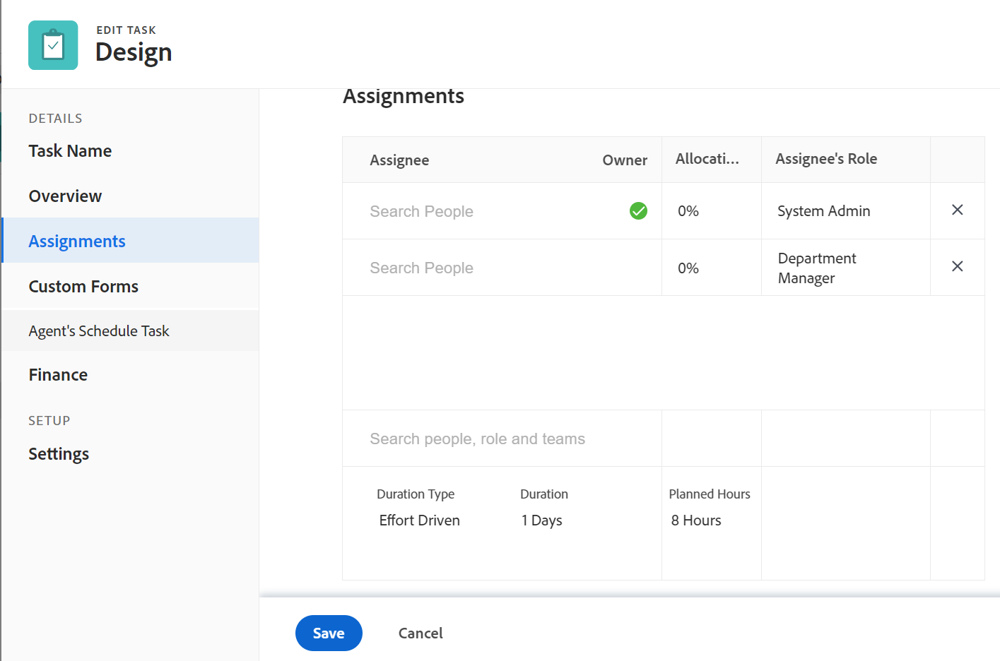

# Taken bewerken

<!--

(NOTE: some information in this area is repeated in the following articles. If you need to update a fied, update it in both:

** Task finances in details

** Task information in overview)

-->

U kunt informatie bewerken over taken die u hebt gemaakt of waarop u machtigingen voor Contribute of Beheren hebt.

## Toegangsvereisten

U moet de volgende toegang hebben om de stappen in dit artikel uit te voeren:

<table style="table-layout:auto"> 
 <col> 
 <col> 
 <tbody> 
  <tr> 
   <td role="rowheader">Adobe Workfront-abonnement*</td> 
   <td> 
Alle 
 </td> 
  </tr> 
  <tr> 
   <td role="rowheader">Adobe Workfront-licentie*</td> 
   <td> 
Werk of hoger
 </td> 
  </tr> 
  <tr> 
   <td role="rowheader">Toegangsniveau*</td> 
   <td> 
Toegang tot taken en projecten bewerken
 
<b>OPMERKING</b>

Als u nog steeds geen toegang hebt, vraagt u de Workfront-beheerder of deze aanvullende beperkingen op uw toegangsniveau instelt. Voor informatie over hoe een beheerder van Workfront uw toegangsniveau kan veranderen, zie <a href="../../../administration-and-setup/add-users/configure-and-grant-access/create-modify-access-levels.md" class="MCXref xref">Aangepaste toegangsniveaus maken of wijzigen</a>.
 </td>
</tr> 
  <tr> 
   <td role="rowheader">Objectmachtigingen</td> 
   <td> 
    <ul> 
     <li> 
Contribute-machtigingen voor een taak om deze te bewerken in het gebied Taakdetails 
 </li> 
     <li> 
Machtigingen beheren voor een taak om deze te bewerken in het vak Taak bewerken
 </li> 
    </ul> 
    <ul> 
     <li> 
Contribute of hoger machtigingen voor het project
 </li> 
    </ul> 
Voor informatie over het aanvragen van aanvullende toegang raadpleegt u <a href="../../../workfront-basics/grant-and-request-access-to-objects/request-access.md" class="MCXref xref">Toegang tot objecten aanvragen </a>.
 </td> 
  </tr> 
 </tbody> 
</table>

&#42;Neem contact op met uw Workfront-beheerder om te weten te komen welk plan, licentietype of toegang u hebt.

## Beperkingen voor het bewerken van taken

Er zijn enkele beperkingen die kunnen voorkomen dat u taken bewerkt.

Houd rekening met het volgende wanneer u taken bewerkt:

* Het bijwerken van taken brengt berichten voor projecten teweeg die een Huidige status zijn. Om verwarring voor gebruikers te vermijden die aan de taken worden toegewezen, beperk het uitgeven taken zoveel mogelijk wanneer het project in de Huidige status is.
* U kunt taken in een goedkeuringsproces niet bewerken. U kunt de Status voor een taak slechts registreren of bijwerken in een goedkeuringsproces.

  

* U kunt documenten aan taken op een project uitgeven en toevoegen dat een status van Voltooid heeft, Dead, of in afwachting van Goedkeuring slechts wanneer uw beheerder van Workfront of een groepsbeheerder deze functionaliteit op het gebied van de Voorkeur van het Project toeliet. Voor informatie over het instellen van projectvoorkeuren raadpleegt u [Projectvoorkeuren voor het hele systeem configureren](../../../administration-and-setup/set-up-workfront/configure-system-defaults/set-project-preferences.md).

* U kunt de volgende informatie over een taak altijd uitgeven wanneer het project is duidelijk Voltooid, Dead, of in een Erkenningsproces is:

   * Logtijd
   * Bestaande uitgaven bewerken
   * Een aangepast formulier bijvoegen

## Een taak in een lijst bewerken

U kunt taakgegevens bewerken in een takenlijst door velden inline te bewerken die worden weergegeven in de weergave van de lijst.

Voor informatie over het bewerken van taken in lijsten raadpleegt u [Taken in een lijst bewerken](../../../manage-work/tasks/manage-tasks/edit-tasks-in-a-list.md).

## Een taak in een lijst bewerken met Overzicht

U kunt een taak in een lijst bewerken met het deelvenster Overzicht. Voor informatie over het bewerken van een taak in het deelvenster Overzicht raadpleegt u de sectie &quot;Een taak bewerken in het overzicht&quot; in het dialoogvenster [Taken in een lijst bewerken](../../../manage-work/tasks/manage-tasks/edit-tasks-in-a-list.md) artikel.

## Een taak bewerken in het vak Taak bewerken

U kunt een taak bewerken met de gebieden Taak bewerken of Taakdetails. In de volgende stappen wordt het bewerken van een taak beschreven in het vak Taak bewerken.

1. Klik op de knop **Hoofdmenu** pictogram  in de rechterbovenhoek van Adobe Workfront.

1. Klikken **Projecten** klikt u vervolgens op de naam van een project om het te openen.
1. Klikken **Taken** in het linkerdeelvenster.
1. Klik op de taak die u wilt bewerken.
1. (Voorwaardelijk) Als u beperkte informatie over een taak wilt bewerken, als een gebruiker met Contribute-machtigingen voor de taak, klikt u op **Taakdetails** in het linkerdeelvenster.

   

   Overweeg het uitgeven van informatie op de volgende gebieden in de sectie van de Details van de Taak:

   * **Overzicht**

     Dit gebied wordt standaard uitgevouwen.

   * **Aangepaste Forms**

     De namen van douaneformulieren worden alleen weergegeven als er aangepaste formulieren aan het object zijn gekoppeld.

   * **Financiën**

   >[!NOTE]
   >
   >Afhankelijk van de manier waarop uw Workfront-beheerder of groepsbeheerder uw lay-outsjabloon heeft gewijzigd, kunnen de velden in het gebied Taakdetails opnieuw worden gerangschikt of niet worden weergegeven. Zie voor meer informatie [De weergave Details aanpassen met een lay-outsjabloon](../../../administration-and-setup/customize-workfront/use-layout-templates/customize-details-view-layout-template.md).

   Voor informatie over de gebieden zichtbaar in de sectie van de Details van de Taak, ga verder met het uitgeven van de taak in het Edit de vakje van de Taak zoals hieronder beschreven.

   Ga als volgt te werk om de gegevens in de sectie Details te bewerken:

   1. (Optioneel) Klik op de knop **Alles samenvouwen** pictogram  in de rechterbovenhoek om alle gebieden samen te vouwen.
   1. (Optioneel en voorwaardelijk) Als een gebied is samengevouwen, klikt u op de knop **pijl-rechts**  naast elk gebied om het gebied uit te breiden u wilt uitgeven.
   1. Raadpleeg de volgende artikelen voor meer informatie over het bewerken van informatie op het tabblad Taakdetails:

      * [Taakgegevens beheren in het gebied Overzicht van taakdetails](../../../manage-work/tasks/manage-tasks/task-information-in-overview.md)
      * [Taakfinanciën beheren in de sectie Taakdetails](../../../manage-work/tasks/manage-tasks/task-finances-in-details.md)

   1. (Optioneel) Als er geen aangepaste formulieren aan de taak zijn gekoppeld, typt u de naam van een formulier in het dialoogvenster **Aangepast formulier toevoegen** , selecteert u het veld wanneer het wordt weergegeven in de lijst en klikt u vervolgens op **Wijzigingen opslaan**.
   1. (Optioneel) Klik op de knop **Exporteren** pictogram  als u het overzicht en de aangepaste formuliergegevens wilt exporteren naar een PDF-bestand, klikt u op **Exporteren**. Selecteer een van de volgende opties:

      * Alles selecteren (wordt alleen weergegeven als er ten minste één aangepast formulier is gekoppeld)
      * Overzicht
      * De naam van een of meerdere aangepaste formulieren

      Het PDF-bestand wordt naar de computer gedownload.

      

      Zie voor meer informatie [Aangepaste formulieren en objectdetails exporteren](../../../workfront-basics/work-with-custom-forms/export-custom-forms-details.md).

1. (Voorwaardelijk) Als u alle informatie over de taak wilt bewerken, als een gebruiker met de machtiging Beheren voor de taak, klikt u op de knop **Meer** menu  naast de naam van de taak klikt u op **Bewerken**.

   of

   Selecteer een taak in een lijst met taken en klik op de knop **Bewerken** pictogram  boven aan de lijst.

   Het vak Taak bewerken wordt geopend.

   >[!IMPORTANT]
   >
   >U moet over beheerdersmachtigingen voor de taak beschikken om de optie Bewerken te kunnen zien.

   Alle taakvelden zijn beschikbaar in het vak Taak bewerken en zijn gegroepeerd op de gebieden in het linkerdeelvenster.

   >[!NOTE]
   >
   >Afhankelijk van de manier waarop uw Workfront-beheerder of groepsbeheerder uw lay-outsjabloon heeft gewijzigd, kunnen de velden in het gebied Taakdetails opnieuw worden gerangschikt of niet worden weergegeven. Zie voor meer informatie [De weergave Details aanpassen met een lay-outsjabloon](../../../administration-and-setup/customize-workfront/use-layout-templates/customize-details-view-layout-template.md).

   Overweeg informatie op te geven in een van de volgende secties:

   * [Taaknaam](#task-name)
   * [Overzicht](#overview)
   * [Toewijzingen](#assignments)
   * [Aangepaste Forms](#Custom%C2%A0F)
   * [Financiën](#finance)
   * [Instellingen](#settings)

   >[!NOTE]
   >
   >Afhankelijk van hoe uw Workfront-beheerder of groepsbeheerder onze lay-outsjabloon instelt, kunnen de velden in het vak Taak bewerken opnieuw worden gerangschikt of niet worden weergegeven. Zie voor meer informatie [De weergave Details aanpassen met een lay-outsjabloon](../../../administration-and-setup/customize-workfront/use-layout-templates/customize-details-view-layout-template.md).

### Taaknaam {#task-name}

1. Bewerk de taak zoals hierboven beschreven.
1. Klikken **Taaknaam** in het linkerdeelvenster.

   

1. Werk de naam van de taak bij.

1. Klikken **Opslaan** of ga verder met de volgende secties.

### Overzicht {#overview}

1. Bewerk de taak zoals hierboven beschreven.
1. Klikken **Overzicht** in het linkerdeelvenster.

   

1. Werk de volgende informatie over de taak bij:

   <table style="table-layout:auto"> 
    <col> 
    <col> 
    <tbody> 
     <tr> 
      <td role="rowheader">Beschrijving</td> 
      <td>Voeg aanvullende informatie over de taak toe. </td> 
     </tr> 
     <tr> 
      <td colspan="2" role="rowheader">Sectie Basisinformatie </td> 
     </tr> 
     <tr> 
      <td role="rowheader">Status</td> 
      <td> 
Selecteer de status van de taak die aangeeft in welk ontwikkelingsstadium de taak zich bevindt.
 
<b>TIP</b>

   U kunt de taakstatus bijwerken in de taakkoptekst. 
 </td>
   </tr> 
     <tr> 
      <td role="rowheader">Prioriteit</td> 
      <td> 
Dit is een visuele vlag voor u die u toestaat om aan uw taken voorrang te geven. 
 
Selecteer een van de volgende opties: 
 
       <ul> 
      <li> 
 Geen
 </li> 
      <li> 
 Laag 
 </li> 
      <li> 
Normaal 
 </li> 
      <li> 
Hoog 
 </li> 
      <li> 
 Dringend 
 </li> 
       </ul> 
Afhankelijk van de projectvoorkeuren die door uw Workfront-beheerder zijn geselecteerd, kunnen de namen van prioriteiten voor u anders zijn. Voor informatie over taakprioriteiten raadpleegt u <a href="../../../manage-work/tasks/task-information/task-priority.md" class="MCXref xref">Taakprioriteit bijwerken</a>. 
 </td> 
     </tr> 
     <tr> 
      <td colspan="2" role="rowheader">Sectie Taakdatums en beperkingen </td> 
     </tr> 
     <tr> 
      <td role="rowheader">Taakbeperking</td> 
      <td> 
Beslis wanneer de taak moet worden voltooid door een Beperking van de Taak te specificeren. 
 
Selecteer een van de volgende opties: 
 
       <ul> 
      <li> 
Vaste datums 
 
Geef een <strong>Geplande start</strong> en <strong>Geplande afsluitdatum</strong>. 
 </li> 
      <li> 
Moet beginnen op 
 
Geef een <strong>Geplande begindatum</strong>. 
 </li> 
      <li> 
Moet worden voltooid op 
 
Geef een <strong>Geplande afsluitdatum</strong>. 
 </li> 
       </ul> 
       <ul> 
      <li> 
Zo snel mogelijk
 </li> 
      <li> 
Zo laat mogelijk
 </li> 
      <li> 
Vroegst beschikbare tijd
 </li> 
      <li> 
 Laatste beschikbare tijd
 </li> 
      <li> 
Niet later starten dan 
 </li> 
      <li> 
Een geplande begindatum opgeven
 </li> 
      <li> 
Niet eerder starten dan 
 
Geef een <strong>Geplande begindatum</strong>. 
 </li> 
      <li> 
 Voltooien Niet later dan
 
Geef een <strong>Geplande afsluitdatum</strong>. 
 </li> 
      <li> 
 Voltooien Niet eerder dan
 
Geef een <strong>Geplande afsluitdatum</strong>
 </li> 
       </ul> 
Voor meer informatie over de Beperking van de Taak, zie <a href="../../../manage-work/tasks/task-constraints/task-constraint-overview.md" class="MCXref xref">Overzicht van taakbeperking</a>.
 </td> 
     </tr> 
     <tr> 
      <td role="rowheader">Datum en tijd vastleggen</td> 
      <td> 
Dit is de datum waardoor de gebruiker aan de taak toezegt om het te voltooien. Dit kan anders zijn dan de geplande voltooiingsdatum. Alleen toegewezen personen kunnen dit veld bewerken. Voor informatie over Commit Dates in Workfront, zie <a href="../../../manage-work/projects/updating-work-in-a-project/overview-of-commit-dates.md" class="MCXref xref">Overzicht van datum vastleggen</a>. 
 </td> 
     </tr> 
     <tr> 
      <td role="rowheader">Geplande begindatum en -tijd</td> 
      <td> 
Wanneer de taak van plan is te beginnen. De geplande begindatum van een taak wordt bepaald en beïnvloed door een aantal factoren:
 
       <ul> 
      <li>Afhankelijk van de systeembrede voorkeur voor de taak geplande begindatum, kan de begindatum van een nieuwe taak op een project of vandaag, of de begindatum van het project, door gebrek zijn. De groepsbeheerder voor de groep verbonden aan het project kan deze voorkeur voor de groep ook plaatsen. Voor meer informatie over de taakvoorkeuren op systeemniveau of groepsniveau raadpleegt u <a href="../../../administration-and-setup/set-up-workfront/configure-system-defaults/set-task-issue-preferences.md" class="MCXref xref">Taak- en probleemvoorkeuren voor het hele systeem configureren</a>.</li> 
      <li>Afhankelijk van de voorgangers van de taak, wordt de geplande begindatum gekozen door Workfront om de volgende beschikbare datum te zijn nadat de voorgangers klaar zijn of beginnen, afhankelijk van de voorganger-relatie. Voor meer informatie over vorige relaties raadpleegt u <a href="../../../manage-work/tasks/use-prdcssrs/predecessors-overview.md" class="MCXref xref">Overzicht van voorgangers van taken</a>.</li> 
      <li>De projectmanager of de taakeigenaar kunnen manueel de geplande begindatum plaatsen wanneer de taakbeperking of Vaste Datums is of moet Begin op. Voor meer informatie over taakbeperkingen, zie <a href="../../../manage-work/tasks/task-constraints/task-constraint-overview.md" class="MCXref xref">Overzicht van taakbeperking</a>.</li> 
       </ul> </td> 
     </tr> 
     <tr> 
      <td role="rowheader">Geplande voltooiing Datum en tijd</td> 
      <td> 
De verwachte voltooiingsdatum zoals aangetoond wanneer de taak wordt gepland. De geplande einddatum kan door een aantal factoren worden bepaald:
 
       <ul> 
      <li>De geplande einddatum wordt berekend vanaf de geplande begindatum door de duur van de taak toe te voegen aan de geplande begindatum. Wanneer de projectmanager of Workfront de Duur van de taak specificeert, teweegbrengt dit een update aan de geplande voltooiingsdatum. Als de geplande datum verandert, zal het vaak omdat de Duur van is bijgewerkt.</li> 
      <li>De projectmanager of de taakeigenaar kunnen manueel de geplande voltooiingsdatum plaatsen wanneer de taakbeperking of Vaste Datums is of moet beëindigen. Voor meer informatie over taakbeperkingen, zie <a href="../../../manage-work/tasks/task-constraints/task-constraint-overview.md" class="MCXref xref">Overzicht van taakbeperking</a>.</li> 
      <li>Als het Type van Duur van de taak verandert, en het aantal middelen op de taken tezelfdertijd verandert, zal de geplande voltooiingsdatum ook veranderen. Voor meer informatie over de soorten duur raadpleegt u <a href="../../../manage-work/tasks/taskdurtn/task-duration-and-duration-type.md" class="MCXref xref">Overzicht van het Type van Duur en van de Duur van de Taak</a>.</li> 
       </ul> </td> 
     </tr> 
     <tr> 
      <td role="rowheader">Werkelijke begindatum en -tijd</td> 
      <td> 
Geef een werkelijke begindatum op voor de taak. De standaardinstelling wordt meestal automatisch ingevuld wanneer u de status van de taak wijzigt in Bezig. De daadwerkelijke begindatum kan ook handmatig worden gewijzigd door de projectmanager of de eigenaar van de taak. 
 </td> 
     </tr> 
     <tr> 
      <td role="rowheader">Werkelijke einddatum en -tijd</td> 
      <td> 
Geef de werkelijke datum en tijd op waarop de taak is voltooid. De standaarddatum en -tijd waarop een taak wordt voltooid, vallen altijd samen met de werkelijke tijd waarop de status wordt voltooid. De daadwerkelijke voltooiingsdatum kan ook manueel door de projectmanager, of de taakeigenaar worden gewijzigd. 
 </td> 
     </tr> 
     <tr> 
      <td role="rowheader"><b>Werktijdsectie</b></td> 
     </tr> 
     <tr> 
      <td role="rowheader">Werkinspanning </td> 
      <td>

   
De hoeveelheid inspanning die wordt vereist om de taak te voltooien. Uw projectmanager zou kunnen besluiten om dit gebied in plaats van Geplande Uren te gebruiken om de inspanning te schatten nodig om een taak te voltooien. Dit veld is alleen zichtbaar als aan de volgende voorwaarden is voldaan:
 
      <ul> 
      <li> 
De taak heeft een Eenvoudig Type van Duur. 
 
<b>TIP</b>

   Als u het type Duur van de taak wijzigt, wordt dit gebied verduisterd. 
 </li>
   <li>Uw projectmanager heeft de Werkinspanning van het Gebruik toegelaten om het taak Geplande gebied van Uren op het project automatisch te berekenen. </li> 
      </ul> 
      
Selecteer een van de volgende opties:
 
      <ul> 
      <li>Klein</li> 
      <li>Normaal (dit is de standaardwaarde voor een nieuwe taak)</li> 
      <li>Groot</li> 
      </ul> 
      
<b>OPMERKING</b>

   Door de hoeveelheid moeite bij te werken, kan de geplande uren worden bijgewerkt. De update is onmiddellijk als het Type van projectupdate Automatisch is. Wanneer het Type van Projectupdates Handmatig is moet u chronologie opnieuw berekenen om de bijgewerkte Geplande Uren te zien. 

   
Voor informatie over het gebruiken van de Werkinspanning in plaats van Geplande Uren om taakinspanning te schatten, zie <a href="../../../manage-work/tasks/task-information/work-effort.md" class="MCXref xref">Overzicht van werkprestaties</a>. 
 
    </td> 
     </tr> 
    </tbody> 
   </table>

1. Klikken **Opslaan** of ga verder met de volgende secties.

### Toewijzingen {#assignments}

1. Bewerk de taak zoals hierboven beschreven.
1. Klikken **Toewijzingen** in het linkerdeelvenster.

   

1. Klikken **Personen, rollen en teams zoeken** en begint de naam van een gebruiker, een rol, of een team te typen die u aan de taak wilt toewijzen, dan het klikken of drukken binnengaan wanneer het op de lijst toont.

   >[!NOTE]
   >
   >Als de naam van de gebruiker een speciaal teken bevat, moet u het speciale teken in het zoekveld opnemen.

   >[!TIP]
   >
   >U kunt meerdere gebruikers, taakrollen of teams toewijzen. U kunt alleen actieve gebruikers, taakrollen en teams toewijzen.
   >
   >Als een gebruiker, een baanrol, of een team werd toegewezen alvorens zij werden gedeactiveerd, blijven zij toegewezen aan het het werkpunt. In dit geval raden we het volgende aan:
   >
   >* Wijs het werkitem opnieuw toe aan actieve bronnen.
   >* Koppel de gebruikers in een gedeactiveerd team aan een actief team en wijs het het werkpunt aan het actieve team opnieuw toe.

1. (Optioneel) Geef aan of een verkrijger de primaire ontvanger van de taak is door de **Eigenaar** keuzerondje naast hun naam. Een team kan niet de primaire ontvanger van een taak zijn.
1. (Voorwaardelijk en optioneel) Werk de volgende velden bij:

   <table style="table-layout:auto"> 
    <col> 
    <col> 
    <tbody> 
     <tr> 
      <td role="rowheader">Duur</td> 
      <td> 
Dit identificeert de verhouding tussen het volgende: 
 
       <ul> 
      <li> 
Het aantal middelen die aan een taak worden toegewezen 
 </li> 
      <li> 
De totale vereiste inspanning om de taak te voltooien 
 </li> 
      <li> 
 De totale duur van de taak. 
 </li> 
       </ul> 
Uw Workfront-beheerder  of een groepsbeheerder Hiermee selecteert u de standaardinstelling Duur (Duur) voor de taken in uw systeem of groep. Voor informatie over het plaatsen van projectgebreken, zie <a href="../../../administration-and-setup/set-up-workfront/configure-system-defaults/set-project-preferences.md" class="MCXref xref">Projectvoorkeuren voor het hele systeem configureren</a>. 
 
De Types van Duur laten u toe om verenigbare middeltaken te plaatsen die op de behoeften van de taak worden gebaseerd. Voor meer informatie over het Type van Duur van een taak, zie <a href="../../../manage-work/tasks/taskdurtn/task-duration-and-duration-type.md" class="MCXref xref">Overzicht van het Type van Duur en van de Duur van de Taak</a>. 
 
Selecteer een van de volgende opties: 
 
       <ul> 
      <li> 
Berekende toewijzing 
 </li> 
      <li> 
 Berekend werk 
 </li> 
      <li> 
Inzet gedreven 
 </li> 
      <li> 
Eenvoudig
 </li> 
       </ul> </td> 
     </tr> 
     <tr data-mc-conditions="QuicksilverOrClassic.Quicksilver"> 
      <td role="rowheader">Duur per instantie</td> 
      <td> 
Dit wordt alleen weergegeven op het bovenliggende element van terugkerende taken. Het toont de duur van elke terugkomende taak. Voor informatie over het creëren van terugkomende taken, zie <a href="../../../manage-work/tasks/create-tasks/create-recurring-tasks.md" class="MCXref xref">Herhalende taken maken</a>. 
 
 <b>OPMERKING</b>

   De duur die in individuele terugkerende taken wordt gewijzigd toont niet de waarde die op dit gebied wordt vermeld. 
 </td>
   </tr> 
     <tr> 
      <td role="rowheader">Duur</td> 
      <td> 
      
 
      
 
      
Dit is de hoeveelheid tijd dat u een taak open laat blijven alvorens het wordt voltooid. 
 
      
<b>BELANGRIJK</b>

   Omdat de taakduur typisch de hoeveelheid tijd tussen de Geplande Begin en de Geplande Datums van de Voltooiing is, beïnvloedt het de chronologie van het project.

   
Ga als volgt te werk om de duur van de taak en de tijdseenheid aan te geven:
 
      <ul> 
      <li> 
Typ de tijdsduur en kies een van de tijdseenheden die beschikbaar zijn in het keuzemenu.
 
<b>TIP</b>

      Wanneer u de Duur van taken in een taaklijst bijwerkt, kunt u de afkorting voor de eenheid van tijd gebruiken. 
 </li> 
      </ul> 
      
 U kunt kiezen uit de opties voor normale tijd of verstreken tijd in de volgende tabel: 
 
      <table style="table-layout:auto"> 
      <col> 
      <col data-mc-conditions=""> 
      <tbody> 
      <tr> 
      <td>Tijdseenheid</td> 
      <td>Afkorting</td> 
      </tr> 
      <tr> 
      <td>Minuten</td> 
      <td>M</td> 
      </tr> 
      <tr> 
      <td>Uren</td> 
      <td>H</td> 
      </tr> 
      <tr> 
      <td>Dagen. Dit is de standaardinstelling. </td> 
      <td>D</td> 
      </tr> 
      <tr> 
      <td>Weken</td> 
      <td>W</td> 
      </tr> 
      <tr> 
      <td>Maanden</td> 
      <td>T</td> 
      </tr> 
      <tr> 
      <td>Verstreken minuten</td> 
      <td>EM</td> 
      </tr> 
      <tr> 
      <td>Verstreken uren</td> 
      <td>EH</td> 
      </tr> 
      <tr> 
      <td>Verstreken dagen</td> 
      <td>ED</td> 
      </tr> 
      <tr> 
      <td>Verstreken weken</td> 
      <td>EW</td> 
      </tr> 
      <tr> 
      <td>Verstreken maanden</td> 
      <td>ET</td> 
      </tr> 
      </tbody> 
   </table>

   
<b>OPMERKING</b>

   
De verstreken tijd is een eenheid van tijd voor de Duur van een taak. Dit is de tijd tussen de Geplande Datum van het Begin en de Geplande Datum van de Voltooiing van een taak die vakantie, weekends, en onderbreking omvat. Met andere woorden, de verstreken tijd is de doorloop van kalenderdagen.

   De regelmatige tijd houdt rekening met vakantie, weekends, en onderbreking en sluit hen van de Duur van de taak uit. Voor meer informatie over taakduur raadpleegt u <a href="../../../manage-work/tasks/taskdurtn/task-duration-and-duration-type.md" class="MCXref xref">Overzicht van het Type van Duur en van de Duur van de Taak</a>. 

   
 
   
 </td> 
   </tr> 
   <tr> 
   <td role="rowheader">Geplande uren</td> 
   <td> 
Geef de hoeveelheid geplande uren voor de taak op in uren. Dit is de hoeveelheid werkelijke tijd die nodig is om de taken af te ronden. U kunt de hoeveelheid Geplande Uren voor een taak slechts specificeren wanneer het Type van Duur aan Berekende Toewijzing wordt geplaatst. Voor meer informatie over de soorten duur raadpleegt u <a href="../../../manage-work/tasks/taskdurtn/task-duration-and-duration-type.md" class="MCXref xref">Overzicht van het Type van Duur en van de Duur van de Taak</a>.
 </td> 
   </tr> 
   <tr> 
   <td role="rowheader">Toewijzing</td> 
   <td> 
Als uw Taakbeperking Berekend Werk of Gedreven Inspanning is, specificeer <strong>Toewijzing %</strong> (toewijzingspercentage) voor elke toegewezen persoon. Dit is de hoeveelheid tijd van het programma van de toegewezen persoon die zij aan deze taak kunnen uitgeven. Als het toewijzingspercentage voor een toegewezen persoon wordt gewijzigd, veranderen de geplande uren van een taak. 
 
Wanneer de Restrictie van de Taak Eenvoudig is, kunt u het volgende specificeren:
 
      <ul> 
      <li> 
Toewijzingstijden van elke toegewezen persoon.
 </li> 
      <li> 
Geplande uren van de taak
 </li> 
      <li> 
Duur van de taak
 </li> 
      </ul> </td> 
   </tr> 
   <tr> 
   <td role="rowheader">Rol van de gemachtigde</td> 
   <td> 
Selecteer een rol in het menu <strong>Rol van de gemachtigde</strong> vervolgkeuzemenu wanneer u een persoon als ontvanger hebt geselecteerd. Dit is de rol die de verkrijger in deze taak kan vervullen. 
 
<b>TIP</b>

   Alleen de functies die aan elke toegewezen persoon in het profiel zijn gekoppeld, worden weergegeven in het vervolgkeuzemenu.
 </td>
   </tr> 
      </tbody> 
      </table>

1. Klikken **Opslaan** of ga verder met de volgende secties.

### Aangepaste Forms

U kunt aangepaste standaardformulieren definiëren die automatisch aan taken worden gekoppeld wanneer de taken aan een project worden toegevoegd. Zie de sectie &quot;Taken&quot; in het artikel voor informatie over het instellen van het project om standaardformulieren voor taken voor alle nieuwe taken op te nemen [Projecten bewerken](../../../manage-work/projects/manage-projects/edit-projects.md).

1. Bewerk de taak zoals hierboven beschreven.
1. Klikken **Aangepaste Forms** in het linkerdeelvenster, of klik op de naam van een aangepast formulier als dit al is gekoppeld.

   

1. Klikken **Aangepast formulier toevoegen** en selecteert u het aangepaste formulier of de formulieren die u aan de taak wilt koppelen. U moet aangepaste formulieren maken voordat u ze in dit veld kunt selecteren. Alleen actieve aangepaste formulieren worden in de lijst weergegeven.

   Zie voor meer informatie over het samenstellen van aangepaste formulieren [Een aangepast formulier maken of bewerken](../../../administration-and-setup/customize-workfront/create-manage-custom-forms/create-or-edit-a-custom-form.md).U kunt maximaal tien aangepaste formulieren aan een taak toevoegen.

1. (Voorwaardelijk) Als u een aangepast formulier aan de taak hebt gekoppeld, bewerkt u alle velden op het formulier. U moet alle vereiste velden opgeven voordat u de taak kunt opslaan.

   >[!NOTE]
   >
   >Afhankelijk van de manier waarop uw Workfront-beheerder de machtigingen voor de secties in uw aangepaste formulier instelt, kan niet iedereen dezelfde velden op een aangepast formulier weergeven of bewerken. De machtigingen voor het bewerken van velden in een sectie van een aangepast formulier zijn afhankelijk van de machtigingen die u hebt voor de taak zelf. Voor informatie over het instellen van taakmachtigingen raadpleegt u [Een taak delen](../../../workfront-basics/grant-and-request-access-to-objects/share-a-task.md).

1. Klikken **Opslaan** of ga verder met de volgende secties.

### Financiën {#finance}

1. Beginnen met het bewerken van de taak zoals beschreven in het dialoogvenster [Taken bewerken](#Edit2) in dit artikel.
1. Klikken **Financiën** in het linkerdeelvenster.

   

1. Werk de volgende velden bij:

   <table style="table-layout:auto"> 
    <col> 
    <col> 
    <tbody> 
     <tr> 
      <td role="rowheader">Kostensoort</td> 
      <td> 
Geef het type kosten voor de taak op. Dit gaat bepalen hoe de kosten van de taak, gebaseerd op het aantal uren op de taken worden berekend. 
 
Selecteer een van de volgende opties: 
 
       <ul> 
        <li> 
Geen kosten
 </li> 
        <li> 
Vaste uren 
 </li> 
        <li> 
 Uur gebruiker 
 </li> 
        <li> 
 Rol Uur
 </li> 
       </ul> 
Voor meer informatie over het volgen van kosten, zie <a href="../../../manage-work/projects/project-finances/track-costs.md" class="MCXref xref">Trackkosten</a> . Uw Workfront-beheerder of groepsbeheerder selecteert de standaardinstelling Kostensoort voor de taken in uw systeem of groep. Voor informatie over het plaatsen van projectgebreken, zie <a href="../../../administration-and-setup/set-up-workfront/configure-system-defaults/set-project-preferences.md" class="MCXref xref">Projectvoorkeuren voor het hele systeem configureren</a> .
 </td> 
     </tr> 
     <tr> 
      <td role="rowheader">Type inkomsten</td> 
      <td> 
Geef het type inkomsten voor de taak op. Dit gaat bepalen hoe de Inkomsten op de taak worden berekend, gebaseerd op het aantal uren op de taken. 
 
Selecteer een van de volgende opties: 
 
       <ul> 
      <li> 
 Niet opteerbaar 
 </li> 
      <li> 
Uur gebruiker 
 </li> 
      <li> 
Rol Uur 
 </li> 
      <li> 
Vaste uren 
 </li> 
      <li> 
Uur gebruiker met lampvoet 
 </li> 
      <li> 
Rol Uur met lampvoet 
 </li> 
      <li> 
Uur plus vaste kosten gebruiker 
 </li> 
      <li> 
Rol Uur plus vast 
 </li> 
      <li> 
Vaste inkomsten 
 </li> 
       </ul> 
Voor meer informatie over het volgen van opbrengst, zie<a href="../../../manage-work/projects/project-finances/billing-and-revenue-overview.md" class="MCXref xref">Overzicht van facturering en inkomsten</a> . 
 
Uw Workfront-beheerder of groepsbeheerder selecteert de standaardinstelling Inkooptype voor de taken in uw systeem of groep. Voor informatie over het plaatsen van projectgebreken, zie <a href="../../../administration-and-setup/set-up-workfront/configure-system-defaults/set-project-preferences.md" class="MCXref xref">Projectvoorkeuren voor het hele systeem configureren</a>.
 </td> 
     </tr> 
    </tbody> 
   </table>

1. Klikken **Opslaan** of ga verder met de volgende sectie.

### Instellingen {#settings}

1. Beginnen met het bewerken van de taak zoals beschreven in het dialoogvenster [Taken bewerken](#Edit2) in dit artikel.
1. Klikken **Instellingen** in het linkerdeelvenster.

   

1. Werk de volgende velden bij:

   <table style="table-layout:auto"> 
    <col> 
    <col> 
    <tbody> 
     <tr> 
      <td role="rowheader">Traceermodus</td> 
      <td> 
Geef op hoe de voortgangsstatus van de taak wordt bijgehouden. 
 
Selecteer een van de volgende opties: 
 
       <ul> 
      <li> 
 Gebruiker moet bijwerken 
 </li> 
      <li> 
Veronderstellen op tijd 
 </li> 
      <li> 
Te late waarschuwingen negeren
 </li> 
      <li> 
 Automatisch aanvullen 
 </li> 
      <li> 
Voorganger 
 </li> 
       </ul> 
Voor meer informatie over de Trackingmodus op taken raadpleegt u <a href="../../../manage-work/tasks/task-information/task-tracking-mode.md" class="MCXref xref">Overzicht van de modus Taken bijhouden</a>.
 </td> 
     </tr> 
     <tr> 
      <td role="rowheader">Bronniveaus</td> 
      <td> 
Selecteer <strong>Uitsluiten van bronnenniveau</strong> veld als u wilt dat de bronnen die aan de taak zijn toegewezen, niet op niveau worden gebracht.
 </td> 
     </tr> 
     <tr> 
      <td role="rowheader">Vertraging Niveaus</td> 
      <td> 
Geef de Leveling-vertraging op in uren. 
 
 Voor meer informatie over het nivelleren van vertragingen, zie <a href="../../../manage-work/tasks/task-information/task-leveling-delay.md" class="MCXref xref">Vertraging taakniveaus bijwerken</a>. 
 </td> 
     </tr> 
     <tr> 
      <td role="rowheader">Goedkeuringsproces</td> 
      <td> 
Selecteer een goedkeuringsproces dat u met de taak wilt associëren. Uw Workfront-beheerder moet goedkeuringsprocessen op systeemniveau definiëren voordat u deze aan taken kunt koppelen. Een gebruiker met administratieve toegang tot goedkeuringsprocessen kan ook groepsspecifieke goedkeuringsprocessen maken. 
 
Ga voor meer informatie over het maken van goedkeuringsprocessen naar <a href="../../../administration-and-setup/customize-workfront/configure-approval-milestone-processes/create-approval-processes.md">Een goedkeuringsproces voor werkitems maken</a>. Houd rekening met het volgende wanneer u goedkeuringsprocessen toevoegt: 
 
       <ul>

   <li> 
Alleen actieve goedkeuringsprocessen worden in de lijst weergegeven. 
 </li>

   <li> 
Systeemspecifieke en groepsspecifieke goedkeuringsprocessen worden in de lijst weergegeven. Een goedkeuringsproces verbonden aan een groep buiten die van het project toont niet in de lijst. 

   
<b>BELANGRIJK</b>

   Als de groep van het project verandert, wordt het groep-specifieke goedkeuringsproces eerder in bijlage een enig-gebruiksgoedkeuringsproces. Voor meer informatie over hoe de veranderingen in de groep van het project of de veranderingen in het goedkeuringsproces goedkeuringsmontages beïnvloeden, zie <a href="../../../administration-and-setup/customize-workfront/configure-approval-milestone-processes/how-changes-affect-group-approvals.md">De invloed van wijzigingen in groep- en goedkeuringsproces op toegewezen goedkeuringsprocessen</a>. 

   </li>

   <li> 
U kunt standaardgoedkeuringsprocessen bepalen die automatisch aan taken moeten worden vastgemaakt wanneer de taken aan een project worden toegevoegd. Voor informatie over vestiging het project om de processen van de standaardtaakgoedkeuring te omvatten, zie de "sectie van Taken"in het artikel <a href="../../../manage-work/projects/manage-projects/edit-projects.md" class="MCXref xref">Projecten bewerken</a>. 
 </li>

   <li> 
Bij taken voor bulkbewerking bestaan de volgende scenario's: 
 
      <ul> 
      <li> 
Wanneer u meerdere taken selecteert uit dezelfde groep, worden zowel op systeemniveau als op groepsniveau goedkeuringsprocessen weergegeven in dit veld. 
 </li> 
      <li> 
Wanneer u meerdere taken selecteert uit verschillende groepen, worden alleen goedkeuringsprocessen op systeemniveau weergegeven in dit veld. 
 </li> 
      <li> 
Als voor een van de taken een goedkeuringsproces voor één gebruik is gekoppeld, wordt dit vervangen door het goedkeuringsproces op systeemniveau of op groepsniveau dat u selecteert. 
 </li>

   </ul> </li> 
      </ul> </td> 
     </tr> 
    </tbody> 
   </table>
    </li>

1. Klikken **Opslaan**.

<!--notes from the table: 
(NOTE: this bullet stays here although the sections it might appear in are QS only, so we can use the snippet for both Qs and classic)
       -->

## Een taak bewerken in de taakkoptekst (beperkt)

U kunt een beperkte hoeveelheid informatie bewerken in de taakkoptekst.

Uw systeem- of groepsbeheerder kan de velden die u in de taakkoptekst ziet, aanpassen. Zie voor meer informatie [Objectkoppen aanpassen met een lay-outsjabloon](../../../administration-and-setup/customize-workfront/use-layout-templates/customize-object-headers.md).

De volgende gebieden zijn inbegrepen in de projectheader, door gebrek:

* Taaknaam
* Percentage voltooid
* Toewijzingen
* Geplande voltooiing Datum en tijd

  >[!CAUTION]
  >
  >Sommige Restricties van de Taak en andere gebiedsdelen zouden u kunnen verhinderen dit gebied uit te geven. Voor informatie over de Beperkingen van de Taak, zie [Overzicht van taakbeperking](../../../manage-work/tasks/task-constraints/task-constraint-overview.md).

* Status
* Goedkeuringsbeslissingen nemen als u in een huidig goedkeuringsproces als fiatteur bent ingesteld

## Taken bulksgewijs bewerken

U kunt taken in een lijst bulksgewijs bewerken en alle gegevens tegelijk bijwerken wanneer u de wijzigingen die u aanbrengt in taken in de lijst automatisch opslaat.

Zie de sectie &quot;Taken bulksgewijs bewerken&quot; in het artikel voor informatie over het opslaan van taken in bulk [Taken in een lijst bewerken](../../../manage-work/tasks/manage-tasks/edit-tasks-in-a-list.md).
