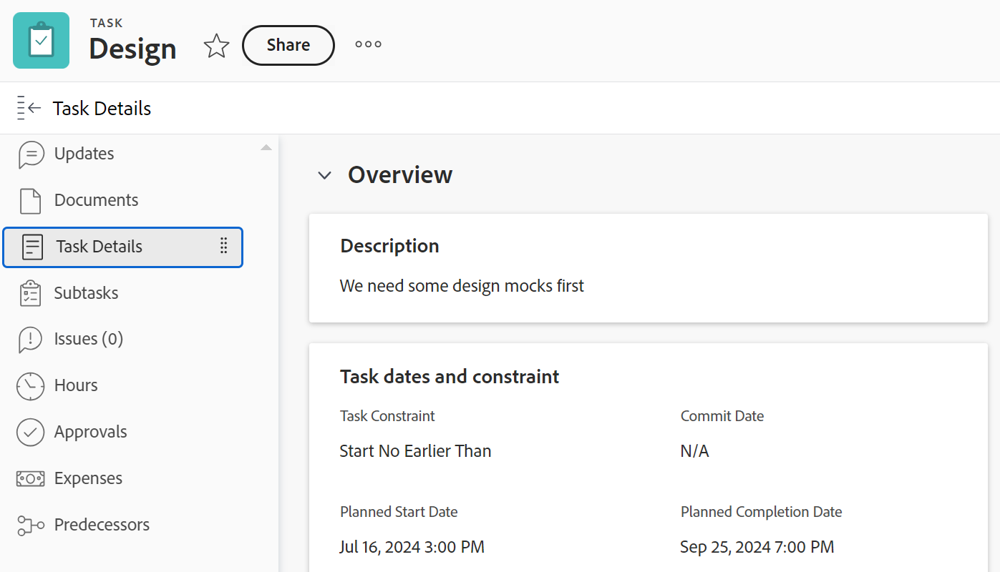
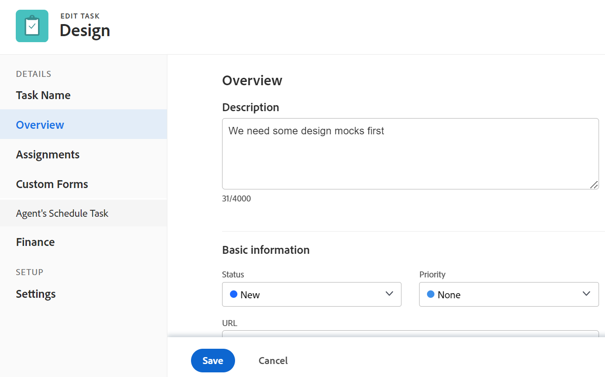

# Taken bewerken

<!--Audited: 10/2025-->

<!--take out prod and preview references at release, or new and old experience-->

<!--

(NOTE: some information in this area is repeated in the following articles. If you need to update a field, update it in both:

** Task finances in details

** Task information in overview)

-->

De gemarkeerde informatie op deze pagina verwijst naar functionaliteit die nog niet algemeen beschikbaar is. Deze optie is alleen beschikbaar in de voorvertoningsomgeving voor alle klanten. Dezelfde functies zijn ook beschikbaar in de productieomgeving voor alle klanten vanaf een week na de release Preview.

Voor meer informatie, zie [ modernisering van de Interface ](/help/quicksilver/product-announcements/product-releases/interface-modernization/interface-modernization.md).

U kunt informatie bewerken over taken die u hebt gemaakt of waarop u machtigingen voor Contribute of Beheren hebt.

## Toegangsvereisten

+++ Breid uit om de toegangseisen voor de functionaliteit in dit artikel weer te geven. 

<table style="table-layout:auto"> 
 <col> 
 <col> 
 <tbody> 
  <tr> 
   <td role="rowheader">Adobe Workfront-pakket</td> 
   <td> 
Alle
 </td> 
  </tr> 
  <tr> 
   <td role="rowheader">Adobe Workfront-licentie</td> 
   <td> 
Standard

   
Werk of hoger
 </td> 
  </tr> 
  <tr> 
   <td role="rowheader">Toegangsniveau</td> 
   <td> 
Toegang tot taken en projecten bewerken
 </td> 
  </tr> 
  <tr> 
   <td role="rowheader">Objectmachtigingen</td> 
   <td> 
    <ul> 
     <li> 
Contribute-machtigingen voor een taak om de volgende gegevens te bewerken in het gebied Taakdetails: 

     <ul>
     <li>Beschrijving</li>
     <li>Status</li>
     </ul>  
      </li> 
     <li> 
Rechten voor een taak beheren om alle informatie in het gebied Details en het vak Taak bewerken te bewerken
 </li> 
    </ul> 
    <ul> 
     <li> 
Contribute of hoger machtigingen voor het project
 </li> 
    </ul> </td> 
  </tr> 
 </tbody> 
</table>

*For informatie, zie [ vereisten van de Toegang in de documentatie van Workfront ](/help/quicksilver/administration-and-setup/add-users/access-levels-and-object-permissions/access-level-requirements-in-documentation.md).

+++

<!--Old:

<table style="table-layout:auto"> 
 <col> 
 <col> 
 <tbody> 
  <tr> 
   <td role="rowheader">Adobe Workfront plan</td> 
   <td> 
Any 
 </td> 
  </tr> 
  <tr> 
   <td role="rowheader">Adobe Workfront license*</td> 
   <td> 
Standard

   
Work or higher
 </td> 
  </tr> 
  <tr> 
   <td role="rowheader">Access level</td> 
   <td> 
Edit access to Tasks and Projects
 </td> 
  </tr> 
  <tr> 
   <td role="rowheader">Object permissions</td> 
   <td> 
    <ul> 
     <li> 
Contribute permissions to a task to edit the following information in the Task Details area: 

     <ul>
     <li>Description</li>
     <li>Status</li>
     </ul>  
      </li> 
     <li> 
Manage permissions to a task to edit all the information in the Details area and the Edit Task box
 </li> 
    </ul> 
    <ul> 
     <li> 
Contribute or higher permissions to the project
 </li> 
    </ul> </td> 
  </tr> 
 </tbody> 
</table>-->

## Beperkingen voor het bewerken van taken

Er zijn enkele beperkingen die kunnen voorkomen dat u taken bewerkt.

Houd rekening met het volgende wanneer u taken bewerkt:

* Het bijwerken van taken brengt berichten voor projecten teweeg die een Huidige status zijn. Om verwarring voor gebruikers te vermijden die aan de taken worden toegewezen, beperk het uitgeven taken zoveel mogelijk wanneer het project in de Huidige status is.
* U kunt taken in een goedkeuringsproces niet bewerken. U kunt de Status voor een taak slechts registreren of bijwerken in een goedkeuringsproces.

   uit

* U kunt documenten aan taken op een project uitgeven en toevoegen dat een status van Voltooid heeft, Dead, of in afwachting van Goedkeuring slechts wanneer uw beheerder van Workfront of een groepsbeheerder deze functionaliteit op het gebied van de Voorkeur van het Project toeliet. Voor informatie over het plaatsen van projectvoorkeur, zie [ systeem-brede projectvoorkeur ](../../../administration-and-setup/set-up-workfront/configure-system-defaults/set-project-preferences.md) vormen.

* U kunt de volgende informatie over een taak altijd uitgeven wanneer het project is duidelijk Voltooid, Dead, of in een Erkenningsproces is:

   * Logtijd
   * Bestaande uitgaven bewerken
   * Een aangepast formulier bijvoegen

* Andere gebruikers moeten hun pagina&#39;s vernieuwen voordat ze de updates die u voor een taak maakt, kunnen bekijken.

## Een taak in een lijst bewerken

U kunt taakgegevens bewerken in een takenlijst door velden inline te bewerken die worden weergegeven in de weergave van de lijst.

Voor informatie over het uitgeven van taken in lijsten, zie [ taken in een lijst ](../../../manage-work/tasks/manage-tasks/edit-tasks-in-a-list.md) uitgeven.

## Een taak in een lijst bewerken met Overzicht

U kunt een taak in een lijst bewerken met het deelvenster Overzicht. Voor informatie over het uitgeven van een taak in het Summiere paneel, zie &quot;een taak in de Samenvatting&quot;sectie in [ uitgeven taken in een lijst ](../../../manage-work/tasks/manage-tasks/edit-tasks-in-a-list.md) artikel.

## Een taak bewerken in het vak Taak bewerken

U kunt een taak bewerken met de gebieden Taak bewerken of Taakdetails. In de volgende stappen wordt het bewerken van een taak beschreven in het vak Taak bewerken.

{{step1-click-main-menu}}

1. Klik **Projecten**, dan klik de naam van een project om het te openen.
1. Klik **Taken** in het linkerpaneel.
1. Klik op de taak die u wilt bewerken.
1. (Voorwaardelijk) om beperkte informatie over een taak uit te geven, klik **Details van de Taak** in het linkerpaneel.

   

   Overweeg het uitgeven van informatie op de volgende gebieden in de sectie van de Details van de Taak:

   * **Overzicht**

     Dit gebied wordt standaard uitgebreid.

   * **Aangepaste Forms**

     De namen van douaneformulieren worden alleen weergegeven als er aangepaste formulieren aan het object zijn gekoppeld.

   * **Financiën**

   >[!NOTE]
   >
   >Afhankelijk van de manier waarop uw Workfront-beheerder of groepsbeheerder uw lay-outsjabloon heeft gewijzigd, kunnen de velden in het gebied Taakdetails opnieuw worden gerangschikt of niet worden weergegeven. Voor informatie, zie [ de mening van Details aanpassen gebruikend een lay-outmalplaatje ](../../../administration-and-setup/customize-workfront/use-layout-templates/customize-details-view-layout-template.md).

   Voor informatie over de gebieden zichtbaar in de sectie van de Details van de Taak, ga verder met het uitgeven van de taak in het Edit de vakje van de Taak zoals hieronder beschreven.

   Ga als volgt te werk om de gegevens in de sectie Details te bewerken:

   1. (Facultatief) klik **Vouw Alle** pictogram  in de hoger-juiste hoek samen om alle gebieden samen te vouwen.
   1. (Facultatief en voorwaardelijk) wanneer een gebied wordt doen ineenstorten, klik de **juist-richt pijl**  naast elk gebied om het gebied uit te breiden u wilt uitgeven.
   1. Raadpleeg de volgende artikelen voor meer informatie over het bewerken van informatie op het tabblad Taakdetails:

      * [ beheert taakinformatie in het gebied van het Overzicht van de Details van de Taak ](../../../manage-work/tasks/manage-tasks/task-information-in-overview.md)
      * [Taakfinanciën beheren in de sectie Taakdetails](../../../manage-work/tasks/manage-tasks/task-finances-in-details.md)

   1. (Facultatief) als er geen douaneformulieren in bijlage aan de taak zijn, begin de naam van een vorm in het **te typen voeg douaneformulier** gebied toe, dan selecteer het wanneer het in de lijst toont, dan klik **sparen Veranderingen**.
   1. (Facultatief) klik het **pictogram van de Uitvoer** om het Overzicht en de informatie van de douanevormen naar een dossier van PDF uit te voeren, dan klik  Uitvoer **.** Selecteer een van de volgende opties:

      * Alles selecteren (wordt alleen weergegeven als er ten minste één aangepast formulier is gekoppeld)
      * Overzicht
      * De naam van een of meerdere aangepaste formulieren

      Het PDF-bestand wordt naar uw computer gedownload.

      

      Voor meer informatie, zie [ de douaneformulieren en objecten details van de Uitvoer ](../../../workfront-basics/work-with-custom-forms/export-custom-forms-details.md).

1. (Voorwaardelijk) om alle informatie over de taak uit te geven, als gebruiker met Manage toestemmingen aan de taak, klik **Meer** menu  naast de naam van de taak, dan klik **uitgeven**.

   of

   Van een lijst van taken, selecteer een taak, dan klik **uitgeven** pictogram  bij de bovenkant van de lijst.

   Het vak Taak bewerken wordt geopend.

   >[!IMPORTANT]
   >
   >U moet over beheerdersmachtigingen voor de taak beschikken om de optie Bewerken te kunnen zien.

   Alle taakvelden zijn beschikbaar in het vak Taak bewerken en zijn gegroepeerd op de gebieden in het linkerdeelvenster.

   >[!NOTE]
   >
   >Afhankelijk van de manier waarop uw Workfront-beheerder of groepsbeheerder uw lay-outsjabloon heeft gewijzigd, kunnen de velden in het gebied Taakdetails opnieuw worden gerangschikt of niet worden weergegeven. Voor informatie, zie [ de mening van Details aanpassen gebruikend een lay-outmalplaatje ](../../../administration-and-setup/customize-workfront/use-layout-templates/customize-details-view-layout-template.md).

   Overweeg informatie op te geven in een van de volgende secties:

   * [ Naam van de Taak ](#task-name)
   * [Overzicht](#overview)
   * [ Taken ](#assignments)
   * [ Aangepaste Forms ](#Custom%C2%A0F)
   * [ Financiën ](#finance)
   * [Instellingen](#settings)
   * [Opmerking](#comment)

   >[!NOTE]
   >
   >Afhankelijk van hoe uw Workfront-beheerder of groepsbeheerder uw lay-outsjabloon instelt, kunnen de velden in het vak Taak bewerken opnieuw worden gerangschikt of niet worden weergegeven. Voor informatie, zie [ de mening van Details aanpassen gebruikend een lay-outmalplaatje ](../../../administration-and-setup/customize-workfront/use-layout-templates/customize-details-view-layout-template.md).

### Taaknaam {#task-name}

1. Bewerk de taak zoals hierboven beschreven.
1. Klik **Naam van de Taak** in het linkerpaneel.

   

1. Werk de naam van de taak bij.

1. Klik **sparen** of ga met de volgende secties verder.

### Overzicht {#overview}

1. Bewerk de taak zoals hierboven beschreven.
1. Klik **Overzicht** in het linkerpaneel.

   

1. Werk de volgende informatie over de taak bij:

   <table style="table-layout:auto"> 
    <col> 
    <col> 
    <tbody> 
     <tr> 
      <td role="rowheader">Beschrijving</td> 
      <td>Voeg aanvullende informatie over de taak toe. </td> 
     </tr> 
     <tr> 
      <td colspan="2" role="rowheader"> Basisinformatiesectie  </td> 
     </tr> 
     <tr> 
      <td role="rowheader">Status</td> 
      <td> 
Selecteer de status van de taak die aangeeft in welk ontwikkelingsstadium de taak zich bevindt.
 
<b>TIP</b>

   U kunt de taakstatus bijwerken in de taakkoptekst. 

   
Uw Workfront- of groepsbeheerder kan de namen van taakstatussen aanpassen. Voor informatie, zie <a href="/help/quicksilver/administration-and-setup/customize-workfront/creating-custom-status-and-priority-labels/create-or-edit-a-status.md"> een status </a> creëren of uitgeven. 
      </td> 
     </tr> 
     <tr> 
      <td role="rowheader">Prioriteit</td> 
      <td> 
Dit is een visuele vlag voor u die u toestaat om aan uw taken voorrang te geven. 
 
Selecteer een van de volgende opties: 
 
       <ul> 
      <li> 
 Geen
 </li> 
      <li> 
 Laag 
 </li> 
      <li> 
Normaal 
 </li> 
      <li> 
Hoog 
 </li> 
      <li> 
 Dringend 
 </li> 
       </ul> 
Afhankelijk van de projectvoorkeuren die door uw Workfront-beheerder zijn geselecteerd, kunnen de namen van prioriteiten voor u anders zijn. Voor informatie over taakprioriteiten, zie {de Prioriteit van de Taak van 0} Update <a href="../../../manage-work/tasks/task-information/task-priority.md" class="MCXref xref">.</a> 
 </td> 
     </tr> 
     <tr> 
      <td colspan="2" role="rowheader"> de data en de beperkingssectie van de Taak  </td> 
     </tr> 
     <tr> 
      <td role="rowheader">Taakbeperking</td> 
      <td> 
Beslis wanneer de taak moet worden voltooid door een Beperking van de Taak te specificeren. 
 
Selecteer een van de volgende opties: 
 
       <ul> 
      <li> 
 Vaste Datums  
 
Specificeer a <strong> Geplande Begin </strong> en a <strong> Geplande Datum van de Voltooiing </strong>. 
 </li> 
      <li> 
 moet beginnen op  
 
Specificeer a <strong> Geplande Datum van het Begin </strong>. 
 </li> 
      <li> 
 moet op  beëindigen 
 
Specificeer a <strong> Geplande Datum van de Voltooiing </strong>. 
 </li> 
       </ul> 
       <ul> 
      <li> 
Zo snel mogelijk
 </li> 
      <li> 
Zo laat mogelijk
 </li> 
      <li> 
Vroegst beschikbare tijd
 </li> 
      <li> 
  Laatste Beschikbare Tijd 
 </li> 
      <li> 
 Begin niet later dan  
 </li> 
      <li> 
Een geplande begindatum opgeven
 </li> 
      <li> 
 Begin niet vroeger dan  
 
Specificeer a <strong> Geplande Datum van het Begin </strong>. 
 </li> 
      <li> 
 Voltooi  niet later dan 
 
Specificeer a <strong> Geplande Datum van de Voltooiing </strong>. 
 </li> 
      <li> 
 Voltooi  niet vroeger dan 
 
Specificeer a <strong> Geplande Datum van de Voltooiing </strong>
 </li> 
       </ul> 
Voor meer informatie over de Beperking van de Taak, zie <a href="../../../manage-work/tasks/task-constraints/task-constraint-overview.md" class="MCXref xref"> Overzicht van de Beperking van de Taak </a>.
 </td> 
     </tr> 
     <tr> 
      <td role="rowheader">Datum en tijd vastleggen</td> 
      <td> 
Dit is de datum waardoor de gebruiker aan de taak toezegt om het te voltooien. Dit kan anders zijn dan de geplande afsluitdatum. Alleen toegewezen personen kunnen dit veld bewerken. Voor informatie over Commit Dates in Workfront, zie <a href="../../../manage-work/projects/updating-work-in-a-project/overview-of-commit-dates.md" class="MCXref xref"> Overzicht van de Datum van het Vastleggen </a>. 
 </td> 
     </tr> 
     <tr> 
      <td role="rowheader">Geplande begindatum en -tijd</td> 
      <td> 
Wanneer de taak van plan is te beginnen. De geplande begindatum van een taak wordt bepaald en beïnvloed door een aantal factoren:
 
       <ul> 
      <li>Afhankelijk van de systeembrede voorkeur voor de taak geplande begindatum, kan de begindatum van een nieuwe taak op een project of vandaag, of de begindatum van het project, door gebrek zijn.  de groepsbeheerder voor de groep verbonden aan het project kan deze voorkeur voor de groep ook plaatsen. voor meer informatie over de systeem-niveau of groep-vlakke taakvoorkeur, zie <a href="../../../administration-and-setup/set-up-workfront/configure-system-defaults/set-task-issue-preferences.md" class="MCXref xref"> de taak van het hele systeem vormen en voorkeur uitgeven </a>.</li> 
      <li>Afhankelijk van de voorgangers van de taak, wordt de geplande begindatum gekozen door Workfront om de volgende beschikbare datum te zijn nadat de voorgangers klaar zijn of beginnen, afhankelijk van de voorganger-relatie. Voor meer informatie over voorgangersverhoudingen, zie <a href="../../../manage-work/tasks/use-prdcssrs/predecessors-overview.md" class="MCXref xref"> Overzicht van taakvoorgangers </a>.</li> 
      <li>De projectmanager of de taakeigenaar kunnen manueel de geplande begindatum plaatsen wanneer de taakbeperking of Vaste Datums is of moet Begin op. Voor meer informatie over taakbeperkingen, zie <a href="../../../manage-work/tasks/task-constraints/task-constraint-overview.md" class="MCXref xref"> Overzicht van de Beperking van de Taak </a>.</li> 
       </ul> </td> 
     </tr> 
     <tr> 
      <td role="rowheader">Geplande voltooiing Datum en tijd</td> 
      <td> 
De verwachte voltooiingsdatum zoals aangetoond wanneer de taak wordt gepland. Workfront stelt de Geplande Voltooiingsdatum in op basis van een aantal van de volgende factoren:
 
       <ul> 
      <li>De geplande einddatum wordt berekend vanaf de geplande begindatum door de duur van de taak toe te voegen aan de geplande begindatum. Wanneer de projectmanager of Workfront de Duur van de taak specificeert, teweegbrengt dit een update aan de geplande voltooiingsdatum. Als de geplande datum verandert, zal het vaak zijn omdat de Duur van de taak is bijgewerkt.</li> 
      <li>De projectmanager of de taakeigenaar kunnen manueel de geplande voltooiingsdatum plaatsen wanneer de taakbeperking of Vaste Datums is of moet beëindigen. Voor meer informatie over taakbeperkingen, zie <a href="../../../manage-work/tasks/task-constraints/task-constraint-overview.md" class="MCXref xref"> Overzicht van de Beperking van de Taak </a>.</li> 
      <li>Als het Type van Duur van de taak verandert, en het aantal middelen op de taken tezelfdertijd verandert, zal de geplande voltooiingsdatum ook veranderen. Voor meer informatie over duurtypes, zie <a href="../../../manage-work/tasks/taskdurtn/task-duration-and-duration-type.md" class="MCXref xref"> Overzicht van het Type van Duur en van de Duur van de Taak </a>.</li> 
       </ul> </td> 
     </tr> 
     <tr> 
      <td role="rowheader">Begindatum en -tijd</td> 
      <td> 
Geef een werkelijke begindatum op voor de taak. De standaardinstelling wordt meestal automatisch gevuld wanneer u de status van de taak wijzigt in Bezig. De daadwerkelijke begindatum kan ook handmatig worden gewijzigd door de projectmanager of de eigenaar van de taak. 
 </td> 
     </tr> 
     <tr> 
      <td role="rowheader">Werkelijke einddatum en -tijd</td> 
      <td> 
Geef de werkelijke datum en tijd op waarop de taak is voltooid. De standaarddatum en -tijd waarop een taak wordt voltooid, vallen altijd samen met de werkelijke tijd waarop de status wordt voltooid. De daadwerkelijke voltooiingsdatum kan ook manueel door de projectmanager, of de taakeigenaar worden gewijzigd. 
 </td> 
     </tr> 
     <tr> 
      <td role="rowheader"><b>Werktijdensectie</b></td> 
     </tr> 
     <tr> 
      <td role="rowheader">Werkinspanning </td> 
      <td>

   
De hoeveelheid inspanning die wordt vereist om de taak te voltooien. Uw projectmanager zou kunnen besluiten om dit gebied in plaats van Geplande Uren te gebruiken om de inspanning te schatten nodig om een taak te voltooien. Dit veld is alleen zichtbaar als aan de volgende voorwaarden is voldaan:
 
      <ul> 
      <li> 
De taak heeft een Eenvoudig Type van Duur. 
 
<b>TIP</b>

   Als u het type Duur van de taak wijzigt, wordt dit gebied verduisterd. 
 </li>
   <li>Uw projectmanager heeft de Werkinspanning van het Gebruik toegelaten om het taak Geplande gebied van Uren op het project automatisch te berekenen. </li> 
      </ul> 
      
Selecteer een van de volgende opties:
 
      <ul> 
      <li>Klein</li> 
      <li>Medium  (dit is de standaardwaarde voor een nieuwe taak) </li> 
      <li>Groot</li> 
      </ul> 
      
<b>OPMERKING</b>

   Door de hoeveelheid moeite bij te werken, kan de geplande uren worden bijgewerkt. De update is onmiddellijk als het Type van projectupdate Automatisch is. Wanneer het Type van Projectupdates Handmatig is moet u de chronologie opnieuw berekenen om de bijgewerkte Geplande Uren te zien. 

   
Voor informatie over het gebruiken van de Werkinspanning in plaats van Geplande Uren om taakinspanning te schatten, zie <a href="../../../manage-work/tasks/task-information/work-effort.md" class="MCXref xref"> Overzicht van de Werkinspanning van het Werk </a>. 
 
    </td> 
     </tr> 
    </tbody> 
   </table>

1. Klik **sparen** of ga met de volgende secties verder.

### Toewijzingen {#assignments}

Het bewerken van toewijzingen is anders in het vak Taak bewerken, afhankelijk van de omgeving die u kiest.

#### Het gebied Toewijzingen in de productieomgeving bewerken

1. Bewerk de taak zoals hierboven beschreven.
1. Klik **Toewijzingen** in het linkerpaneel.

   Het gebied van Toewijzingen opent in de nieuwe ervaring.

1. (Voorwaardelijk) Gebruikend de nieuwe ervaring, doe het volgende:

   1. Begin de naam van een gebruiker, baanrol, of team in het **mensen van het Onderzoek, de rol of het team** gebied te typen, dan hen te selecteren wanneer zij in de lijst tonen

      of

      Klik **toewijzen aan me** om de taak aan zich toe te wijzen.

   1. Werk de volgende gegevens bij:

      <table style="table-layout:auto"> 
         <col> 
         <col> 
         <tbody> 
         <tr> 
         <td role="rowheader">Duur</td> 
         <td> 
Dit identificeert de verhouding tussen het volgende: 
 
         <ul> 
         <li> 
Het aantal middelen die aan een taak worden toegewezen 
 </li> 
         <li> 
De totale vereiste inspanning om de taak te voltooien 
 </li> 
         <li> 
 De totale duur van de taak. 
 </li> 
         </ul> 
Uw Workfront-beheerder of groepsbeheerder selecteert de standaardinstelling Duur (Type standaardduur) voor de taken in uw systeem of groep. Voor informatie over het plaatsen van projectgebreken, zie <a href="../../../administration-and-setup/set-up-workfront/configure-system-defaults/set-task-issue-preferences.md" class="MCXref xref"> systeembrede taak vormen en voorkeur uitgeven </a>. 
 
De Types van Duur laten u toe om verenigbare middeltaken te plaatsen die op de behoeften van de taak worden gebaseerd. Voor meer informatie over het Type van Duur van een taak, zie <a href="../../../manage-work/tasks/taskdurtn/task-duration-and-duration-type.md" class="MCXref xref"> Overzicht van het Type van Duur en van de Duur van de Taak </a>. 
 
Selecteer een van de volgende opties: 
 
         <ul> 
         <li> 
Berekende toewijzing 
 </li> 
         <li> 
 Berekend werk 
 </li> 
         <li> 
Inzet gedreven 
 </li> 
         <li> 
eenvoudig
 </li> 
         </ul> </td> 
         </tr> 
         <td role="rowheader">Duur per instantie</td> 
         <td> 
Dit wordt alleen weergegeven op het bovenliggende element van terugkerende taken. Het toont de duur van elke terugkomende taak, zoals bepaald toen de taak werd gecreeerd. Voor informatie over het creëren van terugkomende taken, zie <a href="../../../manage-work/tasks/create-tasks/create-recurring-tasks.md" class="MCXref xref"> terugkomende taken </a> creëren. 
 
 <b> NOTA </b>          
         De duur die in individuele terugkerende taken wordt gewijzigd toont niet de waarde die op dit gebied wordt vermeld. 
 </td> 
         </tr>
         <tr> 
         <td role="rowheader">Duur</td> 
         <td> 
         
 
         
 
         
Dit is de hoeveelheid tijd dat u een taak open laat blijven alvorens het wordt voltooid. 
 
         
<b>BELANGRIJK</b>

      Omdat de taakduur typisch de hoeveelheid tijd tussen de Geplande Begin en de Geplande Datums van de Voltooiing is, beïnvloedt het de chronologie van het project.

      
Ga als volgt te werk om de duur van de taak en de tijdseenheid aan te geven:
 
         <ul> 
         <li> 
Typ de tijdsduur en selecteer een van de beschikbare tijdeenheden in het keuzemenu.
 
<b>TIP</b>

         Wanneer u de Duur van taken in een taaklijst bijwerkt, kunt u de afkorting voor de eenheid van tijd gebruiken. 
 </li> 
         </ul> 
         
 U kunt kiezen uit de opties voor normale tijd of verstreken tijd in de volgende tabel: 
 
         <table style="table-layout:auto"> 
         <col> 
         <col data-mc-conditions=""> 
         <tbody> 
         <tr> 
         <td>Tijdseenheid</td> 
         <td>Afkorting</td> 
         </tr> 
         <tr> 
         <td>Minuten</td> 
         <td>M</td> 
         </tr> 
         <tr> 
         <td>Uren</td> 
         <td>H</td> 
         </tr> 
         <tr> 
         <td>Dagen. Dit is de standaardinstelling. </td> 
         <td>D</td> 
         </tr> 
         <tr> 
         <td>Weken</td> 
         <td>W</td> 
         </tr> 
         <tr> 
         <td>Maanden</td> 
         <td>T</td> 
         </tr> 
         <tr> 
         <td>Verstreken minuten</td> 
         <td>EM</td> 
         </tr> 
         <tr> 
         <td>Verstreken uren</td> 
         <td>EH</td> 
         </tr> 
         <tr> 
         <td>Verstreken dagen</td> 
         <td>ED</td> 
         </tr> 
         <tr> 
         <td>Verstreken weken</td> 
         <td>EW</td> 
         </tr> 
         <tr> 
         <td>Verstreken maanden</td> 
         <td>ET</td> 
         </tr> 
         </tbody> 
         </table>

      
<b>OPMERKING</b>

      
De verstreken tijd is een eenheid van tijd voor de Duur van een taak. Dit is de tijd tussen de Geplande Datum van het Begin en de Geplande Datum van de Voltooiing van een taak die vakantie, weekends, en onderbreking omvat. Met andere woorden, de verstreken tijd is de doorloop van kalenderdagen.

      De regelmatige tijd houdt rekening met vakantie, weekends, en onderbreking en sluit hen van de Duur van de taak uit. Voor meer informatie over taakduur, zie <a href="../../../manage-work/tasks/taskdurtn/task-duration-and-duration-type.md" class="MCXref xref"> Overzicht van het Type van Duur en van de Duur van de Taak </a>. 

      </td> 
         </tr> 
         <tr> 
         <td role="rowheader">Geplande uren</td> 
         <td> 
Geef het aantal geplande uren voor de taak op in uren. Dit is de hoeveelheid werkelijke tijd die nodig is om de taken af te ronden. U kunt het aantal geplande uren voor een taak slechts specificeren wanneer het Type van Duur aan Berekende Toewijzing wordt geplaatst. Voor meer informatie over duurtypes, zie <a href="../../../manage-work/tasks/taskdurtn/task-duration-and-duration-type.md" class="MCXref xref"> Overzicht van het Type van Duur en van de Duur van de Taak </a>.
 
         <b> NOTA </b>
         

         Bij het maken van terugkerende taken zijn de geplande uren die van elk exemplaar. De geplande uren van de bovenliggende taken zijn het totaal van alle geplande uren van alle voorvallen. Voor informatie over het creëren van terugkomende taken, zie <a href="../../../manage-work/tasks/create-tasks/create-recurring-tasks.md" class="MCXref xref"> terugkomende taken </a> creëren.
         

      </td> 
         </tr> 
         </tbody> 
         </table>

      <!--<tr> 
      <td role="rowheader">Allocation</td> 
      <td> 
If your Task Constraint is Calculated Work or Effort Driven, specify the <strong>Allocation %</strong> (allocation percentage) for each assignee. This is the amount of time from the schedule of the assignee that they can spend on this task. Changing the allocation percentage for an assignee will change the Planned Hours of a task. 
 
When the Task Constraint is Simple, you can specify the following:
 
         <ul> 
         <li> 
Allocation Hours of each assignee.
 </li> 
         <li> 
Planned Hours of the task
 </li> 
         <li> 
Duration of the task
 </li> 
         </ul> </td> 
      </tr> 
      <tr> 
      <td role="rowheader">Assignee's Role</td> 
      <td> 
Select a role from the <strong>Assignee's Role</strong> drop-down menu when you selected a person as an assignee. This is the role that the assignee can fulfill on this task. 
 
<b>TIP</b>
         Only the job roles associated with each assignee in their profile appear in the drop-down menu.
 </td> 
         </tr>
         </tbody> 
         </table>-->

   1. (Facultatief) klik **Schakelaar aan oude ervaring** bij de bodem van **uitgeven Taakdoos**.
Het gebied van Toewijzingen opent in de oude ervaring.

      

1. (Voorwaardelijk) Gebruikend de oude ervaring, doe het volgende:

   1. Klik **mensen van het Onderzoek, rollen, of teams** en begin de naam van een gebruiker, een rol, of een team te typen dat u aan de taak wilt toewijzen, dan het klikken of drukken binnengaan wanneer het op de lijst toont.

      >[!TIP]
      >
      >* Als de naam van de gebruiker een speciaal teken bevat, moet u het speciale teken in het zoekveld opnemen.
      >* U kunt meerdere gebruikers, taakrollen of teams toewijzen. U kunt alleen actieve gebruikers, taakrollen en teams toewijzen.
      >
      >* Als een gebruiker, een baanrol, of een team werd toegewezen alvorens zij werden gedeactiveerd, blijven zij toegewezen aan het het werkpunt. In dit geval raden we het volgende aan:
      >
      >* Wijs het werkitem opnieuw toe aan actieve bronnen.
      >* Koppel de gebruikers in een gedeactiveerd team aan een actief team en wijs het het werkpunt aan het actieve team opnieuw toe.

   1. (Optioneel) Houd de muis boven de naam van een ontvanger en klik vervolgens op **Primair maken** om aan te geven of een ontvanger de primaire ontvanger of de eigenaar van de taak is. Een team kan niet de primaire ontvanger van een taak zijn.
   1. (Optioneel) Werk de volgende velden bij:

      <table style="table-layout:auto"> 
      <col> 
      <col> 
      <tbody> 
      <tr> 
         <td role="rowheader">Duur</td> 
         <td> 
Dit identificeert de verhouding tussen het volgende: 
 
         <ul> 
         <li> 
Het aantal middelen die aan een taak worden toegewezen 
 </li> 
         <li> 
De totale vereiste inspanning om de taak te voltooien 
 </li> 
         <li> 
 De totale duur van de taak. 
 </li> 
         </ul> 
Uw Workfront-beheerder of groepsbeheerder selecteert de standaardinstelling Duur (Type standaardduur) voor de taken in uw systeem of groep. Voor informatie over het plaatsen van projectgebreken, zie <a href="../../../administration-and-setup/set-up-workfront/configure-system-defaults/set-task-issue-preferences.md" class="MCXref xref"> systeembrede taak vormen en voorkeur uitgeven </a>. 
 
De Types van Duur laten u toe om verenigbare middeltaken te plaatsen die op de behoeften van de taak worden gebaseerd. Voor meer informatie over het Type van Duur van een taak, zie <a href="../../../manage-work/tasks/taskdurtn/task-duration-and-duration-type.md" class="MCXref xref"> Overzicht van het Type van Duur en van de Duur van de Taak </a>. 
 
Selecteer een van de volgende opties: 
 
         <ul> 
         <li> 
Berekende toewijzing 
 </li> 
         <li> 
 Berekend werk 
 </li> 
         <li> 
Inzet gedreven 
 </li> 
         <li> 
eenvoudig
 </li> 
         </ul> </td> 
      </tr> 
      <tr data-mc-conditions="QuicksilverOrClassic.Quicksilver"> 
         <td role="rowheader">Duur per instantie</td> 
         <td> 
Dit wordt alleen weergegeven op het bovenliggende element van terugkerende taken. Het toont de duur van elke terugkomende taak, zoals bepaald toen de taak werd gecreeerd. Voor informatie over het creëren van terugkomende taken, zie <a href="../../../manage-work/tasks/create-tasks/create-recurring-tasks.md" class="MCXref xref"> terugkomende taken </a> creëren. 
 
 <b> NOTA </b>

      De duur die in individuele terugkerende taken wordt gewijzigd toont niet de waarde die op dit gebied wordt vermeld. 
 </td>
      </tr> 
      <tr> 
         <td role="rowheader">Duur</td> 
         <td> 
         
 
         
 
         
Dit is de hoeveelheid tijd dat u een taak open laat blijven alvorens het wordt voltooid. 
 
         
<b>BELANGRIJK</b>

      Omdat de taakduur typisch de hoeveelheid tijd tussen de Geplande Begin en de Geplande Datums van de Voltooiing is, beïnvloedt het de chronologie van het project.

      
Ga als volgt te werk om de duur van de taak en de tijdseenheid aan te geven:
 
         <ul> 
         <li> 
Typ de tijdsduur en selecteer een van de beschikbare tijdeenheden in het keuzemenu.
 
<b>TIP</b>

         Wanneer u de Duur van taken in een taaklijst bijwerkt, kunt u de afkorting voor de eenheid van tijd gebruiken. 
 </li> 
         </ul> 
         
 U kunt kiezen uit de opties voor normale tijd of verstreken tijd in de volgende tabel: 
 
         <table style="table-layout:auto"> 
         <col> 
         <col data-mc-conditions=""> 
         <tbody> 
         <tr> 
         <td>Tijdseenheid</td> 
         <td>Afkorting</td> 
         </tr> 
         <tr> 
         <td>Minuten</td> 
         <td>M</td> 
         </tr> 
         <tr> 
         <td>Uren</td> 
         <td>H</td> 
         </tr> 
         <tr> 
         <td>Dagen. Dit is de standaardinstelling. </td> 
         <td>D</td> 
         </tr> 
         <tr> 
         <td>Weken</td> 
         <td>W</td> 
         </tr> 
         <tr> 
         <td>Maanden</td> 
         <td>T</td> 
         </tr> 
         <tr> 
         <td>Verstreken minuten</td> 
         <td>EM</td> 
         </tr> 
         <tr> 
         <td>Verstreken uren</td> 
         <td>EH</td> 
         </tr> 
         <tr> 
         <td>Verstreken dagen</td> 
         <td>ED</td> 
         </tr> 
         <tr> 
         <td>Verstreken weken</td> 
         <td>EW</td> 
         </tr> 
         <tr> 
         <td>Verstreken maanden</td> 
         <td>ET</td> 
         </tr> 
         </tbody> 
      </table>

      
<b>OPMERKING</b>

      
De verstreken tijd is een eenheid van tijd voor de Duur van een taak. Dit is de tijd tussen de Geplande Datum van het Begin en de Geplande Datum van de Voltooiing van een taak die vakantie, weekends, en onderbreking omvat. Met andere woorden, de verstreken tijd is de doorloop van kalenderdagen.

      De regelmatige tijd houdt rekening met vakantie, weekends, en onderbreking en sluit hen van de Duur van de taak uit. Voor meer informatie over taakduur, zie <a href="../../../manage-work/tasks/taskdurtn/task-duration-and-duration-type.md" class="MCXref xref"> Overzicht van het Type van Duur en van de Duur van de Taak </a>. 

      
 
         
 </td> 
         </tr> 
         <tr> 
         <td role="rowheader">Geplande uren</td> 
         <td> 
Geef het aantal geplande uren voor de taak op in uren. Dit is de hoeveelheid werkelijke tijd die nodig is om de taken af te ronden. U kunt het aantal geplande uren voor een taak slechts specificeren wanneer het Type van Duur aan Berekende Toewijzing wordt geplaatst. Voor meer informatie over duurtypes, zie <a href="../../../manage-work/tasks/taskdurtn/task-duration-and-duration-type.md" class="MCXref xref"> Overzicht van het Type van Duur en van de Duur van de Taak </a>.
 
         <b> NOTA </b>
         

         Bij het maken van terugkerende taken zijn de geplande uren die van elk exemplaar. De geplande uren van de bovenliggende taken zijn het totaal van alle geplande uren van alle voorvallen. Voor informatie over het creëren van terugkomende taken, zie <a href="../../../manage-work/tasks/create-tasks/create-recurring-tasks.md" class="MCXref xref"> terugkomende taken </a> creëren.
         

      </td> 
         </tr> 
         <tr> 
         <td role="rowheader">Toewijzing</td> 
         <td> 
Als uw Beperking van de Taak het Gedreven Werk of van de inspanning wordt berekend, specificeer <strong> Toewijzing % </strong> (toewijzingspercentage) voor elke toegewezen. Dit is de hoeveelheid tijd van het programma van de toegewezen persoon die zij aan deze taak kunnen uitgeven. Als het toewijzingspercentage voor een toegewezen persoon wordt gewijzigd, veranderen de geplande uren van een taak. 
 
Wanneer de Restrictie van de Taak Eenvoudig is, kunt u het volgende specificeren:
 
            <ul> 
            <li> 
Toewijzingstijden van elke toegewezen persoon.
 </li> 
            <li> 
Geplande uren van de taak
 </li> 
            <li> 
Duur van de taak
 </li> 
            </ul> </td> 
         </tr> 
         <tr> 
         <td role="rowheader">Rol van de gemachtigde</td> 
         <td> 
Selecteer een rol van het <strong> drop-down menu van de Rol van 0} Toegewezen wanneer u een persoon als toegewezen selecteerde. </strong> Dit is de rol die de verkrijger kan vervullen in deze taak. 
 
<b>TIP</b>

      Alleen de functies die aan elke toegewezen persoon in het profiel zijn gekoppeld, worden weergegeven in het vervolgkeuzemenu.
 </td>
      </tr>
      </tbody>
      </table>

1. Klik **sparen** of ga met de volgende secties verder.

#### Het gebied Toewijzingen bewerken in de voorvertoningsomgeving

>[!TIP]
>
>Wanneer u taaktoewijzingen bulksgewijs bewerkt, ziet u een indicator met meerdere waarden voor de velden waarvan de waarden verschillen tussen de geselecteerde taken.
>
>U kunt de afzonderlijke toewijzingen voor elke geselecteerde taak niet zien.

1. Bewerk de taak zoals hierboven beschreven.
1. Klik **Toewijzingen** in het linkerpaneel.

   

1. Klik **mensen van het Onderzoek, rollen, of teams** en begin de naam van een gebruiker, een rol, of een team te typen dat u aan de taak wilt toewijzen, dan het klikken of drukken binnengaan wanneer het op de lijst toont.

   >[!TIP]
   >
   >* Als de naam van de gebruiker een speciaal teken bevat, moet u het speciale teken in het zoekveld opnemen.
   >* U kunt meerdere gebruikers, taakrollen of teams toewijzen. U kunt alleen actieve gebruikers, taakrollen en teams toewijzen.
   >
   >* Als een gebruiker, een baanrol, of een team werd toegewezen alvorens zij werden gedeactiveerd, blijven zij toegewezen aan het het werkpunt. In dit geval raden we het volgende aan:
   >
   >* Wijs het werkitem opnieuw toe aan actieve bronnen.
   >* Koppel de gebruikers in een gedeactiveerd team aan een actief team en wijs het het werkpunt aan het actieve team opnieuw toe.

1. (Optioneel) Houd de muis boven de naam van een ontvanger en klik vervolgens op **Primair maken** om aan te geven of een ontvanger de primaire ontvanger of de eigenaar van de taak is. Een team kan niet de primaire ontvanger van een taak zijn.
1. (Optioneel) Werk de volgende velden bij:

   <table style="table-layout:auto"> 
    <col> 
    <col> 
    <tbody> 
     <tr> 
      <td role="rowheader">Duur</td> 
      <td> 
Dit identificeert de verhouding tussen het volgende: 
 
       <ul> 
      <li> 
Het aantal middelen die aan een taak worden toegewezen 
 </li> 
      <li> 
De totale vereiste inspanning om de taak te voltooien 
 </li> 
      <li> 
 De totale duur van de taak. 
 </li> 
       </ul> 
Uw Workfront-beheerder of groepsbeheerder selecteert de standaardinstelling Duur (Type standaardduur) voor de taken in uw systeem of groep. Voor informatie over het plaatsen van projectgebreken, zie <a href="../../../administration-and-setup/set-up-workfront/configure-system-defaults/set-task-issue-preferences.md" class="MCXref xref"> systeembrede taak vormen en voorkeur uitgeven </a>. 
 
De Types van Duur laten u toe om verenigbare middeltaken te plaatsen die op de behoeften van de taak worden gebaseerd. Voor meer informatie over het Type van Duur van een taak, zie <a href="../../../manage-work/tasks/taskdurtn/task-duration-and-duration-type.md" class="MCXref xref"> Overzicht van het Type van Duur en van de Duur van de Taak </a>. 
 
Selecteer een van de volgende opties: 
 
       <ul> 
      <li> 
Berekende toewijzing 
 </li> 
      <li> 
 Berekend werk 
 </li> 
      <li> 
Inzet gedreven 
 </li> 
      <li> 
eenvoudig
 </li> 
       </ul> </td> 
     </tr> 
     <tr data-mc-conditions="QuicksilverOrClassic.Quicksilver"> 
      <td role="rowheader">Duur per instantie</td> 
      <td> 
Dit wordt alleen weergegeven op het bovenliggende element van terugkerende taken. Het toont de duur van elke terugkomende taak, zoals bepaald toen de taak werd gecreeerd. Voor informatie over het creëren van terugkomende taken, zie <a href="../../../manage-work/tasks/create-tasks/create-recurring-tasks.md" class="MCXref xref"> terugkomende taken </a> creëren. 
 
 <b> NOTA </b>

   De duur die in individuele terugkerende taken wordt gewijzigd toont niet de waarde die op dit gebied wordt vermeld. 
 </td>
   </tr> 
     <tr> 
      <td role="rowheader">Duur</td> 
      <td> 
      
 
      
 
      
Dit is de hoeveelheid tijd dat u een taak open laat blijven alvorens het wordt voltooid. 
 
      
<b>BELANGRIJK</b>

   Omdat de taakduur typisch de hoeveelheid tijd tussen de Geplande Begin en de Geplande Datums van de Voltooiing is, beïnvloedt het de chronologie van het project.

   
Ga als volgt te werk om de duur van de taak en de tijdseenheid aan te geven:
 
      <ul> 
      <li> 
Typ de tijdsduur en selecteer een van de beschikbare tijdeenheden in het keuzemenu.
 
<b>TIP</b>

      Wanneer u de Duur van taken in een taaklijst bijwerkt, kunt u de afkorting voor de eenheid van tijd gebruiken. 
 </li> 
      </ul> 
      
 U kunt kiezen uit de opties voor normale tijd of verstreken tijd in de volgende tabel: 
 
      <table style="table-layout:auto"> 
      <col> 
      <col data-mc-conditions=""> 
      <tbody> 
      <tr> 
      <td>Tijdseenheid</td> 
      <td>Afkorting</td> 
      </tr> 
      <tr> 
      <td>Minuten</td> 
      <td>M</td> 
      </tr> 
      <tr> 
      <td>Uren</td> 
      <td>H</td> 
      </tr> 
      <tr> 
      <td>Dagen. Dit is de standaardinstelling. </td> 
      <td>D</td> 
      </tr> 
      <tr> 
      <td>Weken</td> 
      <td>W</td> 
      </tr> 
      <tr> 
      <td>Maanden</td> 
      <td>T</td> 
      </tr> 
      <tr> 
      <td>Verstreken minuten</td> 
      <td>EM</td> 
      </tr> 
      <tr> 
      <td>Verstreken uren</td> 
      <td>EH</td> 
      </tr> 
      <tr> 
      <td>Verstreken dagen</td> 
      <td>ED</td> 
      </tr> 
      <tr> 
      <td>Verstreken weken</td> 
      <td>EW</td> 
      </tr> 
      <tr> 
      <td>Verstreken maanden</td> 
      <td>ET</td> 
      </tr> 
      </tbody> 
   </table>

   
<b>OPMERKING</b>

   
De verstreken tijd is een eenheid van tijd voor de Duur van een taak. Dit is de tijd tussen de Geplande Datum van het Begin en de Geplande Datum van de Voltooiing van een taak die vakantie, weekends, en onderbreking omvat. Met andere woorden, de verstreken tijd is de doorloop van kalenderdagen.

   De regelmatige tijd houdt rekening met vakantie, weekends, en onderbreking en sluit hen van de Duur van de taak uit. Voor meer informatie over taakduur, zie <a href="../../../manage-work/tasks/taskdurtn/task-duration-and-duration-type.md" class="MCXref xref"> Overzicht van het Type van Duur en van de Duur van de Taak </a>. 

   
 
      
 </td> 
      </tr> 
      <tr> 
      <td role="rowheader">Geplande uren</td> 
      <td> 
Geef het aantal geplande uren voor de taak op in uren. Dit is de hoeveelheid werkelijke tijd die nodig is om de taken af te ronden. U kunt het aantal geplande uren voor een taak slechts specificeren wanneer het Type van Duur aan Berekende Toewijzing wordt geplaatst. Voor meer informatie over duurtypes, zie <a href="../../../manage-work/tasks/taskdurtn/task-duration-and-duration-type.md" class="MCXref xref"> Overzicht van het Type van Duur en van de Duur van de Taak </a>.
 
      <b> NOTA </b>
      

      Bij het maken van terugkerende taken zijn de geplande uren die van elk exemplaar. De geplande uren van de bovenliggende taken zijn het totaal van alle geplande uren van alle voorvallen. Voor informatie over het creëren van terugkomende taken, zie <a href="../../../manage-work/tasks/create-tasks/create-recurring-tasks.md" class="MCXref xref"> terugkomende taken </a> creëren.
      

   </td> 
      </tr> 
      <tr> 
      <td role="rowheader">Toewijzing</td> 
      <td> 
Als uw Beperking van de Taak het Gedreven Werk of van de inspanning wordt berekend, specificeer <strong> Toewijzing % </strong> (toewijzingspercentage) voor elke toegewezen. Dit is de hoeveelheid tijd van het programma van de toegewezen persoon die zij aan deze taak kunnen uitgeven. Als het toewijzingspercentage voor een toegewezen persoon wordt gewijzigd, veranderen de geplande uren van een taak. 
 
Wanneer de Restrictie van de Taak Eenvoudig is, kunt u het volgende specificeren:
 
         <ul> 
         <li> 
Toewijzingstijden van elke toegewezen persoon.
 </li> 
         <li> 
Geplande uren van de taak
 </li> 
         <li> 
Duur van de taak
 </li> 
         </ul> </td> 
      </tr> 
      <tr> 
      <td role="rowheader">Rol van de gemachtigde</td> 
      <td> 
Selecteer een rol van het <strong> drop-down menu van de Rol van 0} Toegewezen wanneer u een persoon als toegewezen selecteerde. </strong> Dit is de rol die de verkrijger kan vervullen in deze taak. 
 
<b>TIP</b>

   Alleen de functies die aan elke toegewezen persoon in het profiel zijn gekoppeld, worden weergegeven in het vervolgkeuzemenu.
 </td>
   </tr>
   </tbody>
   </table>

1. Klik **sparen** of ga met de volgende secties verder.

### Aangepaste Forms

U kunt aangepaste standaardformulieren definiëren die automatisch aan taken worden gekoppeld wanneer de taken aan een project worden toegevoegd. Voor informatie over vestiging het project om de vormen van de standaardtaakdouane voor alle nieuwe taken te omvatten, zie de &quot;sectie van Taken&quot;in het artikel [ projecten ](../../../manage-work/projects/manage-projects/edit-projects.md) uitgeven.

1. Bewerk de taak zoals hierboven beschreven.
1. Klik **Aangepaste Forms** in het linkerpaneel, of klik de naam van een douaneformulier als het reeds in bijlage is.

   

1. Klik **toevoegen douanevorm** en selecteer de douanevorm of de vormen die u met de taak wilt associëren. U moet aangepaste formulieren maken voordat u ze in dit veld kunt selecteren. Alleen actieve aangepaste formulieren worden in de lijst weergegeven.

   Voor meer informatie over de bouw van douaneformulieren, zie [ een douaneformulier ](/help/quicksilver/administration-and-setup/customize-workfront/create-manage-custom-forms/form-designer/design-a-form/design-a-form.md) creëren.U kunt tot tien douaneformulieren aan een taak toevoegen

1. (Voorwaardelijk) Als u een aangepast formulier aan de taak hebt gekoppeld, bewerkt u alle velden op het formulier. U moet alle vereiste velden opgeven voordat u de taak kunt opslaan.

   >[!NOTE]
   >
   >Afhankelijk van de manier waarop uw Workfront-beheerder de machtigingen voor de secties in uw aangepaste formulier instelt, kan niet iedereen dezelfde velden op een aangepast formulier weergeven of bewerken. De machtigingen voor het bewerken van velden in een sectie van een aangepast formulier zijn afhankelijk van de machtigingen die u hebt voor de taak zelf. Voor informatie over het plaatsen van taaktoestemmingen, zie [ een taak ](../../../workfront-basics/grant-and-request-access-to-objects/share-a-task.md) delen.

1. Klik **sparen** of ga met de volgende secties verder.

### Financiën {#finance}

1. Begin het uitgeven van uw taak zoals die in [ wordt beschreven geef taken ](#Edit2) sectie in dit artikel uit.
1. Klik **Financiën** in het linkerpaneel.

   

1. Werk de volgende velden bij:

   <table style="table-layout:auto"> 
    <col> 
    <col> 
    <tbody> 
     <tr> 
      <td role="rowheader">Kostensoort</td> 
      <td> 
Geef het type kosten voor de taak op. Dit gaat bepalen hoe de kosten van de taak, gebaseerd op het aantal uren op de taken worden berekend. 
 
Selecteer een van de volgende opties: 
 
       <ul> 
        <li> 
Geen kosten
 </li> 
        <li> 
Vast uurwerk 
 </li> 
        <li> 
 Uur gebruiker 
 </li> 
        <li> 
 Rol Uur
 </li> 
       </ul> 
Voor meer informatie over het volgen van kosten, zie <a href="../../../manage-work/projects/project-finances/track-costs.md" class="MCXref xref"> Kosten van het Spoor </a>. Uw Workfront-beheerder of groepsbeheerder selecteert de standaardinstelling Kostensoort voor de taken in uw systeem of groep. Voor informatie over het plaatsen van projectgebreken, zie <a href="../../../administration-and-setup/set-up-workfront/configure-system-defaults/set-project-preferences.md" class="MCXref xref"> systeem-brede projectvoorkeur </a> vormen.
 </td> 
     </tr> 
     <tr> 
      <td role="rowheader">Type inkomsten</td> 
      <td> 
Geef het type inkomsten voor de taak op. Dit gaat bepalen hoe de Inkomsten op de taak worden berekend, gebaseerd op het aantal uren op de taken. 
 
Selecteer een van de volgende opties: 
 
       <ul> 
      <li> 
 Niet opblaasbaar 
 </li> 
      <li> 
Uur gebruiker 
 </li> 
      <li> 
Rol Uur 
 </li> 
      <li> 
Vast uurwerk 
 </li> 
      <li> 
Uur gebruiker met lampvoet 
 </li> 
      <li> 
Rol Uur met lampvoet 
 </li> 
      <li> 
Uur plus vaste kosten gebruiker 
 </li> 
      <li> 
Rol Uur plus vast 
 </li> 
      <li> 
Vaste inkomsten 
 </li> 
       </ul> 
Voor meer informatie over het volgen van opbrengst, zie <a href="../../../manage-work/projects/project-finances/billing-and-revenue-overview.md" class="MCXref xref"> Overzicht van Facturering en Ontvangsten </a>. 
 
Uw Workfront-beheerder of groepsbeheerder selecteert de standaardinstelling Inkooptype voor de taken in uw systeem of groep. Voor informatie over het plaatsen van projectgebreken, zie <a href="../../../administration-and-setup/set-up-workfront/configure-system-defaults/set-project-preferences.md" class="MCXref xref"> systeem-brede projectvoorkeur </a> vormen.
 </td> 
     </tr> 
    </tbody> 
   </table>

1. Klik **sparen** of ga met de volgende sectie verder.

### Instellingen {#settings}

1. Begin het uitgeven van uw taak zoals die in [ wordt beschreven geef taken ](#Edit2) sectie in dit artikel uit.
1. Klik **Montages** in het linkerpaneel.

   

1. Werk de volgende velden bij:

   <table style="table-layout:auto"> 
    <col> 
    <col> 
    <tbody> 
     <tr> 
      <td role="rowheader">Traceermodus</td> 
      <td> 
Geef op hoe de voortgangsstatus van de taak wordt bijgehouden. 
 
Selecteer een van de volgende opties: 
 
       <ul> 
      <li> 
 Gebruiker moet bijwerken 
 </li> 
      <li> 
Veronderstellen op tijd 
 </li> 
      <li> 
Te late waarschuwingen negeren
 </li> 
      <li> 
 Automatisch aanvullen 
 </li> 
      <li> 
Voorganger 
 </li> 
       </ul> 
Voor meer informatie over de het Volgen Wijze op taken, zie <a href="../../../manage-work/tasks/task-information/task-tracking-mode.md" class="MCXref xref"> het Volgen van de Taak overzicht van de Wijze </a>.
 </td> 
     </tr> 
     <tr> 
      <td role="rowheader">Bronniveaus</td> 
      <td> 
Selecteer <strong> uitsluiten van het Levelen van het Middel </strong> gebied als u de middelen die aan de taak worden toegewezen van het nivelleren wilt worden uitgesloten.
 </td> 
     </tr> 
     <tr> 
      <td role="rowheader">Vertraging Niveaus</td> 
      <td> 
Geef de Leveling-vertraging op in uren. 
 
 Voor meer informatie over het nivelleren van vertragingen, zie <a href="../../../manage-work/tasks/task-information/task-leveling-delay.md" class="MCXref xref"> de taak van de Update het Levende Vertraging </a>. 
 </td> 
     </tr> 
     <tr> 
      <td role="rowheader">Goedkeuringsproces</td> 
      <td> 
Selecteer een goedkeuringsproces dat u met de taak wilt associëren. Uw Workfront-beheerder moet goedkeuringsprocessen op systeemniveau definiëren voordat u deze aan taken kunt koppelen. Een gebruiker met administratieve toegang tot goedkeuringsprocessen kan ook groepsspecifieke goedkeuringsprocessen maken. 
 
Voor meer informatie over het creëren van de Processen van de Goedkeuring, zie <a href="../../../administration-and-setup/customize-workfront/configure-approval-milestone-processes/create-approval-processes.md"> een goedkeuringsproces voor het werkpunten </a> creëren. Houd rekening met het volgende wanneer u goedkeuringsprocessen toevoegt: 
 
       <ul>

   <li> 
Alleen actieve goedkeuringsprocessen worden in de lijst weergegeven. 
 </li>

   <li> 
Systeemspecifieke en groepsspecifieke goedkeuringsprocessen worden in de lijst weergegeven. Een goedkeuringsproces verbonden aan een groep buiten die van het project toont niet in de lijst. 

   
<b>BELANGRIJK</b>

   Als de groep van het project verandert, wordt het groep-specifieke goedkeuringsproces eerder in bijlage een enig-gebruiksgoedkeuringsproces. Voor meer informatie over hoe de veranderingen in de groep van het project of de veranderingen in het goedkeuringsproces goedkeuringsmontages beïnvloeden, zie <a href="../../../administration-and-setup/customize-workfront/configure-approval-milestone-processes/how-changes-affect-group-approvals.md"> hoe de groep en de veranderingen van het goedkeuringsproces aangewezen goedkeuringsprocessen </a> beïnvloeden. 

   </li>

   <li> 
U kunt standaardgoedkeuringsprocessen bepalen die automatisch aan taken moeten worden vastgemaakt wanneer de taken aan een project worden toegevoegd. Voor informatie over vestiging het project om standaardprocessen van de taakgoedkeuring te omvatten, zie de "sectie van Taken"in artikel <a href="../../../manage-work/projects/manage-projects/edit-projects.md" class="MCXref xref"> projecten </a> uitgeven. 
 </li>

   <li> 
Bij taken voor bulkbewerking bestaan de volgende scenario's: 
 
      <ul> 
      <li> 
Wanneer u meerdere taken selecteert uit dezelfde groep, worden zowel op systeemniveau als op groepsniveau goedkeuringsprocessen weergegeven in dit veld. 
 </li> 
      <li> 
Wanneer u meerdere taken selecteert uit verschillende groepen, worden alleen goedkeuringsprocessen op systeemniveau weergegeven in dit veld. 
 </li> 
      <li> 
Als voor een van de taken een goedkeuringsproces voor één gebruik is gekoppeld, wordt dit vervangen door het goedkeuringsproces op systeemniveau of op groepsniveau dat u selecteert. 
 </li>

   </ul> </li> 
      </ul> </td> 
     </tr> 
    </tbody> 
   </table>
    </li>

1. Klik **sparen** of ga met de volgende sectie verder.

<!--notes from the table: 
(NOTE: this bullet stays here although the sections it might appear in are QS only, so we can use the snippet for both Qs and classic)
       -->

### Opmerking

1. Begin het uitgeven van uw taak zoals die in [ wordt beschreven geef taken ](#Edit2) sectie in dit artikel uit.
1. Klik **Commentaar** in het linkerpaneel.

   

1. Voeg een update toe in de beschikbare ruimte.
1. (Optioneel) Voeg een van de volgende opties toe aan uw update:

   * Voeg gebruikers of teams aan uw update in het **gebied van de Mensen van de Markering** toe of gebruik @ om hen in uw update te omvatten.
   * Selecteer **Privé aan mijn bedrijf** checkbox om de update privé aan mensen in uw bedrijf te houden.

   >[!TIP]
   >
   >**Privé aan mijn bedrijf** het plaatsen is slechts beschikbaar wanneer uw profiel van Workfront met een bedrijf wordt geassocieerd.

1. Klik **sparen**.

## Een taak bewerken in de taakkoptekst (beperkt)

U kunt een beperkte hoeveelheid informatie bewerken in de taakkoptekst.

Uw systeem- of groepsbeheerder kan de velden die u in de taakkoptekst ziet, aanpassen. Voor meer informatie, zie [ objecten kopballen aanpassen gebruikend een lay-outmalplaatje ](../../../administration-and-setup/customize-workfront/use-layout-templates/customize-object-headers.md).

De volgende velden worden standaard opgenomen in de taakkoptekst:

* Taaknaam
* Percentage voltooid

  Voor informatie, zie [ Mening en werk Percent bij Voltooid voor taken ](/help/quicksilver/manage-work/projects/updating-work-in-a-project/view-update-percent-complete-for-tasks.md).
* Toewijzingen
* Geplande afsluitdatum

  >[!CAUTION]
  >
  >Sommige Beperkingen van de Taak en andere gebiedsdelen zouden u kunnen verhinderen de Geplande Datum van de Voltooiing van een taak uit te geven. Voor informatie over de Beperkingen van de Taak, zie [ Overzicht van de Restrictie van de Taak ](../../../manage-work/tasks/task-constraints/task-constraint-overview.md).

* Status
* Goedkeuringsbeslissingen nemen als u in een huidig goedkeuringsproces als fiatteur bent ingesteld

## Taken bulksgewijs bewerken

U kunt taken in een lijst bulksgewijs bewerken en alle gegevens tegelijk bijwerken wanneer u de wijzigingen die u aanbrengt in taken in de lijst automatisch opslaat.

Voor informatie over besparingstaken in bulk, zie &quot;de taken in bulk&quot;sectie in het artikel [ uitgeven taken in een lijst ](../../../manage-work/tasks/manage-tasks/edit-tasks-in-a-list.md).
