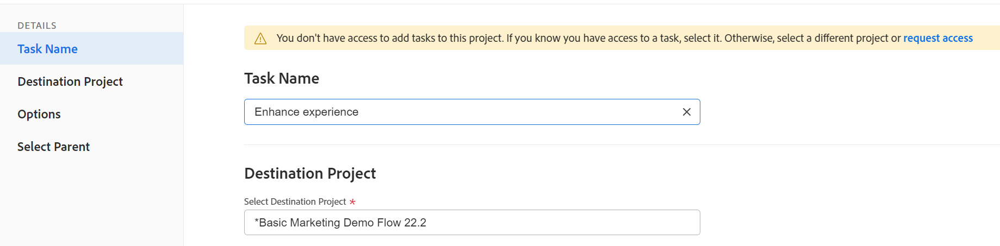

# Taken verplaatsen

<!--Audited: 5/2025-->

<!--The highlighted information on this page refers to functionality not yet generally available. It is available only in the Preview environment for all customers. After the monthly releases to Production, the same features are also available in the Production environment for customers who enabled fast releases.    

For information about fast releases, see [Enable or disable fast releases for your organization](/help/quicksilver/administration-and-setup/set-up-workfront/configure-system-defaults/enable-fast-release-process.md). -->

U kunt taken in Adobe Workfront verplaatsen tussen de volgende objecten:

* Een ad-hoctaak voor een project.
* Een taak van een project aan een ander project.
* Een taak van een project onder een verschillende ouder in een ander project.
* Een taak binnen het zelfde project onder een verschillende ouder.

U kunt een taak op taakniveau verplaatsen of u kunt een taak uit een lijst met taken verplaatsen.

U kunt één taak verplaatsen of meerdere taken tegelijk uit een takenlijst verplaatsen.

## Toegangsvereisten

+++ Breid uit om de toegangseisen voor de functionaliteit in dit artikel weer te geven. 

<table style="table-layout:auto"> 
 <col> 
 <col> 
 <tbody> 
  <tr> 
   <td role="rowheader">Adobe Workfront-pakket</td> 
   <td> 
Alle
 </td> 
  </tr> 
  <tr> 
   <td role="rowheader">Adobe Workfront-licentie</td> 
   <td> 
Standard 
 
 
Werk of hoger
 </td> 
  </tr> 
  <tr> 
   <td role="rowheader">Configuraties op toegangsniveau</td> 
   <td> 
Toegang tot taken en projecten bewerken
 </td> 
  </tr> 
  <tr> 
   <td role="rowheader">Objectmachtigingen</td> 
   <td> 
Rechten voor de taken beheren
 
Contribute of hoger rechten voor het project met de mogelijkheid om taken toe te voegen
  </td> 
  </tr> 
 </tbody> 
</table>

Voor meer informatie, zie [ vereisten van de Toegang in de documentatie van Workfront ](/help/quicksilver/administration-and-setup/add-users/access-levels-and-object-permissions/access-level-requirements-in-documentation.md).

+++

<!--Old:

<table style="table-layout:auto"> 
 <col> 
 <col> 
 <tbody> 
  <tr> 
   <td role="rowheader">Adobe Workfront plan</td> 
   <td> 
Any
 </td> 
  </tr> 
  <tr> 
   <td role="rowheader">Adobe Workfront license</td> 
   <td> 
New: Standard 
 
 
or
  

Current: Work or higher 
 </td> 
  </tr> 
  <tr> 
   <td role="rowheader">Access level configurations</td> 
   <td> 
Edit access to Tasks and Projects
 </td> 
  </tr> 
  <tr> 
   <td role="rowheader">Object permissions</td> 
   <td> 
Manage permissions to the tasks
 
Contribute or higher permissions to the project with ability to Add Tasks
  </td> 
  </tr> 
 </tbody> 
</table>-->

## Overwegingen bij het verplaatsen van taken

Houd rekening met het volgende wanneer u een taak verplaatst:

* Uw systeem of groepsbeheerder kan u verhinderen taken te bewegen die het programma geopende uren afhankelijk van hoe zij vormen toestaan gebruikers om taken en kwesties met geregistreerde urenvoorkeur in het gebied van de Opstelling te bewegen. Voor informatie, zie [ de taak en de uitgevende voorkeur van het systeem brede ](/help/quicksilver/administration-and-setup/set-up-workfront/configure-system-defaults/set-task-issue-preferences.md) vormen.

* Wanneer u een taak van één project aan een ander verplaatst, zouden de taakdata kunnen worden herberekend. Bij de herberekening wordt rekening gehouden met het tijdschema dat voor het nieuwe project wordt gebruikt en met het tijdschema voor het project op basis van informatie.

* U kunt bepaalde onderdelen die aan de taak zijn gekoppeld tijdens het verplaatsen naar de verplaatste taak verplaatsen. De volgende objecten worden echter standaard overgebracht naar de verplaatste taak:

   * Problemen
   * Aangemeld aantal uren
   * Opmerkingen van gebruikers
   * Aangepaste formulieren en aangepaste veldgegevens
   * Subtaken

* De volgende items worden standaard niet verplaatst met de taak:

   * Mijlpalen

## Taken in een lijst verplaatsen

{{step1-to-projects}}

1. Voor de **pagina van Projecten**, selecteer het project dat de taak of de taken bevat u wilt bewegen.
1. Klik **Taken** in het linkerpaneel om de taaklijst te tonen.
1. Klik het **pictogram van de Wijze van het Plan** pictogram van het Plan  Autosave **knevel wordt toegelaten, dan selecteer de taak of de taken die u wilt bewegen.**

   

   >[!IMPORTANT]
   >
   >U kunt geen taken bewegen wanneer **Autosave** knevel gehandicapt is.

1. (Optioneel en voorwaardelijk) Als u de geselecteerde taken binnen hetzelfde project wilt verplaatsen, klikt u op de geselecteerde taken en sleept u deze naar de gewenste locatie in het project. De wijzigingen in de taakhiërarchie worden direct opgeslagen en de informatie die aan elke taak is gekoppeld, wordt met de taken verplaatst.

1. (Voorwaardelijk) Selecteer de taak of de taken die u wilt verplaatsen en voer een van de volgende handelingen uit:

   * Klik het **Meer** menu  bij de bovenkant van de taaklijst, dan klik **Beweging aan**.
   * Klik de geselecteerde taken met de rechtermuisknop aan, dan klik **Beweging aan**.
   * Wanneer het selecteren van één taak, klik **Meer** menu  naast de taaknaam in de lijst, dan klik **Beweging aan**.

   De **vertoningen van de Taak van de Beweging**.

1. Ga met het bewegen van de taak voort, zoals die in de sectie [ wordt beschreven Beweeg een taak op het taakniveau ](#move-a-task-at-the-task-level) in dit artikel.

   <!--
   is this still accurate?!
   -->

## Een taak op taakniveau verplaatsen {#move-a-task-at-the-task-level}

Naast het verplaatsen van taken uit een lijst met taken kunt u een taak op taakniveau verplaatsen nadat u deze hebt geopend.

1. Zoek naar een taak in je Workfront-systeem.
1. Klik op de naam van de taak om deze te openen.
1. Klik **Meer** drop-down menu  naast de taaknaam, dan klik **Beweging aan**. De **zijpaneelvertoningen van de Taak van de Beweging**.

1. (Facultatief) werk de **Naam van de Taak** bij. De taak wordt met de nieuwe naam verplaatst op de nieuwe locatie.

   >[!TIP]
   >
   >Het **gebied van de Naam van de Taak** wordt gedimd en niet editable wanneer het selecteren om veelvoudige taken in een lijst te bewegen. U kunt over het **gebied van de Naam van de Taak** bewegen en een lijst van alle geselecteerde taken zal tonen.
   >
   >
   >{de taaknamen van 0} Vertoning 

1. Op het **Uitgezochte gebied van het Project van de Bestemming**, typ de naam van het project u de taak wilt zich bewegen. Als u de taak binnen het zelfde project wilt bewegen, typ de naam van het huidige project.

   >[!TIP]
   >
   >* De projectnaam is hoofdlettergevoelig.
   >* U kunt naar een project zoeken door het Aantal van de Verwijzing te typen of identiteitskaart van het project in te gaan. Hierdoor kunt u projecten met identieke namen beter van elkaar onderscheiden.
   >* Er worden slechts 100 projecten weergegeven in de lijst.

1. (Voorwaardelijk) als u geen toegang tot het project hebt, klik **de toegang van het Verzoek**.
1. (Voorwaardelijk) blijf de taak aan het bestemmingsproject verplaatsen zonder toegang te vragen als u toegang hebt om taken aan één van de taken op het bestemmingsproject toe te voegen.

    te verzoeken

   >[!TIP]
   >
   >De gelijkaardige berichten tonen als het geselecteerde project in afwachting van goedkeuring is, voltooid, of dood wanneer de beheerder van Workfront het toevoegen van taken aan deze projecten verhindert. Voor meer informatie, zie [ systeem-brede projectvoorkeur ](../../../administration-and-setup/set-up-workfront/configure-system-defaults/set-project-preferences.md) vormen.

1. (Facultatief) in de **sectie van Opties**, schrap om het even welke punten die in de lijst hieronder worden vermeld om hen uit de verplaatste taken te verwijderen. Alle opties zijn standaard geselecteerd.

   >[!IMPORTANT]
   >
   >Het schrappen van punten in de **lijst van Opties** resulteert in verlies van gegevens. Informatie van de bestaande taak wordt verwijderd en kan niet worden hersteld.

   <table style="table-layout:auto"> 
    <col> 
    <col> 
    <tbody> 
     <tr> 
      <td role="rowheader">Alles selecteren</td> 
      <td>Schakel deze optie uit als u alle gegevens uit de taak wilt verwijderen wanneer u de taak naar de nieuwe locatie verplaatst. </td> 
     </tr> 
     <tr> 
      <td role="rowheader">Restrictie</td> 
      <td> 
De taakbeperking wordt geplaatst aan zo spoedig mogelijk of zo laat mogelijk gebaseerd op het plaatsen van de Wijze van het projectprogramma.
 
 Als deze optie is geselecteerd, wordt de huidige beperking van de taak overgedragen met de taak. 
 
      
Opmerking: wanneer u een taak met datumspecifieke beperkingen naar een ander project verplaatst of kopieert en de beperkingsdatums van de taak zich buiten de nieuwe projectdatums bevinden, wordt de taakbeperking zo snel mogelijk of zo laat mogelijk gewijzigd of worden de geplande begin- of einddatums van de projecten aangepast.

   Hieronder volgen voorbeelden van datumspecifieke beperkingen:
   <ul>
      <li> Starten bij</li>
      <li> Moet worden voltooid op</li>
      <li> Niet eerder starten dan</li>
      <li> Niet later starten dan</li>
      </ul>

   Voor meer informatie, zie <a href="../../../manage-work/tasks/task-constraints/task-constraint-overview.md" class="MCXref xref"> Overzicht van de Beperking van de Taak </a>.
 </td>
   </tr> 
     <tr> 
      <td role="rowheader">Toewijzingen</td> 
      <td> 
Alle toewijzingen worden uit de taak verwijderd. 
 </td> 
     </tr> 
     <tr> 
      <td role="rowheader">Goedkeuringsproces</td> 
      <td>Alle goedkeuringsprocessen worden uit de taak verwijderd.</td> 
     </tr> 
     <tr> 
      <td role="rowheader">Voortgang</td> 
      <td>De taakstatus is ingesteld op Nieuw. Anders blijft de bestaande taakstatus behouden. </td> 
     </tr> 
     <tr> 
      <td role="rowheader">Financiële informatie</td> 
      <td>De financiële informatie van de taak wordt verwijderd en Workfront werkt het type van taakkosten aan Geen Kosten en het type van taakopbrengst bij niet Facultable. </td> 
     </tr> 
     <tr> 
      <td role="rowheader">Alle voorgangers</td> 
      <td> 
Wanneer geselecteerd, wordt het gebiedsdeel een dwars-projectvoorganger wanneer u de taak naar een ander project verplaatst. 
 </td> 
     </tr> 
     <tr> 
      <td role="rowheader">Documenten</td> 
      <td> 
De documenten in bijlage aan de taak worden niet overgebracht naar de verplaatste taak. Dit zijn versies, proefdrukken en gekoppelde documenten.
 
Dit omvat geen documentgoedkeuringen. Documentgoedkeuringen kunnen nooit worden verplaatst wanneer een taak wordt verplaatst.
 
      
Opmerking: als u ervoor kiest om de documenten niet met de taak te laten verplaatsen, worden de documenten verwijderd en gedurende 30 dagen in de prullenbak geplaatst. Een beheerder kan ze herstellen en ze worden hersteld op de verplaatste taak. 

   
Als de taak wordt geschrapt nadat het wordt bewogen, zullen de herstelde documenten in het gebied van Documenten van de gebruikerspagina van de beheerder worden geplaatst die hen herstelt.

   </td> 
     </tr> 
     <tr> 
      <td role="rowheader">Herinneringsmeldingen</td> 
      <td>De taakherinneringen worden niet overgedragen naar de verplaatste taak. </td> 
     </tr> 
     <tr> 
      <td role="rowheader">Uitgaven</td> 
      <td>De uitgaven die op de taak worden geregistreerd brengen niet naar de verplaatste taak over. </td> 
     </tr> 
     <tr> 
      <td role="rowheader">Machtigingen</td> 
      <td> 
Workfront verwijdert de namen van alle entiteiten die worden weergegeven in de lijst voor delen van de taak. 
 </td> 
     </tr> 
    </tbody> 
   </table>

1. (Facultatief) in de **Uitgezochte Ouder** sectie, selecteer de taak in het bestemmingsproject dat de ouder van de verplaatste taak zal worden.

   >[!TIP]
   >
   >Wanneer u selecteert om meerdere taken in een lijst te verplaatsen, worden alle geselecteerde taken de onderliggende taken van het geselecteerde bovenliggende element.

   Voer een van de volgende handelingen uit om een bovenliggend element te selecteren:

   * In de taaklijst, selecteer één van de ouders in het projectplan.
   * Klik het pictogram van het onderzoekspictogram  en onderzoek naar een oudertaak door naam.

   De taak wordt weergegeven in de lijst.

   

   >[!NOTE]
   >
   >Als u geen oudertaak selecteert, worden de taken verplaatst als belangrijkste taken eerder dan subtaken, en zij worden geplaatst aan het eind van de taaklijst op het bestemmingsproject.

1. Klik **de taak van de Beweging**. De taken bewegen zich naar het gespecificeerde project als of subtasks aan een oudertaak of de laatste taken op het project.
