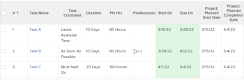

# Overzicht van taakbeperking: nieuwste beschikbare tijd

De meest recente Beschikbare Tijd (LAT) is een type van de Beperking van de Taak in Adobe Workfront.

## De laatst beschikbare tijdtaakbeperking gebruiken

U kunt de LAT beperking gebruiken wanneer u een taak wilt plannen om bij de recentste beschikbare tijd na het overwegen van predecessor-opvolgerrelaties in het project te beginnen.

Deze beperking verschilt van Zo snel mogelijk in zoverre dat zij voorgangers of opvolgers niet dwingt om opnieuw te worden gepland. In plaats daarvan, zal het slechts het programma van de taak beïnvloeden het met wordt geassocieerd, die het aan de recentste beschikbare tijd plaatst op zijn verhouding aan andere taken wordt gebaseerd.

Voor informatie over hoe te om de Restrictie van de Taak op een taak bij te werken, zie [ de Restrictie van de Taak van een taak ](../../../manage-work/tasks/task-constraints/update-task-constraint-of-task.md) bijwerken.

<!--

To update the Task Constraint to Latest Available Time:

(NOTE: replaced with new article linked above) 

<ol>
<li value="1">Go to a task whose Task Constraint you want to update.</li>
<li value="2"> 
Click the <strong>More</strong> icon  next to the task name, then click <strong>Edit</strong>.
 </li>
<li value="3">In the <strong>Overview</strong> section, expand the <strong>Task Constraint</strong> drop-down menu.</li>
<li value="4"> 
Select <strong>Latest Available Time</strong>.
 </li>
<li value="5">Click <strong>Save Changes</strong>.</li>
</ol>

-->

## Het verschil tussen de laatst beschikbare tijd en zo laat mogelijk

<!--

(NOTE: [! This section is duplicated in "As Late As Possible"] - inserted snippet in both (Alina)) 

-->

De laatst beschikbare tijdbeperking verschilt van de beperking Zo laat mogelijk wanneer aan de volgende criteria wordt voldaan:

* Het project is gepland vanaf de begindatum
* De taken in het project hebben een voorgangersverhouding
* De opvolgertaak heeft een flexibele taakbeperking

In deze situatie:

* **Latest Beschikbare Tijd:** Gebruikend de Latest Beschikbare Beperking van de Tijd op de voorgangertaak geeft prioriteit aan flexibele beperking van de opvolger.

  **Voorbeeld:** Bijvoorbeeld, is Taak A een voorganger aan Taak B. Taak A heeft de Latest Beschikbare Beperking van de Tijd en Taak B heeft zo spoedig mogelijk de beperking. In deze situatie is taak A zo dicht mogelijk bij de start van het project gepland.

  

* **zo laat mogelijk:** in dit scenario, die zo laat mogelijk beperking op de voorgangerstaak gebruiken geeft de prioriteit aan de voorgangertaak.

  **Voorbeeld:** Bijvoorbeeld, is Taak A een voorganger aan Taak B. Taak A heeft zo laat mogelijk beperking en de Taak B heeft zo snel mogelijk beperking. In deze situatie is taak A zo dicht mogelijk bij het einde van het project gepland.

  

<!--

(NOTE: this content was here before but it was wrong - according to this issue in Hub, per Dev, the correct functionality is in the snippet above: https://hub.workfront.com/task/6193c6910004bce9de07cda7757f3ce8/updates?email-source=subscribedCommunication) 

The Latest Available Time constraint differs from the As Late As Possible constraint when the following criteria exist:

<ul>
<li> The project is scheduled From Completion </li>
<li> Tasks in the project have a predecessor relationship </li>
<li> The predecessor task has a flexible task constraint </li>
</ul>

 In this situation: 

<ul>
<li> 
<strong>Latest Available Time:</strong> Using the Latest Available Time constraint on the successor task gives priority to flexible constraint of the predecessor.
 
For example, Task A is a predecessor to Task B. Task B has the Latest Available Time constraint and Task A has the As Soon As Possible constraint. In this situation, Task B is scheduled as close to the start of the project as possible.
 </li>
<li> 
<strong>As Late As Possible:</strong> In this scenario, using the As Late As Possible constraint on the successor task gives the priority to the successor task.
 
For example, Task A is a predecessor to Task B. Task B has the As Late As Possible constraint and Task A has the As Soon As Possible constraint. In this situation, Task B is scheduled as close to the end of the project as possible.
 </li>
</ul>

-->
