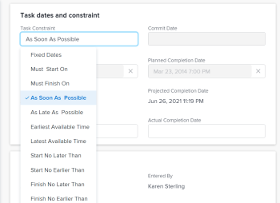

# Werk de Beperking van de Taak van een taak bij

De beperkingen van de taak bepalen wanneer een taak op een project zou moeten beginnen en eindigen. Voor meer informatie, zie [&#x200B; Overzicht van de Beperking van de Taak &#x200B;](../../../manage-work/tasks/task-constraints/task-constraint-overview.md).

## Toegangsvereisten

+++ Breid uit om de toegangseisen voor de functionaliteit in dit artikel weer te geven. 

<table style="table-layout:auto"> 
 <col> 
 <col> 
 <tbody> 
  <tr> 
   <td role="rowheader">Adobe Workfront-pakket</td> 
   <td> 
Alle
 </td> 
  </tr> 
  <tr> 
   <td role="rowheader">Adobe Workfront-licentie</td> 
   <td>
Standard
 
   
Werk of hoger
 </td> 
  </tr> 
  <tr> 
   <td role="rowheader">Configuraties op toegangsniveau</td> 
   <td> 
Toegang tot projecten weergeven of vergroten
 
Toegang tot taken bewerken
</td> 
  </tr> 
  <tr> 
   <td role="rowheader">Objectmachtigingen</td> 
   <td> 
De toegang tot de taak beheren
</td> 
  </tr> 
 </tbody> 
</table>

Voor meer informatie, zie [&#x200B; vereisten van de Toegang in de documentatie van Workfront &#x200B;](/help/quicksilver/administration-and-setup/add-users/access-levels-and-object-permissions/access-level-requirements-in-documentation.md).

+++

<!--Old:

<table style="table-layout:auto"> 
 <col> 
 <col> 
 <tbody> 
  <tr> 
   <td role="rowheader">Adobe Workfront plan*</td> 
   <td> 
Any 
 </td> 
  </tr> 
  <tr> 
   <td role="rowheader">Adobe Workfront license*</td> 
   <td> 
Work or higher
 </td> 
  </tr> 
  <tr> 
   <td role="rowheader">Access level configurations*</td> 
   <td> 
View or higher access to Projects
 
Edit access to Tasks
 
Note: If you still don't have access, ask your Workfront administrator if they set additional restrictions in your access level. For information on how a Workfront administrator can modify your access level, see <a href="../../../administration-and-setup/add-users/configure-and-grant-access/create-modify-access-levels.md" class="MCXref xref">Create or modify custom access levels</a>.
 </td> 
  </tr> 
  <tr> 
   <td role="rowheader">Object permissions</td> 
   <td> 
Manage access to the task 
 
For information on requesting additional access, see <a href="../../../workfront-basics/grant-and-request-access-to-objects/request-access.md" class="MCXref xref">Request access to objects </a>.
 </td> 
  </tr> 
 </tbody> 
</table>-->

## Werk de Beperking van de Taak van een taak bij

1. Klik **HoofdMenu** > **Projecten**, dan klik een project om tot het toegang te hebben.
1. Klik de **sectie van Taken** in het linkerpaneel.
1. Klik **Details van de Taak** in het linkerpaneel, dan in het gebied van het Overzicht klikt **de Beperking van de Taak**.

   

1. Selecteer een van de volgende opties

   | Vaste datums | Voor informatie, zie [&#x200B; Overzicht van de Beperking van de Taak: Vaste Datums &#x200B;](../../../manage-work/tasks/task-constraints/fixed-dates.md). |
   |---|---|
   | Moet beginnen op | Voor informatie, zie [&#x200B; overzicht van de Restrictie van de Taak: Moet &#x200B;](../../../manage-work/tasks/task-constraints/must-start-on.md) beginnen. |
   | Moet worden voltooid op | Voor informatie, zie [&#x200B; overzicht van de Beperking van de Taak: Moet &#x200B;](../../../manage-work/tasks/task-constraints/must-finish-on.md) beëindigen. |
   | Zo snel mogelijk | Voor informatie, zie [&#x200B; overzicht van de Restrictie van de Taak: Zo spoedig mogelijk &#x200B;](../../../manage-work/tasks/task-constraints/as-soon-as-possible.md). |
   | Zo laat mogelijk | Voor informatie, zie [&#x200B; overzicht van de Taakbeperking: Zo laat mogelijk &#x200B;](../../../manage-work/tasks/task-constraints/as-late-as-possible.md). |
   | Vroegst beschikbare tijd | Voor informatie, zie [&#x200B; Overzicht van de Beperking van de Taak: De vroegste Beschikbare Tijd &#x200B;](../../../manage-work/tasks/task-constraints/earliest-available-time.md). |
   | Laatste beschikbare tijd | Voor informatie, zie [&#x200B; Overzicht van de Beperking van de Taak: De nieuwste Beschikbare Tijd &#x200B;](../../../manage-work/tasks/task-constraints/latest-available-time.md). |
   | Niet later starten dan | Voor informatie, zie [&#x200B; overzicht van de Restrictie van de Taak: Begin niet later dan &#x200B;](../../../manage-work/tasks/task-constraints/start-no-later-than.md). |
   | Niet eerder starten dan | Voor informatie, zie [&#x200B; overzicht van de Restrictie van de Taak: Begin niet vroeger dan &#x200B;](../../../manage-work/tasks/task-constraints/start-no-earlier-than.md). |
   | Uiterlijk op | Voor informatie, zie [&#x200B; overzicht van de Restrictie van de Taak: Eindig niet later dan &#x200B;](../../../manage-work/tasks/task-constraints/finish-no-later-than.md). |
   | Niet eerder voltooien dan | Voor informatie, zie [&#x200B; overzicht van de Restrictie van de Taak: Eindig geen vroeger dan &#x200B;](../../../manage-work/tasks/task-constraints/finish-no-earlier-than.md). |

   {style="table-layout:auto"}

1. Klik **sparen** **Veranderingen**.

