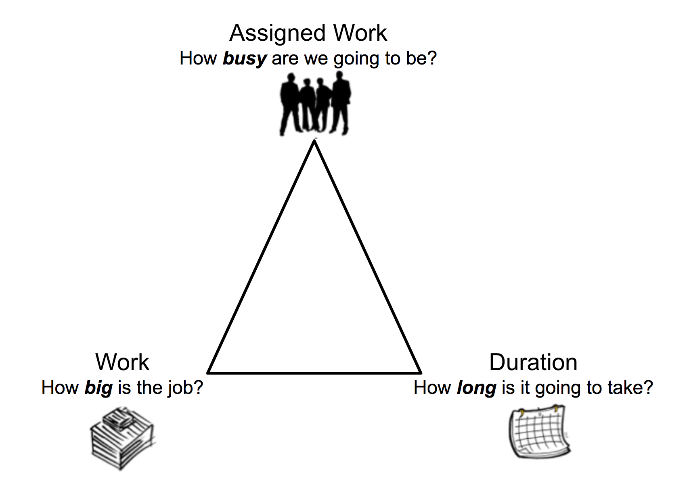

# Overzicht van het Type van Duur en van de Duur van de Taak

<!-- Audited: 12/2023 -->

<!--The highlighted information on this page refers to functionality not yet generally available. It is available only in the Preview environment for all customers. After the monthly releases to Production, the same features are also available in the Production environment for customers who enabled fast releases.    

For information about fast releases, see [Enable or disable fast releases for your organization](/help/quicksilver/administration-and-setup/set-up-workfront/configure-system-defaults/enable-fast-release-process.md). -->

De taakduur is het verschil tussen de Geplande Datum van Voltooiing en de Geplande Datum van het Begin van de taak. De Duur wijst op het tijdkader dat voor de taak beschikbaar is om te worden voltooid.

Het Type van Duur van een taak identificeert het verband tussen het aantal middelen die aan een taak, de totale inspanning, en de totale Duur van de taak worden toegewezen.

## Overzicht van taakduur

Als de Ware Datum van het Begin en van de Werkelijke Voltooiing van de taak buiten het programma van het project, primaire toegewezen, of StandaardProgramma vallen, is de taakDuur nul.

>[!BEGINSHADEBOX]

**VOORBEELD**
Als u een programma hebt dat bij 9 :00 AM begint en bij 12 :00 PM beëindigt en een taak die om bij 2 :00 PM is gepland te beginnen en bij 4 :00 PM te beëindigen, is de Duur van de taak nul.

>[!ENDSHADEBOX]

De volgende twee scenario&#39;s bestaan bij het berekenen van de duur in Adobe Workfront:

* Als de taak aan één gebruiker wordt toegewezen:

   1. Workfront houdt rekening met of het programma van het project of dat van de gebruiker die aan de taak wordt toegewezen.

      Uw Workfront of groepsbeheerder bepaalt welk schema Workfront gebruikt wanneer een taak aan één gebruiker wordt toegewezen. Voor informatie, zie [ systeem-brede projectvoorkeur ](../../../administration-and-setup/set-up-workfront/configure-system-defaults/set-project-preferences.md) vormen.

   1. Als de gebruiker of het project geen programma hebben, gebruikt Workfront het systeemGebrek programma.

      De stappen zijn gelijkaardig aan het eerste scenario na begrip welk programma Workfront gebruikt om Duur te berekenen.

* Als de taak aan meerdere gebruikers wordt toegewezen:

   1. Workfront houdt rekening met het projectschema of met dat van de primaire ontvanger.

      Uw Workfront of groepsbeheerder bepaalt welk schema Workfront gebruikt wanneer een taak aan veelvoudige gebruikers wordt toegewezen. Voor informatie, zie [ systeem-brede projectvoorkeur ](../../../administration-and-setup/set-up-workfront/configure-system-defaults/set-project-preferences.md) vormen.

   1. Als de primaire ontvanger of het project geen programma hebben, gebruikt Workfront het systeemGebrek programma.

  De stappen zijn gelijkaardig aan het eerste scenario na begrip welk programma Workfront gebruikt om Duur te berekenen.

>[!NOTE]
>
>Wanneer rekening houdend met de tijd van de Primaire Ontvanger op een project, zouden de geplande data van de taak kunnen aanpassen, maar de Duur van de taak blijft het zelfde. Voor informatie over het nemen van rekening met de tijd van de Primaire Ontvanger wanneer het plannen van een project, zie [ systeem-brede projectvoorkeur ](../../../administration-and-setup/set-up-workfront/configure-system-defaults/set-project-preferences.md) vormen.

## Eenheden van tijd voor de Duur van de Taak

U kunt de duur van de taak aangeven in zowel de normale tijd als de verstreken tijd tussen de geplande begin- en de geplande voltooiingsdatum.

Wanneer u de duur van taken in een lijst bijwerkt, kunt u de volgende afkortingen gebruiken om de tijdeenheden in Workfront aan te geven:

| Tijdseenheid | Afkorting |
|---|---|
| Minuten | M |
| Uren | H |
| Dagen. Dit is de standaardinstelling. | D |
| Weken | W |
| Maanden | T, MO |
| Verstreken minuten | EM |
| Verstreken uren | EH |
| Verstreken dagen | ED |
| Verstreken weken | EW |
| Verstreken maanden | ET |

{style="table-layout:auto"}

>[!BEGINSHADEBOX]

**VOORBEELD**

Als u wilt erop wijzen dat de Duur van een taak 3 Verstreken Dag is, zou u &quot;3 ED&quot;op het gebied van de Duur in een taaklijst typen.  U kunt de aangewezen optie voor de Eenheid van de Duur van Tijd van het beschikbare drop-down menu ook selecteren wanneer het uitgeven van een taak of in de sectie van de Details van de Taak. Voor informatie over het uitgeven van taken, zie [ taken ](../../../manage-work/tasks/manage-tasks/edit-tasks.md) uitgeven.

>[!ENDSHADEBOX]

<!--

(NOTE: stays QS only forever; for the pictures below: make the first one classic at preview time and the second one stays QS always. The second one is yellow >> take out at 21.2 production!!)

-->

Denk aan het volgende wanneer u de duur van een taak opgeeft:

* De verstreken tijd is een eenheid van tijd voor de Duur van een taak. Dit is de tijd tussen de Geplande Datum van het Begin en de Geplande Datum van de Voltooiing van een taak die vakantie, weekends, en onderbreking omvat. Met andere woorden, de verstreken tijd is de doorloop van kalenderdagen.
* De dagen vertegenwoordigen de werkdagen die in het systeem worden bepaald en het is configureerbaar in het gebied van de Opstelling. In de meeste gevallen bestaat een dag uit 8 uur.
* De normale tijd (dagen of werkdagen) houdt rekening met feestdagen, weekends en vrije tijd en sluit deze uit van de duur van de taak.
* Wanneer u op de Duur van een taak in weken wijst, berekent Workfront de Duur in dagen en uren gebaseerd op de Typische het werkdagen per week en Typische uren per de montages van de het werkdag die door uw beheerder van Workfront in het gebied van de Voorkeur van het Project van Opstelling worden geplaatst.
* Workfront gebruikt de standaardduur van 4 weken gedurende één maand bij het berekenen van de Duur in maanden.

## Overzicht van het type taakduur

Het beheren van het Type van Duur van een taak laat u toe om verenigbare middeltaken te plaatsen die op de behoeften van de taak worden gebaseerd.

Met het type Duur kunt u de volgende vragen beantwoorden:

* Hoe druk gaan we het hebben?
* Hoe groot is de baan?
* Hoe lang duurt het nog?

## Definieer duurtypen

<table border="1" cellspacing="15" cellpadding="1"> 
 <col> 
 <col> 
 <col> 
 <thead> 
  <tr> 
   <th scope="row">
<strong>Duur</strong>
</th> 
   <th scope="col"> 
<strong> Functie </strong> 
 </th> 
   <th scope="col"> 
<strong> hoe de Middelen het beïnvloeden </strong> 
 </th> 
  </tr> 
 </thead> 
 <tbody> 
  <tr> 
   <th scope="col"> 
<strong> Berekende Taak </strong> 
 </th> 
   <td scope="col"> 
Berekent het toewijzingspercentage voor elke toegewezen persoon op een taak. 
 
Wanneer u dit Type van Duur kiest, kunt u individuele Duur en Geplande Uren voor de taak invoeren. Workfront deelt de geplande uren door het aantal uren binnen de Duur van de taak, dan door het aantal middelen die aan de taak worden toegewezen om de toewijzing voor elke toegewezen persoon te berekenen.
 
Voor meer gedetailleerde informatie, zie <a href="../../../manage-work/tasks/taskdurtn/calculated-assignment.md" class="MCXref xref"> Overzicht van het Type van Duur: Berekende Toewijzing </a>.
 </td> 
   <td scope="col">De duur en de Geplande Uren veranderen niet wanneer het toevoegen van of het verwijderen van toegewezen aan de taak. </td> 
  </tr> 
  <tr> 
   <th scope="col"> 
<strong> Berekend Werk </strong> 
 </th> 
   <td scope="col"> 
Bepaalt de Geplande Uren (hoeveelheid inspanning) die voor de te voltooien taak wordt vereist.
 
Normaal gebruikt wanneer de middelen die aan de taak worden toegewezen voor de volledige Duur van de taak worden toegewezen.
 
Wanneer u dit Type van Duur kiest, hebt u de capaciteit om een individuele Duur voor de taak in te voeren. Workfront berekent de Geplande Uren voor de taak door het aantal dagen in de Duur met het aantal werkuren in het programma en met het aantal wijzers aan de taak te vermenigvuldigen. 
 
U kunt het toewijzingspercentage van elke toegewezen persoon handmatig wijzigen in de taak, waardoor de hoeveelheid geplande uren wordt verkort.
 
Voor meer gedetailleerde informatie, zie <a href="../../../manage-work/tasks/taskdurtn/calculated-work.md" class="MCXref xref"> Overzicht van het Type van Duur: Berekend Werk </a>.
 </td> 
   <td scope="col"> 
De geplande Uren stijgen wanneer de wijzers aan de taak worden toegevoegd. 
 
Geplande uren nemen af wanneer er toewijzingen uit de taak worden verwijderd.
 </td> 
  </tr> 
  <tr> 
   <th scope="col"> 
<strong>Inzet gedreven</strong>
 </th> 
   <td scope="col"> 
Hiermee bepaalt u de geplande uren op basis van het aantal bronnen.
 
Wanneer u dit Type van Duur kiest, hebt u de capaciteit om een individuele Duur voor de taak in te voeren. Workfront berekent de Geplande Uren voor de taak door het aantal dagen in de Duur met het aantal werkuren in het programma te vermenigvuldigen en dat te delen door het aantal wijzers aan de taak. 
 
U kunt het toewijzingspercentage van elke toegewezen persoon voor de taak handmatig wijzigen, maar het aantal geplande uren blijft ongewijzigd.
 
Voor meer gedetailleerde informatie, zie <a href="../../../manage-work/tasks/taskdurtn/effort-driven.md" class="MCXref xref"> Overzicht van het Type van Duur: Gedreven inspanning </a>.
 </td> 
   <td scope="col"> 
De geplande uren stijgen wanneer de wijzers van de taak worden verwijderd.
 
Geplande uren nemen af wanneer er toewijzingen aan de taak worden toegevoegd. 
 
De Duur verandert niet, ongeacht veranderingen in het aantal aangewezen personen of hun programma. 
 
De duur is gelijk aan de geplande uren. De geplande duur is gelijk aan de geplande uren gedeeld door het aantal toegewezen personen.
 </td> 
  </tr> 
  <tr> 
   <th scope="col"> 
<strong> Eenvoudig </strong> 
 </th> 
   <td scope="col"> 
Bepaalt de Geplande Uren en de Duur (die het zelfde zijn, voor dit Type van Duur) gebaseerd op het aantal uren elke toegewezen ontvanger wordt. 
 
Workfront berekent de geplande uren door de geplande toegewezen uren voor elke ontvanger op te tellen. 
 
U kunt de hoeveelheid uren waarvoor elke toegewezen persoon is toegewezen handmatig wijzigen en het aantal geplande uren en de hoeveelheid tijdsduur worden dienovereenkomstig aangepast. Als u een totaal aantal toegewezen uren kiest voor alle toegewezen personen, wordt dat aantal gelijkelijk over elke toegewezen persoon verdeeld.
 
Voor meer gedetailleerde informatie, zie <a href="../../../manage-work/tasks/taskdurtn/simple-duration-type.md" class="MCXref xref"> overzicht van het Type van Duur: Eenvoudig </a>.
 </td> 
   <td scope="col"> 
De uren worden gelijkmatig verdeeld over toegewezen uren als u een totaal aantal toegewezen uren kiest. Nochtans, als projectmanager, kunt u de uren voor elke toegewezen persoon manueel aanpassen. 
 
U kunt Geplande uren en Duur van een taak met het Eenvoudige Type van Duur inline of op het taakniveau uitgeven. 
 
Als een team van de Gelijkheid aan een taak wordt toegewezen, wordt het Type van Duur automatisch geplaatst aan Eenvoudig en kan niet worden veranderd. De taakduur voor een Agile-team moet langer zijn dan 0 minuten.
 </td> 
  </tr> 
 </tbody> 
</table>

## Het type Duur van nieuwe taken

Het type van Duur van een nieuwe taak past het Type van Duur aan opstelling in uw systeem aan. Het standaardtype van Duur is Berekende Toewijzing. Uw beheerder van Workfront of een groepsbeheerder kan het Type van standaardDuur voor uw systeem of voor de groep bijwerken verbonden aan het project. Voor informatie, zie [ de taak en de uitgevende voorkeur van het systeem brede ](../../../administration-and-setup/set-up-workfront/configure-system-defaults/set-task-issue-preferences.md) vormen.

## De originele Duur van een oudertaak

De Originele Duur van een taak is de Duur die een taak oorspronkelijk had alvorens het een oudertaak, in notulen werd.

Wanneer een taak een ouder wordt, rolt de Duur tussen de Geplande Datum van het Begin van het vroegste kind en de Geplande Datum van de Voltooiing van het laatste kind tot de oudertaak en wordt de Duur van de oudertaak. Dit vervangt de Duur van de originele taak.

Wanneer de kinderen de eenheid van de Duur van Verstreken Dagen gebruiken en hun ouder gebruikt de eenheid van de Duur van Dagen, zouden er discrepanties in de manier kunnen zijn Workfront de Duur van de oudertaak berekent.

Overweeg het volgende:

* De tijdseenheid Verstreken dagen vertegenwoordigt kalenderdagen, die altijd uit 24 uur per dag bestaat.
* De Dagen van de duureenheid vertegenwoordigt de werkdag die in het systeem wordt bepaald en configureerbaar is. In de meeste gevallen bestaat het uit 8 uur per dag.
* De formule om de duur van de oudertaak te berekenen is het volgende:

  `Parent task duration = Planned Completion Date of the child task that is planned to end the latest - Planned Start Date of the child task that starts the earliest`

* Wanneer het berekenen van de duur van de oudertaak, berekent het systeem eerst de duur door de bovengenoemde formule en dan past het het programma toe.

Voor meer informatie, zie [ Overzicht van taak Oorspronkelijke Duur en Origineel Gepland Uren ](/help/quicksilver/manage-work/tasks/task-information/task-original-duration-and-original-planned-hours.md).

## Het type duur van een taak wijzigen

Voor informatie over het veranderen van het Type van Duur van een taak, zie [ het Type van Duur van een taak ](../../../manage-work/tasks/taskdurtn/update-duration-type-of-task.md) bijwerken.
