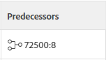

# Predecessors voor meerdere projecten maken

<!--Audited: 12/2023-->

Een voorganger voor meerdere projecten is een taak waarvan een andere taak (een opvolgertaak genoemd) in een ander project afhankelijk is. De voorganger is de taak die voorrang heeft op de afhankelijke (opvolger)taak. Bijvoorbeeld, kunt u tot een gebiedsdeel leiden dat vereist dat de voorgangertaak wordt duidelijk Voltooid alvorens de afhankelijke taak kan beginnen.

Adobe Workfront staat voor taken toe om van taken in andere projecten afhankelijk te zijn, enkel aangezien het predecessors binnen één enkel project toestaat.

>[!INFO]
>
>Een opgravingsbedrijf heeft bijvoorbeeld maar één hoes en twee projecten hebben taken die het gebruik van de hoes vereisen. De projectmanager kan van de taak in het eerste project een voorganger aan de taak in het tweede project maken. Dit toont aan dat het tweede project kan beginnen gebruikend de hoes wanneer het eerste project met het wordt gebeëindigd.

Wanneer het verbinden van projecten door dwars-project predecessors, zullen de data van het primaire project (die de voorgangertaak heeft) het secundaire project (die de opvolgertaak heeft) beïnvloeden.

>[!TIP]
>
>U moet chronologie voor de projecten opnieuw berekenen om data te zien die voor het secundaire project worden bijgewerkt. Zie voor meer informatie over het opnieuw berekenen van tijdlijnen [Tijdlijnherberekeningen voor projecten configureren](../../../administration-and-setup/set-up-workfront/configure-system-defaults/configure-timeline-recalculations-projects.md).

Zie voor meer informatie over voorgaande relaties [Overzicht van voorgangers van taken](../../../manage-work/tasks/use-prdcssrs/predecessors-overview.md).

## Toegangsvereisten

U moet de volgende toegang hebben om de stappen in dit artikel uit te voeren:

<table style="table-layout:auto"> 
 <col> 
 <col> 
 <tbody> 
  <tr> 
   <td role="rowheader">Adobe Workfront-plan</td> 
   <td> 
Alle
 </td> 
  </tr> 
  <tr> 
   <td role="rowheader">Adobe Workfront-licentie</td> 
   <td> 
Nieuw: Standaard 
 
   of
   
Huidig: Plan 

   </td> 
  </tr> 
  <tr> 
   <td role="rowheader">Configuraties op toegangsniveau*</td> 
   <td> 
Toegang tot taken en projecten bewerken
 </td> 
  </tr> 
  <tr> 
   <td role="rowheader">Objectmachtigingen</td> 
   <td> 
Rechten voor de taken en projecten beheren
 </td> 
  </tr> 
 </tbody> 
</table>

Zie voor meer informatie over de informatie in deze tabel [Toegangsvereisten in Workfront-documentatie](/help/quicksilver/administration-and-setup/add-users/access-levels-and-object-permissions/access-level-requirements-in-documentation.md).

## Een voorganger voor meerdere projecten maken

1. Ga naar de taak die uw opvolger (afhankelijke taak) zal zijn.
1. Klikken **Predecessors** in het linkerdeelvenster.
1. Klikken **Voorganger toevoegen.**
1. In de **Bovenliggend project** veld, typt u de naam van het project dat de taak bevat die u als voorganger voor de huidige taak wilt uitvoeren.
1. Klik op de naam wanneer deze wordt weergegeven in de vervolgkeuzelijst.
1. In de **Taken** in het veld typt u de naam van de taak die u als voorganger voor de huidige taak wilt uitvoeren.
1. Geef de volgende informatie op voor het definiëren van de relatie tussen de voorganger en de afhankelijke taak:

   * **Type afhankelijkheid:** Selecteer de verhouding die u de voorgangertaak met de afhankelijke taak wilt hebben. De standaardverhouding is &quot;eind-Begin,&quot;betekenend dat de voorgangerstaak moet beëindigen alvorens de afhankelijke taak kan beginnen. Voor meer informatie over de diverse gebiedstypes, zie [Overzicht van typen taakafhankelijkheid](../../../manage-work/tasks/use-prdcssrs/task-dependency-types.md).

   * **Lag:** Geef de hoeveelheid tijd op die moet verstrijken na de voltooiing van een afgedwongen voorganger totdat de afhankelijke taak kan beginnen. Zie voor meer informatie over de verschillende typen vertragingen [Overzicht van typen labels](../../../manage-work/tasks/use-prdcssrs/lag-types.md).

   * **Afgedwongen:** Als deze optie is geselecteerd, kan de afhankelijkheidsrelatie tussen de twee taken niet worden omzeild door gebruikers die taken vroeg beginnen. Bijvoorbeeld, als u een verband tussen Taak A en Taak B afdwingt, kan de Taak B niet worden begonnen tot Taak A volledig is. Voor meer informatie over het afdwingen van predecessors raadpleegt u [Voorgangers afdwingen](../../../manage-work/tasks/use-prdcssrs/enforced-predecessors.md).

     Als deze optie niet is geselecteerd, wordt de afhankelijkheid behandeld als een suggestie voor gebruikers. Bijvoorbeeld, kunnen de gebruikers Taak B beginnen alvorens Taak A volledig is.

1. Klikken **Opslaan**.

   De taken die een dwars-projectvoorganger hebben tonen het verwijzingsaantal van het project predecessor tot behoort en het aantal van de taak, die door een dubbelpunt wordt gescheiden, in de kolom van Predecessors op een taaklijst.

   

   Het voorgangspictogram wordt groen als de voorganger de markering Voltooid heeft. Dit wijst erop dat de afhankelijke taak klaar voor het werk is.

   Houd de muisaanwijzer boven deze waarde voor meer informatie over de voorganger, het project en de datums. Klik op de voorganger voor meerdere projecten in het vak Details om de taak te openen.

   Klik bij de bovenkant van het aanwijsvenster om meer informatie over het project van de voorganger te zien.

   Klikken **Zie Project** het project van de voorganger te openen.

   

   >[!TIP]
   >
   >   De **Zie Project** Deze optie wordt alleen weergegeven wanneer u een voorganger voor meerdere projecten weergeeft.

