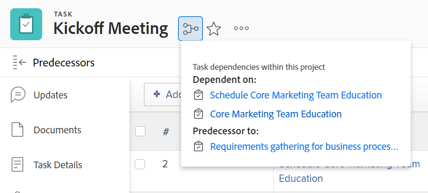

# Overzicht van voorgangers van taken

<!-- 

CONTEXT SENSITIVE HELP article. DO NOT CHANGE THE NAME OF THE ARTICLE/ DO NOT MOVE OR DELETE! -->

Een voorganger is de taak waarvan een andere taak (een opvolger of afhankelijke taak genoemd) afhankelijk is. Adobe Workfront ondersteunt vijf typen afhankelijkheden van voorgangers. Als u afhankelijkheden van voorgangers wilt begrijpen, raadpleegt u [Overzicht van typen taakafhankelijkheid](../../../manage-work/tasks/use-prdcssrs/task-dependency-types.md).

## Overzicht van voorgangers

Kennis van de functionaliteit van de voorganger is belangrijk voor het begrijpen van de tijdlijnen in uw projecten.

De voorgangersverhoudingen van de taak bestaan zowel tussen taken binnen één enkel project als tussen taken van verschillende projecten.

In het geval van multi-project afhankelijkheid, kunt u dwars-project predecessors tussen taken van twee verschillende projecten vestigen.

Of de voorganger en opvolgertaken tot het zelfde project of tot twee verschillende projecten behoren, worden de gebiedsdelen en de chronologie van elk project berekend op de zelfde manier.

Wanneer het op predecessors aankomt, wordt de projectchronologie beïnvloed door het volgende:

* Afhankelijkheid van voorgangers
* Lagwaarde en -type\
  Voor meer informatie over zowel afhankelijkheid als vertraging, zie [Voorbeelden van voorgangerswaarden in een takenlijst](#examples-of-predecessor-values-in-a-task-list).

  Bijvoorbeeld, als taak A een voorganger is om B in een eindstartverhouding te taken, en taak B heeft een taakbeperking van zo snel mogelijk, dan wijst Workfront taak B een geplande begindatum onmiddellijk na de geplande voltooiingsdatum van taak A toe, ongeacht of voorganger wordt afgedwongen of niet.

Als u relaties met voorgangers wilt begrijpen, moet u begrijpen:

* **Afhankelijkheidstypen:** De voorgangers worden verbonden door diverse gebiedstypes. Voor meer informatie over gebiedstypes, zie [Overzicht van typen taakafhankelijkheid](../../../manage-work/tasks/use-prdcssrs/task-dependency-types.md).

* **Een voorganger afdwingen:** Wanneer het afdwingen van een voorganger, kan de opvolgertaak absoluut niet beginnen tot voorganger voltooit. De opvolgertaak wordt weergegeven als onmiddellijk starten nadat de voorganger is voltooid.

  Wanneer de voorganger niet is voltooid (of is gestart) en niet wordt afgedwongen, kan de opvolgertaak worden gestart, maar is de projecttijdlijn nog steeds van invloed op de datums van zowel de voorganger als de opvolgertaken.

  Met een afgedwongen voorganger staat Workfront niet toe dat de opvolgertaak wordt gemarkeerd als Bezig of Voltooid totdat de voorganger is voltooid.

  Workfront staat echter toe dat er uren worden gerapporteerd over de taak.\
  Zie voor meer informatie over het afdwingen van voorgangers [Voorgangers afdwingen](../../../manage-work/tasks/use-prdcssrs/enforced-predecessors.md).

* **Labels:** U kunt vertragingen in uw gebiedsdelen bouwen die tot een vertraging leiden die na de voltooiing van een voorgangstaak en vóór de opvolgertaak moet voorkomen kan beginnen. Lags beïnvloeden de tijdlijn van het project.

  Zie voor meer informatie over type lag [Overzicht van labeltypen](../../../manage-work/tasks/use-prdcssrs/lag-types.md).

## Relaties van voorgangers maken

Zie een of meer van de volgende artikelen om voordecessors te maken:

* Als u voorgangers wilt maken met het tabblad Voorgangers van de taak, raadpleegt u [Een eerdere relatie maken met het gebied Voorgangers](../../../manage-work/tasks/use-prdcssrs/create-predecessors-in-predecessors-area.md).
* Om predecessors in een taaklijst te vestigen, zie [Een voorganger-relatie maken in de takenlijst](../../../manage-work/tasks/use-prdcssrs/create-predecessors-on-task-list.md).
* Om predecessor verhoudingen te vestigen door taken te ketenen, zie [Maak vorige relaties door taken in een keten te plaatsen](../../../manage-work/tasks/use-prdcssrs/create-predecessors-by-chaining-tasks.md).
* Als u voorgangers voor meerdere projecten wilt instellen, raadpleegt u [Predecessors voor meerdere projecten maken](../../../manage-work/tasks/use-prdcssrs/cross-project-predecessors.md).

## De voorgangers van een taak zoeken {#locate-the-predecessors-of-a-task}

Als u de voorgangers van een taak wilt zoeken, voert u een van de volgende handelingen uit:

* Ga naar het project u werkt aan en doe het volgende:

   1. Zoek de taak waarvoor u de voorgangers wilt zoeken en klik op de taak.
   1. Klikken **Predecessors** in het linkerdeelvenster. Mogelijk moet u op **Meer weergeven** vervolgens **Predecessors**.
   1. De naam van het project dat voorganger is toont in **Project** kolom.

      Het getal in het dialoogvenster **Aantal** in de kolom wordt het vorige taaknummer weergegeven. Bijvoorbeeld &quot;6&quot;betekent de zesde taak in het project.

      

* Ga naar het project u werkt aan en doe het volgende:

   1. Klik op de knop **Taken** tab.
   1. Kies de optie **Standaardweergave** boven aan de takenlijst.
   1. De **Predecessors** in de kolom worden de vorige taaknummers weergegeven.

      Voor een dwars-projectvoorganger, toont de kolom van Voorgangers het verwijzingsaantal van het project predecessor tot behoort en het aantal van de taak, die door een dubbelpunt wordt gescheiden.

      Het voorgangspictogram wordt groen als de voorganger de markering Voltooid heeft. Dit wijst erop dat de afhankelijke taak klaar voor het werk is.

      Houd de muisaanwijzer boven deze waarde voor meer informatie over de voorganger, het project en de datums.

      

## Voorbeelden van voorgangerswaarden in een takenlijst {#examples-of-predecessor-values-in-a-task-list}

Wanneer u predecessors in een lijst van taken bekijkt, zou u om het even welke volgende types van predecessors met hun respectieve Types van Afhankelijkheid en de bedragen van de Lag kunnen zien:

* **1fs -** Het vorige taaknummer is 1. Het afhankelijkheidstype is Finish-Start. In de projectchronologie, is deze taak gepland om onmiddellijk te beginnen nadat taak 1 wordt gebeëindigd. Desondanks kan het nog worden gemarkeerd als Bezig of Voltooid.
* **1 -** Het vorige taaknummer is 1. Dit is hetzelfde als **1fs**, omdat **fs** is de standaardvoorganger-relatie in Workfront.

* **1fse -** Het vorige taaknummer is 1. Het afhankelijkheidstype is Voltooien-Begin-Geforceerd. In de projectchronologie, toont deze taak zoals aanvang onmiddellijk nadat taak 1 wordt gebeëindigd. Workfront staat niet toe dat het wordt gemarkeerd als Bezig of Voltooid totdat taak 1 is voltooid. Workfront staat echter toe dat er uren worden gerapporteerd over de taak.
* **1fs+3d -** Het vorige taaknummer is 1. Het afhankelijkheidstype is Finish-Start met een vertragingstijd van 3 dagen. In de projectchronologie, toont deze taak als aanvang 3 werkdagen nadat taak 1 wordt gebeëindigd.
* **1fs-3d -** Het vorige taaknummer is 1. Het afhankelijkheidstype is Finish-Start met een vertragingstijd van 3 dagen. In de projectchronologie, toont deze taak als aanvang 3 werkdagen alvorens de voorgangerstaak wordt gebeëindigd.
* **1fs+3de** -Het vorige taaknummer is 1. Het afhankelijkheidstype is Voltooien-Begin-Geforceerd met een vertragingstijd van 3 dagen. In de projectchronologie, toont deze taak als aanvang 3 werkdagen nadat taak 1 wordt gebeëindigd. Workfront staat niet toe dat het wordt gemarkeerd als Bezig of Voltooid totdat Taak 1 is voltooid. Workfront staat echter toe dat er uren worden gerapporteerd over de taak.

  >[!NOTE]
  >
  >U moet de afgedwongen waarde toevoegen (**e**) aan de Lag, en niet aan de voorganger.

* **4515:2** Het vorige taaknummer is 2. - Dit is een Einde aan Begin, niet afgedwongen afhankelijkheid met predecessor in het project met verwijzingsaantal **4515**.

## Voorgangergegevens weergeven

U kunt voorganger-informatie weergeven in de volgende gebieden van Workfront. Dit omvat informatie over predecessors voor meerdere projecten:

* Op taakniveau, in de sectie Predecessors.

  Zie de sectie [De voorgangers van een taak zoeken](#locate-the-predecessors-of-a-task) in dit artikel.

* In het Gantt-diagram.

  Voor informatie over het tonen van predecessors in de grafiek van Gantt, zie [Vorm hoe de informatie op de Grafiek van Gantt toont](../../../manage-work/gantt-chart/use-the-gantt-chart/configure-info-on-gantt-chart.md).

* In een takenlijst.

  Als u informatie wilt bekijken over de voorgangers van uw taken in een takenlijst, kunt u een van de volgende handelingen uitvoeren:

   * Pas de ingebouwde standaardweergave toe in een takenlijst.

     Zie de sectie voor informatie over het weergeven van voorganger-informatie in de standaardweergave [De voorgangers van een taak zoeken](#locate-the-predecessors-of-a-task) in dit artikel.

   * Bouw een taakmening of een rapport en voeg de kolom Predecessors aan die mening toe.

     Voor meer informatie over het bouwen van een aangepaste mening voor taken met voorgangersinformatie, zie [Weergave: details van vorige versie](../../../reports-and-dashboards/reports/custom-view-filter-grouping-samples/view-predecessor-details.md).

* In de taakkopbal wanneer het toegang tot van de taak.

  
