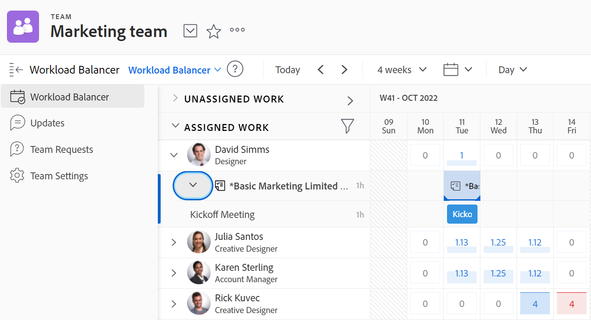

# Beheer waaraan uw team werkt

In de sectie [!UICONTROL Team Requests] van uw team kunt u een lijst met items weergeven waaraan uw team werkt.

U kunt niet-toegewezen items toewijzen, de huidige toewijzingen aanpassen, de huidige toewijzingen aanpassen en meer opgeven in de sectie [!UICONTROL Workload Balancer] van uw team.

Zie [[!UICONTROL Workload Balancer]](../../resource-mgmt/workload-balancer/assign-work-in-workload-balancer.md) voor meer informatie over het beheren van taken die aan uw team zijn toegewezen.

