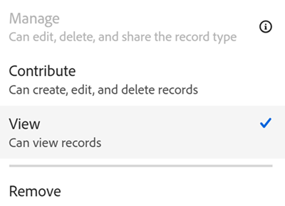

<!--update metadata with real information at release-->

# Records delen

 de informatie op deze pagina verwijst naar functionaliteit nog niet algemeen beschikbaar. Deze optie is alleen beschikbaar in de voorvertoningsomgeving voor alle klanten. Na de maandelijkse versies aan Productie, zijn de zelfde eigenschappen ook beschikbaar in het milieu van de Productie voor klanten die snelle versies toeliet. 

 voor informatie over snelle versies, zie [&#x200B; snelle versies voor uw organisatie &#x200B;](/help/quicksilver/administration-and-setup/set-up-workfront/configure-system-defaults/enable-fast-release-process.md) toelaten of onbruikbaar maken. 

{{planning-important-intro}}

U kunt de toestemmingen van mensen aan individuele verslagen in een verslagtype aanpassen.

U kunt een Adobe Workfront-planningsrecord op de volgende manieren delen:

* Een koppeling naar de record delen.

  Voor meer informatie, zie [&#x200B; verslagen van het Aandeel gebruikend een verbinding &#x200B;](/help/quicksilver/planning/records/share-records.md).

* Deel alle records in een werkruimte met andere gebruikers door de werkruimte en het recordtype te delen.

  Zie de volgende artikelen voor meer informatie:

   * [Een werkruimte delen](/help/quicksilver/planning/access/share-workspaces.md)

   * [Een recordtype delen](/help/quicksilver/planning/access/share-record-types.md)

* Deel een verslag gebruikend de **optie van het Aandeel**.

  Dit artikel beschrijft hoe u een verslag met anderen kunt delen gebruikend de **optie van het Aandeel**.

>[!IMPORTANT]
>
>Gebruikers met toegang tot een werkruimte krijgen automatisch minstens weergavemachtigingen voor alle records in de werkruimte.
>Als u weergaven deelt, geeft u gebruikers geen machtigingen voor records. Alleen werkruimten delen kan gebruikers machtigingen verlenen voor het opnemen van typen en records.
>
>Voor algemene informatie over het delen van voorwerpen in de Planning van Workfront, zie ook [&#x200B; Overzicht van het delen van toestemmingen in de Planning van Adobe Workfront &#x200B;](/help/quicksilver/planning/access/sharing-permissions-overview.md).

## Toegangsvereisten

+++ Breid uit om de toegangseisen voor de functionaliteit in dit artikel weer te geven. 

<!--at GA, check that the Workfront plans article linked below has Planning info-->

<table style="table-layout:auto"> 
<col> 
</col> 
<col> 
</col> 
<tbody> 
    <tr> 
<tr> 
   <td role="rowheader">
Adobe Workfront-pakket
</td> 
   <td> 

Alle Workfront- en planningspakketten
 
of

Willekeurig workflowpakket en planningspakket
 
 </tr>

<tr> 
   <td role="rowheader">
Adobe Workfront-licentie
</td> 
   <td>
Alle
 
   
<b>OPMERKING</b>

   
Alleen personen met een standaardlicentie kunnen beheermachtigingen voor records krijgen. Alle andere licenties kunnen alleen weergavemachtigingen hebben en de optie Beheren is voor deze licenties grijs.

  </td> 
  </tr> 
  <tr> 
   <td role="rowheader">
Configuratie op toegangsniveau
</td> 
   <td> 
Er zijn geen toegangsniveaucontroles voor de Planning van Adobe Workfront
   
</td> 
  </tr> 
<tr> 
   <td role="rowheader">
Objectmachtigingen
</td> 
   <td>  
Rechten voor een werkruimte, een recordtype en de record beheren
  
   
<b>BELANGRIJK</b>

   
Alleen gebruikers met de machtiging Beheren in een werkruimte kunnen een record delen
</td> 
  </tr>
<tr>
   <td role="rowheader">
Lay-outsjabloon
</td>
   <td> De gebruikers met een Licht of de vergunning van de Medewerker moeten een lay-outmalplaatje worden toegewezen dat Planning omvat.
   
De standaardgebruikers en de Beheerders van het Systeem hebben de Gebieden van de Planning die door gebrek worden toegelaten.

</li></ul>

</td>
  </tr>

</tbody> 
</table>

Voor meer informatie over de toegangsvereisten van Workfront, zie [&#x200B; vereisten van de Toegang in de documentatie van Workfront &#x200B;](/help/quicksilver/administration-and-setup/add-users/access-levels-and-object-permissions/access-level-requirements-in-documentation.md).

+++

## Overwegingen bij het delen van records

<!--maybe use the Share record types as example here and touch on the same points: help/quicksilver/planning/access/share-record-types.md; in addition to using Lilit's information-->

<!--checking on the below with Lilit-->

* U kunt records delen met de volgende entiteiten: personen, groepen, teams, bedrijven of functies.
* Als u een werkruimte deelt met gebruikers, ontvangen zij standaard dezelfde machtigingen voor de records in de werkruimte.
* Wanneer u een entiteit uit een werkruimte verwijdert, worden alle machtigingen voor delen verwijderd uit de recordtypen en alle records in de werkruimte.
* De toegang van een gebruiker tot de record wordt bepaald door de combinatie van de volgende drie instellingen:

   * Hun rechten worden overgenomen van het recordtype en de werkruimte
   * Machtigingen die afzonderlijk zijn toegevoegd in het dialoogvenster voor het delen van records
   * De volgende machtigingen:

      * **iedereen in de werkruimte kan** bekijken: Dit maakt het verslag viewable door iedereen in de werkruimte <!-- is this OK to say "workspace? should it be "record"??-->
      * **slechts kunnen de uitgenodigde mensen tot** toegang hebben: Dit wordt geselecteerd door gebrek en staat het beperken van toegang tot het verslag tot specifieke mensen toe.

* U kunt de volgende machtigingsniveaus aan een record toekennen:

   * Weergave
   * Beheren

* Wanneer u een record deelt met een gebruiker, worden deze gegevens standaard toegevoegd met dezelfde machtigingen als voor het recordtype.

  Bijvoorbeeld:

   * Als zij de toestemmingen van de Mening aan het verslagtype hebben, krijgen zij de toestemmingen van de Mening aan het verslag
   * Als zij over Contribute- of beheermachtigingen voor het recordtype beschikken, krijgen zij beheermachtigingen voor de record

* Als werkruimtebeheerder kunt u een record delen met een gebruiker die geen deel uitmaakt van de werkruimte. In dit geval, is er een waarschuwing naast de toegevoegde entiteit op de hoogte brengend dat zij geen toegang tot de werkruimte hebben. U kunt doorgaan met het toevoegen van de gebruiker aan de record, waardoor deze ook aan de werkruimte wordt toegevoegd, of u kunt stoppen met het toevoegen van de gebruiker aan de record, waardoor deze ook niet aan de werkruimte wordt toegevoegd.

* Wanneer u een record deelt met gebruikers die beheermachtigingen hebben voor de werkruimte, krijgen zij ook standaard beheermachtigingen voor de record. De machtiging Weergeven is grijs.

* Als u geen toestemmingen hebt om mensen aan de werkruimte toe te voegen, zult u slechts gebruikers, teams, groepen, rollen, en bedrijven zien en toevoegen die reeds aan de werkruimte worden toegevoegd. U kunt geen andere entiteit toevoegen die nog geen deel uitmaakt van de werkruimte.

* U kunt geërfte toestemmingen voor één enkel verslag onbruikbaar maken, in welk geval u hen toestemmingen aan individuele verslagen kunt geven, of zij kunnen toestemmingen verkrijgen als zij tot **iedereen in de werkruimte behoren** optie kan bekijken. <!-- is this OK to say "workspace? should it be "record"??-->

* Als meerdere machtigingen voor delen van toepassing zijn op dezelfde gebruiker, krijgen ze de hoogste machtigingen voor die machtigingen.

  Als een record bijvoorbeeld wordt gedeeld met een gebruiker met weergavemachtigingen en hun groep met beheertoegang, krijgen ze beheermachtigingen voor de record.

<!--Too granular??

If the inheritance has not been disabled, the user gets the maximum of inherited+individual+wildcard access 

If the inherited permissions are disabled, the user gets the maximum of wildcard+individual permissions -->

* Als een formuleveld of een raadplegingsgebied van een verbonden verslag op een gebied op een verslag gebaseerd is waarover u geen toestemmingen hebt, zult u de correcte berekening zien welke factoren in het verslag u anders niet kunt toegang hebben.

<!-- not sure if any of the Share record types points might match here - ask Lilit??-->

## Recordmachtigingen delen

U kunt machtigingen aanpassen aan afzonderlijke records als u beheerdersmachtigingen hebt voor de werkruimte.

{{step1-to-planning}}

1. Open de werkruimte waarvan u de records wilt delen.
1. Klik op het recordtype waarvan u de records wilt delen.

1. Voer een van de volgende handelingen uit:

   * Van de lijstmening, houd over de naam van een verslag, klik **Meer** menu , dan klik **Aandeel**.
   * Van om het even welke mening, klik de naam van een verslag, dan klik **Aandeel** in de hoger-juiste hoek van de de detailspagina van het verslag.

   Het **vakje van het Aandeel** opent.

   

1. (Facultatief) in **die toegang** heeft, kan **iedereen in de werkruimte** optie bekijken door gebrek worden geselecteerd.  Alle gebruikers met Weergave of hogere machtigingen voor de werkruimte en het recordtype kunnen de record weergeven.

1. (Facultatief) klik het aantal gebruikers onder de **Geërfte toestemmingen** optie om gebruikers, teams, groepen, bedrijven, of baanrollen te bekijken die toestemmingen van de werkruimte erven.

   >[!TIP]
   >
   >U kunt afzonderlijke entiteiten niet verwijderen uit de lijst Geërfde machtigingen.

1. (Optioneel en voorwaardelijk) Als u het recordtype wilt delen met specifieke entiteiten en deze een andere toegang tot het recordtype wilt geven dan ze al hebben voor de werkruimte, gaat u als volgt te werk:

   1. Selecteer **onbruikbaar maken** van **Geërfte toestemmingen** drop-down menu.

   >[!TIP]
   >
   >Workspace-managers blijven beheermachtigingen hebben voor het recordtype en de record.

   1. (Optioneel) Selecteer **slechts uitgenodigde mensen kunnen** van **toegang hebben wie toegang** gebied heeft.

   1. In de **toegang van de Verlening tot dit verslagtype** gebied, voeg de gebruikers, de teams, de groepen, de bedrijven, of baanrollen toe die u een verschillend toestemmingsniveau aan wilt verlenen dan zij voor de werkruimte of het verslagtype hebben.
   1. Kies een van de volgende machtigingsniveaus:

      * Weergave
      * Beheren

      <!--checking on the below with Lilit-->

   >[!IMPORTANT]
   >
   >* Naast teams, groepen, bedrijven, en baanrollen, kunt u slechts met gebruikers delen die aan Adobe Admin Console zijn toegevoegd. U kunt geen gebruikers met alleen Workfront toevoegen. Voor informatie, zie [&#x200B; gebruikers in Adobe Admin Console &#x200B;](/help/quicksilver/administration-and-setup/add-users/create-and-manage-users/admin-console.md) leiden.
   >* Als gebruikers over Contribute- of Beheren-machtigingen voor de werkruimte en het recordtype beschikken, behouden zij de machtiging Beheren voor de record. De machtiging Weergeven is grijs
   >* U kunt gebruikers geen lagere machtigingen voor de record geven als ze Contribute of hoger hebben.
   > Voor meer informatie, zie [&#x200B; Overzicht van het delen van toestemmingen in de Planning van Adobe Workfront &#x200B;](/help/quicksilver/planning/access/sharing-permissions-overview.md).

1. Om gebruikers te geven die geen toestemmingen aan de werkruimtetoegang hebben om een verslag, op de **toegang van de Verlening tot dit mening** gebied te bekijken, begin de naam van een gebruiker, een groep, een team, een bedrijf, of baanrol te typen, dan het te klikken wanneer het in de lijst toont.

   De entiteit u selecteerde wordt toegevoegd aan het verslag en aan de werkruimte met **toestemmingen van de Mening**.

   Systeembeheerders ontvangen altijd beheermachtigingen voor records die met hen worden gedeeld, en er is een indicatie dat een gebruiker een systeembeheerder is.

1. (Facultatief) klik **verbinding van het Exemplaar** om een verbinding aan het verslag aan uw klembord te kopiëren en het met anderen te delen. Met de koppeling wordt de detailpagina van de record geopend.
1. Klik **sparen**.

   De record wordt nu gedeeld met andere gebruikers.
   <!--Checking with Lilit on this: The users you shared the record with receive both an in-app and email notification about having given permissions to the following entities:

   * The record
   * The record type, if they never had permissions before
   * The workspace, if they had not had permissions to the workspace before the record was shared with them. -->

1. Deel de gekopieerde koppeling met anderen. Gebruikers die de koppeling ontvangen, moeten actieve gebruikers zijn en zich aanmelden bij Workfront om de pagina met recordtypen te kunnen openen en weergeven in de geselecteerde weergave. Zij moeten toestemmingen aan het verslagtype hebben om het te kunnen bekijken. Voor meer informatie, zie ook [&#x200B; verslagen van het Aandeel gebruikend een verbinding &#x200B;](/help/quicksilver/planning/records/share-records.md).

## Verwijder toestemmingen aan een verslag (**&#x200B;** **&#x200B;**&#x200B;**&#x200B;**&#x200B;**&#x200B; DIT WERD GEKOPIEERD VAN RECORDTYPES, HET MOET VOOR RECORDS WORDEN BEWERKT, MAAR WACHT OP DE REACTIE VAN SLACK VAN LILIT &#x200B;**&#x200B;**&#x200B;**&#x200B;**&#x200B;**)

U kunt gebruikersmachtigingen uit een record verwijderen. Ze behouden echter ten minste weergavemachtigingen voor de recordwerkruimte, die ze ook ten minste weergavemachtigingen voor het recordtype geven. U moet hun toegang uit de werkruimte verwijderen als u wilt dat zij geen machtigingen hebben voor de recordtypen in de werkruimte.

{{step1-to-planning}}

1. Open de werkruimte waarvan recordtypen u wilt ophouden met delen en klik vervolgens op een opnametype-kaart. Hierdoor wordt de pagina met recordtypen geopend.

1. Van het lusje van om het even welke mening, klik **Aandeel** in de hoger-juiste hoek van het verslagtype.
1. Klik **Deel het verslagtype**.

   Het **vakje van het Aandeel** opent.
1. Vind de gebruiker, de groep, het team, het bedrijf, of de baanrol die de toestemmingen u wilt verwijderen, het drop-down menu van toestemmingen rechts van hun naam uitbreiden, dan **verwijderen** klikken. <!--check the screen shot below - the UI text for View might not be accurate-->

   

1. Klik **sparen**.

   Personen beschikken niet meer over de aangegeven machtigingen voor het recordtype. Ze hebben echter nog steeds machtigingen voor de werkruimte, tenzij u ze ook verwijdert uit de werkruimtemachtigingen.

   Er is geen bericht voor de gebruikers die zijn verwijderd van toegang tot de weergave, dat zij deze toegang niet meer hebben.
