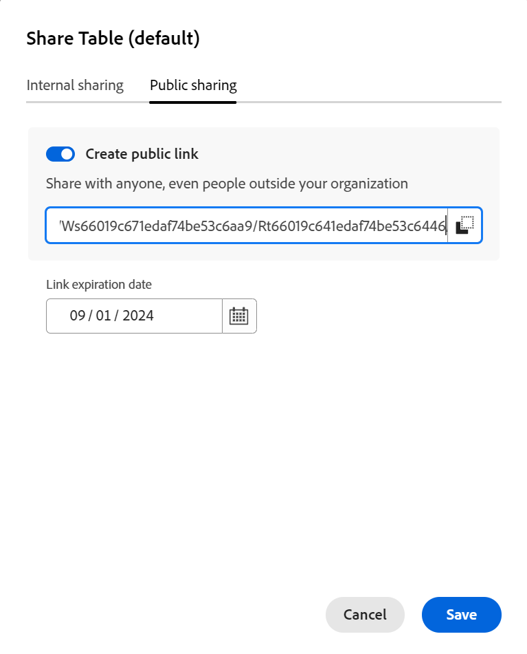

# Weergaven delen

<!--there are several mentions on how to share public links for global record types in secondary workspaces in this articel; you have to update all of these mentions when something changes-->

 de benadrukte informatie op deze pagina verwijst naar functionaliteit nog niet algemeen beschikbaar. Deze optie is alleen beschikbaar in de voorvertoningsomgeving voor alle klanten. Na de maandelijkse versies aan Productie, zijn de zelfde eigenschappen ook beschikbaar in het milieu van de Productie voor klanten die snelle versies toeliet. 

 voor informatie over snelle versies, zie [ snelle versies voor uw organisatie ](/help/quicksilver/administration-and-setup/set-up-workfront/configure-system-defaults/enable-fast-release-process.md) toelaten of onbruikbaar maken. 

{{planning-important-intro}}

U kunt een weergave met anderen delen om samenwerking te garanderen wanneer u werkt met records in Adobe Workfront Planning.

>[!IMPORTANT]
>
>* Het verlenen van toestemmingen aan een werkruimte geeft andere gebruikers geen toestemmingen aan de meningen op de verslagtypepagina&#39;s. U moet machtigingen verlenen aan afzonderlijke weergaven in een recordtypepagina om deze te kunnen delen met andere gebruikers.
>
>* Als u machtigingen verleent aan een weergave, worden de machtigingen voor het weergeven van de records niet gewijzigd. De toestemmingen van het verslag worden verleend door werkruimten te delen.
>
>* Wanneer u een weergave deelt, geeft u anderen machtigingen om toegang te krijgen tot alle elementen van de weergave. Als u ze bijvoorbeeld de machtiging Beheren geeft aan een weergave, kunnen ze de weergave van de groepering, het filter, de sortering of de balk wijzigen.

<!--
This article describes how you can share a view with others. For information about requesting, granting, or denying permissions to a view, see [Request permissions to a view or a workspace](/help/quicksilver/planning/access/request-permissions.md). -->

## Toegangsvereisten

+++ Breid uit om de toegangseisen voor de functionaliteit in dit artikel weer te geven. 

<!--at GA, check that the Workfront plans article linked below has Planning info-->

<table style="table-layout:auto"> 
<col> 
</col> 
<col> 
</col> 
<tbody> 
    <tr> 
<tr> 
   <td role="rowheader">
Adobe Workfront-pakket
</td> 
   <td> 

Alle Workfront- en planningspakketten
 
of

Willekeurig workflowpakket en planningspakket
 
 </tr>

<tr> 
   <td role="rowheader">
Adobe Workfront-licentie
</td> 
   <td>
Alle
 
  </td> 
  </tr> 
  <tr> 
   <td role="rowheader">
Configuratie op toegangsniveau
</td> 
   <td> 
Er zijn geen toegangsniveaucontroles voor de Planning van Adobe Workfront
   
</td> 
  </tr> 
<tr> 
   <td role="rowheader">
Objectmachtigingen
</td> 
   <td>  
Rechten beheren voor een weergave
 
   
<b>BELANGRIJK</b>
 
   
Alleen gebruikers met de machtiging Beheren in een werkruimte kunnen een weergave openbaar delen.
</td> 
  </tr> 
<tr>
   <td role="rowheader">
Lay-outsjabloon
</td>
   <td> De gebruikers met een Licht of de vergunning van de Medewerker moeten een lay-outmalplaatje worden toegewezen dat Planning omvat.
   
De standaardgebruikers en de Beheerders van het Systeem hebben de Gebieden van de Planning die door gebrek worden toegelaten.

</li></ul>

</td>
  </tr>

</tbody> 
</table>

Voor meer informatie over de toegangsvereisten van Workfront, zie [ vereisten van de Toegang in de documentatie van Workfront ](/help/quicksilver/administration-and-setup/add-users/access-levels-and-object-permissions/access-level-requirements-in-documentation.md).

+++

<!--Old:
<table style="table-layout:auto"> 
<col> 
</col> 
<col> 
</col> 
<tbody> 
    <tr> 
<tr> 
<td> 
   
 Products
 </td> 
   <td> 
   <ul><li>
 Adobe Workfront
</li> 
   <li>
 Adobe Workfront Planning
</li></ul></td> 
  </tr>   
<tr> 
   <td role="rowheader">
Adobe Workfront plan*
</td> 
   <td> 

Any of the following Workfront plans:
 
<ul><li>Select</li> 
<li>Prime</li> 
<li>Ultimate</li></ul> 

Workfront Planning is not available for legacy Workfront plans
 
   </td> 
<tr> 
   <td role="rowheader">
Adobe Workfront Planning package*
</td> 
   <td> 

Any 
 

For more information about what is included in each Workfront Planning plan, contact your Workfront account manager. 
 
   </td> 
 <tr> 
   <td role="rowheader">
Adobe Workfront platform
</td> 
   <td> 

Your organization's instance of Workfront must be onboarded to the Adobe Unified Experience to be able to access Workfront Planning.
 

Your organization must be onboarded to the Adobe Unified Experience for users to be able to request and grant permissions to a view from a permission request. 

Users must be added to the Adobe Admin Console in order to gain permissions to Workfront Planning views.

For more information, see <a href="/help/quicksilver/workfront-basics/navigate-workfront/workfront-navigation/adobe-unified-experience.md">Adobe Unified Experience for Workfront</a>. 
 
   </td> 
   </tr> 
  </tr> 
  <tr> 
   <td role="rowheader">
Adobe Workfront license*
</td> 
   <td>
 Standard

   
Workfront Planning is not available for legacy Workfront licenses
 
  </td> 
  </tr> 
  <tr> 
   <td role="rowheader">
Access level configuration
</td> 
   <td> 
There are no access level controls for Adobe Workfront Planning
   
</td> 
  </tr> 
<tr> 
   <td role="rowheader">
Object permissions
</td> 
   <td>  
Manage permissions to a view
  
   
Only users with Manage permissions to a workspace can share a view publicly.
</td> 
  </tr> 

</tbody> 
</table> -->

## Overwegingen bij het delen van weergaven

* U kunt een weergave op de volgende manieren delen:

   * Intern, met gebruikers, groepen, teams, bedrijven van Workfront, en baanrollen
   * Openbaar, met gebruikers buiten Workfront
   * Door een koppeling naar een weergave te kopiëren en vervolgens te delen
   * Door het naar Excel of een Csv- dossier uit te voeren. U kunt alleen de tabelweergave exporteren naar een bestand. Voor informatie, zie [ de lijstmening ](/help/quicksilver/planning/views/manage-the-table-view.md) leiden.

* Voor algemene informatie over het delen van voorwerpen in de Planning van Workfront, zie ook [ Overzicht van het delen van toestemmingen in de Planning van Adobe Workfront ](/help/quicksilver/planning/access/sharing-permissions-overview.md).
* U kunt weergave- of beheermachtigingen aan interne Workfront-gebruikers geven.

* Gebruikers met de machtiging Beheren kunnen de weergave-instellingen wijzigen, deze delen, dupliceren of verwijderen.

* U kunt weergaven delen met personen buiten uw organisatie via een openbare koppeling.

* Wanneer u een mening openbaar deelt, is de verbinding toegankelijk door iedereen buiten uw bedrijf voor een beperkte tijd, die door de vervaldatum wordt vermeld. U hoeft zich niet aan te melden om de gedeelde weergave te kunnen weergeven.

  >[!NOTE]
  >
  >U kunt een mening niet openbaar van een globaal verslagtype in een secundaire werkruimte delen. Voor meer informatie, zie [ bestaande verslagtypes van een andere werkruimte ](/help/quicksilver/planning/architecture/add-existing-record-types-from-another-workspace.md) toevoegen.

* Personen buiten uw organisatie die toegang hebben tot een weergave, kunnen geen andere weergaven maken, de gedeelde weergave bewerken of recordgegevens in de weergave toevoegen, verwijderen of bewerken.

## Rechten delen met een weergave intern

U kunt weergaven delen die u hebt gemaakt of weergaven waarop u beheerdersmachtigingen hebt, met gebruikers, groepen, teams, bedrijven en taakrollen in Workfront Planning.

>[!NOTE]
>
>Systeembeheerders kunnen geen weergaven weergeven of delen die ze zelf niet hebben gemaakt. Ze kunnen alleen weergaven openen of delen die met hen worden gedeeld.
>
>Systeembeheerders kunnen alleen beheermachtigingen voor een weergave hebben.

{{step1-to-planning}}

1. Open de werkruimte waarvan u de weergave wilt delen en klik op een opnametype-kaart.

   Hierdoor wordt de pagina met recordtypen geopend.

1. Voer op het tabblad van de weergave een van de volgende handelingen uit:

   * Klik het lusje van de mening, over de mening in het drop-down menu, klik het **Meer** menu , dan klik **Aandeel**.

     

   * Klik **Aandeel** in de hoger-juiste hoek van het scherm, dan **Deel de huidige mening**.

     

   De **mening van het Aandeel** doos opent en het **Interne het delen** lusje zou door gebrek moeten worden geselecteerd.

1. (Facultatief) op **die toegang** gebied heeft, selecteer van de volgende opties:

   * **slechts kunnen de uitgenodigde mensen tot** toegang hebben: U moet gebruikers, groepen, team, bedrijf, of baanrol specificeren die u de mening met wilt delen. Dit is de standaardoptie.

   >[!NOTE]
   >
   >* Naast teams, groepen, bedrijven, en baanrollen, kunt u slechts met gebruikers delen die aan Adobe Admin Console zijn toegevoegd. U kunt geen gebruikers met alleen Workfront toevoegen. Voor informatie, zie [ gebruikers in Adobe Admin Console ](/help/quicksilver/administration-and-setup/add-users/create-and-manage-users/admin-console.md) leiden.
   >
   >* Wanneer u een mening met een gebruiker deelt, hun primaire baanrol  en hun e-mail  ook tonen op het gebied. U moet de instelling Contactgegevens weergeven hebben ingeschakeld voor het object Users in uw toegangsniveau om de e-mail van de gebruiker te kunnen zien.

   * **iedereen in de werkruimte kan** bekijken: Alle gebruikers die Mening of hogere toestemmingen aan werkruimten hebben kunnen tot de mening toegang hebben.

1. In de **toegang van de Verlening tot dit mening** gebied, begin de naam van een gebruiker, een groep, een team, een bedrijf, of baanrol te typen dan het te klikken wanneer het in de lijst toont.

   

1. Selecteer een van de volgende machtigingsniveaus in het keuzemenu:
   * Weergave
   * Beheren

     Voor informatie over toestemmingsniveaus en welke acties kunnen de gebruikers voor elk niveau uitvoeren, zie [ Overzicht van het delen van toestemmingen in de Planning van Adobe Workfront ](/help/quicksilver/planning/access/sharing-permissions-overview.md).

     Systeembeheerders ontvangen altijd beheermachtigingen voor weergaven die met hen worden gedeeld.

1. Klik **sparen**.

   De meningsupdates met een mensen pictogram  wordt gedeeld om erop te wijzen dat de mening nu met andere gebruikers wordt gedeeld.

   De gebruikers die u de weergave hebt gedeeld, ontvangen zowel een melding in de app als een e-mailbericht over het hebben van machtigingen voor de weergave.

   >[!TIP]
   >
   >Weergaven zonder personen of een globaal pictogram zijn weergaven die u hebt gemaakt en die niet met anderen worden gedeeld. Niet-gedeelde weergaven zijn alleen voor u zichtbaar.

1. Deel de gekopieerde koppeling met anderen. Gebruikers die de koppeling ontvangen, moeten actieve gebruikers zijn en zich aanmelden bij Workfront om de pagina met recordtypen te kunnen openen en weergeven in de geselecteerde weergave.

## Machtigingen delen voor een openbare weergave

U kunt weergaven die u hebt gemaakt of weergaven waarop u beheerdersmachtigingen hebt, delen met personen die geen Workfront-licentie hebben en die zich buiten uw organisatie bevinden.

U kunt een mening niet openbaar van een globaal verslagtype in zijn secundaire werkruimte delen.

>[!IMPORTANT]
>
>Alleen gebruikers met de machtiging Beheren in een werkruimte kunnen de weergaven van de werkruimte openbaar delen.

Een weergave openbaar delen in Workfront Planning:

{{step1-to-planning}}

1. Open de werkruimte waarvan u de weergave wilt delen en klik op een opnametype-kaart.

   Hierdoor wordt de pagina met recordtypen geopend.

1. Voer op het tabblad Weergave een van de volgende handelingen uit:

   * Beweeg over de lusjenaam van de mening u **Meer** menu  aan het recht van de meningsnaam delen en wilt klikken, dan **Aandeel** klikken.

    worden uitgebreid
   * Klik **Aandeel** > **Aandeel de huidige mening**

   De **mening van het Aandeel** doos opent.

1. Klik **Openbaar het delen**.

   

1. Laat **toe creeer openbare verbinding** plaatsen.

   Er wordt een koppeling beschikbaar. Dit is een openbare link. Als de koppeling wordt gedeeld, heeft iedereen met deze koppeling, dus ook mensen van buiten uw organisatie, toegang tot de pagina met recordtypen en kunnen records en velden op de pagina worden weergegeven.

   >[!TIP]
   >
   >Het **Openbare delen** lusje wordt verwijderd voor een globaal verslagtype in zijn secundaire werkruimte.

1. Klik de **pictogram van het 1} verbinding van het Exemplaar** verbindingsmening van het Exemplaar 

1. Voer manueel een datum in, of gebruik de kalender op het **gebied van de Vervaldatum van de Verbinding** om een vervaldatum voor de openbare verbinding te selecteren. De weergave van de recordpagina is na de geselecteerde datum niet toegankelijk.

1. Klik **sparen**.

   De meningsupdates met een globaal pictogram  om erop te wijzen dat de mening openbaar wordt gedeeld.

   >[!TIP]
   >
   >Weergaven zonder personen of een globaal pictogram zijn weergaven die u hebt gemaakt en die niet met anderen worden gedeeld. Niet-gedeelde weergaven zijn alleen voor u zichtbaar.

1. (Optioneel) Plak de koppeling die u hebt gekopieerd naar een e-mail, chatbericht, document of Workfront-opmerking om deze met anderen te delen.

## Een koppeling naar een weergave kopiëren

U kunt een koppeling naar een weergave naar het klembord kopiëren en deze opnemen in een andere toepassing of deze delen met anderen.

Om een verbinding aan een openbaar-gedeelde mening te kopiëren, zie de sectie [ toestemmingen van het Aandeel aan een mening openbaar ](#share-permissions-to-a-view-publicly) in dit artikel.

In deze sectie wordt beschreven hoe u een weergave intern deelt.

>[!IMPORTANT]
>
>U moet eerst de weergave met gebruikers delen voordat u de koppeling naar de weergave kunt delen. Anders kunt u de koppeling niet meer zien.

{{step1-to-planning}}

1. Open de werkruimte waarnaar u de koppeling wilt kopiëren en delen en klik vervolgens op een opnametype-kaart.

   Hierdoor wordt de pagina met recordtypen geopend.

1. Voer op het tabblad van een weergave een van de volgende handelingen uit:

   * Beweeg over het lusje van de mening u **Meer** menu  aan het recht van de meningsnaam wilt delen en klikken, dan **Aandeel** > **verbinding van het Exemplaar** in de **mening van het Aandeel** doos.
   * Klik **Aandeel** > **Kopieer de meningsverbinding** van de verslagtype pagina.

   Een koppeling naar de weergave wordt naar het klembord gekopieerd en u ontvangt een bevestiging onder aan het scherm.

   U kunt de koppeling nu naar een andere toepassing plakken of naar anderen verzenden.

## Rechten verlenen aan een weergave vanuit een machtigingsverzoek

Gebruikers die een koppeling openen naar een weergave waarvoor zij geen machtigingen hebben, kunnen machtigingen aanvragen voor de weergave. Alle gebruikers met de machtiging Beheren voor de weergave ontvangen de aanvraag voor machtigingen en kunnen de machtigingen verlenen of weigeren.

1. (Voorwaardelijk) Als u de manager van een mening bent, zou u een verzoek van een andere gebruiker kunnen ontvangen om tot de mening op de volgende gebieden toegang te hebben:

   * Een melding in de app
     
   * Een e-mailmelding
     
1. (Voorwaardelijk) Klik in het systeemvak in Workfront op de melding in de app.
of
Van het e-mailbericht, klik **Mening alle berichten**, dan klik het bericht in de lijst.

   De **hangende toegangsverzoeken** vakvertoningen.

   
1. (Optioneel) Voor de gebruiker wiens machtigingen u wilt goedkeuren, selecteert u een van de volgende opties in het vervolgkeuzemenu rechts van de gebruikersnaam:
   * **Mening**
   * **leiden**
1. Selecteer de gebruiker voor wie u de toestemming goedkeuren of wilt ontkennen, dan klik **allen** goedkeuren of **ontkennen allen**.
1. Klik de verlaten-richt pijl aan de linkerzijde van **Hangende toegangsverzoeken**, dan klik **sparen**.

   Als u het verzoek hebt goedgekeurd, worden de gebruikers toegevoegd aan het vak voor delen van de weergave. De gebruiker die de machtiging aanvraagt, ontvangt een e-mailbevestiging dat zijn aanvraag is goedgekeurd. <!--will they also get an in-app notification??-->

## Machtigingen verwijderen uit een weergave

{{step1-to-planning}}

1. Open de werkruimte waarvan u de weergave niet meer wilt delen en klik op een opnametype-kaart. Hierdoor wordt de pagina met recordtypen geopend.
1. Voer op het tabblad Weergave een van de volgende handelingen uit:

   * Beweeg over de lusjenaam van de mening u **Meer** menu  aan het recht van de meningsnaam delen en wilt klikken, dan **Aandeel** klikken.

   * Klik **Aandeel** > **Aandeel de huidige mening**

   De **mening van het Aandeel** doos opent.
1. Ga als volgt te werk om het interne delen van een weergave te verwijderen:

   1. Verzeker het **Interne delen** lusje wordt geselecteerd.
   1. Vind de gebruiker, de groep, het team, het bedrijf, of de baanrol wat u wilt verwijderen, breid het drop-down menu van toestemmingen rechts van de naam van de entiteit uit u de mening deelt met, dan klik **verwijdert**.

1. Ga als volgt te werk om het delen van een weergave door het publiek te verwijderen:

   1. Klik het **Openbare delen** tabel.
   1. Deselecteer **creeer openbare verbinding** optie.

1. Klik **sparen**.

   Personen hebben geen toegang meer tot de weergave. Er is geen bericht voor de gebruikers die zijn verwijderd van toegang tot de weergave, dat zij deze toegang niet meer hebben.
