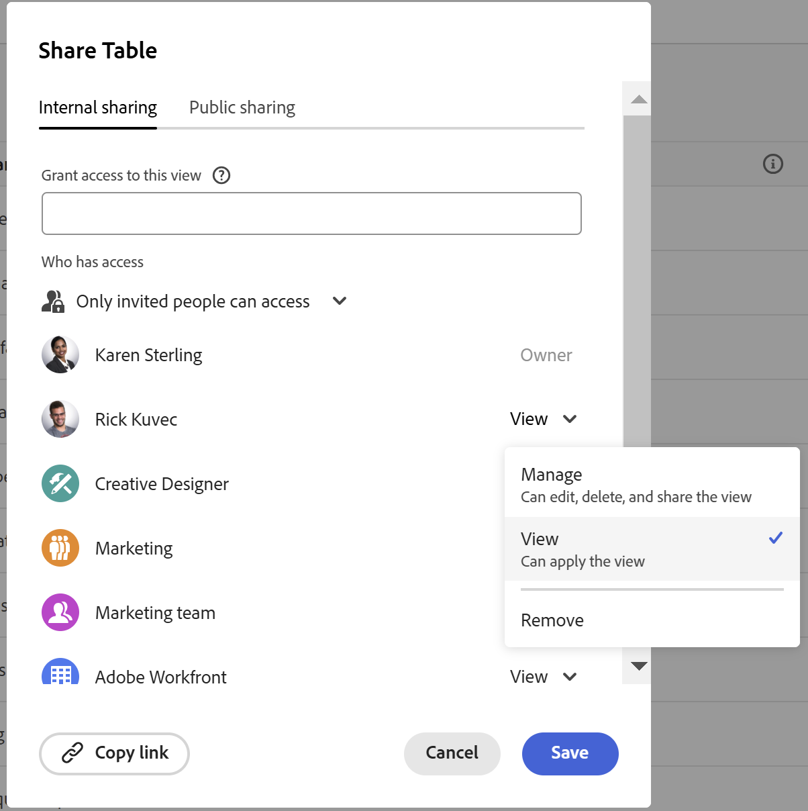

<!--update the metadata and description when we turn this article live-->

# Weergaven delen

{{planning-important-intro}}

U kunt een weergave met anderen delen om samenwerking te garanderen wanneer u werkt met records in Adobe Workfront Planning.

>[!IMPORTANT]
>
>* Het verlenen van toestemmingen aan een werkruimte geeft andere gebruikers geen toestemmingen aan de meningen op de verslagtypepagina&#39;s. U moet machtigingen verlenen aan afzonderlijke weergaven in een recordtypepagina om deze te kunnen delen met andere gebruikers.
>
>* Als u machtigingen verleent aan een weergave, worden de machtigingen voor het weergeven van de records niet gewijzigd. De toestemmingen van het verslag worden verleend door werkruimten te delen.
>
>* Wanneer u een weergave deelt, geeft u anderen machtigingen om toegang te krijgen tot alle elementen van de weergave. Als u ze bijvoorbeeld de machtiging Beheren geeft aan een weergave, kunnen ze de weergave van de groepering, het filter, de sortering of de balk wijzigen.

U kunt een weergave delen met de volgende entiteiten:

* Intern, met Workfront-gebruikers en -groepen
* Openbaar, met gebruikers buiten Workfront

## Toegangsvereisten

+++ Breid uit om toegangsvereisten voor de Planning van Workfront te bekijken.

<!--at GA the plan below will change to Prime, Select and Ultimate only-->

<table style="table-layout:auto">
 <col>
 </col>
 <col>
 </col>
 <tbody>
    <tr>
<tr>
<td>
   
 Product
 </td>
   <td>
   
 Adobe Workfront
 </td>
  </tr>  
 <td role="rowheader">
Adobe Workfront-overeenkomst
</td>
   <td>

Uw organisatie moet zijn ingeschreven in de vroege toegangsfase voor Workfront Planning 

   </td>
  </tr>
  <tr>
   <td role="rowheader">
Adobe Workfront-plan
</td>
   <td>

Alle

   </td>
  </tr>
  <tr>
   <td role="rowheader">
Adobe Workfront-licentie*
</td>
   <td>
   
Nieuw: Standaard

   of
   
Huidig: Plan 
 
  </td>
  </tr>

<tr>
   <td role="rowheader">
Configuraties op toegangsniveau
</td>
   <td> Er zijn geen toegangscontroles voor de Planning van Adobe Workfront
  
</td>
  </tr>

<tr>
   <td role="rowheader">
Machtigingen
</td>
   <td> 
Rechten beheren voor een weergave
  
   
Alleen gebruikers met de machtiging Beheren in een werkruimte kunnen een weergave openbaar delen.

</td>
  </tr>

<tr>
   <td role="rowheader">
Lay-outsjabloon
</td>
   <td> 
Aan alle gebruikers, inclusief Workfront-beheerders, moet een lay-outsjabloon worden toegewezen die het planningsgebied in het hoofdmenu bevat. 
 
Voor informatie, zie <a href="/help/quicksilver/planning/access/access-overview.md"> overzicht van de Toegang </a>. 
 
</td>
  </tr>
 </tbody>
</table>

*For informatie, zie [ vereisten van de Toegang in de documentatie van Workfront ](/help/quicksilver/administration-and-setup/add-users/access-levels-and-object-permissions/access-level-requirements-in-documentation.md).

+++

## Overwegingen bij het delen van weergaven

* U kunt weergave- of beheermachtigingen aan interne Workfront-gebruikers geven.

* Gebruikers met de machtiging Beheren kunnen de weergave-instellingen wijzigen, deze delen, dupliceren of verwijderen.

* U kunt weergaven delen met personen buiten uw organisatie via een openbare koppeling.

* Wanneer u een mening openbaar deelt, is de verbinding toegankelijk door iedereen buiten uw bedrijf voor een beperkte tijd, die door de vervaldatum wordt vermeld. U hoeft zich niet aan te melden om de gedeelde weergave te kunnen weergeven.

* Personen buiten uw organisatie die toegang hebben tot een weergave, kunnen geen andere weergaven maken, de gedeelde weergave bewerken of recordgegevens in de weergave toevoegen, verwijderen of bewerken.

## Rechten delen met een weergave intern

U kunt weergaven die u hebt gemaakt of weergaven waarop u beheermachtigingen hebt, delen met gebruikers of groepen in Workfront.

>[!NOTE]
>
>Systeembeheerders kunnen geen weergaven weergeven of delen die ze zelf niet hebben gemaakt. Ze kunnen alleen weergaven openen of delen die met hen worden gedeeld.
>
>Systeembeheerders kunnen alleen beheermachtigingen voor een weergave hebben.

{{step1-to-planning}}

1. Open de werkruimte waarvan u de weergave wilt delen en klik op een opnametype-kaart.

   Hierdoor wordt de pagina met recordtypen geopend.

1. Van het meningslusje, houd over de mening u **Meer** menu  aan het recht van de meningsnaam delen en wilt klikken, dan **Aandeel** klikken.

   

   Het **Interne delende** lusje zou door gebrek moeten worden geselecteerd.

1. (Facultatief) op **die toegang** gebied heeft, selecteer van de volgende opties:

   * **slechts kunnen de uitgenodigde mensen tot** toegang hebben: U moet gebruikers of groepen specificeren die u de mening met wilt delen. Dit is de standaardoptie.
   * **iedereen in de werkruimte kan** bekijken: Alle gebruikers die Mening of hogere toestemmingen aan werkruimten hebben kunnen tot de mening toegang hebben.

1. In de **de meningstoegang van de Verlening tot** gebied, begin de naam van een gebruiker of een groep te typen, dan het te klikken wanneer het in de lijst toont.

   

1. Selecteer een van de volgende machtigingsniveaus in het keuzemenu:
   * Weergave
   * Beheren

     Voor informatie over toestemmingsniveaus en welke acties kunnen de gebruikers voor elk niveau uitvoeren, zie [ Overzicht van het delen van toestemmingen in de Planning van Adobe Workfront ](/help/quicksilver/planning/access/sharing-permissions-overview.md).

     Systeembeheerders ontvangen altijd beheermachtigingen voor weergaven die met hen worden gedeeld.

1. Klik **verbinding van het Exemplaar** om een verbinding aan de mening aan uw klembord te kopiëren.
1. Klik **sparen**.

   De weergave wordt bijgewerkt met het pictogram voor personen  om aan te geven dat de weergave nu wordt gedeeld met andere gebruikers.

   >>
   >[!TIP]
   >>
   >Weergaven zonder personen of een globaal pictogram zijn weergaven die u hebt gemaakt en die niet met anderen worden gedeeld. Niet-gedeelde weergaven zijn alleen voor u zichtbaar.

1. Deel de gekopieerde koppeling met anderen. Gebruikers die de koppeling ontvangen, moeten actieve gebruikers zijn en zich aanmelden bij Workfront om de pagina met recordtypen te kunnen openen en weergeven in de geselecteerde weergave.

## Machtigingen delen voor een openbare weergave

U kunt weergaven die u hebt gemaakt of weergaven waarop u beheerdersmachtigingen hebt, delen met personen die geen Workfront-licentie hebben en die zich buiten uw organisatie bevinden.

>[!IMPORTANT]
>
>Alleen gebruikers met de machtiging Beheren in een werkruimte kunnen de weergaven van de werkruimte openbaar delen.

Een weergave openbaar delen in Workfront Planning:

{{step1-to-planning}}

1. Open de werkruimte waarvan u de weergave wilt delen en klik op een opnametype-kaart.

   Hierdoor wordt de pagina met recordtypen geopend.

1. Van het meningslusje, houd over de mening u **Meer** menu  aan het recht van de meningsnaam delen en wilt klikken, dan **Aandeel** klikken.

   

1. Klik **Openbaar het delen**.

   

1. Laat **toe creeer openbare verbinding** plaatsen.

   Er wordt een koppeling beschikbaar. Dit is een openbare link. Als de koppeling wordt gedeeld, heeft iedereen met deze koppeling, dus ook mensen van buiten uw organisatie, toegang tot de pagina met recordtypen en kunnen records en velden op de pagina worden weergegeven.

1. Klik het **pictogram van de verbinding van het 0} Exemplaar  om de verbinding aan uw klembord te kopiëren.**

1. Voer manueel een datum in, of gebruik de kalender op het **gebied van de Vervaldatum van de Verbinding** om een vervaldatum voor de openbare verbinding te selecteren. De weergave van de recordpagina is na de geselecteerde datum niet toegankelijk.

1. Klik **sparen**.

   De weergave wordt bijgewerkt met een algemeen pictogram  om aan te geven dat de weergave openbaar wordt gedeeld.

   >>
   >[!TIP]
   >
   >Weergaven zonder personen of een globaal pictogram zijn weergaven die u hebt gemaakt en die niet met anderen worden gedeeld. Niet-gedeelde weergaven zijn alleen voor u zichtbaar.

1. (Optioneel) Plak de koppeling die u hebt gekopieerd naar een e-mail, chatbericht, document of Workfront-opmerking om deze met anderen te delen.

## Machtigingen verwijderen uit een weergave

{{step1-to-planning}}

1. Open de werkruimte waarvan u de weergave niet meer wilt delen en klik op een opnametype-kaart. Hierdoor wordt de pagina met recordtypen geopend.
1. Beweeg over de lusjenaam van de mening u het delen uit wilt verwijderen en **Meer** menu  klikken, dan **Aandeel** klikken.
1. Ga als volgt te werk om het interne delen van een weergave te verwijderen:

   1. Verzeker het **Interne delen** lusje wordt geselecteerd.
   1. Vind de gebruiker of de groep wat u wilt verwijderen, breid het toestemmingendrop-down menu rechts van de naam van de gebruiker of van de groep uit, dan klik **verwijdert**.

1. Ga als volgt te werk om het delen van een weergave door het publiek te verwijderen:

   1. Klik het **Openbare delen** tabel.
   1. Deselecteer **creeer openbare verbinding** optie.

1. Klik **sparen**.

   Personen hebben geen toegang meer tot de weergave. Er is geen bericht voor de gebruikers die zijn verwijderd van toegang tot de weergave, dat zij deze toegang niet meer hebben.