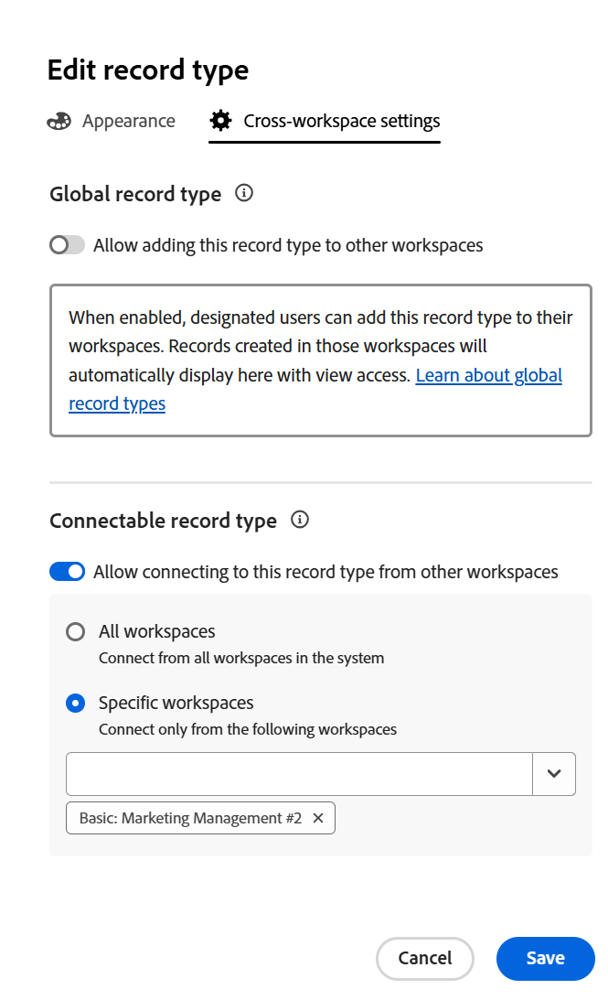
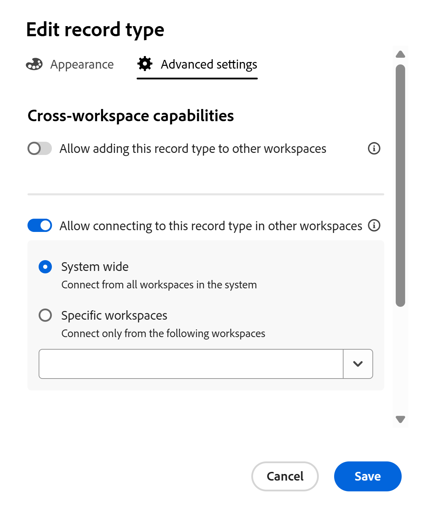

<!--*******************REPLACE THE "ADVANCED SETTINGS" SECTION IN THE "EDIT RECORD TYPES" ARTICLE WITH A LINK TO THIS ARTICLE INSTEAD AND REMOVE THE STEPS FROM THE "EDIT RECORD TYPES" ARTICLE ON HOW TO ALLOW CROSS-WORKSPACE SETTINGS FOR RECORD TYPES*************-->

# Mogelijkheden tussen werkruimten configureren voor recordtypen

<!--this article is linked to the UI in the Advanced settings/ Cross-workspace settings tab - do not delete or change the URL-->

{{planning-important-intro}}

 de informatie die op deze pagina wordt benadrukt verwijst naar functionaliteit nog niet algemeen beschikbaar. Deze optie is alleen beschikbaar in de voorvertoningsomgeving voor alle klanten. Na de maandelijkse versies aan Productie, zijn de zelfde eigenschappen ook beschikbaar in het milieu van de Productie voor klanten die snelle versies toeliet. 

 voor informatie over snelle versies, zie [&#x200B; snelle versies voor uw organisatie &#x200B;](/help/quicksilver/administration-and-setup/set-up-workfront/configure-system-defaults/enable-fast-release-process.md) toelaten of onbruikbaar maken. 

U kunt recordtypes vormen om over veelvoudige werkruimten in de Planning van Adobe Workfront te werken.

U kunt een recordtype aanwijzen als een van de volgende:

* **A globaal verslagtype**: de gebruikers kunnen globale verslagtypes aan andere werkruimten toevoegen zij kunnen leiden.
* **A connectable verslagtype**: de gebruikers kunnen met dit verslagtype van andere werkruimten verbinden.

U moet eerst de mogelijkheden voor de werkruimte van een recordtype definiëren voordat werkruimtemanagers dit kunnen toevoegen aan of verbinden vanuit andere werkruimten.

U definieert de mogelijkheden voor de werkruimte van een recordtype wanneer u een recordtype maakt of bewerkt.

Zie een van de volgende artikelen voor meer informatie:

* [Recordtypen maken](/help/quicksilver/planning/architecture/create-record-types.md)
* [Recordtypen bewerken](/help/quicksilver/planning/architecture/edit-record-types.md)

## Toegangsvereisten

+++ Breid uit om de toegangsvereisten voor de functionaliteit in dit artikel te bekijken.

<table style="table-layout:auto"> 
<col> 
</col> 
<col> 
</col> 
<tbody> 
    <tr> 
<tr> 
</tr>   
<tr> 
   <td role="rowheader">
Adobe Workfront-pakket
</td> 
   <td> 

Verbindbare recordtypen configureren: 

<ul> 
<li>
Alle Workfront-pakketten en alle planningspakketten
</li>
of
<li>Willekeurige workflow en planningpakket voor Prime of Ultimate
</li></ul>

Globale recordtypen configureren:

<ul> 
<li>
Willekeurig Workfront-pakket en een plannings Plus-pakket
</li>
of
<li>
Willekeurige workflow en planningpakket voor Prime of Ultimate
</li></ul>

Neem voor meer informatie over wat er in elk planningspakket voor Workfront staat, contact op met uw Workfront-accountvertegenwoordiger. 

 
   </td> 
  <tr> 
   <td role="rowheader">
Adobe Workfront-licentie
</td> 
   <td>
Standard

   </td> 
  </tr> 
  <tr> 
   <td role="rowheader">
Objectmachtigingen
</td> 
   <td>   
Machtigingen beheren in een werkruimte
  
   
Systeembeheerders hebben machtigingen voor alle werkruimten, inclusief de werkruimten die ze niet hebben gemaakt
  </td> 
  </tr>  
</tbody> 
</table>

Voor meer informatie over de toegangsvereisten van Workfront, zie [&#x200B; vereisten van de Toegang in de documentatie van Workfront &#x200B;](/help/quicksilver/administration-and-setup/add-users/access-levels-and-object-permissions/access-level-requirements-in-documentation.md).

+++   

<!--Old:

<table style="table-layout:auto"> 
<col> 
</col> 
<col> 
</col> 
<tbody> 
    <tr> 
<tr> 

  </tr>   
<tr> 
   <td role="rowheader">
Adobe Workfront package
</td> 
   <td> 
<ul><li>
Any Workfront package
</li>

And

<li>
Any Planning package to create connectable record types
</li>
<li>
A Planning Plus package to create global record types
</li>
</ul>
Or:
<ul><li>
A Workflow Prime or Ultimate package
 </li>
And
<li>
A Planning Prime or Ultimate package
</li></ul>

For more information about what is included in each Workfront Planning package, contact your Workfront account manager. 
 
   </td> 
  <tr> 
   <td role="rowheader">
Adobe Workfront license
</td> 
   <td>
Standard

   </td> 
  </tr> 
  <tr> 
   <td role="rowheader">
Object permissions
</td> 
   <td>   
Manage permissions to a workspace and to the record type</a> 
  
   
System Administrators have permissions to all workspaces, including the ones they did not create
  </td> 
  </tr>  
</tbody> 
</table> -->

## Algemene recordtypen configureren

<!--this is a UI term; don't change the title of this section-->

Als werkruimtemanager, kunt u een verslagtype vormen om een globaal verslagtype te zijn. Een algemeen recordtype kan aan andere werkruimten worden toegevoegd.

Een werkruimtemanager kan een globaal recordtype toevoegen aan een werkruimte die zij beheren. De oorspronkelijke velden van het recordtype worden ook toegevoegd aan de secundaire werkruimte.

Gebruikers kunnen records toevoegen aan een algemeen recordtype vanuit elke werkruimte waarin zij Contribute-machtigingen hebben en waarin het algemene recordtype is toegevoegd, inclusief de oorspronkelijke werkruimte. Zij kunnen verslagen van werkruimten bekijken zij slechts toestemmingen van de Mening hebben aan.

Voor meer informatie, zie [&#x200B; overzicht van de types van het werkruimterecord over de werkruimte &#x200B;](/help/quicksilver/planning/architecture/cross-workspace-record-types-overview.md).

Om een verslagtype als globaal te vormen:

{{step1-to-planning}}

1. Klik de werkruimte waarvan verslagtypes u als globaal wilt vormen.

   De werkruimtepagina wordt geopend en de recordtypen worden weergegeven.
1. Voer een van de volgende handelingen uit:

   * Beweeg over de kaart van een verslagtype en klik **Meer** menu  in de hoger-juiste hoek van de kaart van het verslagtype. <!--add new screen shot without Share for now-->

     

   * Klik een kaart van het verslagtype om de verslagtype pagina te openen, dan klik **Meer** menu  rechts van de naam van het verslagtype.
1. Klik **uitgeven** of **Montages**.

   >[!TIP]
   >
   >Wanneer een recordtype aan een andere werkruimte wordt toegevoegd, wordt het als een algemeen recordtype in die werkruimte weergegeven. In dit geval worden de opties Bewerken en Instellingen grijs weergegeven.

1. (Voorwaardelijk) als u **klikte geef** uit, in **geef verslagtype** doos uit, klik de **montages van de dwars-werkruimte** tabel

   Of, als u **Montages** klikte, klik de **sectie van de montages van de dwars-werkruimte** in het linkerpaneel.
1. Laat **toe toestaan toevoegend dit verslagtype aan andere werkruimten** plaatsen.

   

   >[!TIP]
   >
   >Nadat u een algemeen recordtype aan een andere werkruimte hebt toegevoegd, kan deze instelling niet meer worden uitgeschakeld.

1. In **Uitgezocht die dit verslagtype aan werkruimten kan toevoegen die zij** gebied beheren, voeg entiteiten toe die u wilt toestaan om dit verslagtype aan werkruimten toe te voegen die zij beheren.

   Uw naam wordt automatisch toegevoegd aan het veld.

   U kunt individuele gebruikers, groepen, teams, baanrollen, of bedrijven toevoegen de waarvan gebruikers u wilt toestaan om dit verslagtype aan de werkruimten toe te voegen die zij beheren.

   U kunt dit veld bewerken nadat u het recordtype hebt opgeslagen.

1. (Facultatief) verwijder uw naam uit **Uitgezocht die dit verslagtype aan werkruimten kan toevoegen zij** gebied beheren.

   >[!TIP]
   >
   >U moet minstens één entiteit (gebruiker, team, groep, rol, of bedrijf) aanwijzen om deze het plaatsen kunnen toelaten.

1. (Voorwaardelijk) klik **sparen** in **geef verslagtype** doos uit, of klik de achterpijl links van **Montages** in de paginakop om uw veranderingen te bewaren.

   De volgende dingen doen zich voor:

   * Het recordtype en de bijbehorende velden kunnen nu door de door u opgegeven personen worden toegevoegd aan een andere werkruimte.

   >[!NOTE]
   >
   >U kunt de weergave en de instellingen van het recordtype en de oorspronkelijke velden alleen vanuit de oorspronkelijke werkruimte bewerken.

   * De kaart van het verslagtype toont a **globaal verslagtype** pictogram  om erop te wijzen dat het verslagtype beschikbaar is om aan andere werkruimten worden toegevoegd.
   * Een systeem-geproduceerd **Workspace** gebied wordt toegevoegd aan de lijstmening van het verslagtype en zijn verslagen&#39; details.

     In het Workspace-veld wordt de werkruimte weergegeven van waaruit elke record is gemaakt.

     Dit veld is alleen-lezen en kan niet worden verwijderd.
1. (Optioneel) Ga naar een andere werkruimte en maak een recordtype met een bestaand recordtype. Selecteer het recordtype dat u in de bovenstaande stappen hebt ingeschakeld.

   Voor informatie, zie [&#x200B; bestaande verslagtypes van een andere werkruimte &#x200B;](/help/quicksilver/planning/architecture/add-existing-record-types-from-another-workspace.md) toevoegen.

   Het verslagtype dat van een globaal verslagtype in de secundaire werkruimte wordt toegevoegd toont ook het a **globale verslagtype** pictogram .
1. (Optioneel) Ga terug naar de oorspronkelijke werkruimte waar u het algemene recordtype hebt gemaakt en bewerk het recordtype door de stappen 1-4 hierboven uit te voeren <!--ensure this stays accurate-->
1. (Facultatief) herzie de lijst van werkruimten waar het globale verslag in de **Werkruimten is toegevoegd waar dit verslagtype** sectie wordt gebruikt. De eigenaar van de werkruimte wordt ook weergegeven naast de naam van de werkruimte.

   
1. (Facultatief) klik de naam van één van werkruimten die in de **Werkruimten worden vermeld waar dit verslagtype** sectie wordt gebruikt om die werkruimte te openen.

## Verbindbare recordtypen configureren

<!--this is a UI term; don't change the title of this section-->

U kunt een recordtype configureren waarmee verbinding wordt gemaakt vanuit andere werkruimten wanneer u het recordtype maakt of bewerkt.

Het vormen van een verslagtype om verbindbaar te zijn verschilt afhankelijk van het milieu u voor uw configuratie kiest.

### Configureer verbindingbare recordtypen in de productieomgeving

{{step1-to-planning}}

1. Klik de werkruimte waarvan verslagtypes u als verbindbaar wilt vormen.

   De werkruimtepagina wordt geopend en de recordtypen worden weergegeven.
1. Voer een van de volgende handelingen uit:

   * Beweeg over de kaart van een verslagtype en klik **Meer** menu  in de hoger-juiste hoek van de kaart van het verslagtype

     

   * Klik een kaart van het verslagtype om de verslagtype pagina te openen, dan klik **Meer** menu  rechts van de naam van het verslagtype, dan klik **uitgeven**.

1. Klik de **Geavanceerde montages** tabel.

1. Laat **toe toestaan verbindend met dit verslagtype van andere werkruimten** plaatsen.

   

   Als deze optie is ingeschakeld, wordt het recordtype schakelbaar en is het toegankelijk om te worden verbonden met andere werkruimten.

1. Kies van welke werkruimten het recordtype kan worden betreden. Kies een van de volgende opties:

   <!--check names of the setting: System wide?? OR All workspaces??-->

   * **Systeem wijd**: De gebruikers kunnen met dit verslagtype van alle werkruimten verbinden waar zij beheertoestemmingen hebben.
   * **Specifieke werkruimten**: Van het drop-down menu, voeg de namen van de werkruimten toe waar de werkruimtemanagers met dit verslagtype kunnen verbinden.
1. (Voorwaardelijk) klik **sparen** in **geef verslagtype** doos uit om uw veranderingen te bewaren.

   De volgende dingen doen zich voor:

   * Het recordtype en de bijbehorende velden zijn nu beschikbaar om verbinding te maken met de werkruimten die u hebt toegewezen.
   * De kaart van het verslagtype toont een verbindbaar verslagtype pictogram  om erop te wijzen dat het verslagtype beschikbaar is om aan van om het even welke werkruimte te worden verbonden u in uw configuratie hebt aangewezen.

1. (Optioneel) Ga naar een andere werkruimte en voeg een verbinding toe aan het recordtype dat u in de bovenstaande stappen hebt ingeschakeld voor verbindingsbaarheid tussen werkruimten.

   Voor informatie, zie [&#x200B; verbind verslagtypes &#x200B;](/help/quicksilver/planning/architecture/connect-record-types.md).

### Verbindbare recordtypen configureren in de voorvertoningsomgeving

{{step1-to-planning}}

1. Klik de werkruimte waarvan verslagtypes u als verbindbaar wilt vormen.

   De werkruimtepagina wordt geopend en de recordtypen worden weergegeven.
1. Voer een van de volgende handelingen uit:

   * Beweeg over de kaart van een verslagtype en klik **Meer** menu  in de hoger-juiste hoek van de kaart van het verslagtype

     

   * Klik een kaart van het verslagtype om de verslagtype pagina te openen, dan klik **Meer** menu  rechts van de naam van het verslagtype.
1. Klik **uitgeven** of **Montages**.

1. (Voorwaardelijk) als u **klikte geef** uit, in **geef verslagtype** doos uit, klik de **montages van de dwars-werkruimte** tabel

   Of, als u **Montages** klikte, klik de **sectie van de montages van de dwars-werkruimte** in het linkerpaneel.

1. Laat **toe toestaan verbindend met dit verslagtype in andere werkruimten** plaatsen. <!-- check the setting name, I sent this to Lilit to say FROM instead of IN-->

   <!-- add new screen shot with new tab name-->

   

   Als deze optie is ingeschakeld, is het recordtype toegankelijk en kan het via andere werkruimten worden verbonden.

1. Kies van welke werkruimten het recordtype kan worden betreden. Kies een van de volgende opties:

   <!--check names of the setting: System wide?? OR All workspaces??-->

   * **Alle werkruimten**: De gebruikers kunnen met dit verslagtype van alle werkruimten verbinden waar zij beheertoestemmingen hebben.
   * **Specifieke werkruimten**: Van het drop-down menu, voeg de namen van de werkruimten toe waar de werkruimtemanagers met dit verslagtype kunnen verbinden.
1. (Voorwaardelijk) klik **sparen** in **geef verslagtype** doos uit, of klik de achterpijl links van **Montages** in de paginakop om uw veranderingen te bewaren.

   De volgende dingen doen zich voor:

   * Het recordtype en de bijbehorende velden zijn nu beschikbaar om verbinding te maken met de werkruimten die u hebt toegewezen.
   * De kaart van het verslagtype toont een verbindbaar verslagtype pictogram  om erop te wijzen dat het verslagtype beschikbaar is om aan van om het even welke werkruimte te worden verbonden u in uw configuratie hebt aangewezen.

1. (Optioneel) Ga naar een andere werkruimte en voeg een verbinding toe aan het recordtype dat u in de bovenstaande stappen hebt ingeschakeld voor verbindingsbaarheid tussen werkruimten.

   Voor informatie, zie [&#x200B; verbind verslagtypes &#x200B;](/help/quicksilver/planning/architecture/connect-record-types.md).

