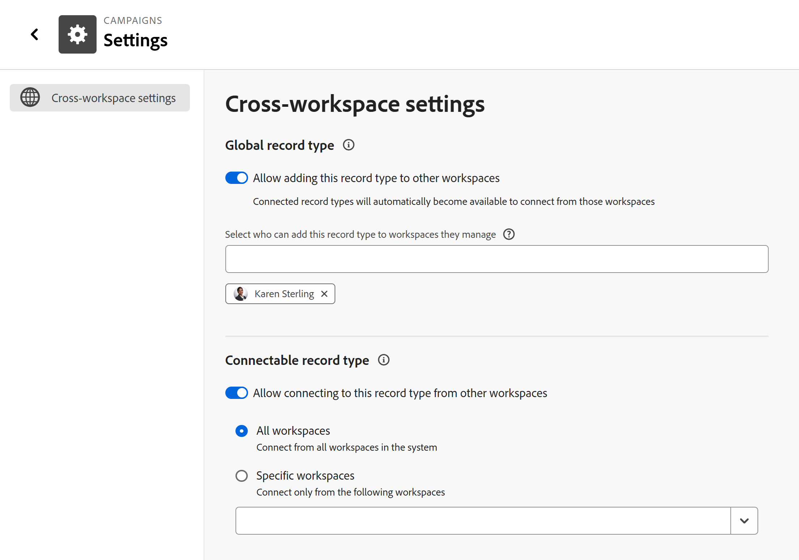

# Het gebied Instellingen van een recordtype configureren

 de informatie op deze pagina verwijst naar functionaliteit nog niet algemeen beschikbaar. Deze optie is alleen beschikbaar in de voorvertoningsomgeving voor alle klanten. Na de maandelijkse versies aan Productie, zijn de zelfde eigenschappen ook beschikbaar in het milieu van de Productie voor klanten die snelle versies toeliet. 

 voor informatie over snelle versies, zie [ snelle versies voor uw organisatie ](/help/quicksilver/administration-and-setup/set-up-workfront/configure-system-defaults/enable-fast-release-process.md) toelaten of onbruikbaar maken. 

{{planning-important-intro}}

U kunt extra montages voor een verslagtype vormen nadat zij in de Planning van Adobe Workfront zijn bewaard.

Afhankelijk van welke mogelijkheden u voor een verslagtype wilt bepalen, kunt u extra montages vormen door één van het volgende te doen:

<!--the above will need to be reworded when we add automations and manage request forms to this area-->

* Ze bewerken

  Voor informatie, zie [ recordtypes ](/help/quicksilver/planning/architecture/edit-record-types.md) uitgeven.

* De pagina Instellingen van een recordtype configureren.

  In dit artikel wordt beschreven hoe u een recordtype kunt bewerken door de bijbehorende pagina Instellingen te configureren.

## Toegangsvereisten

+++ Breid uit om de toegangsvereisten voor de functionaliteit in dit artikel te bekijken. 

<table style="table-layout:auto"> 
<col> 
</col> 
<col> 
</col> 
<tbody> 
    <tr> 
<tr> 
</tr>   
<tr> 
   <td role="rowheader">
Adobe Workfront-pakket
</td> 
   <td> 

Alle Workfront- en planningspakketten

Willekeurig workflowpakket en planningspakket

<b>OPMERKING</b>

Verbindbare recordtypen configureren:

<ul> 
<li>
Alle Workfront- en planningspakketten
</li>
of
<li>
Elk workflowpakket en een planningpakket voor Prime of Ultimate
</li></ul>

Globale recordtypen configureren:

<ul> 
<li>
Willekeurig Workfront-pakket en een plannings Plus-pakket
</li>
of
<li>
Elk workflowpakket en een planningpakket voor Prime of Ultimate
</li></ul>

Neem voor meer informatie over wat er in elk planningspakket voor Workfront staat, contact op met uw Workfront-accountvertegenwoordiger. 
 

   </td> </tr>
  <tr> 
   <td role="rowheader">
Adobe Workfront-licentie
</td> 
   <td>
Standard

   </td> 
  </tr> 
  <tr> 
   <td role="rowheader">
Objectmachtigingen
</td> 
   <td>   
Machtigingen beheren in een werkruimte
  
   
Systeembeheerders hebben machtigingen voor alle werkruimten, inclusief de werkruimten die ze niet hebben gemaakt
  </td> 
  </tr>  
</tbody> 
</table>

Voor meer informatie over de toegangsvereisten van Workfront, zie [ vereisten van de Toegang in de documentatie van Workfront ](/help/quicksilver/administration-and-setup/add-users/access-levels-and-object-permissions/access-level-requirements-in-documentation.md).

+++    

<!--Old:

<table style="table-layout:auto"> 
<col> 
</col> 
<col> 
</col> 
<tbody> 
    <tr> 
<tr> 
<td> 
   
 Products
 </td> 
   <td> 
   <ul><li>
 Adobe Workfront
</li> 
   <li>
 Adobe Workfront Planning
</li></ul></td> 
  </tr>   
<tr> 
   <td role="rowheader">
Adobe Workfront plan*
</td> 
   <td> 

Any of the following Workfront plans:
 
<ul><li>Select</li> 
<li>Prime</li> 
<li>Ultimate</li></ul> 

Workfront Planning is not available for legacy Workfront plans
 
   </td> 
<tr> 
   <td role="rowheader">
Adobe Workfront Planning package*
</td> 
   <td> 

Any 
 

For more information about what is included in each Workfront Planning plan, contact your Workfront account manager. 
 
   </td> 
 <tr> 
   <td role="rowheader">
Adobe Workfront platform
</td> 
   <td> 

Your organization's instance of Workfront must be onboarded to the Adobe Unified Experience to be able to access Workfront Planning.
 

For more information, see <a href="/help/quicksilver/workfront-basics/navigate-workfront/workfront-navigation/adobe-unified-experience.md">Adobe Unified Experience for Workfront</a>. 
 
   </td> 
   </tr> 
  </tr> 
  <tr> 
   <td role="rowheader">
Adobe Workfront license*
</td> 
   <td>
 Standard 

   
Workfront Planning is not available for legacy Workfront licenses
 
  </td> 
  </tr> 
  <tr> 
   <td role="rowheader">
Access level configuration
</td> 
   <td> 
There are no access level controls for Adobe Workfront Planning
   
</td> 
  </tr> 
<tr> 
   <td role="rowheader">
Object permissions
</td> 
   <td>   
Manage permissions to a workspace and record type 
  
   
System Administrators have permissions to all workspaces, including the ones they did not create

   
Only system administrators can enable record types to connect from other workspaces
 </td> 
  </tr> 

</tbody> 
</table> 

-->

## Recordtype-informatie configureren op de pagina Instellingen

U kunt de mogelijkheden voor werkruimten voor een recordtype definiëren door de gegevens op de pagina Instellingen te configureren.

<!--the intro above will change when we can configure more in this area -->

{{step1-to-planning}}

1. Klik op de werkruimte waarvan u de recordtypen wilt bewerken.

   De werkruimtepagina wordt geopend en de recordtypen worden weergegeven.
1. Voer een van de volgende handelingen uit:

   * Beweeg over de kaart van een verslagtype en klik **Meer** menu  in de hoger-juiste hoek van de kaart van het verslagtype, dan klik **Montages**

     

     of

   * Klik een kaart van het verslagtype om de verslagtype pagina te openen, klik **Meer** menu  rechts van de naam van het verslagtype, dan klik **Montages**.

   <!--update screen shot at prod??-->

   

1. De **sectie van de montages van de dwars-werkruimte** wordt geselecteerd door gebrek.
1. Schakel een van de volgende instellingen in of uit:

   * **staat het toevoegen van dit verslagtype aan andere werkruimten** toe om erop te wijzen dat dit een globaal verslagtype is
   * **staat het verbinden met dit verslagtype in andere werkruimten** toe om erop te wijzen dat dit een connectable verslagtype is.

   De instellingen zijn standaard uitgeschakeld.

   Voor meer informatie, zie [ dwars-werkruimtemogelijkheden voor verslagtypes ](/help/quicksilver/planning/architecture/configure-record-type-cross-workspace-capabilities.md) vormen