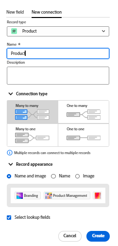

<!--update metadata at GA-->
<!--add mini TOC when live, already added to big TOC to get the link-->

# Overzicht van Connect-recordtypen

<!--REMOVE THE CONTENT BELOW FROM THE "CONNECT RECORD TYPES" ARTICLE WHEN YOU TURN THIS ARTICLE LIVE- THIS IS THE SAME CONTENT AS THERE, DUPLICATED-->

U kunt aangeven dat afzonderlijke recordtypen op elkaar betrekking hebben of op objecten van andere toepassingen door deze met elkaar te verbinden.

Dit artikel is een overzicht van recordtypeverbindingen en beschrijft de types van verbindingen u tussen verslag en objecten types kunt vestigen.

Voor informatie over u verbindt verslagtypes, zie [ verbind verslagtypes ](/help/quicksilver/planning/architecture/connect-record-types.md).

## Overwegingen bij het verbinden van recordtypen

* U kunt de volgende entiteiten verbinden in de Planning van Adobe Workfront:

   * Twee recordtypen.

     Standaard kunt u twee recordtypen verbinden vanuit dezelfde werkruimte. U kunt ook recordtypen instellen om verbinding te maken met recordtypen van andere werkruimten.
   * Een recordtype en een objecttype uit een andere toepassing.

* U kunt Workfront Planning-recordtypen verbinden met de volgende objecttypen vanuit de volgende toepassingen:

   * Adobe Workfront:

      * Projecten
      * Portfolio&#39;s
      * Programma&#39;s
      * Bedrijven
      * Groepen

   * Adobe Experience Manager Assets:

      * Afbeeldingen
      * Mappen

     >[!IMPORTANT]
     >
     >U moet een Adobe Experience Manager Assets-licentie hebben en het Workfront-exemplaar van uw organisatie moet zijn aangemeld bij het Adobe Business Platform of de Adobe Admin Console om Workfront Planning-records te verbinden met Adobe Experience Manager Assets.
     >
     >Als u vragen over het aan boord gaan aan Adobe Admin Console hebt, zie [ Adobe Verenigde Veelgestelde vragen van de Ervaring ](/help/quicksilver/workfront-basics/navigate-workfront/workfront-navigation/unified-experience-faq.md).

* Nadat u afzonderlijke records voor een recordtype hebt gemaakt, kunt u de records waarmee u verbinding maakt, selecteren in het veld voor het gekoppelde recordtype. Voor informatie, zie [ verbindt verslagen ](/help/quicksilver/planning/records/connect-records.md).

* Nadat u een recordtype met een ander verslagtype of met een objecten type van een andere toepassing verbindt, bestaan de volgende scenario&#39;s:

   * **wanneer u twee verslagtypes** verbindt: Een verbonden verslaggebied wordt gecreeerd op het verslagtype u van verbindt. Er wordt een vergelijkbaar gekoppeld recordveld gemaakt voor het recordtype waarmee u verbinding maakt.

     Als u bijvoorbeeld het recordtype ‘Campagne’ verbindt met het recordtype ‘Product’, wordt een gekoppeld recordveld met de naam ‘Gekoppeld product’ gemaakt in het recordtype ‘Campagne’. Er wordt automatisch een gekoppeld recordtype met de naam &quot;Campagne&quot; gemaakt in het recordtype product.

   * **wanneer u een verslagtype met een objecten type van een andere toepassing** verbindt:

      * Er wordt een gekoppeld recordveld gemaakt op het recordtype waarmee u verbinding maakt. Er wordt automatisch geen gekoppeld recordveld gemaakt op het objecttype van de andere toepassing.

      * Planningsrecordvelden zijn niet toegankelijk vanuit Workfront-objecten.
      * De gebieden van het verslag van de planning zijn toegankelijk van de activa van de Experience Manager wanneer uw beheerder van Workfront de meta-gegevensafbeelding door de integratie tussen Workfront en Adobe Experience Manager Assets vormt. Voor meer informatie, zie [ activa meta-gegevensafbeelding tussen Adobe Workfront en Experience Manager Assets ](https://experienceleague.adobe.com/docs/experience-manager-cloud-service/content/assets/integrations/configure-asset-metadata-mapping.html?lang=en) vormen.

   * **wanneer u verbonden (of raadpleging) gebieden van het verslag of het voorwerp toevoegt u met** verbindt: Naast het creëren van een verbonden verslaggebied, kunt u met gebieden van het verbonden verslag of objecten type ook verbinden dat raadplegingsgebieden wordt genoemd. Een gekoppeld veld (of opzoekveld) met informatie uit de record waarmee u verbinding maakt, wordt weergegeven in de record waaruit u verbinding maakt.

     U kunt velden van andere recordtypen of objecten van een andere toepassing verbinden met het recordtype Workfront Planning.

     Gekoppelde velden zijn alleen-lezen en geven automatisch informatie van verbonden records of objecten weer wanneer u de records of de objecten verbindt.

     U kunt verwijzen naar opzoekvelden van andere record- of objecttypen in formules, filters of groepen.

     Als u bijvoorbeeld het recordtype ‘Campagne’ verbindt met een Workfront-project en u selecteert om het veld Geplande afsluitdatum van het project over te brengen naar de planningsrecord van Workfront, wordt automatisch een gekoppeld veld genaamd Geplande voltooiingsdatum (van project) gemaakt voor de campagne. U kunt dit gekoppelde veld niet handmatig bewerken. In het veld Geplande afsluitdatum (van project) wordt de geplande uitvoeringsdatum van de gekoppelde projecten weergegeven.

     >[!IMPORTANT]
     >
     >Iedereen met Weergave of hogere machtigingen voor de werkruimte kan de informatie in de opzoekvelden weergeven, ongeacht de machtigingen of het toegangsniveau in de toepassing van de gekoppelde objecttypen <!--or their permissions in other workspaces--> .

<!--see the commented out text above for the release of cross-workspace connections-->

* Gekoppelde recordvelden worden voorafgegaan door een relatiepictogram  .

  Gekoppelde velden worden voorafgegaan door een pictogram dat het veldtype aangeeft. Gekoppelde velden (of opzoekvelden) worden bijvoorbeeld voorafgegaan door pictogrammen die aangeven dat een veld een getal, alinea of datum is.

## Verbindingstypen

Nadat u een verbinding hebt gemaakt tussen twee recordtypen of tussen een record en een objecttype vanuit een andere toepassing, kunt u records toevoegen in de verbonden recordvelden.

Afhankelijk van het aantal records dat u aan een verbonden recordveld kunt toevoegen, zijn de volgende verbindingstypen waaruit u kunt kiezen bij het verbinden van recordtypen:

* [Eén naar vele](#one-to-many-connection-type)
* [Eén op één](#many-to-one-connection-type)
* [Vele tot één](#many-to-one-connection-type)
* [Veel tot veel](#many-to-many-connection-type)

>[!WARNING]
>
>Deze opties zijn niet beschikbaar wanneer u een verbinding tot stand brengt met:
>* Twee records uit verschillende werkruimten
>
>* Een recordtype en AEM elementen

<!-- add screen shots for each type of connection below-->

### Een-op-veel verbindingstype

Wanneer u het één-op-veel verbindingstype tussen verslagtypes selecteert, kunt u één verslag met veelvoudige verslagen later verbinden u met verbindt.

Bijvoorbeeld, als u campagnes met projecten verbindt, kunt u één campagne met veelvoudige projecten verbinden. Maar één project kan slechts met één campagne worden verbonden.

Wanneer u dit verbindingstype selecteert, kunt u het later alleen wijzigen in een veel-op-veel-verbindingstype.

### Een-op-een verbindingstype

Wanneer u het één-op-één verbindingstype tussen verslagtypes selecteert, kunt u één verslag met één andere verslag later verbinden dat u met verbindt.

Bijvoorbeeld, als u campagnes met projecten verbindt, kunt u één campagne met één project verbinden. Eén project kan slechts op één campagne worden aangesloten.

Wanneer u dit verbindingstype selecteert, kunt u het later wijzigen in een ander verbindingstype.

### Vele-aan-één verbindingstype

Wanneer u het vele-aan-één verbindingstype tussen verslagtypes selecteert, kunt u vele verslagen met slechts één verslag later verbinden u met verbindt.

Bijvoorbeeld, als u campagnes met projecten verbindt, kunt u veelvoudige campagnes met één project verbinden. Eén project kan met meerdere campagnes worden verbonden.

Wanneer u dit verbindingstype selecteert, kunt u het later alleen wijzigen in een veel-op-veel-verbindingstype.

### Vele-aan-vele verbindingstype

Wanneer u het veel-aan-vele verbindingstype tussen verslagtypes selecteert, kunt u vele verslagen met veelvoudige verslagen later verbinden u met verbindt.

Bijvoorbeeld, als u campagnes met projecten verbindt, kunt u verscheidene campagnes met veelvoudige projecten verbinden. U kunt veelvoudige projecten aan veelvoudige campagnes ook verbinden.

Wanneer u dit verbindingstype selecteert, kunt u het verbindingstype niet wijzigen nadat u het hebt opgeslagen.

