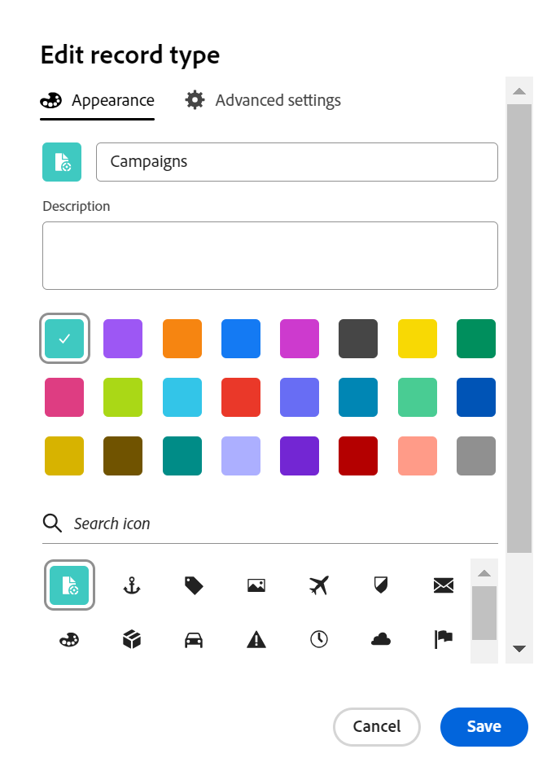

<!--update the metadata with real information when making this available in TOC and in the left nav
---
title: Edit record types
description: You can edit record types after they have been saved. Record types are the object types of Adobe Workfront Planning.
author: Alina
role: User
feature: Work Management 
topic: Architecture
hidefromtoc: yes
hide: yes
---

-->

# Recordtypen bewerken

{{planning-important-intro}}

Recordtypen zijn de objecttypen voor Adobe Workfront Planning. U kunt de weergave van recordtypen bewerken die u of iemand anders heeft gemaakt. Voor informatie over het creëren van het verslagtypes van de Planning van Workfront, zie [ recordtypes ](/help/quicksilver/planning/architecture/create-record-types.md) creëren.

## Toegangsvereisten

+++ Breid uit om toegangsvereisten voor de Planning van Workfront te bekijken.

<!--update the table to say that: Only system administrators can enable record types to connect from other workspaces.-->

<table style="table-layout:auto">
 <col>
 </col>
 <col>
 </col>
 <tbody>
    <tr>
<tr>
<td>
   
 Product
 </td>
   <td>
   
 Adobe Workfront
 
Als u Adobe Workfront Planning-recordtypen wilt verbinden met Experience Manager Assets, hebt u een Adobe Experience Manager Assets-licentie nodig en moet het Workfront-exemplaar van uw organisatie zijn aangemeld bij het Adobe Business Platform of de Adobe Admin Console.
 </td>
  </tr>  
 <td role="rowheader">
Adobe Workfront-overeenkomst
</td>
   <td>

Uw organisatie moet zijn ingeschreven in de vroege toegangsfase voor Workfront Planning 

   </td>
  </tr>
  <tr>
   <td role="rowheader">
Adobe Workfront-plan
</td>
   <td>

Alle

   </td>
  </tr>
  <tr>
   <td role="rowheader">
Adobe Workfront-licentie*
</td>
   <td>
   
Nieuw: Standaard

   
Huidig: Plan
 
  </td>
  </tr>

<tr>
   <td role="rowheader">
Configuraties op toegangsniveau
</td>
   <td> 
Er zijn geen toegangsniveaucontroles voor de Planning van Workfront
  
</td>
  </tr>

<tr>
   <td role="rowheader">
Machtigingen
</td>
   <td> 
Rechten beheren in een werkruimte </a> 
  
   
Systeembeheerders hebben machtigingen voor alle werkruimten, inclusief de werkruimten die ze niet hebben gemaakt
</td>
  </tr>
<tr>
   <td role="rowheader">
Lay-outsjabloon
</td>
   <td> 
Uw Workfront of groepsbeheerder moet het planningsgebied toevoegen aan uw lay-outsjabloon. Voor informatie, zie <a href="/help/quicksilver/planning/access/access-overview.md"> overzicht van de Toegang </a>. 
  
</td>
  </tr>

</tbody>
</table>

*For informatie, zie [ vereisten van de Toegang in de documentatie van Workfront ](/help/quicksilver/administration-and-setup/add-users/access-levels-and-object-permissions/access-level-requirements-in-documentation.md).

+++

<!--Maybe enable this at GA - but Planning is not supposed to have Access controls in the Workfront Access Level: 
>[!NOTE]
>
>If you don't have access, ask your Workfront administrator if they set additional restrictions in your access level. For information on how a Workfront administrator can change your access level, see [Create or modify custom access levels](/help/quicksilver/administration-and-setup/add-users/configure-and-grant-access/create-modify-access-levels.md). -->

## Recordtypen bewerken

{{step1-to-planning}}

1. Klik op de werkruimte waarvan u de recordtypen wilt bewerken.

   De werkruimtepagina wordt geopend en de recordtypen worden weergegeven.
1. Voer een van de volgende handelingen uit:

   * Beweeg over de kaart van een verslagtype en klik **Meer** menu  in de hoger-juiste hoek van de kaart van het verslagtype, dan klik **uitgeven**
of
   * Klik een kaart van het verslagtype om de verslagtype pagina te openen, klik **Meer** menu  rechts van de naam van het verslagtype, dan klik **uitgeven**.

   

   <!--replace everything below with the commented out text below-->

1. In **geef verslagtype** doos uit, werk de volgende informatie bij:

   * Bewerk indien nodig de naam van het recordtype. <!--did they add a field label for this? -->
   * **Beschrijving**: geef of voeg een beschrijving voor het verslagtype met meer informatie over het uit.
   * Bewerk de kleur en vorm van het pictogram dat aan het recordtype is gekoppeld. Ga als volgt te werk:
      * Selecteer een kleur om het recordtype te identificeren. Dit is de kleur van het pictogram voor recordtype. Grijs is standaard geselecteerd.
      * Selecteer een pictogram in de lijst of typ de naam van een pictogram om te beschrijven wat het vertegenwoordigt en selecteer het pictogram wanneer het wordt weergegeven. Dit is het pictogram van het recordtype. Een bestandspictogram is standaard geselecteerd.

     

1. Klik **sparen**.
1. (Optioneel) Klik op de kaart met het recordtype in de werkruimte om de pagina met het recordtype te openen.
1. Klik het **Meer** menu rechts van de naam van het verslagtype, dan klik **uitgeven** om informatie over het verslagtype bij te werken.

   >[!TIP]
   >
   >   U kunt de naam van het recordtype in de koptekst wijzigen.

   

   <!--check this screen shot - not sure this is valid ???-->

1. (Optioneel) Als u een ander recordtype wilt bewerken, vouwt u de pijl omlaag naar rechts van de naam van een recordtype uit, zoekt u een recordtype en selecteert u deze pijl wanneer deze in de lijst wordt weergegeven.

<!--*******************For GA - replace the above with this:

1. In the **Edit record type** box, click the **Appearance** tab and update the following information: (*******copy the screen shot above here and update it with the Appearance tab**********)

    * Edit the record type name, if needed. (*****did they add a field label for this?******)
    * **Description**: Edit or add a description for the record type with more information about it. 
    * Edit the color and shape of the icon associated with the record type. Do the following: 
        * Select a color to identify the record type. This is the color of the record type icon. Gray is selected by default.
        * Select an icon from the list, or start typing the name of an icon to describe what it represents, then select it when it displays. This is the icon of the record type. A file icon is selected by default.

        

1. (Conditional) If you are a system administrator, click the **Advanced settings** tab in the **Edit record type** box and update the following information: 

   * **Connect from other workspaces**: Select this toggle to allow users to connect to this record type from other workspaces. This is deselected by default.
   * **System wide**: Select this option to allow users to connect to this record from all workspaces in the system.
   * **Specific workspaces**: Select this option to restrict the workspaces from which users can connect to this record type, then expand the drop down menu and select the workspaces you want users to connect to this record type from. You can start typing the name of a workspace, and select it when it displays in the list. 

   

   The record type card displays a connectivity icon  in the upper-right corner to indicate that the record is now accessible from other workspaces. 

1. Click **Save**.
1. (Optional) Click the record type card from the workspace area to open the record type's page, then rename the record type in the header.  

1. (Optional) To edit another record type, from the record type page, expand the downward-pointing arrow to the right of a record type name, search for a record type, then select it when it displays in the list.

   

   -->