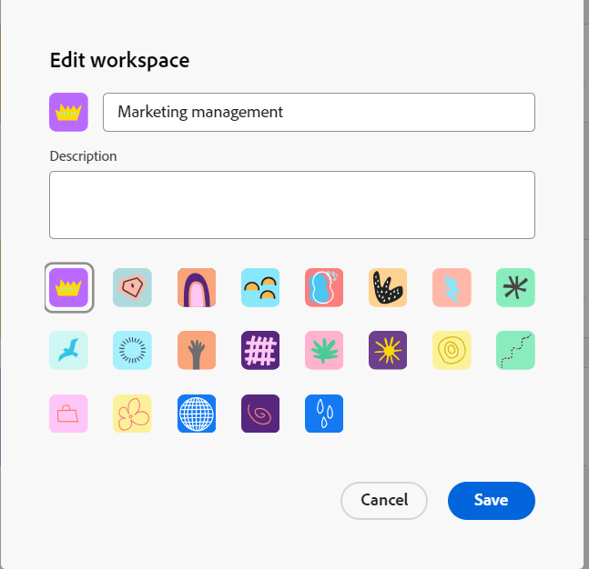

# Werkruimten bewerken

{{planning-important-intro}}

In de Planning van Adobe Workfront, zijn de werkruimten gecentraliseerde plaatsen voor teams om het werk te plannen.

Een werkruimte is een inzameling van verslagtypes die door een team worden gebruikt en vertegenwoordigt de het werklevenscyclus van het team. U kunt werkruimten volledig aanpassen in Adobe Workfront Planning.

Voor informatie over het creëren van werkruimten, zie [ werkruimten ](/help/quicksilver/planning/architecture/create-workspaces.md) creëren.

Alle wijzigingen die u aanbrengt in een werkruimte, zijn zichtbaar voor iedereen die beschikt over minstens weergavemachtigingen voor de werkruimte.

## Toegangsvereisten

+++ Breid uit om toegangsvereisten voor de Planning van Workfront te bekijken.

U moet het volgende hebben om tot de Planning van Workfront toegang te hebben:

<table style="table-layout:auto"> 
<col> 
</col> 
<col> 
</col> 
<tbody> 
    <tr> 
<tr> 
<td> 
   
 Producten
 </td> 
   <td> 
   <ul><li>
 Adobe Workfront
</li> 
   <li>
 Adobe Workfront Planning
</li></ul></td> 
  </tr>   
<tr> 
   <td role="rowheader">
Adobe Workfront-abonnement*
</td> 
   <td> 

Een van de volgende Workfront-plannen:
 
<ul><li>Selecteren</li> 
<li>Eerste</li> 
<li>Ultieme</li></ul> 

Workfront Planning is niet beschikbaar voor oudere Workfront-plannen
 
   </td> 
<tr> 
   <td role="rowheader">
Planning van Adobe Workfront*
</td> 
   <td> 

Alle 
 

Voor meer informatie over wat in elk Plan van de Planning van Workfront inbegrepen is, zie <a href="https://business.adobe.com/products/workfront/pricing.html"> Adobe Workfront tarifering en verpakking </a>. 
 
   </td> 
 <tr> 
   <td role="rowheader">
Adobe Workfront-platform
</td> 
   <td> 

Het geval van Workfront van uw organisatie moet aan de Adobe Verenigde Ervaring worden genegeerd om tot alle mogelijkheden van de Planning van Workfront te kunnen toegang hebben.
 

Voor meer informatie, zie <a href="/help/quicksilver/workfront-basics/navigate-workfront/workfront-navigation/adobe-unified-experience.md"> Adobe Verenigde Ervaring voor Workfront </a>. 
 
   </td> 
   </tr> 
  </tr> 
  <tr> 
   <td role="rowheader">
Adobe Workfront-licentie*
</td> 
   <td>
 Standaard

   
Workfront Planning is niet beschikbaar voor oudere Workfront-licenties
 
  </td> 
  </tr> 
  <tr> 
   <td role="rowheader">
Configuratie op toegangsniveau
</td> 
   <td> 
Er zijn geen toegangsniveaucontroles voor de Planning van Adobe Workfront
   
</td> 
  </tr> 
<tr> 
   <td role="rowheader">
Objectmachtigingen
</td> 
   <td>  
Rechten voor de werkruimte beheren 
   </td> 
  </tr> 
<tr> 
   <td role="rowheader">
Lay-outsjabloon
</td> 
   <td> 
Aan alle gebruikers, inclusief Workfront-beheerders, moet een lay-outsjabloon worden toegewezen die het planningsgebied in het hoofdmenu bevat. 
 </td> 
  </tr> 
</tbody> 
</table>

*Voor meer informatie over de toegangsvereisten van Workfront, zie [ vereisten van de Toegang in de documentatie van Workfront ](/help/quicksilver/administration-and-setup/add-users/access-levels-and-object-permissions/access-level-requirements-in-documentation.md).

+++

<!--OLD

<table style="table-layout:auto">
 <col>
 </col>
 <col>
 </col>
 <tbody>
    <tr>
<tr>
<td>
   
 Product
 </td>
   <td>
   
 Adobe Workfront
 </td>
  </tr>  
 <td role="rowheader">
Adobe Workfront agreement
</td>
   <td>

Your organization must be enrolled in the early access stage for Workfront Planning 

   </td>
  </tr>
  <tr>
   <td role="rowheader">
Adobe Workfront plan
</td>
   <td>

Any

   </td>
  </tr>
  <tr>
   <td role="rowheader">
Adobe Workfront license*
</td>
   <td>
   
New: Standard

   
Current: Plan
 
  </td>
  </tr>
  
  <tr>
   <td role="rowheader">
Access level configuration
</td>
   <td> 
There are no access level controls for Workfront Planning

</td>
  </tr>

<tr>
   <td role="rowheader">
Permissions
</td>
   <td> 
Manage permissions to the workspace 
  
</td>
  </tr>

<tr>
   <td role="rowheader">
Layout template
</td>
   <td> 
You must add the Planning area to your layout template. For information, see <a href="/help/quicksilver/planning/access/access-overview.md">Access overview</a>. 
  
</td>
  </tr>

 </tbody>
</table>

For more information about access requirements, see [Access requirements in Workfront documentation](/help/quicksilver/administration-and-setup/add-users/access-levels-and-object-permissions/access-level-requirements-in-documentation.md). 

-->

## Een werkruimte bewerken

{{step1-to-planning}}

1. (Voorwaardelijk) als u een beheerder van Workfront bent, klik **Werkruimten ik** aan toegang werkruimten u creeerde, of **Andere werkruimten** om tot werkruimten toegang te hebben anderen die met u worden gedeeld.

<!--***********Replace the steps from the next below till the "Update the following information in the Edit workspace box:" (but keep this last step)*******-->

1. (Facultatief) klik **tonen allen** om extra werkruimten te tonen. **toon alle** verbindingsvertoningen slechts wanneer u meer dan twee rijen werkruimtekaarten hebt.
1. (Facultatief) ClicK **toon minder** om het aantal werkruimten te beperken die op het scherm tonen.
1. Voer een van de volgende handelingen uit om een werkruimte te bewerken:

   * Beweeg over de werkruimtekaart, dan klik **Meer** menu  in de hoger-juiste hoek van de kaart
of
   * Klik een werkruimtekaart om de werkruimte te openen, dan klik **Meer** menu  rechts van de werkruimtenaam.
1. Klik **uitgeven**.

   De **geeft werkruimte** vakvertoningen uit.

   

1. Werk de volgende informatie in **uit geeft werkruimte** doos:

   * Voeg een naam voor de werkruimte toe. <!--did they add a label for this field?-->
   * **Beschrijving**: Voeg informatie over de werkruimte toe.
   * Selecteer een pictogram dat u aan de werkruimte wilt koppelen.

1. Klik **sparen** om het Edit werkruimtevakje te sluiten en uw veranderingen toe te passen.

1. (Optioneel) Voer een van de volgende handelingen uit om een nieuwe werkruimtesectie toe te voegen:

   * Klik **toevoegen sectie** bij de bodem van de werkruimte.
   * Beweeg over de naam van een sectie en klik **Meer** menu , dan klik **toevoegen sectie hierboven** of **voeg hieronder sectie toe**.

1. (Optioneel) Voer een van de volgende handelingen uit om de locatie van een sectie te wijzigen:

   * Beweeg over de naam van een sectie en klik **greep** pictogram , dan belemmering en laat vallen het in de juiste vlek.
   * Beweeg over de naam van een sectie en klik **Meer** menu , dan klik **Beweging omhoog** of **Beweging neer**. De sectie wordt omhoog of omlaag verplaatst binnen de werkruimte.

1. (Optioneel) Ga als volgt te werk om een sectie van een werkruimte te verwijderen:

   1. Beweeg over de naam van een sectie, dan klik **Meer** menu , dan klik **Schrapping**. <!--add screen shot when UI is final?-->
   1. Selecteer een nieuwe sectie om alle verslagtypes aan het te bewegen, dan **Schrapping** te klikken. <!--check the button name; logged a bug to change it to "Delete" from "Delete section".-->

      Alle recordtypen worden naar de selectiesectie verplaatst en de sectie wordt verwijderd.

1. (Facultatief) klik **recordtype** toevoegen om verslagtypes aan de werkruimte toe te voegen.

   Voor informatie, zie [ recordtypes ](/help/quicksilver/planning/architecture/create-record-types.md) creëren.

1. (Facultatief) Beweeg over een kaart van het verslagtype, klik **Meer** menu  in de hoger-juiste hoek, dan klik **geef** uit om de verschijning van een verslagtype te wijzigen.

   Voor informatie, zie [ recordtypes ](/help/quicksilver/planning/architecture/edit-record-types.md) uitgeven.

1. (Facultatief) Beweeg over een kaart van het verslagtype, klik **Meer** menu  in de hoger-juiste hoek, dan klik **Schrapping** om een verslagtype te schrappen.

   Voor informatie, zie [ verslagtypes van Schrapping ](/help/quicksilver/planning/architecture/delete-record-types.md).

1. (Optioneel) Klik op een opnametype om het te slepen en neer te zetten op een nieuwe locatie. U kunt recordtypen van de ene werkruimtesectie naar de andere slepen.

   

1. (Facultatief) klik **Aandeel** in de hoger-juiste hoek van de werkruimte om de werkruimte met anderen te delen.

   Voor informatie, zie [ de werkruimten van het Aandeel ](/help/quicksilver/planning/access/share-workspaces.md).
