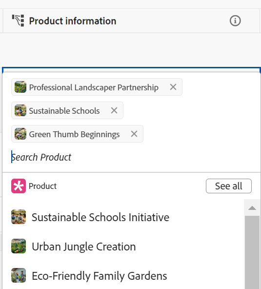

# Voorbeeld van het verbinden van recordtypen en records

{{planning-important-intro}}

In dit artikel wordt een voorbeeld van het volgende beschreven:

* Hoe te om een verbinding tussen twee het verslagtypes van de Planning van Workfront en twee verslagen tot stand te brengen.

* Hoe te om een verbinding tussen een het verslagtype van de Planning van Workfront en een het projectobjecten van Workfront, evenals een verbinding tussen een verslag en een project tot stand te brengen.

Zie ook de volgende artikelen voor meer informatie:

* [Verbind recordtypen](/help/quicksilver/planning/architecture/connect-record-types.md)
* [Connect-records](/help/quicksilver/planning/records/connect-records.md)

## Twee Workfront-recordtypen en -records verbinden (voorbeeld)

U hebt bijvoorbeeld een recordtype met de naam Campaign als oorspronkelijk recordtype.

U hebt ook een ander recordtype, Product genaamd, dat een valutaveld heeft, Budget.

U wilt een gebied op het verslagtype van Campagne tot stand brengen waar u de waarden van het gebied van de Begroting van het verslagtype Product kunt tonen.

Dit doet u als volgt:

1. Open de tabelweergave voor het recordtype Campagne in een werkruimte.
1. Klik het **+** pictogram in de hoger-juiste hoek van de lijstmening om een nieuw gebied toe te voegen, dan **Nieuwe verbinding** te klikken, dan **Product** in de geselecteerde werkruimtesectie te klikken.
1. Voeg bijvoorbeeld de volgende informatie toe:

   * **Type van Verslag**: Product <!--did they change the casing here?-->
   * **Naam**: Geef het nieuwe gebied een naam. Bijvoorbeeld &quot;Productinformatie.&quot; Dit is de naam van het gekoppelde recordveld.
   * **Beschrijving**: Voeg een beschrijving voor het nieuwe gebied toe. Bijvoorbeeld, &quot;Dit zijn de Producten die ik mijn campagnes verbonden aan wil.&quot; De beschrijving van het veld wordt weergegeven wanneer u de muisaanwijzer op het veld in de kolomkop plaatst.
   * **staat veelvoudige verslagen** toe: Als u deze geselecteerde optie verlaat, staat dit gebruikers toe om veelvoudige verslagen te selecteren wanneer het verbonden verslagtype gebied (de informatie van het Product) op de originele verslagen (Campagnes) toont. In ons geval kunnen gebruikers meerdere producten selecteren voor verbinding met één campagne.
   * **Uitgezochte raadplegingsgebieden**: Als u deze geselecteerde optie verlaat, **voegt raadplegingsgebieden** volgende doos toe, om u toe te staan om de gebieden van het Product met het verslagtype van de Campagne te verbinden. U kunt **Skip** klikken om deze stap over te slaan en de gebieden van het Product later toe te voegen.

   

1. (Facultatief) schrap de **knevel van de Titel** in de **verschijning van het Verslag** sectie om slechts het duimnagelbeeld van het verslag op de verbonden gebieden te tonen. Als deze optie is ingeschakeld, worden in de records zowel de miniatuur als de titel weergegeven. De schakeloptie is standaard ingeschakeld.
1. (Voorwaardelijk) als u de **Uitgezochte raadplegingsgebieden optie** in de vorige stap selecteerde, van de lijst van gebieden verbonden aan het **het verslagtype van het Product**, klik het **+** pictogram voor het **7} gebied van de Begroting {, dan klik** voegt gebieden **toe.** Dit leidt tot een gebied genoemd **Begroting (van de informatie van het Product)**, die de naam van het verbonden gebied is. Alle informatie voor het productbudget wordt in dit veld weergegeven voor de campagnebestanden.

   

   >[!TIP]
   >
   >    Als u de Begroting van alle geselecteerde producten als één totaal aantal wilt bekijken, uitgezochte **SUM** in het drop-down menu rechts van de gebiedsnaam. Wanneer de gebruikers veelvoudige producten op de **verbonden verslaggebied van de informatie van het Product** selecteren, voegt het **Begroting (van de informatie van het Product)** gebied al hun waarden van de Begroting samen toe en toont het totaal. <!-- check the shot below - added a bug with a couple of UI changes here-->
   >
   > Als u **niets** selecteert, in plaats van **SUM**, tonen de individuele begrotingen van de geselecteerde producten gescheiden door komma&#39;s.

   Hiermee worden de volgende velden gegenereerd:

   * In de de lijstmening van het verslag van de Campagne en in de verslagpagina van de Campagne van een campagne:

      * **informatie van het Product** (het verbonden verslaggebied): Dit toont de naam of de namen van de Producten wanneer u hen toevoegt.
      * **Begroting (van de Informatie van het Product)** (het verbonden gebied): Dit zal de Begrotingen van de Producten tonen die op het gebied van de Informatie van het Product worden geselecteerd.

   * In de tabelweergave met productrecord en op de pagina met productrecords van een product:

      * **Campagne**: Dit wijst erop dat het het verslagtype van het Product van het verslagtype van de Campagne wordt verbonden.

     

   >[!TIP]
   >
   >    Gekoppelde recordvelden worden voorafgegaan door het relatiepictogram  .

1. Van de **1} het verslagtype van de Campagne {lijstmening, creeer een campagne door een nieuwe rij in de lijst van het het verslagtype van de Campagne te toevoegen pagina.**

1. Dubbelklik binnen de **informatie van het Product** kolom van de nieuwe campagne.

   

1. Voer een van de volgende handelingen uit:

   * Klik in de lijst op de naam van een verbonden product om dit aan de geselecteerde record toe te voegen. Het product wordt automatisch toegevoegd.
   * Typ de naam van een product en klik erop wanneer het in de lijst wordt weergegeven. Het product wordt automatisch toegevoegd.
   * Klik **zie allen** om alle producten te tonen.

1. (Voorwaardelijk) als u **klikte zie allen** in de vorige stap, **verbind voorwerpen** vakvertoningen.

   

1. Typ de naam van een product in het zoekvak en selecteer het product wanneer het in de lijst wordt weergegeven

   of

   Selecteer de verslagen van het Product die u met de verslagen van de Campagne wilt verbinden, dan **verbind voorwerpen** klikken.

   >[!TIP]
   >
   >    U kunt de verslagpagina van een Campagne openen, het verbonden verslaggebied vinden en het **+** pictogram op het gebied klikken om producten van het aangesloten verslagtype van het Product toe te voegen.

   De volgende kolommen worden bevolkt in de lijst van het het verslagtype van de Campagne:
   * Het **informatie van het Product** gebied bevolkt voor het verslag van de Campagne met de geselecteerde Producten.
   * **het Begroting (van de Informatie van het Product)** gebied bevolkt met de waarde van de Begroting voor elk geselecteerd Product, of met een totaal van alle begrotingen van de geselecteerde producten (als u SUM voor uw aggregator selecteerde).

   

   >[!TIP]
   >
   >Wanneer u geen aggregator selecteert voor de meerdere waarden, worden alle waarden van de geselecteerde producten weergegeven, gescheiden door komma&#39;s.

1. Om het **1} gebied van de Campagne {van de** de lijstmening van het Product **te bevolken, herhaal stappen 5-7 die van de het verslagtype van het Product lijstmening beginnen en campagneinformatie selecteren.** Hiermee werkt u ook het veld Productinformatie in de tabel met recordtypen voor campagne bij. <!--ensure the step numbers remain correct-->

## Een Workfront-planningrecordtype verbinden met een Workfront-projectobjecttype en een record verbinden met afzonderlijke projecten

>[!IMPORTANT]
>
>    Iedereen met Weergave of hogere machtigingen voor de werkruimte kan de informatie in de gekoppelde velden weergeven, ongeacht de machtigingen of het toegangsniveau in Workfront.

U hebt bijvoorbeeld een recordtype met de naam Campaign als oorspronkelijk recordtype.

U hebt ook projecten in Workfront met een gebied genoemd &quot;Geplande Inkomsten.&quot;

U wilt een verbindingsgebied op het verslagtype van Campagne tot stand brengen waar u de waarden van het Geplande gebied van Inkomsten van de projecten in Workfront kunt tonen die met campagnes in de Planning van Workfront worden verbonden.

Dit doet u als volgt:

1. Ga naar een Workspace waar u het type van het verslag van de Campagne met de projecten van Workfront wilt verbinden.
1. Open de tabelweergave voor het type Campagnerecord in de geselecteerde werkruimte.
1. Klik het **+** pictogram in de hoger-juiste hoek van de lijstmening om een nieuw gebied toe te voegen, dan klik **Nieuwe verbinding**, dan klik **Project** in de **objecten van Workfront** sectie.
1. Voeg bijvoorbeeld de volgende informatie toe:

   * **Type van Verslag**: Project (van de onderafdeling van Workfront)
   * **Naam**: Geef het nieuwe gebied een naam, bijvoorbeeld &quot;de informatie van het Project.&quot;
   * **Beschrijving**: Voeg een beschrijving voor het nieuwe gebied toe. Bijvoorbeeld: &quot;Dit zijn de projecten waaraan ik mijn campagnes wil koppelen.&quot; De beschrijving wordt weergegeven in de tabelweergave terwijl u de muisaanwijzer op de veldnaam in de kolomkop plaatst.
   * 
      * **staat veelvoudige verslagen** toe: Het verlaten van deze geselecteerde optie staat gebruikers toe om veelvoudige projecten te selecteren wanneer het verbonden projecttype gebied (de informatie van het Project) vertoningen op de originele verslagen (Campagnes).
   * **Uitgezochte raadplegingsgebieden**: Als u deze geselecteerde optie verlaat, **voegt raadplegingsgebieden** volgende doos toe, om u toe te staan om de gebieden van het Project met het verslagtype van de Campagne te verbinden. U kunt **Skip** klikken om deze stap over te slaan en de gebieden van het Project later toe te voegen.

   

1. (Voorwaardelijk) als u de **Uitgezochte optie van raadplegingsgebieden** in de vorige stap selecteerde, van de lijst van gebieden verbonden aan het **voorwerp van het Project** type, klik het **+** pictogram voor het **Geplande gebied van de Inkomsten**, dan klik **voegt gebieden** toe. Dit leidt tot een gebied genoemd **Geplande Inkomsten (van de informatie van het Project)**, die de naam van het verbonden gebied is. Alle informatie uit het veld Geplande inkomsten van project wordt automatisch in dit veld weergegeven voor de campagnebestanden.

   >[!TIP]
   >
   >    Als u de Geplande Opbrengst van alle geselecteerde projecten als één totaal aantal wilt bekijken, uitgezochte **SUM** in het drop-down menu rechts van de gebiedsnaam. Wanneer de gebruikers veelvoudige projecten op het **verbonden objecten van het 0} Project {selecteren, voegt het** Geplande Inkomsten (van de informatie van het Product) **gebied al hun waarden samen toe en toont het totaal. <!-- check the shot below - added a bug with a couple of UI changes here-->**
   >
   > Als u **niets** selecteert, in plaats van **SUM**, de individuele Geplande vertoning van Inkomsten die door komma&#39;s wordt gescheiden.

   

   Hiermee worden de volgende velden gegenereerd:

   * In de de lijstmening van het verslag van de Campagne en in de de verslagpagina van de Campagne:

      * **de informatie van het Project** (het verbonden objecten gebied): Dit toont de naam of de namen van de Projecten.
      * **Geplande Inkomsten (van de informatie van het Project)** (het verbonden gebied): Dit zal de Geplande Inkomsten van de Projecten tonen die op het gebied van de Informatie van het Project worden geselecteerd.

   >[!TIP]
   >
   >    Gekoppelde objectvelden worden voorafgegaan door het relatiepictogram  .

1. Van de **1} het verslagtype van de Campagne {lijstmening, creeer een campagne door een nieuwe rij in de lijst toe te voegen.**

1. Dubbelklik in de kolom Projectinformatie** van de nieuwe campagne.

   

1. Voer een van de volgende handelingen uit:

   * Klik in de lijst op de naam van een project om het toe te voegen aan de geselecteerde record. Het project wordt automatisch toegevoegd.
   * Typ de naam van een project en klik erop wanneer het in de lijst wordt weergegeven. Het project wordt automatisch toegevoegd.
   * Klik **zie allen** om alle projecten te tonen.

1. (Voorwaardelijk) als u **klikte zie allen** in de vorige stap, **verbind voorwerpen** vakvertoningen.

   

1. Typ de naam van een project in het zoekvak en selecteer het vervolgens wanneer het in de lijst wordt weergegeven

   of

   Selecteer de verslagen van het Project die u met de verslagen van de Campagne wilt verbinden, dan **verbind voorwerpen** klikken.

   >[!TIP]
   >
   >    U kunt de pagina van een Campagne openen, het verbonden projectgebied vinden en **+** klikken pictogram op het gebied om projecten van het aangesloten verslagtype van het Product toe te voegen.

   Hiermee voegt u het volgende toe aan de geselecteerde werkruimte:

   * In de lijst van het type van verslag van de Campagne:
      * Het **informatie van het Project** gebied bevolkt voor het verslag van de Campagne met de geselecteerde projecten.
      * Het **Geplande Inkomsten (van de Informatie van het Product)** gebied bevolkt met de waarde van de Begroting voor elk geselecteerd Product. Dit is een alleen-lezen veld.

   

   >[!TIP]
   >
   >Wanneer u geen aggregator selecteert voor de meerdere waarden en u meerdere objecten selecteert in het veld voor objectgekoppelde velden, worden alle waarden gescheiden door komma&#39;s weergegeven.

1. Klik de naam van een project op het verbonden verslaggebied.

   Dit opent het project in Workfront, als u minstens de toestemmingen van de Mening aan het project hebt.
1. (Optioneel) Werk informatie over het project in Workfront bij als u hiervoor gemachtigd bent.

1. (Facultatief) van de de lijstmening van de Campagne, beweegt over de **informatie van het Project** gebiedskopbal, en klikt de naar beneden wijzende pijl, dan **geeft raadplegingsgebieden uit.**
1. Klik het **+** pictogram voor om het even welke projectgebieden die u aan het de Planningsverslag van Workfront van het Project in de **Niet geselecteerde gebieden** sectie wilt toevoegen.
1. Klik het **-** pictogram voor om het even welke projectgebieden die u uit het verslag van de Planning van het Project van Workfront in de **Geselecteerde gebieden** sectie wilt verwijderen.
1. Klik **sparen**.

   Er worden extra gekoppelde velden toegevoegd aan het type Campagne-record.
