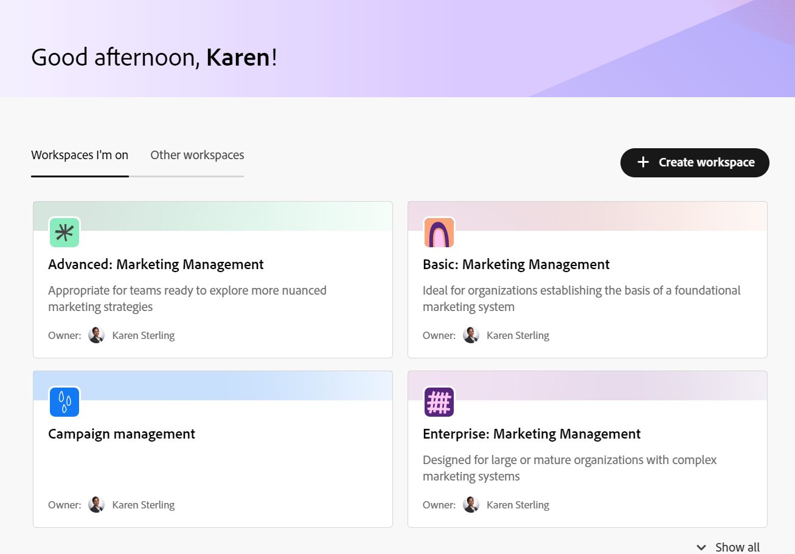

# Overzicht van werkruimten

<!--
The information on this page refers to functionality not yet generally available. It is available only in the Preview environment for all customers. After the monthly releases to Production, the same features are also available in the Production environment for customers who enabled fast releases.    

For information about fast releases, see [Enable or disable fast releases for your organization](/help/quicksilver/administration-and-setup/set-up-workfront/configure-system-defaults/enable-fast-release-process.md). 
-->

{{planning-important-intro}}

Een werkruimte is een verzameling recordtypen die door een organisatie-eenheid worden gebruikt en die de levenscyclus en processen van het werk van de eenheid vertegenwoordigt. U kunt werkruimten volledig aanpassen in Adobe Workfront Planning.

## Overwegingen over werkruimten

* U kunt werkruimten voor specifieke organisatorische eenheden binnen uw organisatie tot stand brengen, om de unieke manier aan te passen elke eenheid werkt.
* Workfront Planning wordt niet geleverd met vooraf geconfigureerde werkruimten. U moet deze maken op basis van de behoeften van uw organisatie.
* U kunt op de volgende manieren werkruimten maken:

   * Van kras
   * Een sjabloon gebruiken. Sjablonen bevatten een vooraf geconfigureerd aantal recordtypen en de bijbehorende velden.
   * De door AI aangedreven planningsDesigner gebruiken. Deze functie is momenteel in Beta.
   * Een sjabloonbundel voor meerdere werkruimten gebruiken.

  Voor informatie, zie [&#x200B; werkruimten &#x200B;](/help/quicksilver/planning/architecture/create-workspaces.md) creëren.

* De werkruimten zijn kaders waarbinnen uw organisatorische eenheden (een team, een groep, een afdeling, of een afdeling) werken. Ze kunnen niet aan velden worden gekoppeld. Alleen de recordtypen in een werkruimte kunnen aan velden worden gekoppeld.

  Voor informatie, zie [&#x200B; overzicht van de types van Verslag &#x200B;](/help/quicksilver/planning/architecture/overview-of-record-types.md).
* Afhankelijk van uw Workfront-licentie worden werkruimten weergegeven op de volgende tabbladen in het gedeelte Planning:

   * Voor systeembeheerders worden de werkruimten weergegeven op de volgende tabbladen:

      * **Werkruimten ik** ben: De werkruimten van vertoningen u creeerde of werkruimten die met u worden gedeeld.
      * **Andere werkruimten**: Toont alle andere werkruimten in het systeem.

   * Voor alle andere gebruikers worden de werkruimten die zij hebben gemaakt en de werkruimten die anderen met hen delen, weergegeven in het gebied Werkruimten.

* De recordtypen die een werkruimte bevat, moeten de levenscyclus van het werk en de concepten van een organisatie-eenheid weerspiegelen.

  Als de werkobjecten van een eenheid bijvoorbeeld campagnes, producten en regio&#39;s zijn, moet de werkruimte van die eenheid de recordtypen Campagne, Product en Regio bevatten.
* Wanneer u een werkruimte maakt, hebt u alleen de toestemming om de werkruimte te openen en te beheren. U moet het met andere gebruikers delen opdat zij met u in de zelfde ruimte kunnen samenwerken.

  Voor informatie, zie [&#x200B; een werkruimte &#x200B;](/help/quicksilver/planning/access/share-workspaces.md) delen.

  Systeembeheerders kunnen alle werkruimten beheren, zelfs de werkruimten die ze niet hebben gemaakt.

<!--make this live with the GA: * There is no limit for how many workspaces you can create in your environment. However, we recommend not to have too many workspaces, as they could become hard to manage and your workflows might be too fragmented.-->

* Er gelden limieten voor het aantal werkruimteobjecten dat u kunt maken in uw exemplaar van Workfront Planning. Voor informatie, zie [&#x200B; overzicht van de objectbeperkingen van de Planning van Adobe Workfront &#x200B;](/help/quicksilver/planning/general/limitations-overview.md).
