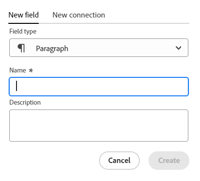
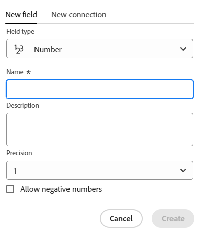

<!--Should the structure of this article be like this other one: https://experienceleague.adobe.com/docs/workfront/using/administration-and-setup/customize/custom-forms/custom-form-builder/use-the-custom-form-builder/add-a-custom-field-to-a-custom-form.html?lang=en ??-->

<!--will they add a way to create fields elsewhere than in a table?! - how will that change the structure of this article? -->

<!--Do we need this for FORMULAS: when we release permissions to RECORDS and we release referring lookup fields in a formula field, update considerations to say that lookup fields from linked records depends on the permissions to the record; if they have no permissions to view a linked record, they won't be able to use that records's lookup fields in a formula - not sure is needed??-->

# Velden maken

<!--information about choice values must stay in yellow till Jan 2026-->

<!--<span class="preview">The highlighted information on this page refers to functionality not yet generally available. It is available only in the Preview environment for all customers. After the monthly releases to Production, the same features are also available in the Production environment for customers who enabled fast releases. </span>   

<span class="preview">For information about fast releases, see [Enable or disable fast releases for your organization](/help/quicksilver/administration-and-setup/set-up-workfront/configure-system-defaults/enable-fast-release-process.md). </span>-->


{{planning-important-intro}}

In Adobe Workfront Planning kunt u aangepaste velden maken voor recordtypen. U kunt de gebieden met de verslagen van de Planning van Workfront dan associëren om verslaginformatie te verbeteren.

U moet recordtypen maken voordat u velden kunt maken die u hieraan wilt koppelen. Voor informatie, zie [&#x200B; recordtypes &#x200B;](/help/quicksilver/planning/architecture/create-record-types.md) creëren.

U kunt velden op de volgende manieren maken in Workfront Planning:

* [Van kras](#create-fields-from-scratch)
* [Door recordtypen aan te sluiten](#create-fields-by-connecting-record-types)
* [Door een recordtype te maken](#create-fields-by-creating-a-record-type)
* [Een werkruimte maken op basis van een sjabloon](#create-fields-by-creating-a-workspace-from-a-template)
* [Door recordtypen te importeren met een Excel- of CSV-bestand](#create-fields-when-importing-record-types-from-a-csv-or-excel-file)
* [Door kopieën van bestaande Workfront-velden te importeren](#create-fields-by-importing-them-from-workfront)

Voor meer informatie over de planningsgebieden van Workfront, zie [&#x200B; Overzicht van het Gebied &#x200B;](/help/quicksilver/planning/fields/fields-overview.md).

## Toegangsvereisten

+++ Breid uit om de toegangsvereisten voor de functionaliteit in dit artikel te bekijken. 

<table style="table-layout:auto"> 
<col> 
</col> 
<col> 
</col> 
<tbody> 
    <tr> 
<tr> 
</tr>   
<tr> 
   <td role="rowheader"><p>Adobe Workfront-pakket</p></td> 
   <td> 
<ul> 
<li><p>Alle Workfront en alle planningspakketten</p></li>
of
<li><p>Willekeurige workflow en planningspakket</p></li></ul>
<p>Neem voor meer informatie over wat er in elk planningspakket voor Workfront staat, contact op met uw Workfront-accountvertegenwoordiger. </p> 
   </td> 
  <tr> 
   <td role="rowheader"><p>Adobe Workfront-licentie</p></td> 
   <td><p>Standard</p>
   </td> 
  </tr> 
  <tr> 
   <td role="rowheader"><p>Objectmachtigingen</p></td> 
   <td>   <p>Machtigingen beheren in een werkruimte</p>  
   <p>Systeembeheerders hebben machtigingen voor alle werkruimten, inclusief de werkruimten die ze niet hebben gemaakt</p>  </td> 
  </tr>  
</tbody> 
</table>

Voor meer informatie over de toegangsvereisten van Workfront, zie [&#x200B; vereisten van de Toegang in de documentatie van Workfront &#x200B;](/help/quicksilver/administration-and-setup/add-users/access-levels-and-object-permissions/access-level-requirements-in-documentation.md).

+++   

<!--Old:

 <table style="table-layout:auto"> 
<col> 
</col> 
<col> 
</col> 
<tbody> 
    <tr> 
<tr> 
<td> 
   <p> Products</p> </td> 
   <td> 
   <ul><li><p> Adobe Workfront</p></li> 
   <li><p> Adobe Workfront Planning<p></li></ul></td> 
  </tr>   
<tr> 
   <td role="rowheader"><p>Adobe Workfront plan*</p></td> 
   <td> 
<p>Any of the following Workfront plans:</p> 
<ul><li>Select</li> 
<li>Prime</li> 
<li>Ultimate</li></ul> 
<p>Workfront Planning is not available for legacy Workfront plans</p> 
   </td> 
<tr> 
   <td role="rowheader"><p>Adobe Workfront Planning package*</p></td> 
   <td> 
<p>Any </p> 
<p>For more information about what is included in each Workfront Planning plan, contact your Workfront account manager. </p> 
   </td> 
 <tr> 
   <td role="rowheader"><p>Adobe Workfront platform</p></td> 
   <td> 
<p>Your organization's instance of Workfront must be onboarded to the Adobe Unified Experience to be able to access Workfront Planning.</p> 
<p>For more information, see <a href="/help/quicksilver/workfront-basics/navigate-workfront/workfront-navigation/adobe-unified-experience.md">Adobe Unified Experience for Workfront</a>. </p> 
   </td> 
   </tr> 
  </tr> 
  <tr> 
   <td role="rowheader"><p>Adobe Workfront license*</p></td> 
   <td><p> Standard </p>
   <p>Workfront Planning is not available for legacy Workfront licenses</p> 
  </td> 
  </tr> 
  <tr> 
   <td role="rowheader"><p>Access level configuration</p></td> 
   <td> <p>There are no access level controls for Adobe Workfront Planning</p>   
</td> 
  </tr> 
<tr> 
   <td role="rowheader"><p>Object permissions</p></td> 
   <td>   <p>Manage permissions to a workspace and record type</a> </p>  
   <p>System Administrators have permissions to all workspaces, including the ones they did not create.</p> </td> 
  </tr> 
</tbody> 
</table> -->

## Velden maken door recordtypen aan te sluiten

U kunt gekoppelde recordvelden maken wanneer u een nieuwe verbinding toevoegt tussen twee recordtypen of een recordtype en een objecttype vanuit andere toepassingen.

Voor informatie over het verbinden van het verslagtypes van de Planning van Workfront, zie [&#x200B; Connect verslagtypes &#x200B;](/help/quicksilver/planning/architecture/connect-record-types.md).

<!--## Create fields by importing record types using an Excel or CSV file

For more information, see [Create record types](/help/quicksilver/planning/architecture/create-record-types.md).-->

## Velden maken door een recordtype te maken

Wanneer u een recordtype maakt, worden ook een aantal velden die aan het nieuwe recordtype zijn gekoppeld, standaard gemaakt. Voor meer informatie, zie [&#x200B; recordtypes &#x200B;](/help/quicksilver/planning/architecture/create-record-types.md) creëren.

## Velden maken door een werkruimte te maken van een sjabloon

Adobe Workfront Planning maakt velden voor recordtypen wanneer u een werkruimte maakt op basis van een sjabloon.

Voor informatie, zie [&#x200B; werkruimten &#x200B;](/help/quicksilver/planning/architecture/create-workspaces.md) creëren.


## Velden maken bij het importeren van recordtypen uit een CSV- of Excel-bestand

U kunt velden importeren wanneer u recordtypen importeert met een CSV- of Excel-bestand.

Voor informatie, zie [&#x200B; recordtypes &#x200B;](/help/quicksilver/planning/architecture/create-record-types.md) creëren.

## Velden maken door ze vanuit Workfront te importeren

U kunt kopieën van bestaande Workfront-velden importeren.

Als u velden importeert uit Workfront, wordt een kopie van elk veld gemaakt voor een recordtype voor Workfront Planning.

Nadat u de velden hebt gekopieerd, zijn de velden onafhankelijk van elkaar en wisselen ze geen informatie uit.

Voor informatie, zie [&#x200B; de gebieden van de Invoer van Workfront &#x200B;](/help/quicksilver/planning/fields/import-fields-from-workfront.md).


## geheel nieuwe velden maken {#create-fields-from-scratch}

<!--in a table (not sure if this can be done elsewhere?!-->

<!--the first 3 steps are the same as in Import fields from Workfront-->

{{step1-to-planning}}

1. Klik op de werkruimte waarvan u de records wilt maken waarvoor u velden wilt maken.

   De werkruimte wordt geopend en de recordtypen worden weergegeven.

1. Klik op de kaart van een recordtype.

   Alle bestaande records die aan het recordtype zijn gekoppeld, worden in de rijen van de tabelweergave weergegeven.

   >[!TIP]
   >
   >    Als er nog geen records worden weergegeven, hebt u mogelijk nog geen records of hebt u een filter toegepast dat beperkt wat u op het scherm ziet.

   Alle bestaande velden die aan het recordtype zijn gekoppeld, worden weergegeven in de kolommen van de tabelweergave.

   >[!TIP]
   >
   >    Sommige velden zijn mogelijk verborgen. Klik op Velden en schakel de modus Velden in die u als kolommen wilt weergeven in de tabelweergave.

1. Klik op het pictogram **+** rechtsboven in de tabelweergave

   of

   Beweeg over de kopbal van om het even welke kolom, klik de naar beneden wijzende pijl na de gebiedsnaam, dan klik links **of** Tussenvoegsel rechts **om het nieuwe gebied toe te voegen.**
1. Op het **Nieuwe gebied** lusje, onderzoek naar een gebiedstype op het **type van Gebied** vakje, of selecteer van de volgende gebiedstypes:

   Op het **Nieuwe gebied** lusje, onderzoek naar een gebiedstype in het **type van Gebied** vakje gebruikend om het even welk verwant sleutelwoord, of selecteer van de hieronder vermelde gebiedstypes.

   >[!TIP]
   >
   >    U kunt &quot;Begroting&quot;typen en de gebiedstypes van Aantal en Valuta tonen in een korte lijst.


   * [Tekst met één regel](#single-line-text)
   * [Alinea](#paragraph)
   * [Meerdere selecties](#multi-select)
   * [Enkel selecteren](#single-select)
   * [Datum](#date)
   * [&#x200B; Aantal &#x200B;](#number)
   * [Percentage](#percentage)
   * [Valuta](#currency)
   * [&#x200B; Checkbox &#x200B;](#checkbox)
   * [Formule](#formula)
   * [Mensen](#people)
   * [Gemaakt door](#created-by)
   * [Aanmaakdatum](#created-date)
   * [Laatst gewijzigd door](#last-modified-by)
   * [Laatst gewijzigd](#last-modified-date)
   * [Goedgekeurde datum](#approved-date)
   * [&#x200B; Goedgekeurd door &#x200B;](#approved-by)
     <!--* [Object](#object-field-type)-->

   >[!IMPORTANT]
   >
   >U kunt het veldtype van het veld niet wijzigen nadat u het hebt opgeslagen.

   <!--Add this to the IMPORTANT above and make it a NOTE - should do directly to Prod:
    * You can use any keyword that might be related to any of the field type names. For example, a search for "Budget" will display the Number or Currency field type.-->

1. Ga verder met het toevoegen van elk veld, zoals beschreven in de volgende secties.

### Tekst met één regel {#single-line-text}

Tekstvelden van één regel bevatten beperkte alfanumerieke informatie. U kunt bijvoorbeeld de gegevens van de eigenaar, de belanghebbende, het team of de organisatie-eenheid vastleggen in een tekstveld met één regel. De inhoud van een tekstveld met één regel kan maximaal 1000 tekens bevatten. <!-- used to be 250 but just tested with 1000 and it allowed this as a maximum. -->

1. Begin creërend een gebied zoals die in de sectie [&#x200B; wordt beschreven creeer gebieden van kras &#x200B;](#create-fields-from-scratch) in dit artikel, dan selecteer het **single-line tekst** gebiedstype.

   

1. Voeg de volgende informatie op het **Nieuwe gebied** tabel toe:
   * **Naam**: De naam van het gebied, aangezien het in een lijst of de pagina van Details van het verslag zal verschijnen. <!--ensure they updated this; and update the screen shot: it used to be "Label"-->
   * **Beschrijving**: Aanvullende informatie over het gebied. De beschrijving van een veld wordt weergegeven wanneer u de cursor op de kolomkop van het veld in een tabel plaatst of wanneer u op het informatiepictogram naast de veldnaam op de detailpagina van de record klikt.
1. Klik **creëren**.

   Het nieuwe veld met één regel wordt toegevoegd als een kolom aan het recordtype en de waarden ervan kunnen aan records worden gekoppeld.


### Alinea {#paragraph}

In alineasvelden wordt aanvullende alfanumerieke informatie over een record vastgelegd, vergelijkbaar met het veld Beschrijving.

>[!TIP]
>
>* U kunt maximaal 20 alineasvelden hebben voor één recordtype.
>
>* De inhoud van een alinea-veld kan maximaal 10.000 tekens bevatten.
>* U kunt RTF-opmaak gebruiken om de inhoud van alineasvelden te verbeteren wanneer deze worden weergegeven in de tabelweergave of op de pagina Details van een record. Voor informatie, zie [&#x200B; verslagen &#x200B;](/help/quicksilver/planning/records/edit-records.md) uitgeven.
>


1. Begin creërend een gebied zoals die in de sectie [&#x200B; wordt beschreven creeer gebieden van kras &#x200B;](#create-fields-from-scratch) in dit artikel, dan selecteer het **3&rbrace; gebiedstype van de Paragraaf &lbrace;.**

   


1. Voeg de volgende informatie op het **Nieuwe gebied** tabel toe:
   * **Naam**: De naam van het gebied, aangezien het in een lijst of de pagina van Details van het verslag zal verschijnen. <!--ensure they updated this; and update the screen shot: it used to be "Label"-->
   * **Beschrijving**: Aanvullende informatie over het gebied. De beschrijving van een veld wordt weergegeven wanneer u de cursor op de kolom van het veld in een tabel plaatst of wanneer u op het informatiepictogram naast de veldnaam op de detailpagina van de record klikt.
1. Klik **creëren**.

   Het nieuwe paragraafgebied wordt toegevoegd als kolom aan het verslagtype, en zijn waarden kunnen met verslagen worden geassocieerd.


### Meerdere selecties {#multi-select}

U kunt een veld met meerdere selecties gebruiken om aanvullende informatie in elke gewenste indeling vast te leggen door meerdere opties in een vervolgkeuzemenu te selecteren.

>[!NOTE]
>
>Naast de functionaliteit die in deze sectie wordt beschreven, kunt u nieuwe keuzen toevoegen wanneer u de multi-select veldwaarde van een record inline bewerkt, in de tabelweergave. Voor meer informatie, zie &quot;informatie over enig-of multi-uitgezochte gebieden&quot;sectie in het artikel [&#x200B; dossiers &#x200B;](/help/quicksilver/planning/records/edit-records.md) uitgeven.
>

1. Begin creërend een gebied zoals die in de sectie [&#x200B; wordt beschreven creeer gebieden van kras &#x200B;](#create-fields-from-scratch) in dit artikel, dan selecteer het **multi-uitgezochte** gebiedstype.

   


1. Voeg de volgende informatie op het **Nieuwe gebied** tabel toe:
   * **Naam**: De naam van het gebied, aangezien het in een lijst of de pagina van Details van het verslag zal verschijnen. <!--ensure they updated this; and update the screen shot: it used to be "Label"-->
   * **Beschrijving**: Aanvullende informatie over het gebied. De beschrijving van een veld wordt weergegeven wanneer u de cursor op de kolom van het veld in een tabel plaatst of wanneer u op het informatiepictogram naast de veldnaam op de detailpagina van de record klikt.
   * **Keuzen**: De opties die de gebruikers kunnen selecteren wanneer het bijwerken van dit gebied. U kunt zowel cijfers als letters gebruiken voor de naam van elke keuze.
1. Klik **toevoegen keus** om meer keuzen toe te voegen. Er geldt geen limiet voor het aantal keuzen dat u kunt toevoegen aan een veld met meerdere selecties.
1. (Optioneel) Sleep een keuze handmatig in de gewenste volgorde of selecteer de optie
   **de keuzen van de Soort a-z** optie als u de keuzen automatisch in alfabetische orde wilt worden vermeld. <!--Add this if they added this functionality: You cannot edit this option after you save the field.-->
1. (Facultatief) om een keus te verwijderen, klik het **x** pictogram rechts van het.
1. Klik op het kleurstaal links van een keuze om de kleurkiezer uit te vouwen en de kleur van elke optie aan te passen.

1. Klik **Monsters** om een vooraf bepaalde kleur te selecteren

   of

   Klik **Douane** om een douanekleur te selecteren gebruikend een kleurenplukker of een code van de Hexagina.
1. Klik buiten het kleurvak om het te sluiten.
1. Klik **creëren**.

   Het nieuwe multi-select gebied wordt toegevoegd als kolom aan het verslagtype, en zijn waarden kunnen met verslagen worden geassocieerd.

1. (Facultatief) Beweeg over de gebiedsnaam in de lijstmening, klik het drop-down menu rechts van de gebiedsnaam, dan klik **uitgeeft gebied**.
1. Zet **aan tonen waarden** het plaatsen om de waarden voor elke keus te tonen. De waarden zijn de namen van elke keuze, zoals deze worden weergegeven in de Workfront-database.

   >[!NOTE]
   >
   >* Workfront wijst unieke waarden toe aan elke keuze.
   >
   >* De waarden komen overeen met de gekozen naam in kleine letters. Meerdere woorden worden gescheiden door een onderstrepingsteken.
   >
   >* Waarden kunnen tussen meerdere velden worden herhaald, maar moeten uniek zijn voor één veld.
   >
   > 

1. (Optioneel) Gebruik de keuzevelden in uw API-aanroepen en andere integraties.

### Enkel selecteren {#single-select}

Met velden die een enkele selectie maken, wordt aanvullende informatie in elke gewenste indeling vastgelegd door een optie in een vervolgkeuzemenu te selecteren.

>[!NOTE]
>
>Naast de functionaliteit die in deze sectie wordt beschreven, kunt u nieuwe keuzen toevoegen wanneer u de één-uitgezochte gebiedswaarde van een verslag inline, in de lijstmening uitgeeft. Voor meer informatie, zie &quot;informatie over enig-of multi-uitgezochte gebieden&quot;sectie in het artikel [&#x200B; dossiers &#x200B;](/help/quicksilver/planning/records/edit-records.md) uitgeven.
>

1. Begin creërend een gebied zoals die in de sectie [&#x200B; wordt beschreven creeer gebieden van kras &#x200B;](#create-fields-from-scratch) in dit artikel, dan selecteer het **enig-uitgezochte** gebiedstype.

   

1. Voeg de volgende informatie op het **Nieuwe gebied** tabel toe:
   * **Naam**: De naam van het gebied, aangezien het in een lijst of de pagina van Details van het verslag zal verschijnen. <!--ensure they updated this; and update the screen shot: it used to be "Label"-->
   * **Beschrijving**: Aanvullende informatie over het gebied. De beschrijving van een veld wordt weergegeven wanneer u de cursor op de kolom van het veld in een tabel plaatst of wanneer u op het informatiepictogram naast de veldnaam op de detailpagina van de record klikt.
   * **Keuzen**: De opties beschikbaar om van het drop-down menu te selecteren nadat het gebied wordt bewaard. U kunt zowel cijfers als letters voor de naam van elke keus hebben.

1. Klik **toevoegen keus** om meer keuzen toe te voegen. Er geldt geen limiet voor het aantal keuzen dat u kunt toevoegen aan een veld voor één keuze.
1. (Facultatief) sleep en laat manueel elke keus in de gewenste orde vallen, of selecteer de **optie van de Soort A-Z** als u de keuzen automatisch in alfabetische orde wilt worden vermeld. <!--Add this if they added this functionality: You cannot edit this option after you save the field.-->
1. (Facultatief) om een keus te verwijderen, klik het **x** pictogram rechts van het.
1. Klik op het kleurstaal links van een keuze om de kleurkiezer uit te vouwen en de kleur van elke optie aan te passen.
1. Klik **Monsters** om een vooraf bepaalde kleur te selecteren

   of

   Klik **Douane** om een douanekleur te selecteren gebruikend een kleurenplukker of een code van de Hexagina.

1. Klik buiten het kleurvak om het te sluiten.
1. Klik **creëren**.

   Het nieuwe veld Eén keuze wordt toegevoegd als kolom aan het recordtype en de waarden ervan kunnen aan records worden gekoppeld.

1. (Facultatief) Beweeg over de gebiedsnaam in de lijstmening, klik het drop-down menu rechts van de gebiedsnaam, dan klik **uitgeeft gebied**.
1. Zet **aan tonen waarden** het plaatsen om de waarden voor elke keus te tonen. De waarden zijn de namen van elke keuze, zoals deze worden weergegeven in de Workfront-database.

   >[!NOTE]
   >
   >* Workfront wijst unieke waarden toe aan elke keuze.
   >
   >* De waarden komen overeen met de gekozen naam in kleine letters. Meerdere woorden worden gescheiden door een onderstrepingsteken.
   >
   >* Waarden kunnen tussen meerdere velden worden herhaald, maar moeten uniek zijn voor één veld.
   >
   > 

1. (Optioneel) Gebruik de keuzevelden in uw API-aanroepen en andere integraties.

### Datum {#date}

U kunt een datumveld gebruiken om aanvullende informatie vast te leggen in de datum- en tijdnotatie.

1. Begin creërend een gebied zoals die in de sectie [&#x200B; wordt beschreven creeer gebieden van kras &#x200B;](#create-fields-from-scratch) in dit artikel, dan selecteer het **Datum** gebiedstype.

   


1. Voeg de volgende informatie op het **Nieuwe gebied** tabel toe:
   * **Naam**: De naam van het gebied, aangezien het in een lijst of een verslagpagina zal verschijnen. <!--ensure they updated this; and update the screen shot: it used to be "Label"-->
   * **Beschrijving**: Aanvullende informatie over het gebied. De beschrijving van een veld wordt weergegeven wanneer u de cursor op de kolom van het veld in een tabel plaatst of wanneer u op het informatiepictogram naast de veldnaam op de detailpagina van de record klikt.
   * **Formaat van de Datum**: Het type van datumformaat u op dit gebied wilt tonen. <!--update this casing - submitted bug for it-->

     Selecteer een van de volgende indelingen:
      * **Landinstelling**: Gelijke aan de scène van uw browser.
      * **Norm**: 05/16/2023
      * **Lang**: 16 mei, 2023
      * **Europees**: 16/05/2023
      * **ISO**: 2023-05-16
   * **omvat tijd**: Selecteer deze optie als u een tijdstempel wilt omvatten. Deze optie is standaard uitgeschakeld. U kunt geen tijd opnemen nadat u het veld hebt opgeslagen.

     Selecteer een van de volgende opties:

      * **24hr**: Bijvoorbeeld: 18 :00
      * **12hr**: Bijvoorbeeld: 6 :00 PM

1. Klik **creëren**.

   Het nieuwe datumveld wordt toegevoegd als een kolom aan het recordtype en de waarden ervan kunnen worden gekoppeld aan records.

### Getal {#number}

Met een getalveldtype wordt informatie vastgelegd in een getalnotatie.

>[!TIP]
>
>Nummervelden worden weergegeven als een tekstveldtype voor één regel in een aanvraagformulierbuilder.
>
>De veldindeling blijft echter wel behouden en de waarden van deze velden worden als getallen weergegeven nadat het verzoek is ingediend, op het recordtype en op de pagina met aanvraagdetails.
>Voor informatie, zie [&#x200B; creeer en beheer een verzoekvorm in de Planning van Adobe Workfront &#x200B;](/help/quicksilver/planning/requests/create-request-form.md).


1. Begin creërend een gebied zoals die in de sectie [&#x200B; wordt beschreven creeer gebieden van kras &#x200B;](#create-fields-from-scratch) in dit artikel, dan selecteer het **3&rbrace; gebiedstype van het Aantal &lbrace;.**

   
1. Voeg de volgende informatie op het **Nieuwe gebied** tabel toe:

   * **Naam**: De naam van het gebied, aangezien het in een lijst of een verslagpagina zal verschijnen.
   * **Beschrijving**: Aanvullende informatie over het gebied. De beschrijving van een veld wordt weergegeven wanneer u de cursor op de kolom van het veld in een tabel plaatst of wanneer u op het informatiepictogram naast de veldnaam op de detailpagina van de record klikt.
   * **Precisie**: Het aantal decimalen die u voor het gebied wilt registreren. U kunt maximaal 6 decimalen weergeven.
   * **sta negatieve aantallen** toe: selecteer deze optie als u negatieve aantallen op dit gebied wilt toestaan. Deze optie is standaard uitgeschakeld.

   >[!NOTE]
   >
   >    Als u negatieve getallen toestaan selecteert en negatieve waarden worden opgeslagen in de records waaraan het veld is gekoppeld, kunt u de instelling in de toekomst niet meer uitschakelen.

1. Klik **creëren**.

   Het nieuwe nummerveld wordt als kolom toegevoegd aan het recordtype en de waarden ervan kunnen aan records worden gekoppeld.

### Percentage {#percentage}

Percentageveldtypen leggen informatie vast in een getalnotatie gevolgd door een percentageteken.

>[!TIP]
>
>Percentagevelden worden weergegeven als een tekstveldtype voor één regel in een aanvraagformulierbuilder.
>
>De veldindeling blijft echter wel behouden en de waarden van deze velden worden als percentages weergegeven nadat het verzoek is ingediend, op het recordtype en op de pagina met aanvraagdetails.
>Voor informatie, zie [&#x200B; creeer en beheer een verzoekvorm in de Planning van Adobe Workfront &#x200B;](/help/quicksilver/planning/requests/create-request-form.md).


1. Begin creërend een gebied zoals die in de sectie [&#x200B; wordt beschreven creeer gebieden van kras &#x200B;](#create-fields-from-scratch) in dit artikel, dan selecteer het **3&rbrace; gebiedstype van het Percentage &lbrace;.**

   

1. Voeg de volgende informatie op het **Nieuwe gebied** tabel toe:
   * **Naam**: De naam van het gebied, aangezien het in een lijst of een verslagpagina zal verschijnen.
   * **Beschrijving**: Aanvullende informatie over het gebied. De beschrijving van een veld wordt weergegeven wanneer u de cursor op de kolom van het veld in een tabel plaatst of wanneer u op het informatiepictogram naast de veldnaam op de detailpagina van de record klikt.
   * **Precisie**: Het aantal decimalen die u voor het gebied wilt registreren. U kunt maximaal 6 decimalen weergeven.
   * **sta negatieve aantallen** toe: selecteer deze optie als u negatieve percentagewaarden op dit gebied wilt toestaan. Deze optie is standaard uitgeschakeld.

     >[!NOTE]
     >
     >Als u negatieve getallen toestaan selecteert en negatieve waarden worden opgeslagen in de records waaraan het veld is gekoppeld, kunt u de instelling in de toekomst niet meer uitschakelen.

   * **toon als**: Van het drop-down menu, kies hoe u de percentagewaarden in de lijstmening wilt tonen. Selecteer een van de volgende opties:
      * **Aantal**: De percentagewaarde toont als aantal dat door het percentageteken wordt gevolgd.
      * **Bar**: De percentagewaarde toont als bar naast het percentageaantal. De vulkleur van de balk geeft de percentagewaarde aan. Dit is de standaardselectie.
      * **Cirkel**: De percentagewaarde toont als overzicht van een cirkel naast het percentageaantal. De vulkleur van de omtrek van de cirkel geeft de percentagewaarde aan.

   >[!NOTE]
   >
   >* De selectie die u maakt in het veld Tonen als, geldt alleen voor het percentage dat zichtbaar is in de tabelweergave. De percentagewaarde van het gebied toont als aantal gevolgd door het percentageteken overal anders in de Planning van Workfront. Dit is ook op het percentage-type gebied van toepassing wanneer het als raadplegingsgebied in de lijstmeningen van andere verslagen toont.
   >* U kunt de optie Tonen als selectie wijzigen wanneer u het veld later bewerkt.

1. Klik **creëren**.

   Het nieuwe percentageveld wordt toegevoegd als kolom aan het verslagtype, en zijn waarden kunnen met verslagen worden geassocieerd.

### Valuta {#currency}

Valutatypen leggen informatie vast in een getalnotatie voorafgegaan door een valutasymbool.

>[!TIP]
>
>Valutabelden worden weergegeven als een tekstveldtype voor één regel in een aanvraagformulierbuilder.
>
>De veldindeling blijft echter wel behouden en de waarden van deze velden worden na de indiening van het verzoek als valuta weergegeven, op het recordtype en op de pagina met aanvraagdetails.
>Voor informatie, zie [&#x200B; creeer en beheer een verzoekvorm in de Planning van Adobe Workfront &#x200B;](/help/quicksilver/planning/requests/create-request-form.md).

1. Begin creërend een gebied zoals die in sectie [&#x200B; wordt beschreven creeer gebieden van kras &#x200B;](#create-fields-from-scratch) in dit artikel, dan selecteer het **3&rbrace; gebiedstype van de Valuta &lbrace;.**

   

1. Voeg de volgende informatie op het **Nieuwe gebied** tabel toe:
   * **Naam**: De naam van het gebied, aangezien het in een lijst of een verslagpagina zal verschijnen. <!--ensure they updated this; and update the screen shot: it used to be "Label"-->
   * **Beschrijving**: Aanvullende informatie over het gebied. De beschrijving van een veld wordt weergegeven wanneer u de cursor op de kolom van het veld in een tabel plaatst of wanneer u op het informatiepictogram naast de veldnaam op de detailpagina van de record klikt.
   * **Valuta**: Het type van munt u op dit gebied wilt tonen. Dit is een lijst van valuta&#39;s volgens de Internationale Organisatie voor Normalisatie (ISO).
   * **Precisie**: Het aantal decimalen die u voor het gebied wilt registreren. U kunt maximaal 6 decimalen weergeven.
   * **sta negatieve aantallen** toe: selecteer deze optie als u negatieve muntwaarden op dit gebied wilt toestaan. Deze optie is standaard uitgeschakeld.

   >[!NOTE]
   >
   >    Als u negatieve getallen toestaan selecteert en negatieve waarden worden opgeslagen in de records waaraan het veld is gekoppeld, kunt u de instelling in de toekomst niet meer uitschakelen.

1. Klik **creëren**.

   Het nieuwe valutaveld wordt toegevoegd als een kolom aan het recordtype en de waarden ervan kunnen aan records worden gekoppeld.

### Selectievakje

Met het veldtype Selectievakje kunt u één optie voor het selectievakje aan een record toevoegen. U kunt dit veld gebruiken om een specifiek kenmerk of een specifieke status voor die specifieke record aan te geven. U kunt deze bijvoorbeeld gebruiken als vlag voor het bijhouden van voltooiing, goedkeuring of een ander binair kenmerk voor elke record.

1. Begin creërend een gebied zoals die in de sectie [&#x200B; wordt beschreven creeer gebieden van kras &#x200B;](#create-fields-from-scratch) in dit artikel, dan selecteer het **CheckBox** gebiedstype.

   

1. Voeg de volgende informatie op het **Nieuwe gebied** tabel toe:
   * **Naam**: De naam van het gebied, aangezien het in een lijst of een verslagpagina zal verschijnen. <!--ensure they updated this; and update the screen shot: it used to be "Label"-->
   * **Beschrijving**: Aanvullende informatie over het gebied. De beschrijving van een veld wordt weergegeven wanneer u de cursor op de kolom van het veld in een tabel plaatst of wanneer u op het informatiepictogram naast de veldnaam op de detailpagina van de record klikt.
1. Klik **creëren**.

   Het nieuwe selectievakje wordt als kolom toegevoegd aan het recordtype en de waarden ervan kunnen aan records worden gekoppeld.

### Formule

Formulervelden genereren een nieuwe waarde met behulp van bestaande waarden uit andere velden in een recordtype en een functie die aangeeft hoe de bestaande waarden moeten worden berekend.

Voor meer informatie, zie [&#x200B; overzicht van de gebieden van de Formule &#x200B;](/help/quicksilver/planning/fields/formula-fields.md).

1. Begin creërend een gebied zoals die in sectie [&#x200B; wordt beschreven creeer gebieden van kras &#x200B;](#create-fields-from-scratch) in dit artikel, dan selecteer het **Formule** gebiedstype.

   

1. Voeg de volgende informatie op het **Nieuwe gebied** tabel toe:

   * **Naam**: Ga een naam voor het nieuwe gebied in.
   * **Beschrijving**: Voeg informatie over het nieuwe gebied toe. De beschrijving van een veld wordt weergegeven wanneer u de cursor op de kolom van het veld in een tabel plaatst of wanneer u op het informatiepictogram naast de veldnaam op de detailpagina van de record klikt.
   * **Formule**: Begin typend minstens één karakter om tot een uitdrukking toegang te hebben, dan selecteer het wanneer het in de lijst toont.

1. Klik op de geselecteerde expressie om de definitie weer te geven en de opmaak weer te geven.

   

   Voor meer informatie over welke uitdrukkingen worden gesteund, zie [&#x200B; overzicht van de gebieden van de Formule &#x200B;](/help/quicksilver/planning/fields/formula-fields.md).


   >[!TIP]
   >
   >U ontvangt een waarschuwingsbericht wanneer u een formuleveld bewerkt of maakt dat een cirkelverwijzing naar zichzelf of gedeelde velden kan veroorzaken. U kunt geen formuleringsgebied opslaan dat of naar zich of naar punten verwijst die in zijn berekening van verwijzingen worden voorzien.


1. Voeg veldnamen toe zoals deze worden weergegeven in Workfront Planning om ernaar te verwijzen in een formule.

   >[!NOTE]
   >
   >* U kunt geen multiselect-tekstvelden toevoegen aan een formule.
   >
   >
   >* U moet de naam van de gebieden spellen die u in de formules omvat aangezien u hen in de Planning van Workfront ziet. Syntaxis en jokertekens in de Workfront-tekstmodus worden niet ondersteund in Workfront-planningsformules.
   >
   >* U kunt verwijzen naar een veld dat maximaal vier velden (en objecten) verwijderd is van het huidige recordtype. Bijvoorbeeld, als u een formuleringsgebied voor een type van het Verslag van de Activiteit creeert (1), en de Activiteit wordt verbonden met het type van het verslag van de Campagne (2) dat met een Project van Workfront (3) wordt verbonden, kunt u het gebied van de Begroting van het project (4) in de formule verwijzen u voor het verslagtype van de Activiteit creeert.
   >
   >
   >

1. (Facultatief) klik **maximaliseren** om de doos van de Formule in een groter gebied te openen.

   Het vak Formule wordt in een groter venster geopend.
1. (Facultatief en voorwaardelijk) als u de doos van de Formule op een groter gebied opende, **minimaliseert** om op de originele het gebiedsdoos van de Formule terug te keren.

1. Op het **gebied van het Formaat**, selecteer van de volgende keuzen om het formaat van het resultaat te identificeren dat op het formule-type gebied wordt getoond:

   * **Tekst**: Het resultaat van de vertoningen van het formuleringsgebied als gewone tekst.
   * **Aantal**: Het resultaat van de vertoningen van het formuleringsgebied als aantal.
   * **Percentage**: Het resultaat van de vertoningen van het formuleringsgebied als aantal dat door een percentagesymbool wordt gevolgd.
   * **Valuta**: Het resultaat van de vertoningen van het formuleringsgebied als aantal voorafgegaan of gevolgd door een muntsymbool.
   * **Markeringen**: Het resultaat van de vertoningen van het formuleringsgebied als markering met de naam van de objecten.

     >[!TIP]
     >
     >We raden labels aan voor velden die arrays weergeven. In dit geval wordt elk arraylid weergegeven als een aparte tag.

     

   * **Datum**: Het resultaat van de vertoningen van het formuleringsgebied als datum.

     Een voorproef van wat het resultaat als vertoningen onder het **gebied van het Formaat** zal kijken.

     >[!WARNING]
     >
     >Als het resultaat van de formule niet overeenkomt met de geselecteerde indeling, wordt in het veld een foutbericht weergegeven waar de formule wordt weergegeven.

1. Klik **creëren**.

   Het nieuwe formuleveld wordt toegevoegd als kolom aan het verslagtype, en zijn waarden kunnen met verslagen worden geassocieerd.

### Mensen

Met het veldtype Personen kunt u een gebruiker <!--, job role, or team--> aan een record toevoegen. Dit is een type-vooruit gebied, en u kunt slechts gebruikers <!--, roles, or teams--> toevoegen die reeds in uw instantie van Workfront bestaan.

>[!TIP]
>
>* Wanneer u de naam van een gebruiker toevoegt in een veld Personen, worden de naam van de gebruiker en zijn primaire taakrol in het veld weergegeven.
>
>* De gebieden van mensen tonen als verwijzings (of verbinding) gebiedstype in een verzoekvormbouwer.
>
>Voor informatie, zie [&#x200B; creeer en beheer een verzoekvorm in de Planning van Adobe Workfront &#x200B;](/help/quicksilver/planning/requests/create-request-form.md).

1. Begin creërend een gebied zoals die in de sectie [&#x200B; wordt beschreven creeer gebieden van kras &#x200B;](#create-fields-from-scratch) in dit artikel, dan selecteer het **3&rbrace; gebiedstype van Mensen &lbrace;.**

   

1. Voeg de volgende informatie op het **Nieuwe gebied** tabel toe:
   * **Naam**: De naam van het gebied, aangezien het in een lijst of een verslagpagina zal verschijnen.
   * **Beschrijving**: Aanvullende informatie over het gebied. De beschrijving van een veld wordt weergegeven wanneer u de cursor op de kolom van het veld in een tabel plaatst of wanneer u op het informatiepictogram naast de veldnaam op de detailpagina van de record klikt.
   * **staat veelvoudige waarden** toe: Selecteer deze optie als u gebruikers wilt toestaan om meer dan één gebruiker op dit gebied toe te voegen. Deze optie is standaard uitgeschakeld.

   >[!NOTE]
   >
   >    Als u Meerdere waarden toestaan selecteert en meerdere gebruikers zijn opgeslagen in de records waaraan het veld is gekoppeld, kunt u de instelling in de toekomst niet meer uitschakelen wanneer u dit veld bewerkt.

1. Klik **creëren**.

   Het nieuwe Mensen-type gebied wordt toegevoegd als kolom aan het verslagtype, en zijn waarden kunnen met verslagen worden geassocieerd.

### Gemaakt door

U kunt het veld Gemaakt op veldtype gebruiken om de gebruiker die de record heeft gemaakt, toe te voegen aan een record. Dit is een alleen-lezen veld en het veld wordt automatisch gevuld met de naam van de gebruiker die is aangemeld toen de record werd gemaakt.

1. Begin creërend een gebied zoals die in de sectie [&#x200B; wordt beschreven creeer gebieden van kras &#x200B;](#create-fields-from-scratch) in dit artikel, dan selecteer **die door** gebiedstype wordt gecreeerd.

    wordt gecreeerd

1. Voeg de volgende informatie op het **Nieuwe gebied** tabel toe:

   * **Naam**: De naam van het gebied, aangezien het in een lijst of een verslagpagina zal verschijnen. <!--this might change and they might prepopulate it with "Created by"-->
   * **Beschrijving**: Aanvullende informatie over het gebied. De beschrijving van een veld wordt weergegeven wanneer u de cursor op de kolom van het veld in een tabel plaatst of wanneer u op het informatiepictogram naast de veldnaam op de detailpagina van de record klikt.

1. Klik **creëren**.

   Het nieuwe veld Gemaakt door type wordt toegevoegd als kolom aan het recordtype en de waarden ervan worden voorgevuld met de naam van de gebruiker die elke record heeft gemaakt.


### Aanmaakdatum

Met het veldtype Gemaakt datum kunt u de datum toevoegen waarop de record is gemaakt aan een record. Dit is een alleen-lezen veld en het veld wordt automatisch gevuld met de datum (en eventueel met de tijd) waarop de record is gemaakt.

1. Begin creërend een gebied zoals die in de sectie [&#x200B; wordt beschreven creeer gebieden van kras &#x200B;](#create-fields-from-scratch) in dit artikel, dan selecteer het **Gemaakt datum** gebiedstype.

   

   <!--check the image above - added bug fix for UI text changes-->

1. Voeg de volgende informatie op het **Nieuwe gebied** tabel toe:

   * **Naam**: De naam van het gebied, aangezien het in een lijst of een verslagpagina zal verschijnen. <!--this might change and they might prepopulate it with "Created date"-->
   * **Beschrijving**: Aanvullende informatie over het gebied. De beschrijving van een veld wordt weergegeven wanneer u de cursor op de kolom van het veld in een tabel plaatst of wanneer u op het informatiepictogram naast de veldnaam op de detailpagina van de record klikt.
   * **Formaat van de Datum**: Uitgezocht van de volgende formaten:

      * **Landinstelling**: Gelijke aan de scène van uw browser.
      * **Norm**: 05/16/2023
      * **Lang**: 16 mei, 2023
      * **Europees**: 16/05/2023
      * **ISO**: 2023-05-16
   * **omvat tijd**: Selecteer deze optie als u een tijdstempel wilt omvatten. Deze optie is standaard uitgeschakeld. U kunt geen tijd opnemen nadat u het veld hebt opgeslagen.

     Selecteer een van de volgende opties:

      * **24hr**: Bijvoorbeeld: 18 :00
      * **12hr**: Bijvoorbeeld: 6 :00 PM

1. Klik **creëren**.

   Het nieuwe datumtekstveld Gemaakt wordt toegevoegd als een kolom aan het recordtype en de waarden ervan worden voorgevuld met de datum (of datum en tijd) waarop de record is gemaakt.

### Laatst gewijzigd door

U kunt de Laatst gewijzigd op veldtype gebruiken om de gebruiker die de record het laatst heeft gewijzigd, toe te voegen aan een record. Dit is een alleen-lezen veld en het veld wordt automatisch gevuld met de naam van de gebruiker die is aangemeld toen de record voor het laatst werd bijgewerkt.

1. Begin creërend een gebied zoals die in de sectie [&#x200B; wordt beschreven creeer gebieden van kras &#x200B;](#create-fields-from-scratch) in dit artikel, dan selecteer het **Laatst gewijzigd door** gebiedstype.

   

1. Voeg de volgende informatie op het **Nieuwe gebied** tabel toe:

   * **Naam**: De naam van het gebied, aangezien het in een lijst of een verslagpagina zal verschijnen. <!--this might change and they might prepopulate it with "Created by"-->
   * **Beschrijving**: Aanvullende informatie over het gebied. De beschrijving van een veld wordt weergegeven wanneer u de cursor op de kolom van het veld in een tabel plaatst of wanneer u op het informatiepictogram naast de veldnaam op de detailpagina van de record klikt.

1. Klik **creëren**.

   Het nieuwe subtekstveld Laatst gewijzigd wordt toegevoegd als een kolom aan het recordtype en de waarden ervan worden voorgevuld met de naam van de gebruiker die elke record het laatst heeft gewijzigd.

### Laatst gewijzigd

Met het veldtype Laatst gewijzigd kunt u de datum toevoegen waarop een record voor het laatst is gewijzigd in een record. Dit is een alleen-lezen veld en het veld wordt automatisch gevuld met de datum (en eventueel met de tijd) waarop de record voor het laatst is gewijzigd.

1. Begin creërend een gebied zoals die in de sectie [&#x200B; wordt beschreven creeer gebieden van kras &#x200B;](#create-fields-from-scratch) in dit artikel, dan selecteer het **Gemaakt datum** gebiedstype.

   

   <!--check the image above - added bug fix for UI text changes-->

1. Voeg de volgende informatie op het **Nieuwe gebied** tabel toe:

   * **Naam**: De naam van het gebied, aangezien het in een lijst of een verslagpagina zal verschijnen. <!--this might change and they might prepopulate it with "Created date"-->
   * **Beschrijving**: Aanvullende informatie over het gebied. De beschrijving van een veld wordt weergegeven wanneer u de cursor op de kolom van het veld in een tabel plaatst of wanneer u op het informatiepictogram naast de veldnaam op de detailpagina van de record klikt.
   * **Formaat van de Datum**: Uitgezocht van de volgende formaten:

      * **Landinstelling**: Gelijke aan de scène van uw browser.
      * **Norm**: 05/16/2023
      * **Lang**: 16 mei, 2023
      * **Europees**: 16/05/2023
      * **ISO**: 2023-05-16
   * **omvat tijd**: Selecteer deze optie als u een tijdstempel wilt omvatten. Deze optie is standaard uitgeschakeld. U kunt geen tijd opnemen nadat u het veld hebt opgeslagen.

     Selecteer een van de volgende opties:

      * **24hr**: Bijvoorbeeld: 18 :00
      * **12hr**: Bijvoorbeeld: 6 :00 PM

1. Klik **creëren**.

   Het nieuwe datum-type veld Laatst gewijzigd wordt toegevoegd als kolom aan het recordtype en de waarden ervan worden voorgevuld met de datum (of datum en tijd) waarop de record voor het laatst is gewijzigd.

### Goedgekeurde datum

Met het veldtype Goedgekeurde datum kunt u de datum toevoegen waarop een aanvraag is goedgekeurd en de record is gemaakt. Dit is een alleen-lezen veld en het veld wordt automatisch gevuld met de datum (en optioneel met de tijd) waarop het verzoek is goedgekeurd door de laatste fiatteur. In dat geval moet de goedkeuringsdatum overeenkomen met de datum waarop de record is gemaakt.

>[!TIP]
>
>In het veld Goedgekeurde datum worden alleen gegevens ingevuld voor records die zijn gemaakt door het verzenden van een aanvraagformulier dat is gekoppeld aan fiatteurs.
>
>Als het formulier met meer dan één fiatteur is geassocieerd, wordt alleen de datum van het laatste goedkeuringsbesluit in het veld Goedgekeurde datum vermeld.

1. Begin creërend een gebied zoals die in de sectie [&#x200B; wordt beschreven creeer gebieden van kras &#x200B;](#create-fields-from-scratch) in dit artikel, dan selecteer het **Gemaakt datum** gebiedstype.

   

   1. Voeg de volgende informatie op het **Nieuwe gebied** tabel toe:

   * **Naam**: De naam van het gebied, aangezien het in een lijst of een verslagpagina zal verschijnen.
   * **Beschrijving**: Aanvullende informatie over het gebied. De beschrijving van een veld wordt weergegeven wanneer u de cursor op de kolom van het veld in een tabel plaatst of wanneer u op het informatiepictogram naast de veldnaam op de detailpagina van de record klikt.
   * **Formaat van de Datum**: Uitgezocht van de volgende formaten:

      * **Landinstelling**: Gelijke aan de scène van uw browser.
      * **Norm**: 05/16/2023
      * **Lang**: 16 mei, 2023
      * **Europees**: 16/05/2023
      * **ISO**: 2023-05-16

   * **omvat tijd**: Selecteer deze optie als u een tijdstempel wilt omvatten. Deze optie is standaard uitgeschakeld. U kunt geen tijd opnemen nadat u het veld hebt opgeslagen.

     Selecteer een van de volgende opties:

      * **24hr**: Bijvoorbeeld: 18 :00
      * **12hr**: Bijvoorbeeld: 6 :00 PM

1. Klik **creëren**.

   Het nieuwe Goedgekeurde datum-type gebied wordt toegevoegd als kolom aan het verslagtype en zijn waarden worden voorgevuld met de datum (of de datum en de tijd) toen het verslagverzoek werd goedgekeurd, als het verslag door een verzoek voor te leggen verbonden aan fiatteurs werd gecreeerd.

### Goedgekeurd door

U kunt het Goedgekeurde door gebiedstype gebruiken om de gebruiker toe te voegen die het laatste verzoek goedkeurde om een verslag tot stand te brengen. Dit is een alleen-lezen veld en het veld wordt automatisch gevuld met de naam van de gebruiker die het verzoek tot het maken van de record heeft goedgekeurd.

>[!TIP]
>
>In het veld Goedgekeurd door worden alleen gegevens ingevuld voor records die zijn gemaakt door het verzenden van een aanvraagformulier dat is gekoppeld aan fiatteurs.
>
>Als het formulier is gekoppeld aan meerdere fiatteurs, wordt de naam van alle fiatteurs opgenomen in het veld Goedgekeurde datum, gescheiden door komma&#39;s.

1. Begin creërend een gebied zoals die in de sectie [&#x200B; wordt beschreven creeer gebieden van kras &#x200B;](#create-fields-from-scratch) in dit artikel, dan selecteer **door** goedgekeurd gebiedstype.

   

1. Voeg de volgende informatie op het **Nieuwe gebied** tabel toe:

   * **Naam**: De naam van het gebied, aangezien het in een lijst of een verslagpagina zal verschijnen.
   * **Beschrijving**: Aanvullende informatie over het gebied. De beschrijving van een veld wordt weergegeven wanneer u de cursor op de kolom van het veld in een tabel plaatst of wanneer u op het informatiepictogram naast de veldnaam op de detailpagina van de record klikt.

1. Klik **creëren**.

   Het nieuwe goedgekeurde bijschriftveld wordt als een kolom toegevoegd aan het recordtype en de waarden ervan worden voorgevuld met de naam van de gebruiker die elke record het laatst heeft gewijzigd.

<!--

## Object field type

You can use the Object field type when you need to store several fields that might include several pieces of information. For example, you can store the source, code, error message, or details of an object in one field. In this case, instead of having several separate single-line text fields for that, you can use an Object field to store all information in one place. 

For example, when using an Object-type field, you can store the following type of information: 

```
"{
""source"": ""string"",
""code"": ""string"",
""subCode"": ""string"",
""message"": ""string"",
""details"": ""string""
}"

```

You can also store an array of values in one field and you would rather rely on user input for each element of the array, instead of using a multi-select field type for the same purpose. For example, you can store information in the following format: 

`["EMEA", "APAC"] `

Consider the following when using Object-type fields:

* In addition to strings and arrays, you can store other value formats like HTML.
* There is no format validation for this field. 
* Object-type fields have a limit of 10,000 characters.

Create an Object field: 

1. Start creating a field as described in the section [Create fields from scratch](#create-fields-from-scratch) in this article, then select the **Created date** field type.

    

1. Add the following information in the **New field** tab:

     * **Name**: The name of the field, as it will appear in a table or the record page. (***********this might change and they might prepopulate it with "Created date"********)
     * **Description**: Additional information about the field. The description of a field displays when you hover over the field's column in a table, or when you click the information icon next to the field name in the record's details page.

1. Click **Create**.

    The new Object-type field is added as a column to the record type.

-->


