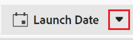

# Veldinstellingen bewerken

 de benadrukte informatie op deze pagina verwijst naar functionaliteit nog niet algemeen beschikbaar. Deze optie is alleen beschikbaar in de voorvertoningsomgeving voor alle klanten. Na de maandelijkse versies aan Productie, zijn de zelfde eigenschappen ook beschikbaar in het milieu van de Productie voor klanten die snelle versies toeliet. 

 voor informatie over snelle versies, zie [ snelle versies voor uw organisatie ](/help/quicksilver/administration-and-setup/set-up-workfront/configure-system-defaults/enable-fast-release-process.md) toelaten of onbruikbaar maken. 

{{planning-important-intro}}

U kunt de instellingen van bestaande velden bewerken in Adobe Workfront Planning.

Voor informatie over het creëren van de gebieden van de Planning van Adobe Workfront, zie [ gebieden ](/help/quicksilver/planning/fields/create-fields.md) creëren.

In dit artikel wordt beschreven hoe u de instellingen voor Workfront-planningsvelden kunt bewerken. Voor informatie over het uitgeven van gebiedswaarden voor verslagen, zie [ verslagen ](/help/quicksilver/planning/records/edit-records.md) uitgeven.

## Toegangsvereisten

+++ Vouw uit om de vereisten voor toegang weer te geven.

U moet de volgende toegang hebben om de stappen in dit artikel uit te voeren:

<table style="table-layout:auto"> 
<col> 
</col> 
<col> 
</col> 
<tbody> 
    <tr> 
<tr> 
<td> 
   
 Producten
 </td> 
   <td> 
   <ul><li>
 Adobe Workfront
</li> 
   <li>
 Adobe Workfront Planning
</li></ul></td> 
  </tr>   
<tr> 
   <td role="rowheader">
Adobe Workfront-abonnement*
</td> 
   <td> 

Een van de volgende Workfront-plannen:
 
<ul><li>Selecteren</li> 
<li>Prime</li> 
<li>Ultimate</li></ul> 

Workfront Planning is niet beschikbaar voor oudere Workfront-plannen
 
   </td> 
<tr> 
   <td role="rowheader">
Adobe Workfront-planningspakket*
</td> 
   <td> 

Alle 
 

Neem contact op met uw Workfront-accountmanager voor meer informatie over wat er in elk Workfront-planningsplan is opgenomen. 
 
   </td> 
 <tr> 
   <td role="rowheader">
Adobe Workfront-platform
</td> 
   <td> 

Het geval van Workfront van uw organisatie moet aan de Adobe Verenigde Ervaring worden bezeten om tot alle mogelijkheden van de Planning van Workfront toegang te hebben.
 

Voor meer informatie, zie <a href="/help/quicksilver/workfront-basics/navigate-workfront/workfront-navigation/adobe-unified-experience.md"> Adobe Verenigde Ervaring voor Workfront </a>. 
 
   </td> 
   </tr> 
  </tr> 
  <tr> 
   <td role="rowheader">
Adobe Workfront-licentie*
</td> 
   <td>
 Standaard 

   
Workfront Planning is niet beschikbaar voor oudere Workfront-licenties
 
  </td> 
  </tr> 
  <tr> 
   <td role="rowheader">
Configuratie op toegangsniveau
</td> 
   <td> 
Er zijn geen toegangsniveaucontroles voor de Planning van Adobe Workfront
   
</td> 
  </tr> 
<tr> 
   <td role="rowheader">
Objectmachtigingen
</td> 
   <td>   
Rechten beheren op een werkruimte  en het recordtype  </a> 
  
   
Systeembeheerders hebben machtigingen voor alle werkruimten, inclusief de werkruimten die ze niet hebben gemaakt
</td> 
  </tr> 
<tr> 
   <td role="rowheader">
Lay-outsjabloon
</td> 
   <td> 
In het milieu van de Productie, moeten alle gebruikers met inbegrip van de Beheerders van het Systeem aan een lay-outmalplaatje worden toegewezen dat Planning omvat.

In het milieu van de Voorproef, hebben de Standaardgebruikers en de Beheerders van het Systeem Planning die door gebrek wordt toegelaten.
 </td> 
  </tr> 
</tbody> 
</table>

*Voor meer informatie over de toegangsvereisten van Workfront, zie [ vereisten van de Toegang in de documentatie van Workfront ](/help/quicksilver/administration-and-setup/add-users/access-levels-and-object-permissions/access-level-requirements-in-documentation.md).

+++

## Overwegingen bij het bewerken van veldinstellingen

U moet het volgende in overweging nemen voordat u wijzigingen aanbrengt in de configuratie van een veld:

* U kunt de veldinstellingen alleen bewerken vanuit de tabel met recordtypen.
* U kunt een veld op de recordpagina of in een andere weergave, buiten de tabelweergave, niet bewerken.
* U kunt het veldtype niet bewerken nadat het veld is opgeslagen.
* U kunt de eerder geselecteerde instelling voor negatieve getallen toestaan niet uitschakelen voor een veld Getal, Percentage of Valuta als er al negatieve waarden zijn opgeslagen in de records waaraan deze is gekoppeld.
* U kunt de configuratie van de volgende veldelementen bewerken nadat u het veld hebt opgeslagen:

   * De naam of beschrijving van een veld
   * De Opties van een Enig-uitgezochte of multi-uitgezochte gebied.
   * De expressie van een veld Formule.

  >[!WARNING]
  >
  >Wanneer formulerendingen veranderen, of de opties van een uitgezocht-type gebied worden toegevoegd of verwijderd, zal er gegevensverlies voor de verslagen zijn die reeds informatie hebben die in de gebieden wordt opgeslagen de waarvan configuratie wordt gewijzigd.
  >
  >Er is geen waarschuwing of indicatie dat dit gegevensverlies kan optreden wanneer u de configuratie van velden wijzigt.
  >
  >Er is geen bericht aan andere gebruikers dat de gebiedsconfiguratie is veranderd.

* U kunt bestaande opzoekvelden van verbonden records bewerken.

<!--at production - April 10, 2025 - remove the last bullet altogether-->

<!--this is not yet true, but it might come later:
* You can deselect Allow negative numbers option from a Number, Percentage, or Currency field after you save the field. 
-->

## Veldinstellingen bewerken

{{step1-to-planning}}

1. Klik op de werkruimte waarvan u de recordvelden wilt bewerken.

   De werkruimte wordt geopend en alle recordtypen in de werkruimte worden op kaarten weergegeven.

1. Klik op de kaart van een recordtype.

   Hierdoor wordt de pagina van het recordtype geopend.

1. (Voorwaardelijk) klik het lusje van de mening van de a **Lijst**.

   Alle bestaande records die aan het recordtype zijn gekoppeld, worden in de rijen van de tabelweergave weergegeven.
1. Plaats over de kolomkopbal van een gebied u wilt uitgeven, dan de naar beneden wijzende pijl na de gebiedsnaam klikken, dan **uitgeeft gebied**

   of

   Dubbelklik op de kolomkop voor het veld.

   

1. Update informatie over het gebied en klik **sparen**. <!--insert screen shot when finalized-->

   >[!TIP]
   >
   >* U kunt het veldtype niet bijwerken nadat het veld is opgeslagen.
   >
   >* Als u veldconfiguraties wijzigt (veldopties of formule-expressies), worden de waarden van records die al informatie in de gewijzigde velden bevatten, in real-time bijgewerkt. Er is geen waarschuwing en geen controlelogboek voor de waardeveranderingen die door de veranderingen van de gebiedsconfiguratie worden teweeggebracht. Alle gebruikers die de velden weergeven, zien de nieuwe waarden direct met de wijzigingen.

   De veldinformatie wordt bijgewerkt voor iedereen die toegang heeft tot de werkruimte.

1. (Voorwaardelijk) voor verbonden verslaggebieden, klik **uitgeeft raadplegingsgebieden** en voeg of verwijder om het even welke raadplegingsgebieden van het verbonden verslagtype toe.

   Voor meer informatie, zie [ Connect verslagtypes ](/help/quicksilver/planning/architecture/connect-record-types.md).