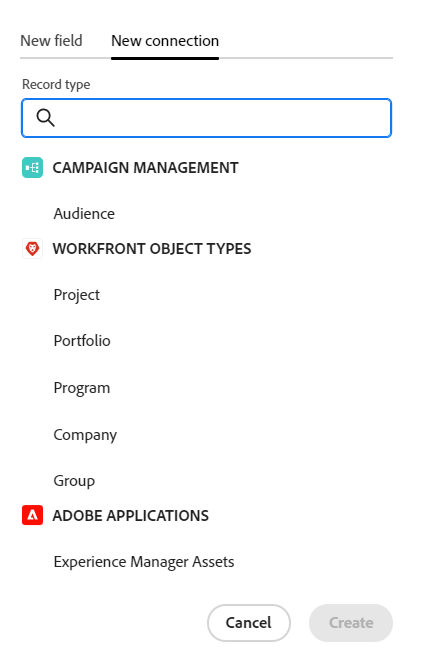

# Overzicht van Adobe Workfront Planning

<!--this article is linked to the WF Planning landing page - do not change URL or move it; send the team a new URL after we add the redirects for this page-->

<!--do not use the snippet for IMPORTANT as it links to this article-->

<!--The highlighted information on this page refers to functionality not yet generally available. It is available only in the Preview environment for all customers, or in the Production environment for customers who enabled fast releases.

For information about fast releases, see [Enable or disable fast releases for your organization](/help/quicksilver/administration-and-setup/set-up-workfront/configure-system-defaults/enable-fast-release-process.md).

For information about the current release, see [Fourth Quarter 2023 release overview](/help/quicksilver/product-announcements/product-releases/23-q4-release-activity/23-q4-release-overview.md).-->

>[!IMPORTANT]
>
>De informatie in dit artikel verwijst naar Adobe Workfront Planning, een extra mogelijkheid van Adobe Workfront.
>
>U moet het volgende hebben om tot de Planning van Workfront toegang te hebben:
>
>* Een nieuw Workfront-pakket en -licentie. Workfront Planning is niet beschikbaar voor verouderde Workfront-pakketten of -licenties.
>* Een Workfront-planningspakket.
>* De instantie van uw organisatie van Workfront moet aan de Adobe Verenigde Ervaring worden genegeerd.
>
> Voor een volledige lijst van vereisten om tot de Planning van Workfront toegang te hebben, zie [ de toegangsoverzicht van de Planning van de Adobe ](/help/quicksilver/planning/access/access-overview.md).
> 

Dit artikel bevat algemene informatie over Workfront Planning.

Voor de volledige lijst van artikelen die documentatie voor de Planning van Workfront bevatten, zie [ Planning van Adobe Workfront: artikelindex ](/help/quicksilver/planning/planning-information.md).

## Inleiding tot Adobe Workfront Planning

Adobe Workfront Planning is een extra mogelijkheid van Adobe Workfront. Het doel van de Planning van Workfront is uitvoerige zicht in de operationele details van een organisatie te ontsluiten, en kritieke bedrijfsvragen in elke fase van de het werkbeheerlevenscyclus te beantwoorden.

Workfront Planning kan vragen als:

* Hoeveel campagnes voeren we in EMEA voor het vierde kwartaal?
* Hebben we publiek overlappingen tussen gezamenlijke campagnes?
* Hoe goed doen de bewustmakingsprogramma&#39;s op dit moment?
* Hoe zien de middelen eruit voor een bepaalde campagne? Welke daarvan moeten nog worden goedgekeurd?

Om deze vragen te beantwoorden, heeft de leiding een oplossing nodig die een holistische mening van elk stadium van het werk van planning tot uitvoering, van levering tot het meten van de resultaten kan verstrekken. Organisaties beschikken momenteel over gereedschappen die betrekking kunnen hebben op bepaalde onderdelen van het proces, maar vaak hebben ze geen goede verbindingen met alle fasen van het werk en kunnen ze ook geen betrouwbare resultaten opleveren.

Hieronder vindt u een aantal van de belangrijkste mogelijkheden:

* Oplossen van het probleem van het beheer van de werkzaamheden in alle stadia en voor alle belanghebbenden die aan het werkproces deelnemen.
* Pas uw workflows volledig aan, van het bepalen van welke objecttypen (of recordtypen) uw organisatie gebruikt om te configureren hoe deze objecten aan elkaar zijn gekoppeld.
* Koppeling maken naar objecttypen van andere systemen en zo een samenhangend kader creëren voor al uw processen.

## Momenteel beschikbare functies voor Workfront-planning

<!--for GA just make a list of what features ARE included in Planning and eliminate the last 2 columns; also update the title of this section-->

<!--at GA: update the link below to the new place for release notes-->

Voor informatie over nieuwe eigenschappen en wanneer zij worden vrijgegeven, zie [ de versieactiviteit van de Planning van Adobe Workfront voor 2024 ](/help/quicksilver/planning/general/release-activity.md).

De volgende functies zijn momenteel beschikbaar in Workfront Planning:

* Werkruimten maken
* Recordtypen maken
* Aangepaste recordvelden maken\
  <!--* Import record types and fields using an Excel or CSV file-->

* Records weergeven in een tabelweergave
* Records weergeven in een tijdlijnweergave
* Records weergeven in een kalenderweergave
* Records in een tabelweergave filteren, sorteren en groeperen
* Code-records in de tijdlijnweergave filteren, groeperen en kleuren
* Records in de kalenderweergave filteren
* Zoeken naar records in de tabel- en tijdlijnweergaven
* Verbind verslagen die tot de zelfde werkruimte behoren
* Verbind verslagen die tot verschillende werkruimten behoren
* Connect Workfront-planningsrecords verbinden met Workfront-projecten, -programma&#39;s, -portfolio&#39;s, -bedrijven en -groepen
* Connect Workfront Planning-records verbinden met Adobe Experience Manager-middelen\
  U moet een Adobe Experience Manager Assets-licentie hebben en een integratie tussen AEM Assets en Workfront.
Voor informatie, zie [ Adobe Workfront voor Experience Manager Assets en Assets Essentials: artikelindex ](/help/quicksilver/documents/adobe-workfront-for-experience-manager-assets-essentials/workfront-for-aem-asset-essentials.md).
* Opnamegegevens weergeven op het tabblad Details
* Recordverbindingen weergeven op het tabblad Verbindingen
* De lay-out van de pagina van een record aanpassen
* Werkruimten delen
* Weergaven delen
* Weergaven openbaar delen met externe bronnen, zelfs met mensen die geen Workfront-gebruikers zijn
* Weergaven dupliceren
* Aanvragen verzenden om records te maken
* Exporteer recordgegevens naar Word en PDF.
* Opmerkingen toevoegen aan records
* In-app meldingen ontvangen
* E-mailberichten ontvangen
* Miniaturen en omslagpagina&#39;s toevoegen aan records
* De geschiedenis van wijzigingen in een record weergeven
* RTF-opmaak voor alineasvelden
* Toegang tot planningsrecords van Workfront-objecten
* Planningsrecords verbinden en loskoppelen van Workfront-objecten
* Planning maken door een aanvraagformulier in te dienen
* Workfront Planning Public API
* Adobe Workfront-planningsmodules voor Adobe Workfront Fusion
* Workfront Planning AI Assistant
* Rapportering over planningsinformatie voor Workfront
U kunt op de informatie van de Planning rapporteren gebruikend het dashboard van het Canvas. Voor informatie, zie [ Overzicht van de Dashboards van het Canvas ](/help/quicksilver/reports-and-dashboards/canvas-dashboards/canvas-dashboards-overview.md).

<!--OLD: 

|       Feature                                      |     Available now  |     Coming soon   |     In research  |
|----------------------------------------------------|:-----------------------------:|:--------------------------------:|:----------------:|
|     Create workspaces                              |   ✓                           |                                  |                  |
|     Create record types                |   ✓                           |                                  |                  |
|     Create record custom fields                    |   ✓                           |                                  |                  |
|     Import record types and fields using an Excel  or CSV file                              |                              |           ✓                       |                  |
|     Link records                                   |   ✓                           |                                  |                  |
|     View records in a table                        |   ✓                           |                                  |                  |
|     View records in a timeline                     |   ✓                           |                                  |                  |
|     View records in a calendar                     |   ✓                           |                                  |                  |
|     Filter records                                 |   ✓                           |                                  |                  |
|     Group records in the timeline view             |   ✓                           |                                  |                  |
|     Group records in the table view                | ✓                              |                                 |                  |
|     Sort records in the table view                                 |  ✓                             |                                 |                  |
|     Sort records in the timeline view                                 |                               |   ✓                              |                  |
|     Sort groupings in the table view                                 |                               |   ✓                              |                  |
|     Sort groupings in the timeline view                                 |                               |   ✓                              |                  |
|   Search for records in the table view    | ✓    |   |
|   Search for records in the timeline view    | ✓    |   |
|     Connect Workfront Planning records to Workfront projects, programs, portfolios, companies, groups  |   ✓                            |                                 |                  |
|     Connect Workfront Planning records to Adobe Experience Manager assets                                  |      ✓                         |                                  |                 |
|     Connect Planning records from different workspaces                                  |      ✓                         |                                  |                 | 
|     Record page with detailed information                            |   ✓                           |                                  |                  |
|     Update the layout of the record's page              |    ✓                           |                                 |                  |
|  Share workspaces | ✓| |  |
|  Share views |✓ | |  |
|  Share views publicly with external resources |✓ | |  |
|  Duplicate views |✓ | |  |
|     Submit requests                                |                               |          ✓                        |                 |
|     Export record details to Word                                 |    ✓                           |                                  |                 |
|     Export record details to PDF                                 |                               |                                  |       ✓          |
|     Customize the color and icon of a record                                 |      ✓                         |                                  |                 |
|     Add comments to records                                 | ✓                              |                                  |                 |
|     Receive in-app notifications                                 | ✓                              |                                  |                 |
|     Receive email notifications                                 | ✓                              |                                  |                 |
|     Add thumbnails to records                                 | ✓                              |                                  |                 |
|     View history of changes on a record                                 | ✓                              |                                  |                 |
|     Rich Text formatting for Paragraph fields                                 |      ✓                         |                                  |                 | 
|     Adobe Workfront Planning modules for Adobe Workfront Fusion                                 |      ✓                         |                                  |                 | 
|     Copy and paste information from one field to another                                  |      ✓                         |                                  |                 | 
|     Access Planning records from Workfront objects                                  |      ✓                         |                                  |                 |
|     Connect Planning records from Workfront objects                                  |      ✓                         |                                  |                 |
|     Workfront Planning public API                                 |      ✓                         |                                  |                 |
|     Workfront Planning AI Assistant*                                 |      ✓                         |                                  |                 |
|     Reporting on Workfront Planning information (Canvas Dashboard)                              |                               |       ✓                           |                 |
-->

## Workfront Planning inschakelen voor de gebruikers in uw Workfront-exemplaar

Nadat uw organisatie een vergunning voor de Planning van Workfront, als beheerder van Workfront koopt, moet u het volgende verzekeren zijn op zijn plaats alvorens de gebruikers tot de Planning van Workfront kunnen toegang hebben:

* Wijs de gebruikers toe die toegang tot de Planning van een lay-outmalplaatje nodig hebben dat Planning in het Belangrijkste Menu omvat. Voor meer informatie, zie [ het Belangrijkste Menu aanpassen gebruikend een lay-outmalplaatje ](/help/quicksilver/administration-and-setup/customize-workfront/use-layout-templates/customize-main-menu.md) en [ wijs gebruikers aan een lay-outmalplaatje ](/help/quicksilver/administration-and-setup/customize-workfront/use-layout-templates/assign-users-to-layout-template.md) toe.

* Wijs gebruikers een Workfront-licentie en Workfront Planning-machtigingen toe waarmee u 5554hview kunt weergeven of objecten kunt maken in Workfront Planning. Voor meer informatie over het verlenen van toegang tot en het toelaten van anderen om de Planning van Workfront te gebruiken, zie [ het Overzicht van de toegang van de Planning van de Adobe ](/help/quicksilver/planning/access/access-overview.md).

## Workfront Planning terminologie

Hoewel Workfront Planning onderdeel is van Workfront, wordt het geleverd met eigen concepten en terminologie. Zorg ervoor dat u bekend bent met de nieuwe concepten voordat u begint met het instellen van Workfront Planning voor uw organisatie.

Het raamwerk voor Workfront Planning is volledig aanpasbaar. U kunt alle recordtypen, hun kenmerken en alle bijbehorende velden maken op basis van de exacte behoeften van uw organisatie.

Er gelden beperkingen voor het aantal Workfront Planning-objecten dat u kunt maken. Voor meer informatie, zie [ overzicht van de objectbeperkingen van de Planning van Adobe Workfront ](/help/quicksilver/planning/general/limitations-overview.md).

Hieronder vindt u de belangrijkste Workfront-planningsobjecten en -concepten:

* **Workspace**: Een inzameling van verslagtypes die de operationele levenscyclus van een bepaalde organisatie bepalen. Een werkruimte is het werkkader van een organisatorische eenheid.

  

  Voor meer informatie, zie [ werkruimten ](/help/quicksilver/planning/architecture/create-workspaces.md) creëren.

* **Type van Verslag**: De naam van objecten types in de Planning van Workfront.

  In tegenstelling tot Workfront, waar de objecttypen vooraf zijn gedefinieerd, kunt u in Workfront Planning uw eigen objecttypen maken.

  In Workfront zijn bijvoorbeeld al de objecttypen Programma, Portfolio, Project, Taak of Probleem gemaakt.

  In de Planning van Workfront, kunt u om het even welke verslagtypes tot stand brengen die aan de werkschema&#39;s van uw organisatie voldoen. Later kunt u bepalen hoe de recordtypen op elkaar betrekking hebben of hoe afhankelijk van het formulier is.

  Voor meer informatie, zie [ overzicht van de types van Verslag ](/help/quicksilver/planning/architecture/overview-of-record-types.md).

* **Verslag**: Een geval van een verslagtype.

  

  Nadat u een recordtype aan een werkruimte hebt toegevoegd, kunt u records van dat type op de pagina van het recordtype toevoegen.

  &#39;Campagne&#39; kan bijvoorbeeld een recordtype zijn en &#39;Summer Campaign for EMEA&#39; is een record van het type Campagne-record.

  Voor meer informatie, zie [ verslagen ](/help/quicksilver/planning/records/create-records.md) creëren.

* **malplaatje van Workspace**: U kunt een werkruimte tot stand brengen gebruikend vooraf bepaalde malplaatjes. U kunt de vooraf gedefinieerde recordtypen en -velden gebruiken die in een sjabloon voorkomen, of u kunt uw eigen recordtypen toevoegen.

  

  Adobe Workfront Planning bevat de volgende sjablonen:

   * Basis: Marketing Management
   * Geavanceerd: marketingbeheer
   * Enterprise: Marketing Management
   * Verkoopbeheer
   * Productbeheer

  Voor meer informatie, zie [ Lijst van werkruimtesjablonen ](/help/quicksilver/planning/architecture/workspace-templates.md).

* **Gebieden**: De gebieden zijn attributen die u aan verslagtypes kunt toevoegen. Velden bevatten informatie over het recordtype. <!--check the shot below, "Connection" needs to be in lowercase-->

  

  Overwegingen bij recordvelden:

   * De velden die u voor een recordtype toevoegt, worden automatisch gekoppeld aan alle records van dat type en kunnen worden gebruikt om gegevens over die records vast te leggen.

   * Velden worden weergegeven als kolommen in de tabelweergave die is toegepast op een recordtypepagina. Ze worden ook weergegeven op de pagina van de record.

   * Velden zijn uniek voor een recordtype en worden niet van het ene naar het andere recordtype overgedragen.

   * De gebieden zijn volledig klantgericht en zijn toegankelijk slechts in de Planning van Workfront. U hebt vanuit Workfront geen toegang tot Workfront-planningsvelden.

  Voor meer informatie, zie [ gebieden ](/help/quicksilver/planning/fields/create-fields.md) creëren.

  Een nieuw recordtype is standaard gekoppeld aan de volgende vooraf gedefinieerde velden:

   * Naam
   * Beschrijving
   * Begindatum
   * Einddatum
   * Status

  U kunt aangepaste velden maken van de volgende typen:

   * Tekst met één regel
   * Alinea
   * Meerdere selecties
   * Enkel selecteren
   * Datum
   * Getal
   * Percentage
   * Valuta
   * Selectievakje
   * Formule
   * Mensen
   * Gemaakt door
   * Aanmaakdatum
   * Laatst gewijzigd door
   * Laatst gewijzigd

* **Verbonden verslagtypes**, **Verbonden verslagen**, en **Verbonden gebieden**: U kunt een verbinding tussen de volgende entiteiten in de Planning van Workfront tot stand brengen:

   * Twee Workfront-recordtypen voor planning.
   * Een recordtype en een Workfront-type project, -programma, -portfolio, -bedrijf of -groepsobject.
   * Een recordtype en een Adobe Experience Manager-middel of -map.

     U moet een Adobe Experience Manager-licentie hebben om recordtypen te koppelen aan Experience Manager-objecten.

     

  Nadat u een verbinding tussen de recordtypen tot stand hebt gebracht, kunt u afzonderlijke records van die typen met elkaar verbinden. De verbinding tussen de records wordt weergegeven als een gekoppeld recordveld.

* **Gekoppelde gebieden** (of raadplegingsgebieden): Nadat u de verbinding tussen twee verslagtypes vestigt en u individuele verslagen samen verbindt, kunt u de verbonden verslagen&#39; gebieden op het verslag van verwijzingen voorzien u van verbindt.

  Bijvoorbeeld, als u een type van het verslag van de Campagne met een de objecten van het Project van Workfront type verbindt, kunt u het gebied van de Begroting van verbonden projecten op de campagneverslagen tonen.

  

  >[!TIP]
  >
  > U kunt de volgende veldtypen niet toevoegen als opzoekvelden van de verbonden record- of objecttypen:
  >
  >* Mensen
  >* Gemaakt door
  >* Laatst gewijzigd door
  >* Workfront-typeahead-velden (inclusief velden zoals Projecteigenaar of Projectsponsor)

  Zie de volgende artikelen voor informatie over het koppelen van recordtypen, records en gekoppelde velden:

   * [Verbind recordtypen](/help/quicksilver/planning/architecture/connect-record-types.md)
   * [Connect-records](/help/quicksilver/planning/records/connect-records.md)

<!--not yet:* Fields are reusable across Record Types.  -->

* **Meningen**: De vertoning van verslagen onder hun respectieve verslagtype pagina in verschillende soorten meningen.

  

  Weergaven bevatten gepersonaliseerde instellingen van een specifiek weergavetype, zoals de lijst met velden (kolommen), een lijst met records (rijen), de volgorde (sortering), een toegepast of toepasselijk filter en een groep.

  Hieronder ziet u weergavetypen die u kunt toepassen op de pagina met recordtypen:

   * **mening van de Lijst**: De verslagen van vertoningen en hun gebieden, met inbegrip van verbonden en raadplegingsgebieden, in een lijstformaat. De rijen van de tabel zijn de afzonderlijke records en de kolommen zijn de recordvelden. De tabelweergave is de standaardweergave.

     

   * **mening van de Chronologie**: De verslagen van vertoningen die minstens twee Datum-type gebieden in een chronologische chronologische chronologische chronologie hebben. U kunt maximaal vijf verbonden recordtypen en de bijbehorende records weergeven in de tijdlijnweergave.

     

   * **mening van de Kalender**: De verslagen van vertoningen die minstens twee Datum-type gebieden in een kalenderformaat hebben.
     

Voor meer informatie, zie [ verslagmeningen ](/help/quicksilver/planning/views/manage-record-views.md) leiden.

## Adobe Workfront-planning zoeken

Om van de Planning van de Adobe de plaats te bepalen, zorg ervoor dat uw organisatie toegang tot de Planning van Workfront heeft ontvangen en dat uw systeem of groepsbeheerder het gebied van de Planning aan uw Belangrijkste Menu heeft toegevoegd. Voor informatie, zie [ de toegangsoverzicht van de Planning van de Adobe ](/help/quicksilver/planning/access/access-overview.md).

Workfront-planning zoeken:

1. Meld u aan bij Adobe Workfront.

{{step1-click-main-menu}}

1. Klik **Planning** .

   De hoofdpagina Workfront Planning wordt geopend.

   

   >[!TIP]
   >
   >    Uw Workfront-beheerder kan het planningsgebied toevoegen aan de optie Landingspagina selecteren in uw lay-outsjabloon, zodat u Planning kunt openen zodra u zich aanmeldt bij Workfront. Voor informatie, zie [ de het landen pagina aanpassen gebruikend een lay-outmalplaatje ](/help/quicksilver/administration-and-setup/customize-workfront/use-layout-templates/customize-landing-page.md).

1. (Voorwaardelijk en optioneel) Als u een Workfront-beheerder bent, klikt u op een van de volgende tabbladen:
   * **Werkruimten ik** ben: De werkruimten van vertoningen die u creeerde of werkruimten die met u worden gedeeld.
   * **Andere werkruimten**: Toont alle andere werkruimten in het systeem.

   Voor alle andere gebruikers, zowel werkruimten die zij creeerden of met hen worden gedeeld tonen in het **1} gebied van de Werkruimten {.**

1. (Optioneel en aanbevolen) Ga door met een aantal van de volgende acties om uw werkstructuur te maken:

   1. Maak een werkruimte helemaal opnieuw of gebruik een sjabloon. Voor informatie, zie [ werkruimten ](/help/quicksilver/planning/architecture/create-workspaces.md) creëren.

   1. Voeg secties toe aan de nieuwe werkruimte. Voor informatie, zie [ werkruimten ](/help/quicksilver/planning/architecture/edit-workspaces.md) uitgeven.
   1. Wijzig de naam van de bestaande secties in de nieuwe werkruimte.
   1. Voeg recordtypen toe aan de nieuwe werkruimte. Voor informatie, zie [ recordtypes ](/help/quicksilver/planning/architecture/create-record-types.md) creëren.

   1. Klik op de naam van een recordtype om de pagina van het recordtype te openen. De pagina met recordtypen wordt standaard in de tabelweergave geopend.

      U kunt ook een tijdlijn of een kalenderweergave maken. Voor informatie, zie [ verslagmeningen ](/help/quicksilver/planning/views/manage-record-views.md) leiden.

   1. Voeg in de tabelweergave records toe door rijen toe te voegen

      of

      Voeg recordvelden toe door kolommen toe te voegen.

      Raadpleeg de volgende artikelen voor meer informatie:

      * [Records maken](/help/quicksilver/planning/records/create-records.md)
      * [ creeer gebieden ](/help/quicksilver/planning/fields/create-fields.md).

## Workfront Planning Release-activiteit

<!--update this with the new release activity page - the article index for all Planning releases-->

We geven regelmatig nieuwe functies aan Workfront Planning.

Voor een bijgewerkte lijst van vrijgegeven eigenschappen, zie [ de versieactiviteit van de Planning van Adobe Workfront: artikelindex ](/help/quicksilver/product-announcements/product-releases/planning-release-activity/planning-release-activity-article-index.md).

## Aanvullende bronnen voor Workfront Planning

* [ Planning van Adobe Workfront: artikelindex ](/help/quicksilver/planning/planning-information.md): Een index van alle artikelen die documentatie over de Planning van Workfront bevatten, die door gebied van belang wordt gegroepeerd.
* [ de Planning AI van Adobe Workfront Hulpoverzicht ](/help/quicksilver/planning/general/planning-ai-assistant-overview.md): Met de Medewerker van Workfront AI voor de Planning kunt u naar verslagen zoeken, of, verslagen tot stand brengen bijwerken en schrappen door bevelen te gebruiken en de medewerker het werk voor u te laten doen.
  <!--
    >[!NOTE]
    >
    >    The Workfront AI Assistant has been temporarily removed and it will be available at a later date.-->

* [ Adobe Workfront planningsmodules voor de Fusie van Workfront ](/help/quicksilver/workfront-fusion/apps-and-their-modules/workfront-planning-modules.md): Met de modules van de Planning van Adobe Workfront, kunt u een scenario teweegbrengen wanneer de gebeurtenissen in de Planning van Workfront voorkomen. U kunt ook records maken, lezen, bijwerken en verwijderen of een aangepaste API-aanroep naar uw Adobe Workfront Planning-account uitvoeren.

* [ de Planning API van Adobe Workfront basiscs ](/help/quicksilver/planning/general/planning-api-basics.md): Het doel voor de Planning API van Adobe Workfront is bouwintegratie met Planning te vereenvoudigen door een REST-ful architectuur te introduceren die over HTTP werkt.

* **de Planning van Workfront rapporteringsmogelijkheden**: U kunt de informatie van de Planning van Workfront in een rapport in Workfront nu bekijken gebruikend het Dashboard van het Canvas van Workfront. Voor informatie, zie [ begonnen worden met de Dashboards van het Canvas ](/help/quicksilver/reports-and-dashboards/canvas-dashboards/manage-canvas-dashboards/get-started-canvas-dashboards.md).

