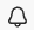

# E-mailberichten voor Adobe Workfront Planning beheren

<!--The highlighted information on this page refers to functionality not yet generally available. It is available only in the Preview environment for all customers. After the monthly releases to Production, the same features are also available in the Production environment for customers who enabled fast releases.    

For information about fast releases, see [Enable or disable fast releases for your organization](/help/quicksilver/administration-and-setup/set-up-workfront/configure-system-defaults/enable-fast-release-process.md). -->

{{planning-important-intro}}

U kunt e-mailmeldingen ontvangen van Workfront Planning wanneer de volgende scenario&#39;s bestaan:

* Iemand tagt u of uw teams in een recordopmerking

  Voor informatie over het etiketteren van anderen in een verslagcommentaar, zie [&#x200B; recordcommentaren beheren &#x200B;](/help/quicksilver/planning/records/manage-record-comments.md).
* Iemand vraagt om uw toestemming om tot een mening, een werkruimte, of verslagtype toegang te hebben <!--or or a record-->
* Iemand bevestigt dat uw toegang is verleend voor een weergave, werkruimte of recordtype <!--or record--> <!--Isk confirmed that there is nno email for denying access but did not test-->
* Je verzendt een aanvraag voor Workfront-planning. Voor informatie, zie [&#x200B; creeer en beheer een verzoekvorm in de Planning van Adobe Workfront &#x200B;](/help/quicksilver/planning/requests/create-request-form.md)
* Iemand keurt of verwerpt een Workfront-planningsverzoek dat u hebt ingediend goed. Voor informatie, zie [&#x200B; een verzoek in de Planning van Adobe Workfront goedkeuren &#x200B;](/help/quicksilver/planning/requests/approve-request.md)
* De status verandert in een Workfront-planningsverzoek dat u hebt verzonden.

## Toegangsvereisten

+++ Breid uit om de toegangsvereisten voor de functionaliteit in dit artikel te bekijken. 

<table style="table-layout:auto"> 
<col> 
</col> 
<col> 
</col> 
<tbody> 
    <tr> 
<tr> 
</tr>   
<tr> 
   <td role="rowheader">
Adobe Workfront-pakket
</td> 
   <td> 

Alle Workfront en alle planningspakketten
 
Willekeurige workflow en planningspakket

Neem voor meer informatie over wat er in elk planningspakket voor Workfront staat, contact op met uw Workfront-accountvertegenwoordiger. 
 
   </td> 
  <tr> 
   <td role="rowheader">
Adobe Workfront-licentie
</td> 
   <td>
Licht of hoger

   </td> 
  </tr> 
  <tr> 
   <td role="rowheader">
Objectmachtigingen
</td> 
   <td>   
De mening of hogere toestemmingen aan een werkruimte </a> 
  
   
Systeembeheerders hebben machtigingen voor alle werkruimten, inclusief de werkruimten die ze niet hebben gemaakt
 </td> 
  </tr> 
<tr>
   <td role="rowheader">
Lay-outsjabloon
</td>
   <td> De gebruikers met een Licht of de vergunning van de Medewerker moeten een lay-outmalplaatje worden toegewezen dat Planning omvat.
   
De standaardgebruikers en de Beheerders van het Systeem hebben de Gebieden van de Planning die door gebrek worden toegelaten.

</li></ul>
</td>
  </tr> 
</tbody> 
</table>

Voor meer informatie over de toegangsvereisten van Workfront, zie [&#x200B; vereisten van de Toegang in de documentatie van Workfront &#x200B;](/help/quicksilver/administration-and-setup/add-users/access-levels-and-object-permissions/access-level-requirements-in-documentation.md).

+++

<!--
OLD: 

<table style="table-layout:auto"> 
<col> 
</col> 
<col> 
</col> 
<tbody> 
    <tr> 
<tr> 
<td> 
   
 Products
 </td> 
   <td> 
   <ul><li>
 Adobe Workfront
</li> 
   <li>
 Adobe Workfront Planning
</li></ul></td> 
  </tr>   
<tr> 
   <td role="rowheader">
Adobe Workfront plan*
</td> 
   <td> 

Any of the following Workfront plans:
 
<ul><li>Select</li> 
<li>Prime</li> 
<li>Ultimate</li></ul> 

Workfront Planning is not available for legacy Workfront plans
 
   </td> 
<tr> 
   <td role="rowheader">
Adobe Workfront Planning package*
</td> 
   <td> 

Any 
 

For more information about what is included in each Workfront Planning plan, contact your Workfront account manager. 
 
   </td> 
 <tr> 
   <td role="rowheader">
Adobe Workfront platform
</td> 
   <td> 

Your organization's instance of Workfront must be onboarded to the Adobe Unified Experience.
 

The users in your organization receive notifications from Workfront Planning only when your organization is onboarded to the Adobe Unified Experience. 

For more information, see <a href="/help/quicksilver/workfront-basics/navigate-workfront/workfront-navigation/adobe-unified-experience.md">Adobe Unified Experience for Workfront</a>. 
 
   </td> 
   </tr> 
  </tr> 
  <tr> 
   <td role="rowheader">
Adobe Workfront license*
</td> 
   <td>
 Standard, Light, or Contributor

   
Workfront Planning is not available for legacy Workfront licenses
 
  </td> 
  </tr> 
  <tr> 
   <td role="rowheader">
Access level configuration
</td> 
   <td> 
There are no access level controls for Adobe Workfront Planning
   
</td> 
  </tr> 
<tr> 
   <td role="rowheader">
Object permissions
</td> 
   <td>   
View or higher permissions to a workspace</a> 
  
   
System Administrators have permissions to all workspaces, including the ones they did not create
 </td> 
  </tr> 
<tr>
   <td role="rowheader">
Layout template
</td>
   <td> Users with a Light or Contributor license must be assigned a layout template that includes Planning.
   
Standard users and System Administrators have the Planning areas enabled by default.

</li></ul>
  
</td>
  </tr>

</tbody> 
</table>
-->

## E-mailmeldingen beheren wanneer iemand u in een opmerking van tags voorziet

1. (Voorwaardelijk en optioneel) Nadat iemand u of uw team tags heeft toegevoegd aan een opmerking in een record, gaat u naar het e-mailbericht dat u op de hoogte brengt van de tag en de opmerking. De afzender van de e-mail is Adobe Experience Cloud.

   

1. (Facultatief) klik het bericht in het **Workfront** vakje binnen e-mail.

   De pagina met recorddetails wordt geopend in Workfront. U kunt de record bijwerken of op de opmerking reageren.

1. (Voorwaardelijk) als beschikbaar, klik **Mening alle berichten**. <!--check with Lilit - do non-IMS users have this button??-->
De **Berichten** pagina opent in Adobe Experience Cloud. Alle berichten van alle Adobe Experience Cloud-toepassingen worden weergegeven.

## E-mailmeldingen beheren wanneer machtigingen worden aangevraagd en verleend

1. (Voorwaardelijk en optioneel) Nadat iemand u om toestemming verzoekt of verleent om tot een het objecten type van de Planning toegang te hebben, ga naar e-mail die u van het toestemmingsverzoek op de hoogte brengt. De afzender van de e-mail is Adobe Experience Cloud.

1. (Facultatief) klik het bericht in het **Workfront** vakje binnen e-mail.

   Het object waarvoor u machtigingen hebt gevraagd, wordt geopend in Workfront.

1. (Voorwaardelijk) als beschikbaar, klik **Mening alle berichten**.
De **pagina van Meldingen** opent in Adobe Experience Cloud. Alle berichten van alle Adobe Experience Cloud-toepassingen worden weergegeven.

Voor informatie over het verzoeken van, het verlenen van, of het ontkennen van toestemmingen, zie {de toestemmingen van het 0} Verzoek aan een mening of een werkruimte [.](/help/quicksilver/planning/access/request-permissions.md)

Voor informatie over het beheren van uw berichten van de Planning van Workfront, zie [&#x200B; de het berichtvoorkeur van de Planning van Adobe Workfront beheren &#x200B;](/help/quicksilver/planning/notifications/manage-notification-preferences.md).

## E-mailmeldingen beheren over het verzenden, goedkeuren of negeren van Workfront-planningsverzoeken

1. (Optioneel) Ga naar de e-mail die Workfront u stuurt
nadat u een verzoek hebt ingediend of nadat een door u ingediend verzoek is goedgekeurd of afgewezen. De afzender van de e-mail is Adobe Workfornt.

1. (Facultatief) klik **Open verzoek**. Dit opent het verzoek in de Planning van Workfront.

1. Klik het **pictogram van de Meldingen** pictogram van het het gebiedspictogram van  **pagina van Meldingen toegang te hebben.**

   Voor informatie over het beheren van uw berichten van de Planning van Workfront, zie [&#x200B; de het berichtvoorkeur van de Planning van Adobe Workfront beheren &#x200B;](/help/quicksilver/planning/notifications/manage-notification-preferences.md).
