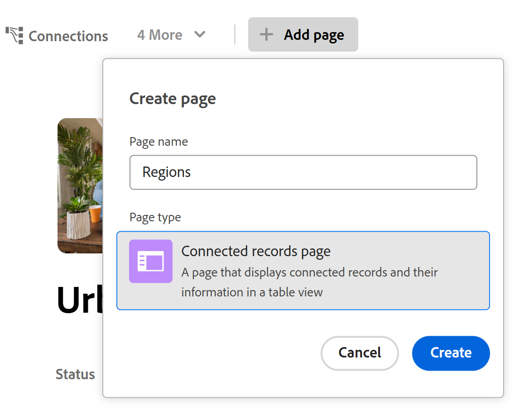

# Een verbonden recordpagina toevoegen aan een record

<!--The highlighted information on this page refers to functionality not yet generally available. It is available only in the Preview environment for all customers. After the monthly releases to Production, the same features are also available in the Production environment for customers who enabled fast releases.    

For information about fast releases, see [Enable or disable fast releases for your organization](/help/quicksilver/administration-and-setup/set-up-workfront/configure-system-defaults/enable-fast-release-process.md). -->

U kunt informatie van verbonden verslagen of voorwerpen bekijken door een lusje voor een Verbonden verslagenpagina aan een verslag in de Planning van Adobe Workfront toe te voegen. Hiermee voegt u de verbonden records in een tabelweergave toe aan het tabblad.

Houd rekening met het volgende wanneer u een pagina Verbonden records aan een record toevoegt:

* U kunt een pagina Verbonden records aan een record toevoegen nadat u de record- of objecttypen vanuit de tabelweergave hebt verbonden met het recordtype.

* U kunt een pagina met verbonden records toevoegen vanuit het voorvertoningsgebied van een record of de pagina van de record.

* U kunt slechts één verbonden verslagenpagina voor een specifiek verslagtype hebben.

  Als u bijvoorbeeld een pagina met verbonden records voor een campagne maakt en u de bijbehorende persoonlijke gegevens wilt weergeven, hebt u slechts één verbonden pagina met records voor Persoonlijke personen.

* Verbonden recordpagina&#39;s geven alleen de verbonden objecten of records van één object of recordtype weer. Op de pagina worden niet alle records van dat type weergegeven.

* Afhankelijk van het object of het recordtype dat u op de pagina met verbonden records weergeeft, kunt u deze weergeven met de volgende weergaven:

   * U kunt verbonden verslagen van de Planning in de volgende types van meningen tonen:
      * Tabel
      * Tijdlijn
      * Kalender
   * U kunt verbonden Workfront-projecten weergeven in een lijstweergave.

* U kunt Verbonden recordpagina&#39;s toevoegen voor de volgende verbonden record- of objecttypen:

   * Workfront Planning-recordtypen
   * Workfront-projecten

     U kunt de verbonden Workfront-projecten ook weergeven als u geen toegangsrechten hebt in Workfront.

## Toegangsvereisten

+++ Breid uit om de toegangsvereisten voor de functionaliteit in dit artikel te bekijken. 

<table style="table-layout:auto"> 
<col> 
</col> 
<col> 
</col> 
<tbody> 
    <tr> 
<tr> 
</tr>   
<tr> 
   <td role="rowheader">
Adobe Workfront-pakket
</td> 
   <td> 

Alle Workfront en alle planningspakketten

Willekeurige workflow en planningspakket

Neem voor meer informatie over wat er in elk planningspakket voor Workfront staat, contact op met uw Workfront-accountvertegenwoordiger. 
 
   </td> 
<tr>
<td> 
   
 Aanvullende producten
 </td> 
   <td> 
   
 Als u een verbonden recordpagina wilt toevoegen voor objecten uit de volgende toepassingen, moet u niet alleen over Adobe Workfront beschikken, maar ook over de volgende opties:

   <ul><li>
Een Adobe Experience Manager Assets-licentie en integratie tussen AEM Assets en Workfront om AEM-middelen te verbinden met planningsrecordtypen.

   
Voor informatie, zie <a href="/help/quicksilver/documents/adobe-workfront-for-experience-manager-assets-essentials/workfront-for-aem-asset-essentials.md"> Adobe Workfront voor Experience Manager Assets en de Hoofdzaak van Activa: artikelindex </a>. 
</li>
   <li>
 Een Adobe GenStudio for Performance Marketing-licentie om recordtypen te verbinden met GenStudio Brands

   
Voor informatie, zie <a href="https://experienceleague.adobe.com/en/docs/genstudio-for-performance-marketing/user-guide/get-started"> begonnen worden met Adobe GenStudio for Performance Marketing </a>.
</li></ul>
   </td> 
  </tr>

<tr> 
   <td role="rowheader">
Adobe Workfront-licentie
</td> 
   <td>
Standard

   </td> 
  </tr> 
  <tr>
   <td role="rowheader">
Objectmachtigingen
</td>
   <td>
   
Contribute of hoger machtigingen voor een werkruimte en recordtype 
  
   
Systeembeheerders hebben machtigingen voor alle werkruimten, inclusief de werkruimten die ze niet hebben gemaakt
 
  </td>
  </tr>   
</tbody> 
</table>

Voor meer informatie over de toegangsvereisten van Workfront, zie [ vereisten van de Toegang in de documentatie van Workfront ](/help/quicksilver/administration-and-setup/add-users/access-levels-and-object-permissions/access-level-requirements-in-documentation.md).

+++   

## Een verbonden recordpagina toevoegen aan een record

U moet recordtypes met andere verslagtypes of de projecten van Workfront eerst verbinden alvorens een verbonden verslagenpagina aan een verslag toe te voegen.

1. Klik op de naam van de record om deze te openen vanuit een willekeurige weergave van een pagina met recordtypen.
1. Klik **toevoegen pagina** van één van de volgende gebieden:

   * Het voorvertoningsvenster van de record
   * De de detailspagina van het verslag, na het klikken van **Open in nieuw lusje** pictogram  in de hoger-juiste hoek van de voorproefpagina.

   **creeer pagina** doos opent.

    toe

1. Voeg de **naam van de Pagina** toe, klik **Verbonden verslagenpagina** voor het **type van Pagina**, dan klik **creeert**.
1. (Optioneel) Klik op de naam van een verbonden record of objecttype in de lijst of zoek ernaar. Klik vervolgens op de naam wanneer deze in de lijst wordt weergegeven om de pagina voor dat record- of objecttype te maken.

   >[!TIP]
   >
   >U kunt één verbonden verslagenpagina per verslagtype tot stand brengen. Als een verbonden recordtype al een pagina heeft, wordt deze niet meer weergegeven als een optie.
   >

1. (Facultatief en voorwaardelijk) als meer dan één verbonden gebied van het verslag of objecten type u de pagina voor vertoningen bouwt, klik het gebied waarvan verslagen of voorwerpen u in de verbonden verslagenpagina van de **Uitgezochte verwijzingsgebied** lijst wilt tonen.

   

   Een van de volgende pagina&#39;s wordt toegevoegd aan de pagina voor verbonden records:

   * De tabelweergave van een recordtype
   * De lijstmening van een type van projectobjecten

   De verslagen of de projecten die met het huidige verslag worden verbonden tonen in de lijst of lijstmening.

   >[!TIP]
   >
   >U moet verbonden verslagen in de lijst of het gebied van Details van een verslag toevoegen alvorens u hen in een verbonden verslagenpagina kunt tonen. Anders is de tabel of lijst leeg.

   De eerste vijf velden van de verbonden records worden standaard weergegeven. Er worden standaard geen opzoekvelden weergegeven.

   

1. (Voorwaardelijk) Afhankelijk van het type records dat u in de verbonden recordpagina weergeeft, voert u een van de volgende handelingen uit:

   * Planningsrecords beheren
Voor informatie, zie de sectie [ de verbonden verslagenpagina voor de Planning verslagen ](#manage-the-connected-records-page-for-planning-records) in dit artikel beheren.
   * Workfront-projecten beheren
Voor informatie, zie de sectie [ de verbonden verslagenpagina voor de projecten van Workfront ](#manage-the-connected-records-page-for-workfront-projects) in dit artikel beheren.

1. (Optioneel) Dubbelklik op de naam van de **Verbonden recordpagina** tab

   of

   Beweeg over de naam van het lusje, dan klik **Meer** , dan klik **anders noemen** om aan nieuwe verbonden verslagenpagina tabel anders te noemen.

1. (Facultatief) Beweeg over de naam van de verbonden verslagenpagina tabel, klik **Meer** , dan klik **Schrapping** om aan tabel te verwijderen.

### De verbonden recordpagina voor planningsrecords beheren

<!--

#### Manage the connected records page for Planning records in the Production environment

When you create a connected records page for  connected Planning records in the Production environment, do the following: (****or AEM Assets - AEM is not available yet?? see note below********)

1. Go to a record type page and click the name of a record. This opens the record's preview page.
1. Click the tab for a connected records page that display Planning records.
   The records connected to the record you selected display in the table view. 
1. Click **Connect** at the bottom of the table view to connect existing records, select them from the connection box, then click outside the box to close it. The records are automatically added to the table and connected to the record you selected. The records must exist before you can add them.

   For more information, see [Connect records](/help/quicksilver/planning/records/connect-records.md).

1. Edit any information from the connected records inline in the table view. 
1. Hover over a connected record's name, then click the **More** menu 

   Or 
   
   Select one of the records, then click one of the following options in the blue bar at the bottom of the list: 

   * **View** to open the record page in a new tab
   * **Copy link** to copy a link to the record page
   * **Edit thumbnail** to open the **Record thumbnail** box and edit the record's thumbnail image
   * **Duplicate** to duplicate the connected record. The duplicated record is also connected to the current record.
   * **Insert record above or below** to add new records to the connected record type. New records added here are also connected to the current record. This option is not available in the blue bar when selecting a record in the table.
   * **Delete** to delete the record. Deleting a connected record deletes it from its record type and from everywhere where the record is connected. The deleted records move to the **Recently deleted** bin of their record type.

      For information about editing records in the table view, see [Edit records](/help/quicksilver/planning/records/edit-records.md). 

      >[!TIP]
      >
      >You can select more than one record or object to delete them.
      >

1. Inline edit any of the records in the table on the connected records page.
1. Use any of the following view elements in the toolbar of a connected record page to manage the table view:

   * **Filters**
   * **Sort**
   * **Grouping**
   * **Fields**, to display, hide, or rearrange fields
   * **Row height**
   * **Search**

   For information, see [Manage the table view](/help/quicksilver/planning/views/manage-the-table-view.md). 

   >[!NOTE]
   >
   >You cannot create, edit, or delete fields in the table view of a connected record's tab.
   >

#### Manage the connected records page for Planning records in the Preview environment

When you create a connected records page for connected Planning records in the Preview environment, do the following: (***********or AEM Assets -- AEM is not available yet?? see note below**********)

-->

1. Ga naar een pagina met recordtypen en klik op de naam van een record. Hierdoor wordt de voorvertoningspagina van de record geopend.
1. Klik het lusje voor een verbonden verslagenpagina die de verslagen van de Planning tonen.
De records die zijn verbonden met de record die u hebt geselecteerd, worden weergegeven in de tabelweergave.
1. Klik **verbinden verslagen** in de hoger-juiste hoek van de verbonden verslagpagina, om bestaande verslagen te verbinden, hen van de verbindingsdoos te selecteren, dan buiten de doos te klikken om het te sluiten. De records worden automatisch aan de tabel toegevoegd en gekoppeld aan de record die u hebt geselecteerd. De records moeten bestaan voordat u ze kunt toevoegen.

   Voor meer informatie, zie [ verbindt verslagen ](/help/quicksilver/planning/records/connect-records.md).

1. Klik **Nieuwe rij** bij de bodem van de lijst om nieuwe verslagen toe te voegen. De nieuwe records worden automatisch verbonden met de records die u hebt geselecteerd.
1. Bewerk alle informatie uit de verbonden records inline in de tabelweergave.
1. Beweeg over de naam van een verbonden verslag, dan klik **Meer** menu 

   of

   Selecteer een van de records en klik op een van de volgende opties in de blauwe balk onder aan de lijst:

   * **Mening** om de verslagpagina in een nieuw lusje te openen
   * **verbinding van het Exemplaar** om een verbinding aan de verslagpagina te kopiëren
   * **geeft duimnagel** uit om de **duimnagel van het Verslag** doos te openen en het duimnagelbeeld van het verslag uit te geven
   * **dupliceer** om het verbonden verslag te dupliceren. De gedupliceerde record wordt ook verbonden met de huidige record.
   * **Verslag van het Tussenvoegsel boven of onder** om nieuwe verslagen aan het verbonden verslagtype toe te voegen. Nieuwe records die u hier toevoegt, worden ook gekoppeld aan de huidige record. Deze optie is niet beschikbaar in de blauwe balk wanneer u een record in de tabel selecteert.
   * **Schrapping** om het verslag te schrappen. Als u een verbonden record verwijdert, wordt deze verwijderd uit het recordtype en van elke locatie waar de record is verbonden. De geschrapte verslagen beweging aan **onlangs schrapte** bak van hun verslagtype.

     Voor informatie over het uitgeven van verslagen in de lijstmening, zie [ verslagen ](/help/quicksilver/planning/records/edit-records.md) uitgeven.

     >[!TIP]
     >
     >U kunt meerdere records of objecten selecteren om deze te verwijderen.

1. Bewerk een van de records in de tabel op de pagina met verbonden records met inline.
1. Gebruik een van de volgende weergave-elementen op de werkbalk van een verbonden recordpagina om de tabelweergave te beheren:

   * **Filters**
   * **Soort**
   * **Groepering**
   * **Gebieden**, om, gebieden te tonen te verbergen of te herschikken
   * **de hoogte van de Rij**
   * **Onderzoek**

   Voor informatie, zie [ de lijstmening ](/help/quicksilver/planning/views/manage-the-table-view.md) leiden.

   >[!NOTE]
   >
   >U kunt geen velden maken, bewerken of verwijderen in de tabelweergave van het tabblad van een verbonden record.
   >

1. Klik het drop-down menu van meningen in de hoger-juiste hoek van de verbonden verslagenpagina, en klik **Nieuwe mening** om een nieuwe mening voor de pagina toe te voegen, dan doe het volgende:

   1. Voeg de naam van de a **Mening** toe.
   1. Van het **type van Mening** gebied, selecteer één van de volgende types van meningen:

      * Tabel
Voor informatie, zie [ de lijstmening ](/help/quicksilver/planning/views/manage-the-table-view.md) leiden
      * Tijdlijn
Voor informatie, zie [ de chronologiemening ](/help/quicksilver/planning/views/manage-the-timeline-view.md) leiden.
      * Kalender
Voor informatie, zie [ de kalendermening ](/help/quicksilver/planning/views/manage-the-calendar-view.md) leiden.

        Voor meer informatie, zie de sectie [ veelvoudige meningen van de verbonden verslagenpagina ](#manage-multiple-views-from-the-connected-records-page) in dit artikel leiden.

   1. Klik **creëren**.
Er wordt een nieuwe weergave toegevoegd aan het vervolgkeuzemenu Weergaven.

   1. (Facultatief) Beweeg over de naam van een mening u creeerde, klik **Meer** menu , dan klik één van de volgende opties:

      * **noem** anders, om een nieuwe naam voor de mening toe te voegen.
      * **Aandeel**

        Voor meer informatie, zie [ meningen van het Aandeel ](/help/quicksilver/planning/access/share-views.md).
      * **Uitvoer**

      * **Schrapping**
Voor informatie, zie [ verslagmeningen van de Schrapping ](/help/quicksilver/planning/views/delete-record-views.md).

        

        >[!NOTE]
        >
        >U kunt geen systeemweergave verwijderen die door Workfront is gemaakt.

### De pagina met verbonden records voor Workfront-projecten beheren

Wanneer u een verbonden verslagenpagina voor verbonden projecten van Workfront creeert, doe het volgende om de pagina te beheren:

1. Ga naar een pagina met recordtypen en klik op de naam van een record. Hierdoor wordt de voorvertoningspagina van de record geopend.
1. Klik het lusje voor een verbonden verslagenpagina die de projecten van Workfront toont.
De projecten verbonden met het verslag u selecteerden tonen in de lijstmening.
1. Klik **verbinden verslagen** in de hoger-juiste hoek van de verbonden verslagpagina om bestaande projecten te verbinden.

   Voor informatie, zie [ verbindt verslagen ](/help/quicksilver/planning/records/connect-records.md).
1. Dubbelklik in een cel in de lijstweergave om de velden van een project te bewerken. Sommige velden zijn alleen-lezen.
1. Voer een van de volgende handelingen uit om de lijstweergave te bewerken:

   * Klik **Nieuwe rij** om een project zonder een malplaatje tot stand te brengen. Het nieuwe project wordt automatisch verbonden met het huidige verslag.

     Voor meer informatie, zie [ de voorwerpen van Workfront van de Planning van Workfront tot stand brengen aangezien u hen met verslagen ](/help/quicksilver/planning/records/create-workfront-objects-from-workfront-planning.md) verbindt.
   * Klik **Create verslagen **in de hoger-juiste hoek van de mening om bestaande projecten toe te voegen. Projecten worden direct verbonden met de geselecteerde record.

   * Beweeg over een projectnaam in de lijst en klik **Meer** menu [ Meer menu ](assets/more-menu.png) en klik **Mening** om het project in een ander lusje te openen

     of

     Selecteer één of meerdere projecten, en van de actiebar bij de bodem van de lijst, klik **Schrapping** of **maak** los om het punt uit de lijst te verwijderen.

   * Klik het meningsdrop-down menu, en klik **Nieuwe mening** om een nieuwe mening voor de pagina toe te voegen, dan doe het volgende, of klik het **Meer** menu  aan het recht van een nieuwe naam, dan **anders noemen**, **Aandeel**, of **Schrapping** de mening.

     U kunt de systeemweergaven of weergaven waarvoor u geen beheermachtigingen hebt, niet hernoemen, delen of verwijderen.

     

   * Klik op een van de volgende opties om de elementen van de weergave bij te werken:

      * **Filter** om de hoeveelheid informatie in de lijst te beperken
      * **Kolommen** om kolommen te verbergen of hun orde te veranderen
      * Het pictogram **+** in de hoger-juiste hoek van de lijstmening om bestaande gebieden aan de lijst toe te voegen. Velden moeten bestaan voordat u ze kunt toevoegen.

   Voor meer informatie over het beheren van voorwerpen in een lijstmening, zie [ de lijstmening ](/help/quicksilver/planning/views/manage-the-list-view.md) leiden.

<!-- this is repetitive from an earlier section above: 

## Manage multiple views from the connected records page

You can add and manage multiple view types from the connected records page of a record. 

The views you create in the Connected records page of a record type are available everywhere in Workfront Planning where that record type page displays. Views created for the same record type anywhere else in Workfront Planning are also accessible in all connected records pages of that record type. 

To manage multiple views from the connected records page: 

1. (Conditional) When displaying Planning records in the connected records page, click the dropdown menu to the right of the view name, then click **New view** to add a view, then select from the following options: 

   * **Table**. For more information, see [Manage the table view](/help/quicksilver/planning/views/manage-the-table-view.md). 
   * **Timeline**. For more information, see [Manage the timeline view](/help/quicksilver/planning/views/manage-the-timeline-view.md).
   * **Calendar**. For more information, see [Manage the calendar view](/help/quicksilver/planning/views/manage-the-calendar-view.md). 

1. (Optional) Hover over the name of a view in the Connected records page, then click the **More** menu , then click one of the following: 

   * **Rename**
   * **Share**. For more information, see [Share views](/help/quicksilver/planning/access/share-views.md).

   >[!TIP]
   >
   >Sharing views from Connected records pages makes them accessible to users in all areas of Workfront Planning where the view displays. 
   >Also, if a view is shared from any other area of Workfront Planning, it is also available to the same users in Connected records pages. 

   * **Export** 
   * **Delete**

   <!--not possible right now: * **Duplicate**. For more information, see [Duplicate record views](/help/quicksilver/planning/views/duplicate-record-views.md).
      >[!TIP]
      >
      >Duplicating a view from Connected records pages makes it available in all other areas of Workfornt planning, when viewing the same record types. -->

<!--No longer possible: 1. (Optional and conditional) When you create a connected records page for the following Workfront object types:
         * Portfolios
         * Programs
         * Groups
         * Companies
      Do any of the following in the table view of the connected records page: 
      * Click the name of a object. This opens the object's page in a new tab. 
      * Click **Connect** at the bottom of the table view to connect existing objects, select them from the connection box, then click outside the box to close it. The objects are automatically added to the table. The objects must exist before you can add them.
      For more information, see [Connect records](/help/quicksilver/planning/records/connect-records.md).
      * Select one of the objects in the table view, then click one of the following options in the blue bar at the bottom of the list: 
      * **View** to open the record page in a new tab
      * **Copy link** to copy a link to the record page
      * **Disconnect** to disconnect the object from the record you are viewing. 
      TIP      
      You can select more than one record or object to disconnect them.
      -->
