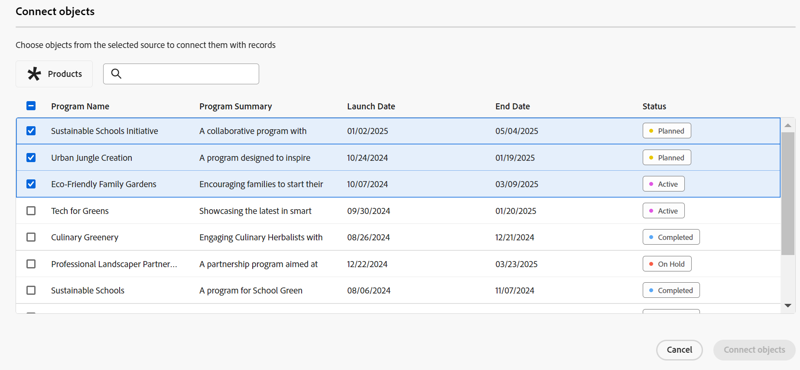

# Connect-records

 de benadrukte informatie op deze pagina verwijst naar functionaliteit nog niet algemeen beschikbaar. Deze optie is alleen beschikbaar in de voorvertoningsomgeving voor alle klanten. Na de maandelijkse versies aan Productie, zijn de zelfde eigenschappen ook beschikbaar in het milieu van de Productie voor klanten die snelle versies toeliet. 

 voor informatie over snelle versies, zie [&#x200B; snelle versies voor uw organisatie &#x200B;](/help/quicksilver/administration-and-setup/set-up-workfront/configure-system-defaults/enable-fast-release-process.md) toelaten of onbruikbaar maken. 

{{planning-important-intro}}

U kunt Adobe Workfront-planningsrecords met elkaar of met objecten van andere toepassingen verbinden. U kunt informatie van één verslag op een ander verslag tonen wanneer u hen aansluit.

In dit artikel wordt beschreven hoe u records kunt verbinden. Voor meer algemene informatie over het verbinden van verslagen, zie [&#x200B; Verbonden verslagenoverzicht &#x200B;](/help/quicksilver/planning/records/connected-records-overview.md).

U moet eerst twee recordtypen met elkaar verbinden of een recordtype met een objecttype vanuit een andere toepassing. Hiermee maakt u verbonden recordvelden. U kunt dan records met elkaar verbinden of records met andere objecten verbinden vanuit andere toepassingen in de verbonden recordvelden.

Het verbinden van records is vergelijkbaar met het verbinden van records met objecten vanuit een andere toepassing.

Voor informatie over het verbinden van verslagtypes met elkaar of aan objecten types van andere toepassingen, zie [&#x200B; verbind verslagtypes &#x200B;](/help/quicksilver/planning/architecture/connect-record-types.md).

Voor een voorbeeld van het verbinden van verslagtypes, zie [&#x200B; Voorbeeld van het verbinden van verslagtypes en verslagen &#x200B;](/help/quicksilver/planning/architecture/example-connect-record-types-and-records.md).

U kunt het volgende verbinden:

* Adobe Workfront Planning records met elkaar
* Adobe Workfront Planning registreert met voorwerpen van andere toepassingen.

  U kunt records verbinden met objecten van de onderstaande typen vanuit de volgende toepassingen:

   * Adobe Workfront

      * Projecten
      * Portfolio&#39;s
      * Programma&#39;s
      * Bedrijven
      * Groepen

   * Adobe Experience Manager Assets

      * Afbeeldingsbestanden
      * Mappen

  <!--when you add more objects, fix the Access Requirements below which right now refer only to projects-->

## Toegangsvereisten

+++ Breid uit om de toegangsvereisten voor de functionaliteit in dit artikel te bekijken. 

<table style="table-layout:auto"> 
<col> 
</col> 
<col> 
</col> 
<tbody> 
    <tr> 
<tr> 
</tr>   
<tr> 
   <td role="rowheader">
Adobe Workfront-pakket
</td> 
   <td> 

Alle Workfront en alle planningspakketten

Willekeurige workflow en planningspakket

Neem voor meer informatie over wat er in elk planningspakket voor Workfront staat, contact op met uw Workfront-accountvertegenwoordiger. 
 
   </td> 
<tr> 
<td> 
   
 Aanvullende producten
 </td> 
   <td> 
   
 Naast Adobe Workfront hebt u het volgende nodig als u records wilt verbinden met objecten uit de volgende toepassingen:

   <ul><li>
Een Adobe Experience Manager Assets-licentie en integratie tussen AEM Assets en Workfront om AEM-middelen te verbinden met planningstypen.

   
Voor informatie, zie <a href="/help/quicksilver/documents/adobe-workfront-for-experience-manager-assets-essentials/workfront-for-aem-asset-essentials.md"> Adobe Workfront voor Experience Manager Assets en de Hoofdzaak van Activa: artikelindex </a>. 
</li>
   <li>
 Een Adobe GenStudio for Performance Marketing-licentie om recordtypen te verbinden met GenStudio Brands

   
Voor informatie, zie <a href="https://experienceleague.adobe.com/en/docs/genstudio-for-performance-marketing/user-guide/get-started"> begonnen worden met Adobe GenStudio for Performance Marketing </a>.
</li></ul>
   </td> 
  </tr>   
<tr> 
  <tr> 
   <td role="rowheader">
Adobe Workfront-licentie
</td> 
   <td>
Standard

   </td> 
  </tr> 
   <tr> 
   <td role="rowheader">
Configuratie op toegangsniveau
</td> 
   <td> 
Er zijn geen toegangsniveaucontroles voor de Planning van Adobe Workfront
 
   
Geef de objecttypen weer waarvan u de objecten wilt verbinden in Workfront en AEM Assets of hoger. 
  
</td> 
  </tr>
  <tr> 
   <td role="rowheader">
Objectmachtigingen
</td> 
   <td>   
Draag of hoger toestemmingen aan een werkruimte bij en registreer type om verslagen te verbinden. 
  
   
U kunt machtigingen voor een werkruimte of hoger weergeven en het type opnemen om alle verbindingen met objecten en velden vanuit andere toepassingen weer te geven, ongeacht de toegang die u hebt in de andere toepassing. 

   
Geef de objecten die u vanuit Workfront of Experience Manager Assets wilt koppelen weer of geef deze machtigingen hoger op. 

   
Systeembeheerders hebben machtigingen voor alle werkruimten, inclusief de werkruimten die ze niet hebben gemaakt.
 </td> 
  </tr>   
</tbody> 
</table>

Voor meer informatie over de toegangsvereisten van Workfront, zie [&#x200B; vereisten van de Toegang in de documentatie van Workfront &#x200B;](/help/quicksilver/administration-and-setup/add-users/access-levels-and-object-permissions/access-level-requirements-in-documentation.md).

+++   

<!--Old:

<table style="table-layout:auto"> 
<col> 
</col> 
<col> 
</col> 
<tbody> 
    <tr> 
<tr> 
<td> 
   
 Products
 </td> 
   <td> 
   <ul><li>
 Adobe Workfront
</li> 
   <li>
 Adobe Workfront Planning
</li>
   <li>
Adobe Experience Manager Assets, if you want to connect AEM assets with Planning records

   
You must have an Adobe Experience Manager Assets license and an integration between AEM Assets and Workfront.
    For information, see <a href="/help/quicksilver/documents/adobe-workfront-for-experience-manager-assets-essentials/workfront-for-aem-asset-essentials.md">Adobe Workfront for Experience Manager Assets and Assets Essentials: article index</a>. 

   </li>  
   </ul></td> 
  </tr>   
<tr> 
   <td role="rowheader">
Adobe Workfront plan*
</td> 
   <td> 

Any of the following Workfront plans:
 
<ul><li>Select</li> 
<li>Prime</li> 
<li>Ultimate</li></ul> 

Workfront Planning is not available for legacy Workfront plans
 
   </td> 
<tr> 
   <td role="rowheader">
Adobe Workfront Planning package*
</td> 
   <td> 

Any 
 

For more information about what is included in each Workfront Planning plan, contact your Workfront account manager. 
 
   </td> 
 <tr> 
   <td role="rowheader">
Adobe Workfront platform
</td> 
   <td> 

Your organization's instance of Workfront must be onboarded to the Adobe Unified Experience to be able to access Workfront Planning.
 

For more information, see <a href="/help/quicksilver/workfront-basics/navigate-workfront/workfront-navigation/adobe-unified-experience.md">Adobe Unified Experience for Workfront</a>. 
 
   </td> 
   </tr> 
  </tr> 
  <tr> 
   <td role="rowheader">
Adobe Workfront license*
</td> 
   <td> Standard
   
Workfront Planning is not available for legacy Workfront licenses
 
  </td> 
  </tr> 
  <tr> 
   <td role="rowheader">
Access level configuration
</td> 
   <td> 
There are no access level controls for Adobe Workfront Planning objects
 
   
View or higher permissions to the object types you want to link from Workfront.
   
</td> 
  </tr> 
<tr> 
   <td role="rowheader">
Object permissions
</td> 
   <td>   
Contribute or higher permissions to a workspace and record type to connect records 
  
   
View or higher permissions to a workspace and record type to view all connections to objects and fields from other applications, regardless of your access in the other application. 

   
View or higher permissions to the objects you want to link from Workfront or Experience Manager Assets. 

   
System Administrators have permissions to all workspaces, including the ones they did not create.
 </td> 
  </tr> 
</tbody> 
</table> -->

## Overwegingen bij het verbinden van records

* Als u records wilt verbinden met andere records of objecten, moet u over het volgende beschikken:

   * Ten minste één werkruimte, recordtype en record.

     Raadpleeg de volgende artikelen voor meer informatie:

      * [Werkruimten maken](/help/quicksilver/planning/architecture/create-workspaces.md)
      * [Recordtypen maken](/help/quicksilver/planning/architecture/create-record-types.md)
      * [Records maken](/help/quicksilver/planning/records/create-records.md)

   * Verbindingen tussen recordtypen of tussen recordtypen en objecten uit andere toepassingen. Voor informatie, zie [&#x200B; verbind verslagtypes &#x200B;](/help/quicksilver/planning/architecture/connect-record-types.md).

* U kunt een of meer records of objecten met elkaar verbinden. Dit is afhankelijk van het verbindingstype dat u hebt geselecteerd bij het verbinden van de record- of objecttypen. Voor informatie, zie [&#x200B; verbind verslagtypes overzicht &#x200B;](/help/quicksilver/planning/architecture/connect-record-types-overview.md).

## Connect-records van Workfront Planning

U kunt verslagen van de Planning van Workfront op de volgende gebieden van een verslag van de Planning verbinden:

* De verbonden recordvelden in de tabelweergave.
* Het voorvertoningsvak of de pagina van de record in de verbonden recordvelden op het tabblad Details.
* Het voorvertoningsvak of de pagina van de record op het tabblad Verbindingen.
* De pagina van het verslag op een Verbonden verslagenpagina tabel.

### Connect Workfront Planning-records vanuit de tabelweergave of het gebied Details van een record

{{step1-to-planning}}

1. Klik de werkruimte waarvan verslagen u wilt verbinden.

   De werkruimte wordt geopend en de recordtypen worden als kaarten weergegeven.
1. Klik op de kaart van een recordtype om de pagina met recordtypen te openen.
1. Klik op de naam van een tabelweergave om deze te openen.
1. (Optioneel) Voeg records toe aan het recordtype dat u hebt geselecteerd door een nieuwe rij aan de tabel toe te voegen. Voor informatie, zie [&#x200B; verslagen &#x200B;](/help/quicksilver/planning/records/create-records.md) creëren.
1. (Voorwaardelijk) nadat u het geselecteerde verslagtype met een ander verslagtype verbindt, ga naar het verbonden gebied van een verslag en klik binnen het gebied of klik **verbind** om verslag toe te voegen.

   

1. Voer een van de volgende handelingen uit:

   * Klik in de lijst op de naam van een verbonden record om deze aan de geselecteerde record toe te voegen. De record wordt automatisch toegevoegd.
   * Typ de naam van een record en klik erop wanneer deze in de lijst wordt weergegeven. De record wordt automatisch toegevoegd.

   >[!TIP]
   >
   >Als alleen de afbeelding van de record is geselecteerd om te worden weergegeven wanneer de recordtypen zijn verbonden, wordt alleen de miniatuur of het pictogram van de record weergegeven in het verbonden veld. Voor meer informatie, zie [&#x200B; Connect verslagtypes &#x200B;](/help/quicksilver/planning/architecture/connect-record-types.md).
   >

1. (Voorwaardelijk) Als u bij het verbindingstype de optie Een op velen of Een op één hebt geselecteerd en u probeert een record of een object te verbinden dat al ergens anders is verbonden, ontvangt u een waarschuwing dat het opnieuw verbinden van de record de record uit de oorspronkelijke verbinding zal verwijderen. Klik **verbinden** om de verwijdering toe te staan en het verslag aan te sluiten, of **annuleert** om terug naar het gebied te gaan en een ander verslag te selecteren.
1. (Optioneel) Als u een object niet kunt vinden om verbinding te maken en u wilt het object toevoegen, klikt u op **+ Toevoegen**

   of

   Typ een naam voor het object en klik op **+ Toevoegen** om het object te maken en toe te voegen.

   Voor meer informatie, zie de sectie &quot;verslagen tot stand brengen aangezien u hen van andere verslagen&quot;in het artikel [&#x200B; verbindt tot verslagen &#x200B;](/help/quicksilver/planning/records/create-records.md).

   >[!TIP]
   >
   >    U kunt de pagina van een record openen en andere records verbinden door het volgende te doen in de tabelweergave:
   >1. Klik op de naam van de record in de weergave.
   >1. Het gekoppelde recordveld zoeken en dubbelklikken op het veld (als er al records zijn verbonden)
   >of
   >Klik **verbinden verslagen** (als het gebied leeg is) om verslagen van het verbonden verslag of objecten type toe te voegen.
   >
   >

1. (Facultatief) klik **zie allen** om alle verslagen te tonen.

1. (Voorwaardelijk) als u **klikte zie allen** in de vorige stap, **verbind voorwerpen** vakvertoningen.

   

1. Typ de naam van een record in het zoekvak en selecteer de naam wanneer de record in de lijst wordt weergegeven

   of

   Selecteer de naam van één of veelvoudige verslagen in de doos, dan klik **verbind voorwerpen**.

   Het volgende wordt toegevoegd:

   * De gekoppelde records worden weergegeven in het gekoppelde recordveld van de record die u in een vorige stap hebt geselecteerd.
   * De gekoppelde velden worden gevuld met de informatie uit de gekoppelde records als u gekoppelde opzoekvelden hebt toegevoegd toen u de recordtypen aansloot.

   Wanneer u de gekoppelde records bijwerkt, worden de gekoppelde velden bijgewerkt voor de records die u automatisch koppelt. U kunt gekoppelde velden niet handmatig bewerken.

   >[!TIP]
   >
   >* We gebruiken onderling gekoppelde velden en opzoekvelden.
   >
   >* Wanneer u ervoor kiest om meerdere records te verbinden wanneer u de recordtypen hebt verbonden, worden de veldwaarden van de meerdere objecten gescheiden door komma&#39;s weergegeven of worden ze samengevoegd volgens de aggregator die u hebt gekozen bij het verbinden van de recordtypen.
   >* U kunt geen Workfront-tekstkopvelden (zoals velden zoals Projecteigenaar of Projectsponsor) toevoegen als opzoekvelden.
   >
   >* De gegevens van het datumveld van Workfront-objecten worden weergegeven in de 24-uursnotatie van Workfront, ongeacht hoe deze worden weergegeven in Workfront.
   >
   >   Bijvoorbeeld, als de Geplande Datum van het Begin van een project als 3 :00 PM in Workfront toont, zal het als 15 :00 in de Planning van Workfront op een ingevoerd raadplegingsgebied tonen.

1. (Optioneel) Sluit de pagina met recordtypen en ga naar de werkruimte die u hebt geselecteerd.
1. Klik op de kaart voor het recordtype waarmee u een koppeling hebt gemaakt.

   Bijvoorbeeld, als u het **Campagne** verslag met het verslag van het Product verbond, klik de **kaart van het Product**.

   De opnametype kaart moet in de lijstmening worden geopend. Als dat niet het geval is, selecteert u een tabelweergave.

   Bericht dat het **verbonden verslaggebied van de Campagne** &lbrace;de namen van de campagnes toont u met producten in de het verslagtype van het Product pagina verbond. Wanneer u de Campagnegegevens bijwerkt, wordt het aan Campagne gekoppelde recordveld voor het type productrecord automatisch bijgewerkt.

### Connect Workfront Planning-records verbinden met Workfront-objecten vanuit de tabelweergave of het gebied Details van een record

<!--when we will have more applications to link to from Planning, change the title to something like: Connect Workfront Planning records to objects from other applications-->

Nadat u een verbinding hebt gemaakt tussen een recordtype en een Workfront-objecttype, kunt u afzonderlijke records verbinden met objecten in Workfront. De Workfront-velden die u hebt verbonden, worden automatisch ingevuld in de records waarvan u de objecten koppelt.

>[!NOTE]
>
>U kunt vanuit Workfront geen verbinding maken tussen Workfront-objecttypen en Workfront Planning-recordtypen.

{{step1-to-planning}}

1. Klik de werkruimte waarvan verslagen u wilt verbinden.

   De werkruimte wordt geopend en de recordtypen worden als kaarten weergegeven.
1. Klik op de kaart van een recordtype om de pagina met recordtypen te openen.
1. Selecteer a **de mening van de Lijst** van het **drop-down menu van de Mening**.

1. Klik **Nieuw verslag** om individuele verslagen aan het verslagtype toe te voegen dat u selecteerde. Voor informatie, zie [&#x200B; verslagen &#x200B;](/help/quicksilver/planning/records/create-records.md) creëren.

1. (Voorwaardelijk) nadat u het geselecteerde verslagtype met een objecten van Workfront type verbindt, ga naar het verbonden gebied op een verslag en of klik het gebied, of klik **verbinden** om de voorwerpen van Workfront toe te voegen.

   

1. Voer een van de volgende handelingen uit:

   * Klik op een object in de lijst om het toe te voegen aan de geselecteerde record. Objecten worden in alfabetische volgorde weergegeven. Het object wordt automatisch toegevoegd.
   * Typ de naam van een object en klik erop wanneer het wordt weergegeven in de lijst. Het object wordt automatisch toegevoegd.

   >[!TIP]
   >
   >U kunt de pagina van een verslag van de mening openen, het verbonden verslaggebied tweemaal klikken, of **verbinden** op het gebied klikken om voorwerpen van het verbonden objecten type toe te voegen.

1. (Optioneel) Als u een object niet kunt vinden om verbinding te maken en u wilt het object toevoegen, klikt u op **+ Toevoegen**

   of

   Begin een naam voor het voorwerp te typen, dan klik **+ toevoegen** om een nieuw project, een portefeuille, of een programma tot stand te brengen en toe te voegen.

   Voor informatie, zie [&#x200B; de voorwerpen van Workfront van de Planning van Workfront &#x200B;](/help/quicksilver/planning/records/create-workfront-objects-from-workfront-planning.md) creëren

1. (Facultatief) klik **zie allen** om alle voorwerpen te tonen u minstens toestemmingen aan mening hebt.

   Als u **klikte zie allen** in de vorige stap, **verbindt voorwerpen** vakvertoningen.

    te selecteren

1. Typ de naam van een Workfront-object in het zoekvak en selecteer het vervolgens wanneer het in de lijst wordt weergegeven

   of

   Selecteer de naam van één of veelvoudige voorwerpen in de doos, dan klik **verbind voorwerpen**.

   >[!IMPORTANT]
   >
   >* U kunt alleen Workfront-objecten toevoegen die u kunt bekijken.
   >
   >* Nadat u Workfront-objecten hebt toegevoegd, kan iedereen met Weergave- of hogere machtigingen de Workfront-objecten en hun veldgegevens weergeven, ongeacht de machtigingen of toegang tot deze objecten in Workfront.

   Het volgende wordt toegevoegd:

   * De geselecteerde Workfront-objecten worden toegevoegd aan het gekoppelde recordveld.
   * Als u deze hebt toegevoegd toen u het recordtype verbond met Workfront, worden de gekoppelde velden (of de opzoekvelden) van de Workfront-objecten automatisch gevuld met informatie van Workfront.

   Voor meer informatie over het verbinden van verslagtypes met voorwerpen van een andere toepassing, zie [&#x200B; verbind verslagtypes &#x200B;](/help/quicksilver/planning/architecture/connect-record-types.md).

1. (Optioneel) Klik op de naam van een Workfront-object dat is verbonden met een Workfront-planningsrecord in het gekoppelde veld van een tabelweergave of vanuit het gekoppelde veld op de recordpagina.

   Hiermee wordt het Workfront-object in Workfront geopend als u ten minste weergavemachtigingen voor het object hebt.

   >[!TIP]
   >
   >* Wanneer u ervoor kiest om meerdere records te verbinden bij het verbinden van de recordtypen, worden de waarden van de opzoekvelden gescheiden door komma&#39;s weergegeven of worden ze geaggregeerd volgens de aggregator die u hebt gekozen.
   >
   >* Er wordt geen gekoppeld recordveld gemaakt voor de gekoppelde Workfront-objecten in Workfront.

1. (Facultatief) van de lijstmening van het verslagtype, houd over de kolomkopbal van het verbonden voorwerp van Workfront, en klik het drop-down menu, dan klik **uitgezocht gebieden** uitgeven.

1. Voeg de objecten van Workfront gebieden van het **Niet geselecteerde gebied** toe

   of

   Verwijder de objecten van Workfront gebieden van het **Geselecteerde gebied**.

   Hiermee voegt u gekoppelde velden toe aan of verwijdert u deze uit de planningsrecords van Workfront. De informatie die aan de verwijderde velden is gekoppeld, blijft in Workfront.

### Connect Workfront Planning-records verbinden met Adobe Experience Manager-objecten vanuit de tabelweergave of het gebied Details van een record

<!--when we will have more applications to link to from Planning, change the title to something like: Connect Workfront Planning records to objects from other applications-->

>[!IMPORTANT]
>
>U moet een Adobe Experience Manager Assets-licentie hebben en het Workfront-exemplaar van uw organisatie moet zijn aangemeld bij het Adobe Business Platform of de Adobe Admin Console om Workfront Planning-records te kunnen verbinden met Adobe Experience Manager Assets.
>
>Als u vragen over het aan boord gaan aan Adobe Admin Console hebt, zie [&#x200B; Adobe Verenigde Veelgestelde vragen van de Ervaring &#x200B;](/help/quicksilver/workfront-basics/navigate-workfront/workfront-navigation/unified-experience-faq.md).

Nadat u een verbinding hebt gemaakt tussen een recordtype en Adobe Experience Manager Assets, kunt u afzonderlijke records verbinden met Experience Manager-elementen. De elementvelden die u vanaf Experience Manager Assets hebt verbonden toen u de verbinding maakte, worden automatisch ingevuld in het recordtype waarvan u een koppeling hebt gemaakt.

>[!NOTE]
>
>De verslagen van de planning en hun gebieden zijn toegankelijk van Experience Manager Assets wanneer uw beheerder van Workfront de meta-gegevensafbeelding door de integratie tussen Workfront en Adobe Experience Manager Assets vormt. Voor meer informatie, zie [&#x200B; activa meta-gegevensafbeelding tussen Adobe Workfront en Experience Manager Assets &#x200B;](https://experienceleague.adobe.com/en/docs/experience-manager-cloud-service/content/assets/integrations/configure-asset-metadata-mapping) vormen.

Om records te verbinden met Experience Manager-elementen:

{{step1-to-planning}}

1. Klik de werkruimte waarvan verslagen u wilt verbinden.

   De werkruimte wordt geopend en de recordtypen worden weergegeven.
1. Klik op de kaart van een recordtype om de pagina met recordtypen te openen.
1. Selecteer a **de mening van de Lijst** van de **drop-down menu van de Mening** in de hoger-juiste hoek van de verslagtype pagina.

1. (Facultatief) klik **Nieuw verslag** om nieuwe verslagen aan het verslagtype toe te voegen dat u selecteerde. Voor informatie, zie [&#x200B; verslagen &#x200B;](/help/quicksilver/planning/records/create-records.md) creëren.
1. (Voorwaardelijk) Nadat u het geselecteerde verslagtype met Experience Manager Assets verbindt, ga naar het verbonden gebied op een verslag en of klik het gebied, of klik **verbinden** om de activa van Experience Manager aan het verslag toe te voegen, dan klik **+** pictogram.

   >[!TIP]
   >
   >  U kunt op het pictogram **+** in het gekoppelde objectveld in de recordpagina klikken om elementen aan de record te koppelen.

   De **Uitgezochte Assets** vakvertoningen. <!--we might change this to Connect assets-->

   

1. Klik om een aantal van de volgende typen elementen te selecteren:

   * Afbeeldingen
   * Mappen

   U kunt meerdere elementen selecteren.

   >[!IMPORTANT]
   >
   > U kunt alleen elementen verbinden die u in Experience Manager kunt bekijken. Zodra verbonden, kunnen alle gebruikers van de Planning van Workfront de activa in de Planning van Workfront, ongeacht hun toegang in Experience Manager Assets bekijken.

1. Klik **Uitgezocht**. <!-- we might change this to Connect-->

   Het volgende wordt toegevoegd:

   * De geselecteerde Experience Manager-elementen worden toegevoegd aan het veld voor gekoppelde records.
   * In de gekoppelde velden (of opzoekvelden) wordt informatie uit de met Experience Manager verbonden elementen ingevuld.

     Eventuele bestaande informatie uit de velden van de Experience Manager-elementen wordt automatisch weergegeven in de gekoppelde of opzoekvelden.

     >[!TIP]
     >
     >* Wanneer u ervoor kiest om meerdere records te verbinden wanneer u de recordtypen verbindt, worden de waarden van de meerdere objecten gescheiden door komma&#39;s of samengevoegd volgens de door u gekozen aggregator weergegeven.
     >
     >* Er wordt geen gekoppeld recordveld voor de gekoppelde Experience Manager-elementen in de Experience Manager Assets-toepassing gemaakt voor de Workfront Planning.

1. (Optioneel) Ga naar het recordtype dat u vanuit Experience Manager Assets hebt gekoppeld en klik op de naam van een element in het gekoppelde recordveld. De Experience Manager-gegevens van het element worden weergegeven in een pop-upvenster.

   

   De volgende velden worden weergegeven voor een afbeeldingsbestand:

   * Een miniatuur van de afbeelding
   * De naam van het afbeeldingsbestand
   * Afmetingen
   * Grootte
   * Beschrijving
   * Het bestandspad in Experience Manager
   * Het elementtype
   * Gemaakt op
   * Datum gewijzigd

1. (Facultatief) om de pagina van het de activaverslag van Experience Manager in Experience Manager te openen, ga naar de verslagtype pagina van het verslag u van verbindt, klik de naam van een activa op het verbonden verslaggebied om het pop-up venster te openen, dan klik **Open in AEM** pictogram  om de activa te openen.

   Hiermee opent u het Experience Manager-middel in Adobe Experience Manager Assets.

1. (Facultatief) van de lijstmening van het verslagtype, houd over de kolomkopbal van de verbonden activa van Experience Manager, en klik het drop-down menu, dan klik **uitgezocht gebieden** uitgeven.

1. Voeg de objecten van Experience Manager Assets gebieden van het **Niet geselecteerde gebied** toe

   of

   Verwijder de objecten van Workfront gebieden van het **Geselecteerde gebied**.

   Hiermee voegt u gekoppelde velden toe aan of verwijdert u deze uit de records. De informatie die aan de verwijderde velden is gekoppeld, blijft in Adobe Experience Assets.

### Connect Workfront Planning-records verbinden met andere records of objecten op het tabblad Verbindingen van de recordpagina

1. Ga naar om het even welke mening van een verslagtype dat met andere het verslagtypes of objecten van de Planning van andere toepassingen is verbonden.
1. Voer de stappen uit die in de vorige subsecties zijn beschreven om een record te zoeken in de weergave die u wilt koppelen aan andere records of objecten.
1. Klik op de naam van een record.

   De voorvertoningspagina wordt geopend.
1. (Facultatief) klik **Open in nieuw lusje** pictogram  om de pagina van het verslag in een nieuwe browser tabel te openen.
1. (Facultatief en voorwaardelijk)  klik de naam van een verslagtype in breadcrumb van de kopbal van de verslagpagina om tot een ander verslagtype in de zelfde hiërarchie toegang te hebben. Er moeten hiërarchieën bestaan voor het recordtype van de record die u verbindt voordat u deze kunt weergeven in de broodkruimel. Voor informatie, zie [&#x200B; de hiërarchieën van de werkruimte &#x200B;](/help/quicksilver/planning/architecture/create-workspace-hierarchies.md) creëren. 
1. Klik het **lusje van Verbindingen** in de voorproef of de pagina van het verslag.

   

   Alle record- of objecttypen die aan het geselecteerde recordtype zijn gekoppeld, worden als secties weergegeven. Verbonden records of objecten worden onder hun naam voor een record of objecttype op kaarten weergegeven.

   >[!TIP]
   >
   >    Alleen verbonden records met afzonderlijke records worden standaard weergegeven.

1. (Facultatief) klik **tonen alle verbindingen** om alle verbonden verslagtypes, met inbegrip van degenen zonder verbonden verslagen te tonen.

1. (Optioneel) Klik op de pijl omlaag links van een sectie om deze samen te vouwen.

1. (Voorwaardelijk) klik **verbinden** om meer verslagen of voorwerpen van het zelfde type toe te voegen.
1. (Optioneel) Als u een record of een object dat u wilt verbinden niet kunt vinden en u wilt deze toevoegen, klikt u op **+ Toevoegen**

   of

   Typ een naam voor het object en klik op **+ Toevoegen** om het object te maken en aan de record toe te voegen.

   Voor meer informatie, zie de sectie &quot;verslagen tot stand brengen aangezien u hen van andere verslagen&quot;in het artikel [&#x200B; verbindt tot verslagen &#x200B;](/help/quicksilver/planning/records/create-records.md).
1. Voer de stappen uit die in de vorige secties zijn beschreven om records van Workfront Planning of objecten van Workfront of Experience Manager Assets te verbinden.
De records en objecten worden direct toegevoegd.
1. (Facultatief) Beweeg over de verbonden kaart van een verslag of een voorwerp, dan klik **losmaken verslag** pictogram  om het van het geselecteerde verslag los te maken.

   

   De record wordt onmiddellijk losgekoppeld van alle gebieden van de Workfront-planning of van andere toepassingen waar deze als verbonden kunnen worden weergegeven. De waarden van opzoekvelden worden ook verwijderd.

### Verbind verslagen van de Verbonden verslagenpagina van een verslag

1. Ga naar om het even welke mening van een verslagtype dat met andere het verslagtypes of objecten van de Planning van andere toepassingen is verbonden.
1. Voer de stappen uit die in de vorige subsecties zijn beschreven om een record te zoeken in de weergave die u wilt koppelen aan andere records of objecten.
1. Klik op de naam van een record.

   De voorvertoningspagina wordt geopend.
1. (Facultatief) klik **Open in nieuw lusje** pictogram  om de pagina van het verslag te openen.
1. Klik een bestaand **Verbonden verslagenpagina** lusje in de pagina van het verslag. U moet eerst a **Verbonden verslagenpagina** creëren.

   Een verbonden verslagtype pagina toont in de lijstmening.

   Alle verbonden verslagen van één type tonen in de lijst.

   >[!TIP]
   >
   >U moet verbonden verslagen aan het huidige verslag toevoegen om hen in de verbonden verslagenpagina te bekijken.

1. Klik **verbinden** in een lijst van verslagen of **verbindt verslagen** in een lijst van projecten om bestaande verslagen of projecten toe te voegen of te verwijderen.

   

   Voor informatie, zie [&#x200B; een Verbonden verslagenpagina aan een verslag &#x200B;](/help/quicksilver/planning/records/add-a-connected-records-page-to-a-record.md) toevoegen.
1. Klik **Nieuwe rij** in een lijst van projecten om een project zonder een malplaatje tot stand te brengen. De nieuwe projecten worden automatisch verbonden met het huidige verslag.
1. (Optioneel) Als u geen verbonden record kunt vinden, klikt u op **+ Toevoegen** om deze te maken en te verbinden.

## Connect-records van Workfront-objecten

U moet het volgende hebben om de verslagen van de Planning van Workfront van de voorwerpen van Workfront te verbinden:

* Verbindingen tussen recordtypen en Workfront-objecttypen die zijn ingesteld in Workfront Planning.
* Uw Workfront- of groepsbeheerder moet het volgende toevoegen aan een Workfront-objecttype:

   * Het gedeelte Planning van de Workfront-projecten, -portfolio&#39;s en -programma&#39;s in uw lay-outsjabloon.

   * In het aangepaste veld voor planningsverbindingen wordt een aangepast formulier gemaakt voor een van de volgende objecten:

      * Project
      * Portfolio
      * Programma
      * Groep
      * Bedrijf

  Voor meer informatie, zie [&#x200B; recordverbindingen van de voorwerpen van Workfront beheren &#x200B;](/help/quicksilver/planning/records/manage-records-in-planning-section.md).
