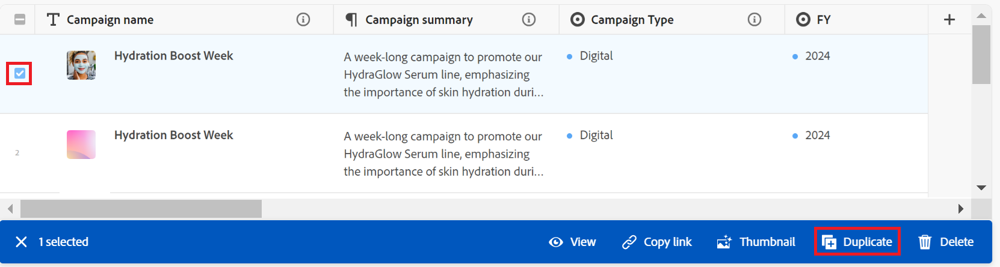

# Records dupliceren

<!--update the metadata after GA-->

{{planning-important-intro}}

In de Planning van Adobe Workfront, is een verslag een geval van een verslagtype.

U kunt een bestaande record dupliceren in de tabelweergave. Er wordt een identieke kopie van de bestaande record toegevoegd aan de recordtypepagina.

## Toegangsvereisten

+++ Breid uit om toegangsvereisten voor de Planning van Workfront te bekijken.

<table style="table-layout:auto">
 <col>
 </col>
 <col>
 </col>
 <tbody>
    <tr>
<tr>
<td>
   
 Product
 </td>
   <td>
   
 Adobe Workfront
 </td>
  </tr>  
 <td role="rowheader">
Adobe Workfront-overeenkomst
</td>
   <td>

Uw organisatie moet zijn ingeschreven in de vroege toegangsfase voor Workfront Planning 

   </td>
  </tr>
  <tr>
   <td role="rowheader">
Adobe Workfront-plan
</td>
   <td>

Alle

   </td>
  </tr>
  <tr>
   <td role="rowheader">
Adobe Workfront-licentie*
</td>
   <td>
   
Nieuw: Standaard

   
Huidig: Plan
  
  </td>
  </tr>

<tr>
   <td role="rowheader">
Configuraties op toegangsniveau
</td>
   <td> 
Er zijn geen toegangscontroles voor de Planning van Adobe Workfront 
  
</td>
  </tr>
<tr>
   <td role="rowheader">
Machtigingen
</td>
   <td> 
Contribute of hogere toestemmingen aan een werkruimte </a> 
  
   
Systeembeheerders hebben machtigingen voor alle werkruimten, inclusief de werkruimten die ze niet hebben gemaakt

</td>
  </tr>
<tr>
   <td role="rowheader">
Lay-outsjabloon
</td>
   <td> 
Uw Workfront of groepsbeheerder moet het planningsgebied toevoegen aan uw lay-outsjabloon. Voor informatie, zie <a href="/help/quicksilver/planning/access/access-overview.md"> overzicht van de Toegang </a>. 
  
</td>
  </tr>

</tbody>
</table>

*Voor meer informatie, zie [ vereisten van de Toegang voor de documentatie van Workfront ](/help/quicksilver/administration-and-setup/add-users/access-levels-and-object-permissions/access-level-requirements-in-documentation.md).

+++

## Een record dupliceren <!--in a record type table (I don't think you can create them elsewhere right now)-->

U kunt records maken in de tabelweergave van een recordtype door een bestaande record te dupliceren. Een record die identiek is aan de bestaande record, wordt gemaakt en toegevoegd onder de oorspronkelijke record.

{{step1-to-planning}}

1. Klik op de werkruimte waar u records wilt toevoegen.

   De werkruimte wordt geopend en de recordtypen worden als kaarten weergegeven.

1. Klik op een opnametype. Voor informatie over het creëren van een verslagtype, zie [ recordtypes ](/help/quicksilver/planning/architecture/create-record-types.md) creëren.

   De pagina met recordtypen wordt geopend in de weergave die u het laatst hebt geopend. Standaard wordt een pagina met recordtypen geopend in de tabelweergave.
Alle records van het geselecteerde type worden in de weergave weergegeven.

1. (Voorwaardelijk) Selecteer een lijstmening.

1. Voer een van de volgende handelingen uit:

   * Beweeg over de naam van een verslag dan het **Meer** menu gealigneerd met de verslagnaam, dan klik het **Dubbele** pictogram .

     

   * Selecteer een verslag, dan klik het **pictogram  Dupliceren** in de toolbar aan de bodem van de pagina.

     

   Onder de oorspronkelijke record wordt een identieke record met dezelfde naam gemaakt. Alle velden van de nieuwe record worden gevuld met dezelfde informatie als in de oorspronkelijke record.

1. (Optioneel) Werk de informatie over de nieuwe record bij in de velden die beschikbaar zijn in de tabelweergave, of klik op de record- en updategegevens in de recordvoorvertoning of pagina.

   >[!NOTE]
   >
   >  * Er zijn geen verplichte velden voor records. Nochtans, adviseren wij dat u informatie voor het primaire gebied van een verslag toevoegt, aangezien het nuttig is om verslagen te identificeren wanneer het verbinden van verslagen aan elkaar. Voor meer informatie over primaire gebieden, zie [ de lijstmening ](/help/quicksilver/planning/views/manage-the-table-view.md) beheren en [ Primair gebiedsoverzicht ](/help/quicksilver/planning/fields/primary-field-overview.md).
   >
   >  * Velden die naar andere recordtypen of berekende velden verwijzen, zijn alleen-lezen velden.

   Voor meer informatie over het uitgeven van verslagen, zie [ verslagen ](/help/quicksilver/planning/records/edit-records.md) uitgeven.

1. (Optioneel) Gebruik de volgende sneltoetsen om nieuwe records of de bijbehorende informatie ongedaan te maken of opnieuw toe te voegen wanneer u deze in de tabelweergave toevoegt:

   * CTRL + Z ( ⌘ + Z voor Mac) om een wijziging ongedaan te maken
   * CTRL + Shift + Z ( ⌘ + Shift + Z voor Mac) om een wijziging opnieuw uit te voeren.