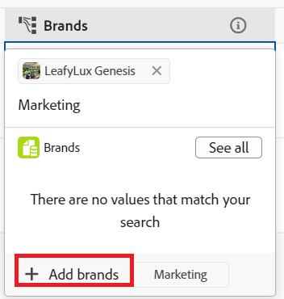

<!--update the metadata with real information when making this available in TOC and in the left nav-->

# Records maken

{{planning-important-intro}}

In de Planning van Adobe Workfront, is een verslag een geval van een verslagtype.

U kunt records maken door een van de volgende handelingen uit te voeren:

* Records toevoegen vanaf de pagina met recordtypen in de tabelweergave
* Een lijst met records uit een externe lijst kopiëren en plakken
* Records dupliceren vanuit een tabelweergave
* Records maken terwijl u deze verbindt met andere records
* Maak ze door een aanvraagformulier naar een recordtype te verzenden

In dit artikel wordt beschreven hoe u records kunt maken.

Raadpleeg de volgende artikelen voor informatie over het beheren van records in de tabel- of tijdlijnweergaven:

* [De tabelweergave beheren](/help/quicksilver/planning/views/manage-the-table-view.md)
* [De tijdlijnweergave beheren](/help/quicksilver/planning/views/manage-the-timeline-view.md)

## Toegangsvereisten

+++ Breid uit om toegangsvereisten voor de Planning van Workfront te bekijken.

U moet het volgende hebben om tot de Planning van Workfront toegang te hebben:

<table style="table-layout:auto"> 
<col> 
</col> 
<col> 
</col> 
<tbody> 
    <tr> 
<tr> 
<td> 
   
 Producten
 </td> 
   <td> 
   <ul><li>
 Adobe Workfront
</li> 
   <li>
 Adobe Workfront Planning
</li></ul></td> 
  </tr>   
<tr> 
   <td role="rowheader">
Adobe Workfront-abonnement*
</td> 
   <td> 

Een van de volgende Workfront-plannen:
 
<ul><li>Selecteren</li> 
<li>Eerste</li> 
<li>Ultieme</li></ul> 

Workfront Planning is niet beschikbaar voor oudere Workfront-plannen
 
   </td> 
<tr> 
   <td role="rowheader">
Planning van Adobe Workfront*
</td> 
   <td> 

Alle 
 

Neem contact op met uw Workfront-accountmanager voor meer informatie over wat er in elk Workfront-planningsplan is opgenomen. 
 
   </td> 
 <tr> 
   <td role="rowheader">
Adobe Workfront-platform
</td> 
   <td> 

Het geval van Workfront van uw organisatie moet aan de Adobe Verenigde Ervaring worden genegeerd om tot alle mogelijkheden van de Planning van Workfront te kunnen toegang hebben.
 

Voor meer informatie, zie <a href="/help/quicksilver/workfront-basics/navigate-workfront/workfront-navigation/adobe-unified-experience.md"> Adobe Verenigde Ervaring voor Workfront </a>. 
 
   </td> 
   </tr> 
  </tr> 
  <tr> 
   <td role="rowheader">
Adobe Workfront-licentie*
</td> 
   <td> Standaard
   
Workfront Planning is niet beschikbaar voor oudere Workfront-licenties
 
  </td> 
  </tr> 
  <tr> 
   <td role="rowheader">
Configuratie op toegangsniveau
</td> 
   <td> 
Er zijn geen toegangsniveaucontroles voor de Planning van Adobe Workfront
 
   
Bewerk de toegang in Workfront voor de objecttypen die u wilt maken (projecten en portfolio's) terwijl u de records met deze eigenschappen verbindt. 
  
</td> 
  </tr> 
<tr> 
   <td role="rowheader">
Objectmachtigingen
</td> 
   <td> 
Rechten beheren in de werkruimte waaraan u records wilt toevoegen. 
  
   
Systeembeheerders hebben machtigingen voor alle werkruimten, inclusief de werkruimten die ze niet hebben gemaakt

   
Rechten voor Workfront-objecten (portfolio's) beheren om onderliggende objecten (projecten) toe te voegen.

   </td> 
  </tr> 
<tr> 
   <td role="rowheader">
Lay-outsjabloon
</td> 
   <td> 
Aan alle gebruikers, inclusief Workfront-beheerders, moet een lay-outsjabloon worden toegewezen die het planningsgebied in het hoofdmenu bevat 
 </td> 
  </tr> 
</tbody> 
</table>

*Voor meer informatie over de toegangsvereisten van Workfront, zie [ vereisten van de Toegang in de documentatie van Workfront ](/help/quicksilver/administration-and-setup/add-users/access-levels-and-object-permissions/access-level-requirements-in-documentation.md).

<!--OLD info: 

<table style="table-layout:auto">
 <col>
 </col>
 <col>
 </col>
 <tbody>
    <tr>
<tr>
<td>
   
 Product
 </td>
   <td>
   
 Adobe Workfront
 </td>
  </tr>  
 <td role="rowheader">
Adobe Workfront agreement
</td>
   <td>

Your organization must be enrolled in the early access stage for Workfront Planning 

   </td>
  </tr>
  <tr>
   <td role="rowheader">
Adobe Workfront plan
</td>
   <td>

Any

   </td>
  </tr>
  <tr>
   <td role="rowheader">
Adobe Workfront license*
</td>
   <td>
   
New: Standard

   
Current: Plan
  
  </td>
  </tr>
  
  <tr>
   <td role="rowheader">
Access level configurations
</td>
   <td> 
There are no access controls for Adobe Workfront Planning 
  
</td>
  </tr>
<tr>
   <td role="rowheader">
Permissions
</td>
   <td> 
Contribute or higher permissions to a workspace</a> 
  
   
System Administrators have permissions to all workspaces, including the ones they did not create

</td>
  </tr>
<tr>
   <td role="rowheader">
Layout template
</td>
   <td> 
Your Workfront or group administrator must add the Planning area in your layout template. For information, see <a href="/help/quicksilver/planning/access/access-overview.md">Access overview</a>. 
  
</td>
  </tr>

 </tbody>
</table>

*For more information, see [Access requirements for Workfront documentation](/help/quicksilver/administration-and-setup/add-users/access-levels-and-object-permissions/access-level-requirements-in-documentation.md). -->

+++

## Records maken door deze toe te voegen aan een recordtype in een recordtype-tabel

U kunt records maken in de tabelweergave van een pagina met recordtypen.

Voor informatie over het uitgeven van verslaginformatie, zie [ verslagen ](/help/quicksilver/planning/records/edit-records.md) uitgeven.

{{step1-to-planning}}

1. Klik op de werkruimte waar u records wilt toevoegen.

   De werkruimte wordt geopend en de recordtypen worden als kaarten weergegeven.

1. Klik op een opnametype. Voor informatie over het creëren van een verslagtype, zie [ recordtypes ](/help/quicksilver/planning/architecture/create-record-types.md) creëren.

   De pagina met recordtypen wordt geopend in de weergave die u het laatst hebt geopend. Standaard wordt een pagina met recordtypen geopend in de tabelweergave.
Alle records van het geselecteerde type worden in de weergave weergegeven.

1. (Voorwaardelijk) Afhankelijk van de weergave die u weergeeft, voert u een van de volgende handelingen uit:

   * In de tabelweergave:

      * Klik **Nieuw verslag** in de laatste rij van de lijst

      * Klik **Verschuiving + gaat** op uw toetsenbord van om het even welke kolom of rij van de lijst binnen. Hiermee voegt u een lege rij toe onder de record waaruit u begint.
      * Beweeg over het primaire gebied van een verslag, klik **Meer** menu  aan het recht van het gebied, dan klik **verslag van het Tussenvoegsel hierboven** of **hieronder verslag van het Tussenvoegsel**.

     

   * Vanuit elke weergave:

      * Klik **Nieuw verslag** in de hoger-juiste hoek van de pagina. Het voorvertoningsvak voor records wordt geopend.

     Workfront uploadt automatisch een miniatuur en een omslagafbeelding naar elke nieuwe record. U kunt deze afbeeldingen later wijzigen. Raadpleeg de volgende artikelen voor meer informatie:

      * [Een omslagafbeelding aan een record toevoegen](/help/quicksilver/planning/records/add-a-cover-image-to-a-record.md)
      * [Een miniatuur toevoegen aan een record](/help/quicksilver/planning/records/add-thumbnails-to-records.md)

1. Typ informatie over de nieuwe record in de velden die u in het voorvertoningsvak ziet.

   >[!NOTE]
   >
   >  * Er zijn geen verplichte velden voor records. Nochtans, adviseren wij dat u informatie voor het primaire gebied van een verslag toevoegt, aangezien het nuttig is om verslagen te identificeren wanneer het verbinden van verslagen aan elkaar. Voor meer informatie over primaire gebieden, zie [ de lijstmening ](/help/quicksilver/planning/views/manage-the-table-view.md) beheren en [ Primair gebiedsoverzicht ](/help/quicksilver/planning/fields/primary-field-overview.md).
   >
   >  * Velden die naar andere recordtypen of berekende velden verwijzen, zijn alleen-lezen velden.

1. (Voorwaardelijk) wanneer het toevoegen van verslagen in de lijst, blijft het toevoegen van informatie over elke rij, dan klik **gaat** op uw toetsenbord binnen om uw veranderingen te bewaren.

   of

   Klik de naam van het nieuwe verslag of **Open details** pictogram  links van de verslagnaam. In de tabel wordt een voorvertoning geopend met de gedetailleerde informatie van de record.

   >[!TIP]
   >
   >U kunt tot het **Open pictogram van Details** slechts van het naamgebied van het verslag toegang hebben wanneer het gebied van de Naam een primair gebied is.

1. Bewerk de recordgegevens in de voorvertoning van de record. Workfront slaat uw wijzigingen automatisch op.
1. (Facultatief) klik **Open in nieuw lusje** pictogram  in de hoger-juiste hoek van de voorproef van het verslag om de pagina van het verslag in een nieuw lusje te openen. Ga door met het bewerken van de record op de recordpagina. Voor informatie, zie [ verslagen ](/help/quicksilver/planning/records/edit-records.md) uitgeven.

1. (Optioneel) Gebruik de volgende sneltoetsen om nieuwe records of de bijbehorende informatie ongedaan te maken of opnieuw toe te voegen wanneer u deze in de tabelweergave toevoegt:

   * CTRL + Z ( ⌘ + Z voor Mac) om een wijziging ongedaan te maken
   * CTRL + Shift + Z ( ⌘ + Shift + Z voor Mac) om een wijziging opnieuw uit te voeren

<!-- this is not possible anymore: 

## Create records by connecting them from another application

You can import records from other applications by linking them to existing records. This creates a linked record for the other application's connected object. 

1. Create a record type, as described in the [Create record types](/help/quicksilver/planning/architecture/create-record-types.md).

1. Create records for the record type you created in the previous step. For information, see the section [Create records by manually adding them to a record type](#create-records-by-manually-adding-them-to-a-record-type) in this article. 

1. Create a connection to an object type from another application for the record type you created. For information, see [Connect record types](/help/quicksilver/planning/architecture/connect-record-types.md).

1. Add objects from another application to the records you created above using the linked record field you created in the previous step. For information, see [Connect records](/help/quicksilver/planning/records/connect-records.md). 

    The following items are created in Workfront Planning:

    * A read-only record type that refers to the other application's record type you linked to in the connected record field. 

      For example, if you connect a Planning record type to Workfront project, a read-only record type named "Workfront project" is created in the same workspace. You can access the read-only Workfront record types from the table view of the Planning records you're linking from. 
   
-->

## Records maken door deze te kopiëren en te plakken vanuit een externe lijst

1. Begin creërend verslagen in de mening van de Lijst, zoals die in sectie [ wordt beschreven creeer verslagen door hen aan een verslagtype ](#create-records-by-manually-adding-them-to-a-record-type) in dit artikel manueel toe te voegen.

   Zorg ervoor dat de tabelweergave de kolommen (of de velden) bevat die u wilt vullen met de nieuwe recordgegevens.

1. Klik **Nieuw &lt; het type van Verslag naam >** in de laatste rij van de lijst om zo vele nieuwe rijen aan de lijst toe te voegen aangezien u uw nieuwe verslagen wilt zijn.

   Voeg bijvoorbeeld 10 rijen toe aan de tabelweergave als u de gegevens voor 10 nieuwe records uit een andere toepassing wilt plakken.

1. Maak in een andere toepassing een lijst met records die u wilt importeren.

   U kunt bijvoorbeeld een Excel-werkblad gebruiken om uw lijst te maken.

   De lijst moet informatie in tabelvorm bevatten.

   >[!TIP]
   >
   > De kolommen in de lijst moeten informatie bevatten voor de bestaande velden die u in Workfront hebt.
   >
   > Zorg ervoor dat de gewenste velden al in Workfront zijn gemaakt en dat de gegevens op uw blad in de juiste indeling worden weergegeven die overeenkomt met die van elk veld in Workfront.

1. In een andere toepassing selecteert u meerdere rijen en kolommen en plakt u de gegevens in de tabelweergave van het recordtype, te beginnen met de eerste nieuwe record.

   De volgende informatie wordt geïmporteerd in het planningsgebied van Workfront:

   * De rijen bevatten de nieuwe records
   * De kolommen vullen informatie voor de gebieden van de verslagen.

## Records maken door deze te dupliceren

Voor informatie over het dupliceren van verslagen, zie [ Dubbele verslagen ](/help/quicksilver/planning/records/copy-or-duplicate-records.md).

## Records maken terwijl u ze verbindt

U kunt records of Workfront-objecten maken terwijl u deze verbindt vanuit andere records.

U moet het volgende hebben voordat u nieuwe records of Workfront-objecten kunt toevoegen door deze te verbinden vanuit bestaande records:

* Verbonden recordtypen. Voor informatie, zie [ verbind verslagtypes ](/help/quicksilver/planning/architecture/connect-record-types.md).
* Verbonden records. Voor informatie, zie [ verbindt verslagen ](/help/quicksilver/planning/records/connect-records.md).
* De correcte toegang en de toestemmingen in de Planning van Workfront en Workfront, zoals die in de sectie [ vereisten van de Toegang ](#access-requirements) in dit artikel worden beschreven.

>[!NOTE]
>
>Het maken van Workfront-projecten en -portfolio&#39;s wanneer u deze koppelt aan Workfront-planningsrecords, lijkt op het maken van planningsrecords wanneer u deze verbindt met andere records.

Om verslagen tot stand te brengen aangezien u hen van andere verslagen verbindt:

1. Begin verbindend de verslagen van de Planning van Workfront, zoals die in het artikel [ worden beschreven verbindt verslagen ](/help/quicksilver/planning/records/connect-records.md).
1. (Voorwaardelijk) als u geen verslag kunt vinden wanneer het proberen om het van het verbonden verslaggebied van een ander verslag toe te voegen, onderzoek naar een verslag, dan klik **+ toevoegen**. De knop **+ Toevoegen** wordt gevolgd door de naam van het recordtype waarmee u verbinding maakt.

   

   De record wordt gemaakt en toegevoegd aan het verbonden recordveld.
1. (Optioneel) Ga naar de tabelweergave van het recordtype waarvan u de record hebt gemaakt. Een nieuwe record wordt weergegeven in de laatste rij van de weergave.
1. (Optioneel) Voeg informatie voor de nieuwe record toe in de tabelweergave
of
Klik op de naam van de pagina om de detailpagina te openen en informatie toe te voegen.

## Records maken door een aanvraagformulier naar een recordtype te verzenden

Nadat iemand een aanvraagformulier voor een recordtype heeft gemaakt en er een koppeling naar heeft gedeeld, kunt u een aanvraag indienen waarmee een record voor dat recordtype wordt gemaakt.

Voor informatie, zie [ creeer en beheer een verzoekvorm in de Planning van Adobe Workfront ](/help/quicksilver/planning/requests/create-request-form.md).

Zowel Workfront-gebruikers als gebruikers buiten uw organisatie kunnen aanvragen indienen bij de planning van recordtypen en records maken als ze een koppeling naar het aanvraagformulier hebben.

Voor informatie, zie [ de Verzoeken van de Planning van Adobe Workfront voorleggen om verslagen ](/help/quicksilver/planning/requests/submit-requests.md) tot stand te brengen.