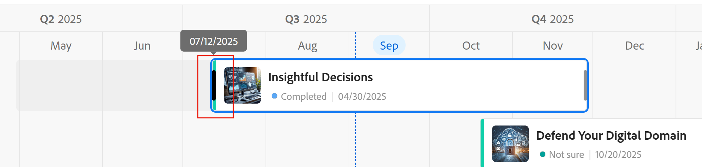

# Records bewerken

<!--keep the choice values information in yellow till Jan 2026-->

 de benadrukte informatie op deze pagina verwijst naar functionaliteit nog niet algemeen beschikbaar. Deze optie is alleen beschikbaar in de voorvertoningsomgeving voor alle klanten. Na de maandelijkse versies aan Productie, zijn de zelfde eigenschappen ook beschikbaar in het milieu van de Productie voor klanten die snelle versies toeliet. 

 voor informatie over snelle versies, zie [ snelle versies voor uw organisatie ](/help/quicksilver/administration-and-setup/set-up-workfront/configure-system-defaults/enable-fast-release-process.md) toelaten of onbruikbaar maken. 

{{planning-important-intro}}

U kunt recordgegevens bewerken in Adobe Workfront Planning door de waarden te bewerken van de velden die aan de records zijn gekoppeld.

U moet recordtypen maken voordat u records kunt maken en bewerken.

Voor informatie, zie [ recordtypes ](/help/quicksilver/planning/architecture/create-record-types.md) creëren.

Voor informatie over het creëren van verslagen, zie [ verslagen ](/help/quicksilver/planning/records/create-records.md) creëren.

&lt;!— vermeld hier dat de velden in de weergave Details hetzelfde zijn als die in de tabelweergave — dit artikel is gekoppeld vanuit de recordweergave Beheren om naar deze informatie te verwijzen.—>

## Toegangsvereisten

+++ Breid uit om de toegangsvereisten voor de functionaliteit in dit artikel te bekijken. 

<table style="table-layout:auto"> 
<col> 
</col> 
<col> 
</col> 
<tbody> 
    <tr> 
<tr> 
</tr>   
<tr> 
   <td role="rowheader">
Adobe Workfront-pakket
</td> 
   <td> 

Alle Workfront en alle planningspakketten
 
Willekeurige workflow en planningspakket

Neem voor meer informatie over wat er in elk planningspakket voor Workfront staat, contact op met uw Workfront-accountvertegenwoordiger. 
 
   </td> 
  <tr> 
   <td role="rowheader">
Adobe Workfront-licentie
</td> 
   <td>
Standard

   </td> 
  </tr> 
  <tr> 
   <td role="rowheader">
Objectmachtigingen
</td> 
   <td>   
Contribute of hoger machtigingen voor een werkruimte en recordtype  
  
   
Systeembeheerders hebben machtigingen voor alle werkruimten, inclusief de werkruimten die ze niet hebben gemaakt
 </td> 
  </tr>   
</tbody> 
</table>

Voor meer informatie over de toegangsvereisten van Workfront, zie [ vereisten van de Toegang in de documentatie van Workfront ](/help/quicksilver/administration-and-setup/add-users/access-levels-and-object-permissions/access-level-requirements-in-documentation.md).

+++   

<!--Old:
<table style="table-layout:auto"> 
<col> 
</col> 
<col> 
</col> 
<tbody> 
    <tr> 
<tr> 
<td> 
   
 Products
 </td> 
   <td> 
   <ul><li>
 Adobe Workfront
</li> 
   <li>
 Adobe Workfront Planning
</li></ul></td> 
  </tr>   
<tr> 
   <td role="rowheader">
Adobe Workfront plan*
</td> 
   <td> 

Any of the following Workfront plans:
 
<ul><li>Select</li> 
<li>Prime</li> 
<li>Ultimate</li></ul> 

Workfront Planning is not available for legacy Workfront plans
 
   </td> 
<tr> 
   <td role="rowheader">
Adobe Workfront Planning package*
</td> 
   <td> 

Any 
 

For more information about what is included in each Workfront Planning plan, contact your Workfront account manager. 
 
   </td> 
 <tr> 
   <td role="rowheader">
Adobe Workfront platform
</td> 
   <td> 

Your organization's instance of Workfront must be onboarded to the Adobe Unified Experience to be able to access Workfront Planning.
 

For more information, see <a href="/help/quicksilver/workfront-basics/navigate-workfront/workfront-navigation/adobe-unified-experience.md">Adobe Unified Experience for Workfront</a>. 
 
   </td> 
   </tr> 
  </tr> 
  <tr> 
   <td role="rowheader">
Adobe Workfront license*
</td> 
   <td> 
Standard
 
   
Workfront Planning is not available for legacy Workfront licenses
 
  </td> 
  </tr> 
  <tr> 
   <td role="rowheader">
Access level configuration
</td> 
   <td> 
There are no access level controls for Adobe Workfront Planning
   
</td> 
  </tr> 
<tr> 
   <td role="rowheader">
Object permissions
</td> 
   <td>  
Contribute or higher permissions to a workspace and record type </a> 
  
   
System Administrators have permissions to all workspaces, including the ones they did not create
  </td> 
  </tr> -->

## Overwegingen bij het bewerken van records

* U kunt records bewerken die u hebt gemaakt of records die door anderen zijn gemaakt, als u machtigingen hebt gekregen voor de werkruimte.
* U kunt recordvelden uit de volgende gebieden bewerken:

   * De voorvertoning van de record in een recordweergave
   * De detailpagina van de record
   * Inline, in een lijstmening.
   * De kalender- en tijdlijnweergave wanneer u de records vergroot of verkleint of sleept. Hiermee werkt u de datums van de records bij.

* Wanneer een gebruiker een record bewerkt in een weergave, zijn de wijzigingen direct zichtbaar in alle weergaven en zijn de recordpagina&#39;s voor alle andere gebruikers.

* De volgende typen velden worden automatisch bijgewerkt en u kunt de waarden ervan niet handmatig bewerken:
   * Gekoppelde velden uit andere records
   * Formuliervelden
   * Systeemvelden (Gemaakt door, Gemaakt op, Laatst gewijzigd door, Datum van laatste wijziging)
* Als de records die u weergeeft, aan andere records zijn gekoppeld, heeft de nieuwe informatie over de records die u bewerkt, betrekking op de gekoppelde records in alle werkruimten waar de record is gekoppeld.
* U kunt records niet bulksgewijs bewerken. <!--this will probably change-->
* URL&#39;s worden alleen herkend als koppelingen in tekstveldtypen voor één regel wanneer ze beginnen met: http://, https://, ftp:// of www. .
* U kunt een omslagafbeelding aan elke record toevoegen. De afbeelding is uniek voor elke record en is niet van toepassing op alle records van hetzelfde moment.
* U kunt de volgorde van de velden op een recordpagina bewerken en een omslagafbeelding voor een record toevoegen. Voor meer informatie, zie [ de lay-out van de verslagpagina beheren ](/help/quicksilver/planning/records/manage-the-record-page.md).
* U kunt de begin- en einddatums van een record bewerken door de grootte of de positie van de records in de tijdlijn- en de kalenderweergave te wijzigen.

  U kunt de grootte of positie van records niet wijzigen als de begin- en einddatum die u voor de record hebt gekozen, alleen-lezen zijn. Als u bijvoorbeeld opzoekings- of formulevelden gebruikt voor de begin- en einddatum van een record, kunt u de grootte of de positie van de record in een tijdlijn- en kalenderweergave niet wijzigen. <!--this also repeats below, for the timeline and the calendar views; also update there, if this changes-->

## Records bewerken

U kunt een record uit de volgende gebieden bewerken:

* [De tabelweergave](#edit-a-record-inline-in-the-table-view-of-a-record-type)
* [De tijdlijnweergave](#edit-a-record-in-the-timeline-view-of-a-record-type)
* [De kalenderweergave](#edit-a-record-in-the-calendar-view-of-a-record-type)
* [De voorvertoning van de record in een weergave](#edit-a-record-from-the-records-preview-in-a-view)
* [De recordpagina](#edit-a-record-from-the-records-page)
* [Een Workfront-object in het gedeelte Planning](#edit-a-record-from-a-workfront-object-in-the-planning-section)

Ga als volgt te werk om de datums van de records te bewerken:

* [ vergroot of vergroot de bars van de verslagen in de chronologie en kalendermening ]

### Een record inline bewerken in de tabelweergave van een recordtype

Wanneer u records uit de tabelweergave bewerkt, ziet u welk veld wordt bewerkt door andere gebruikers op het moment dat u de record weergeeft.

Voor meer informatie, zie [ verslagmeningen ](/help/quicksilver/planning/views/manage-record-views.md) leiden.

Wanneer u een nieuwe record toevoegt na de laatste record in een groep of subgroep, werkt Workfront automatisch de velden bij die zijn opgenomen in de groepen voor de nieuwe records. U kunt deze velden desgewenst handmatig bewerken en de records uit de groep verwijderen.

Voor informatie, zie [ verslagen ](/help/quicksilver/planning/records/create-records.md) creëren.

{{step1-to-planning}}

1. Klik op de werkruimte waarvan u de records wilt bewerken

   De werkruimte wordt geopend en de recordtypen worden als kaarten weergegeven.
1. Klik op een opnametype.

   De pagina met recordtypen wordt geopend.
1. (Voorwaardelijk) klik het lusje van een lijstmening of klik **+ Mening** om een lijstmening tot stand te brengen. De tabelweergave moet de standaardweergave zijn, tenzij u het recordtype in een ander type weergave hebt bekeken toen u het voor het laatst opende.

   De records die aan het geselecteerde recordtype zijn gekoppeld, worden in de tabelweergave weergegeven.
1. Klik in de rij van een record om informatie over de record inline te bewerken.

    uit

   >[!TIP]
   >
   >  U kunt de gegevens voor de volgende velden niet bewerken, omdat het alleen-lezen is en Workfront deze automatisch bijwerkt:
   >  
   >  * Gekoppelde velden die worden gemaakt door het verbinden van recordtypen. Voor meer informatie, zie [ Connect verslagtypes ](/help/quicksilver/planning/architecture/connect-record-types.md).
   >  * Velden van de volgende typen: Gemaakt door, Gemaakt op datum, Laatst gewijzigd door, Datum Laatst gewijzigd, Formule.

1. (Facultatief en voorwaardelijk) wanneer u een alinea-type gebied uitgeeft, gebruik de volgende **het formatteren opties van de Tekst 0} Rich {:**

   * Vet
   * Cursief
   * Onderstrepen
   * Een koppeling toevoegen
   * Een lijst met opsommingstekens toevoegen
   * Een genummerde lijst toevoegen

   

1. (Optioneel) Dubbelklik op een verbonden recordveld om gekoppelde records of objecten aan een andere record toe te voegen. Voor meer informatie, zie [ verbindt verslagen ](/help/quicksilver/planning/records/connect-records.md).
1. De pers **gaat** op uw toetsenbord binnen of klikt buiten een rij om uw veranderingen te bewaren. De wijzigingen worden automatisch opgeslagen. A **de Bewaarde** indicatorvertoningen kort in de hoger-juiste hoek van de lijstmening om te tonen dat de veranderingen werden bewaard.

1. (Optioneel) Voer een van de volgende handelingen uit om gegevens van het ene veld naar het andere te kopiëren en te plakken:

   * Kopieer een of meerdere bestaande waarden van een veld en plak deze in een veld van hetzelfde type in een andere record
   * Klik op de kolomkop van een kolom om deze te selecteren en te kopiëren, klik vervolgens op de kolomkop van een andere kolom en plak de inhoud van de gekopieerde kolom. De kolommen moeten gelijkaardige gebiedstypes bevatten.
   * Houd Shift ingedrukt en klik om meerdere rijen in een tabel te selecteren, kopieer de gegevens in de geselecteerde rijen en klik vervolgens op een andere rij en plak de geselecteerde gegevens in de nieuwe rij en de volgende rijen erna.
   * Kopieer de informatie uit één cel en selecteer vervolgens meerdere cellen en plak dezelfde informatie in meerdere cellen. U kunt meerdere cellen selecteren en dezelfde gegevens in meerdere cellen van aangrenzende rijen en kolommen plakken.
   * Selecteer de rechterbenedenhoek van een bestaande cel die de informatie bevat die u wilt kopiëren, en sleep deze vervolgens over de aangrenzende cellen waar u dezelfde informatie wilt plakken. Alle cellen moeten hetzelfde type informatie bevatten.

     

   * Kopieer een of meerdere cellen van een externe bron (bijvoorbeeld een Excel-bestand) en plak ze in een van de volgende veldtypen:

      * Workfront Planning connection fields.
      * Personenvelden. Alleen velden met één waarde worden ondersteund.

     U kunt geen informatie van een externe bron kopiëren en deze in andere veldtypen plakken, zoals de verbindingsvelden van Workfront of andere toepassingen.

   >[!NOTE]
   >
   >Overweeg het volgende:
   >
   >* Gebruik de volgende sneltoetsen voor het kopiëren en plakken van gegevens:
   >   * Kopiëren: CTRL + C (⌘ + C voor Mac)
   >   * Plakken: CTRL + V (⌘ + V voor Mac)
   >
   >* U kunt geen veldwaarden kopiëren en plakken op de recordpagina. Deze functionaliteit wordt alleen ondersteund in de tabelweergave van een recordtype.
   >* U kunt geen veldwaarden kopiëren en plakken voor de volgende veldtypen:
   >
   >    * Velden opzoeken die worden gemaakt bij het verbinden van recordtypen. U kunt gekoppelde recordvelden kopiëren en plakken. Voor meer informatie, zie [ Connect verslagtypes ](/help/quicksilver/planning/architecture/connect-record-types.md).
   >    * Velden van de volgende typen: Gemaakt door, Gemaakt op, Laatst gewijzigd door, Datum Laatst gewijzigd

1. (Optioneel) Gebruik de volgende sneltoetsen om het bewerken of kopiëren en plakken van recordgegevens ongedaan te maken of opnieuw uit te voeren:

   * CTRL + Z (⌘ + Z voor Mac) om een wijziging ongedaan te maken
   * CTRL + Shift + Z (⌘ + Shift + Z voor Mac) om een wijziging opnieuw uit te voeren

   >[!TIP]
   >
   >    U kunt de sneltoetsen meerdere malen achter elkaar gebruiken om meerdere wijzigingen ongedaan te maken.

1. (Optioneel) Voeg een miniatuur toe aan een record. Voor informatie, zie [ een duimnagel aan een verslag ](/help/quicksilver/planning/records/add-thumbnails-to-records.md) toevoegen.

### Een record bewerken in de tijdlijnweergave van een recordtype

<!--add another step about drag and drop here when that is available-->

1. Open de pagina met recordtypen in een tijdlijnweergave. Voor informatie, zie [ de chronologiemening ](/help/quicksilver/planning/views/manage-the-timeline-view.md) leiden.

1. Houd de muisaanwijzer boven de uiteinden van de balk van een record en klik, sleep de marge ervan naar een andere datum. Hiermee wordt automatisch de begin- of einddatum van de record bijgewerkt.

   

1. Klik op een recordbalk en houd deze ingedrukt en sleep deze naar een andere positie om de tijdlijn en datums bij te werken. De begin- en einddatum van de record worden automatisch bijgewerkt.

   >[!IMPORTANT]
   >
   >U kunt de uiteinden van een recordbalk niet slepen en neerzetten en u kunt de record niet naar een andere datum slepen wanneer de begin- en einddatum die u voor de record hebt gekozen, alleen-lezen zijn. Als u bijvoorbeeld opzoekings- of formulevelden gebruikt voor de begin- en einddatum van een record, kunt u de grootte of de positie van de record in een tijdlijnweergave niet wijzigen. <!--this also repeats in Considerations and in editing in the calendar view; also update there, if this changes-->

1. Klik op de balk van een record om het detailgebied te openen en alle velden te bewerken.

   Voor informatie, zie [ een verslag van de voorproef van het verslag in een mening ](#edit-a-record-from-the-records-preview-in-a-view) sectie in dit artikel uitgeven.

### Een record bewerken in de kalenderweergave van een recordtype

<!--add another step about drag and drop here when that is available-->

1. Open de pagina met recordtypen in een kalenderweergave. Voor informatie, zie [ de kalendermening ](/help/quicksilver/planning/views/manage-the-calendar-view.md) leiden.
1. (Voorwaardelijk) Houd de muisaanwijzer boven de uiteinden van de balk met records in de kalenderweergave en klik, sleep de marges naar een andere datum. Hiermee wordt automatisch de begin- of einddatum van de record bijgewerkt.

   

1. Klik op een recordbalk en houd deze ingedrukt en sleep deze naar een andere positie om de tijdlijn en datums bij te werken. De begin- en einddatum van de record worden automatisch bijgewerkt.

   >[!IMPORTANT]
   >
   >U kunt de uiteinden van een recordbalk niet slepen en neerzetten en u kunt de record niet naar een andere datum slepen wanneer de begin- en einddatum die u voor de record hebt gekozen, alleen-lezen zijn. Als u bijvoorbeeld opzoekings- of formulevelden gebruikt voor de begin- en einddatum van een record, kunt u de grootte of de positie van de record in een kalenderweergave niet wijzigen. <!--this also repeats in Considerations and in editing in the timeline view; also update there, if this changes-->

1. Klik op de balk van een record om het detailgebied te openen en alle velden te bewerken.

   Voor informatie, zie [ een verslag van de voorproef van het verslag in een mening ](#edit-a-record-from-the-records-preview-in-a-view) sectie in dit artikel uitgeven.

### Een record uit de voorvertoning van de record bewerken in een weergave

{{step1-to-planning}}

1. Klik op de werkruimte waarvan u de records wilt bewerken

   De werkruimte wordt geopend en de recordtypen worden als kaarten weergegeven.

1. Klik op een opnametype.

   De pagina met recordtypen wordt geopend.

1. Klik vanuit een weergave van een willekeurig type op de record

   of

   Van de lijstmening, klik het **Open pictogram van details** pictogram  in de eerste kolom. De voorvertoning van de record wordt in de weergave geopend.

   

1. (Facultatief) klik het **Meer** menu rechts van de titel van het verslag, dan klik **anders noemen**. Hiermee werkt u het veld bij dat wordt weergegeven als de titel van de record.

   De titel van de record is het primaire veld van de record bij weergave in een tabelweergave. Voor informatie, zie [ Primair gebiedsoverzicht ](/help/quicksilver/planning/fields/primary-field-overview.md).

1. Bewerk de veldinformatie in de voorvertoning van de record.

   >[!TIP]
   >
   >  U kunt de gegevens voor de volgende velden niet bewerken, omdat het alleen-lezen is en Workfront deze automatisch bijwerkt:
   >  
   >  * Velden opzoeken van andere records die zijn gemaakt door de recordtypen aan te sluiten. Voor meer informatie, zie [ Connect verslagtypes ](/help/quicksilver/planning/architecture/connect-record-types.md).
   >  * Velden van de volgende typen: Gemaakt door, Gemaakt op datum, Laatst gewijzigd door, Datum Laatst gewijzigd, Formule.

1. (Facultatief) klik **omslag** toevoegen om een omslagbeeld aan het verslag toe te voegen. Voor meer informatie, zie [ een omslagbeeld aan een verslag ](/help/quicksilver/planning/records/add-a-cover-image-to-a-record.md) toevoegen.

1. (Facultatief) Beweeg over het duimnagelpictogram, dan klik **Meer**  > **geef duimnagel** uit om een duimnagelbeeld toe te voegen. Voor informatie, zie [ een duimnagel aan een verslag ](/help/quicksilver/planning/records/add-thumbnails-to-records.md) toevoegen.

   Workfront slaat uw wijzigingen automatisch op.

1. (Facultatief) klik de **indicator in real time**  in de hoger-juiste hoek van de de voorproefdoos van het verslag, dan laat **Medewerkers** het plaatsen toe om de gebieden te benadrukken die door anderen in real time worden uitgegeven.

   De namen en avatars van alle gebruikers die tot het verslag tezelfdertijd toegang hebben tonen in dit gebied.

   Als de instelling is uitgeschakeld, worden de avatars en namen weergegeven in het gebied van de tijdindicator in real time en worden de velden die worden bewerkt niet gemarkeerd.

   

1. (Facultatief) klik het **menu van de Uitvoer** pictogram van de Uitvoer in verslagdetailpagina  Voor informatie, zie [ de details van een verslag ](/help/quicksilver/planning/records/export-the-record-page.md) uitvoeren.

1. (Facultatief) klik **Open in nieuw lusje** pictogram  <!--check the icon; they are changing it--> in de hoger-juiste hoek van de voorproef van het verslag om de pagina van het verslag in een nieuw lusje te openen. Ga verder het uitgeven van het verslag zoals die in [ wordt beschreven geef een verslag van de pagina van het verslag ](#edit-a-record-from-the-records-page) sectie in dit artikel uit.

### Een record op de recordpagina bewerken

{{step1-to-planning}}

1. Klik op de werkruimte waarvan u de records wilt bewerken

   De werkruimte wordt geopend en de recordtypen worden als kaarten weergegeven.

1. Klik op een opnametype.

   De pagina met recordtypen wordt geopend.

1. Voer een van de volgende handelingen uit:

   * Van om het even welke mening, toegang tot de voorproef van het verslag, zoals die in [ wordt beschreven geef een verslag van de voorproef van het verslag in een mening ](#edit-a-record-from-the-records-preview-in-a-view) sectie in dit artikel uit, dan klik **Open in nieuw lusje** pictogram  <!--check the icon; they are changing it--> in de hoger-juiste hoek van de verslagvoorproef om de pagina van het verslag in een nieuw lusje te openen.

   * Van de **mening van de Lijst**, houd over de naam van een verslag, dan klik het **Meer** menu , dan klik **Mening**

     

     De recordpagina wordt geopend.

     

1. (Facultatief) klik het **Meer** menu rechts van de titel van het verslag, dan klik **anders noemen**. Hiermee werkt u het veld bij dat wordt weergegeven als de titel van de record.

   De titel van de record is het primaire veld van de record bij weergave in een tabelweergave. Voor informatie, zie [ de lijstmening ](/help/quicksilver/planning/views/manage-the-table-view.md) leiden.

1. Klik op een bewerkbaar veld op de recordpagina om deze te bewerken.

   >[!TIP]
   >
   >  U kunt de gegevens voor de volgende velden niet bewerken, omdat het alleen-lezen is en Workfront deze automatisch bijwerkt:
   >  
   >  * Gekoppelde velden die worden gemaakt door het verbinden van recordtypen. Voor meer informatie, zie [ Connect verslagtypes ](/help/quicksilver/planning/architecture/connect-record-types.md).
   >  * Velden van de volgende typen: Gemaakt door, Gemaakt op datum, Laatst gewijzigd door, Datum Laatst gewijzigd, Formule.

1. (Optioneel) Klik op het informatiepictogram rechts van een veld dat de beschrijving van een veld weergeeft.
1. (Facultatief) klik **omslag** toevoegen om een omslagbeeld aan het verslag toe te voegen

   of

   Beweeg over het bestaande omslagbeeld, dan klik **Meer** menu  > **uploadt** om een nieuw omslagbeeld voor het verslag toe te voegen.

   Voor meer informatie, zie [ een omslagbeeld aan een verslag ](/help/quicksilver/planning/records/add-a-cover-image-to-a-record.md) toevoegen.

1. (Facultatief) Beweeg over een bestaande duimnagel, of het **duimnagelpictogram** , dan klik het **Meer** menu  > **geeft duimnagel** uit om een duimnagel voor het verslag toe te voegen.

   Voor meer informatie, zie [ een duimnagel aan een verslag ](/help/quicksilver/planning/records/add-thumbnails-to-records.md) toevoegen.

   Workfront slaat uw wijzigingen automatisch op.

1. (Facultatief) klik de **indicator in real time**  in de hoger-juiste hoek van de pagina van het verslag, dan laat **samenwerkers** toe plaatsen tonen om de gebieden te benadrukken die door anderen in real time worden uitgegeven.

   De namen en avatars van alle gebruikers die tot het verslag tezelfdertijd toegang hebben tonen in dit gebied.

   Als de instelling is uitgeschakeld, worden de avatars en namen weergegeven in het gebied van de tijdindicator in real time en worden de velden die worden bewerkt niet gemarkeerd.

   

1. (Facultatief) klik het **menu van de Uitvoer** pictogram van de Uitvoer in verslagdetailpagina  Voor informatie, zie [ de details van een verslag ](/help/quicksilver/planning/records/export-the-record-page.md) uitvoeren.

## Een record uit een Workfront-object bewerken in de sectie Planning

Nadat u records met Workfront-objecten hebt verbonden, kunt u Workfront Planning-records in Workfront bewerken vanuit de sectie Planning van het object.

Voor meer informatie, zie [ recordverbindingen van de voorwerpen van Workfront beheren ](/help/quicksilver/planning/records/manage-records-in-planning-section.md).

## Veldinstellingen voor één of meerdere selecties bewerken bij het bijwerken van de waarden

<!--some of this information is also available in Edit fields article - update both when necessary-->

Als u informatie in een veld met één of meerdere selecties bijwerkt, kunt u nieuwe opties aan het veld toevoegen zonder dat u het veld hoeft te bewerken.

>[!IMPORTANT]
>
>De in deze sectie beschreven functionaliteit is alleen beschikbaar in de tabelweergave. Deze optie is niet beschikbaar in andere gebieden waar enkelvoudige of meervoudige velden worden weergegeven.

**VOORBEELD**

U hebt mogelijk een veld met de naam Status dat één keuze bevat en de opties Nieuw en Gesloten bevat. U wilt dan een keuze toevoegen voor de status In uitvoering. U kunt de keuze toevoegen door een van de volgende handelingen uit te voeren:

* Het veld bewerken. Voor informatie, zie [ gebieden ](/help/quicksilver/planning/fields/edit-fields.md) uitgeven
* Een nieuwe optie toevoegen tijdens het bewerken van de record in de tabelweergave, zoals hieronder wordt beschreven.

Een nieuwe keuze toevoegen aan een bestaand selectieveld wanneer u een record bewerkt:

1. Ga naar een pagina met recordtypen en open de tabelweergave.
1. Voeg het veld Eén of Meerdere selecties toe waaraan u een keuze wilt toevoegen in de tabelweergave als een nieuwe kolom. Voor informatie, zie [ gebieden ](/help/quicksilver/planning/fields/create-fields.md) creëren.
1. U kunt het veld inline bewerken door te dubbelklikken op de cel voor het veld.
1. Typ de naam van de keus u wilt toevoegen, dan klik **kiezen** toevoegen.

   

   De nieuwe keuze wordt direct toegevoegd aan het veld Eén keuze.

    een nieuwe keuzevrijheid wordt ook toegevoegd aan elke keus. U kunt de keuzevelden gebruiken in API-aanroepen of andere integraties. Voor informatie, zie [ gebieden ](/help/quicksilver/planning/fields/create-fields.md) creëren. 

