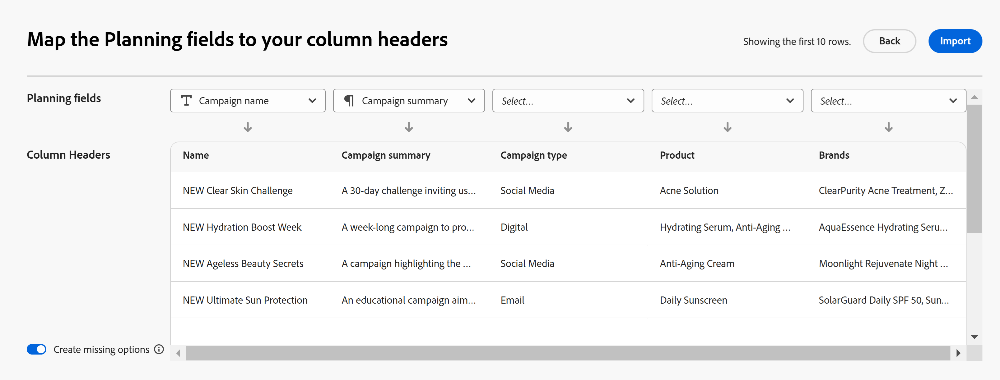

# Records maken door gegevens te importeren uit een CSV- of Excel-bestand

 de informatie op deze pagina verwijst naar functionaliteit nog niet algemeen beschikbaar. Deze optie is alleen beschikbaar in de voorvertoningsomgeving voor alle klanten. Na de maandelijkse versies aan Productie, zijn de zelfde eigenschappen ook beschikbaar in het milieu van de Productie voor klanten die snelle versies toeliet. 

 voor informatie over snelle versies, zie [ snelle versies voor uw organisatie ](/help/quicksilver/administration-and-setup/set-up-workfront/configure-system-defaults/enable-fast-release-process.md) toelaten of onbruikbaar maken. 

{{planning-important-intro}}

Records zijn afzonderlijke instanties van recordtypen. Dit zijn de objecttypen van Adobe Workfront Planning. In de Planning van Workfront, kunt u verslagen tot stand brengen door informatie van een CSV of dossier van Excel in te voeren.

Voor meer informatie over het creëren van verslagen, zie [ verslagen ](/help/quicksilver/planning/records/create-records.md) creëren.

## Toegangsvereisten

+++ Breid uit om toegangsvereisten te bekijken..

U moet de volgende toegang hebben om de stappen in dit artikel uit te voeren:

<table style="table-layout:auto"> 
<col> 
</col> 
<col> 
</col> 
<tbody> 
    <tr> 
<tr> 
<td> 
   
 Producten
 </td> 
   <td> 
   <ul><li>
 Adobe Workfront
</li> 
   <li>
 Adobe Workfront Planning
</li></ul></td> 
  </tr>   
<tr> 
   <td role="rowheader">
Adobe Workfront-abonnement*
</td> 
   <td> 

Een van de volgende Workfront-plannen:
 
<ul><li>Selecteren</li> 
<li>Prime</li> 
<li>Ultimate</li></ul> 

Workfront Planning is niet beschikbaar voor oudere Workfront-plannen
 
   </td> 
<tr> 
   <td role="rowheader">
Adobe Workfront-planningspakket*
</td> 
   <td> 

Alle 
 

Neem contact op met uw Workfront-accountmanager voor meer informatie over wat er in elk Workfront-planningsplan is opgenomen. 
 
   </td> 
 <tr> 
   <td role="rowheader">
Adobe Workfront-platform
</td> 
   <td> 

Het geval van Workfront van uw organisatie moet aan de Adobe Verenigde Ervaring worden bezeten om tot alle mogelijkheden van de Planning van Workfront toegang te hebben.
 

Voor meer informatie, zie <a href="/help/quicksilver/workfront-basics/navigate-workfront/workfront-navigation/adobe-unified-experience.md"> Adobe Verenigde Ervaring voor Workfront </a>. 
 
   </td> 
   </tr> 
  </tr> 
  <tr> 
   <td role="rowheader">
Adobe Workfront-licentie*
</td> 
   <td> Standaard
   
Workfront Planning is niet beschikbaar voor oudere Workfront-licenties
 
  </td> 
  </tr> 
  <tr> 
   <td role="rowheader">
Configuratie op toegangsniveau
</td> 
   <td> 
Er zijn geen toegangsniveaucontroles voor de Planning van Adobe Workfront
 
   
Toegang in Workfront bewerken voor de objecttypen die u wilt maken (projecten, programma's en portfolio's) terwijl u deze koppelt aan nieuwe records  
  
</td> 
  </tr> 
<tr> 
   <td role="rowheader">
Objectmachtigingen
</td> 
   <td> 
Draag of hogere toestemmingen aan de werkruimte <!--and record type--> bij waar u verslagen wilt toevoegen. 
  
   
Systeembeheerders hebben machtigingen voor alle werkruimten, inclusief de werkruimten die ze niet hebben gemaakt

   
Rechten voor Workfront-objecten (portfolio's) beheren om onderliggende objecten (projecten) toe te voegen.

   </td> 
  </tr> 
<tr> 
   <td role="rowheader">
Lay-outsjabloon
</td> 
   <td> 
Aan alle gebruikers, inclusief Workfront-beheerders, moet een lay-outsjabloon worden toegewezen die het planningsgebied in het hoofdmenu bevat 
 </td> 
  </tr> 
</tbody> 
</table>

*Voor meer informatie over de toegangsvereisten van Workfront, zie [ vereisten van de Toegang in de documentatie van Workfront ](/help/quicksilver/administration-and-setup/add-users/access-levels-and-object-permissions/access-level-requirements-in-documentation.md).

+++

## Overwegingen bij het importeren van records met een Excel- of CSV-bestand

* De kolomkoppen in elk blad worden de velden die zijn gekoppeld aan records.
* Elke rij in elk blad wordt een unieke record.
* Als het Excel-bestand meer dan één blad bevat, wordt alleen de informatie uit één blad geïmporteerd die u tijdens het importeren selecteert.
* Het bestand mag het volgende niet overschrijden:
   * 25.000 rijen
   * 500 kolommen
* Het bestand mag niet groter zijn dan 5 MB.
* Lege bladen worden niet ondersteund.
* Velden van de volgende typen worden niet ondersteund en kunnen niet worden toegewezen aan velden op het importblad:
   * Verbindingen en opzoekvelden van verbonden records <!--or connected Workfront objects-->
   * Formuliervelden
   * Gemaakt op
   * Laatst gewijzigd op
   * Mensen
   * Als een multi- of single-select gebied wordt ingevoerd en het meer keuzen dan een gelijkaardig gebied in Planning heeft, worden de extra opties gecreeerd tijdens de invoer. Alleen gebruikers met de machtiging Beheren in de werkruimte kunnen nieuwe keuzen importeren.

## Records maken door een CSV- of Excel-bestand te importeren

{{step1-to-planning}}

1. Klik op de werkruimte waar u records wilt maken.

   of

   Vouw in een werkruimte de pijl omlaag naar rechts uit, zoek naar een werkruimte en selecteer deze wanneer de werkruimte in de lijst wordt weergegeven.
1. Klik op de kaart van het recordtype waar u de records wilt importeren.
1. Klik **Nieuw verslag** in de hoger-juiste hoek van het scherm.
1. Klik **uploaden van dossier**, dan **verdergaan**. <!--add screen shot when all three buttons are added - with the Submit a request button-->
1. Sleep en laat vallen een Excel of Csv- dossier eerder op uw computer, of klik **Uitgezocht een Csv of dossier van Excel** om voor te doorbladeren.
1. Klik **Voorproef en geef uit**.
1. (Voorwaardelijk) als het ingevoerde dossier meer dan één blad heeft, selecteer het radioknoop van het blad u in **wilt invoeren Selecteer een blad om** doos in te voeren, dan klik **daarna**. Anders gaat u door met de volgende stap.

   
1. In de **Kaart de gebieden van de Planning aan uw kolomkopballen** selecteren het **Geplande gebied** dat het best de informatie in elk van de kolommen van het blad aanpast.

   

   Elke rij vertegenwoordigt een nieuwe record. Alleen de eerste 10 records worden weergegeven in het vak Voorbeeld en bewerken.

1. (Facultatief en voorwaardelijk) als u hebt leiden toestemmingen aan de werkruimte, **creeer ontbrekende opties** in de laag-linkerhoek van het scherm. Als deze optie is ingeschakeld, worden de ontbrekende keuzen van velden met één of meerdere selecties toegevoegd.

   >[!NOTE]
   >
   >Als het geselecteerde recordtype bijvoorbeeld een enkel-geselecteerd statusveld met de opties Nieuw, Bezig en Gesloten heeft en een statusveld dat uit een bestand is geïmporteerd, ook de statuskeuze Status In wachtstand heeft, wordt de statuskeuze in de wachtstand ook toegevoegd.
   >
   >Als u geen beheermachtigingen hebt voor de werkruimte, kunt u records importeren, maar worden de extra opties niet gemaakt. In plaats daarvan, ontvangt u het volgende bericht in de hoger-juiste hoek van de Kaart de gebieden van de Planning aan uw doos van kolomkopballen: **de keuzen die niet in verbinding bestaan, zullen enig- of multi-uitgezochte gebieden niet worden toegevoegd**.

1. Klik **Invoer**.

   De volgende informatie wordt geïmporteerd in Workfront Planning:

   * Nieuwe records die onder aan de tabelweergave van het geselecteerde recordtype worden weergegeven.
   * Nieuwe veldwaarden voor bestaande velden die aan elke record zijn gekoppeld.
   * Nieuwe keuzen van een multi- of enig-uitgezocht gebied dat niet in Planning bestond.  <!--when we add connected records - add those here too-->

   U kunt velden en records beheren op de pagina met recordtypen.

   Iedereen met toegang tot de Planning van Workfront en de werkruimte kan nu de ingevoerde verslagen en hun informatie bekijken en uitgeven.

   <!--when we add connected records and the info icon in the tool changes, also add those items to the Import step and to the NOTE above it-->
