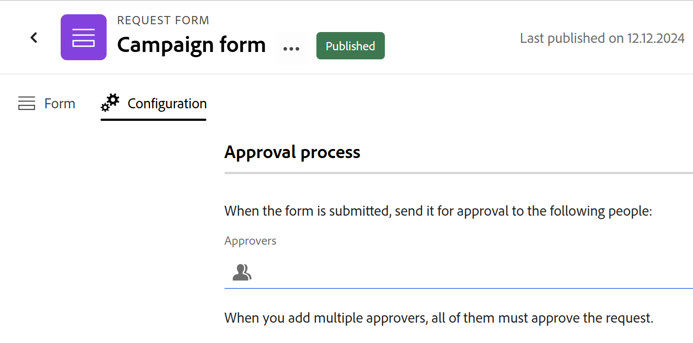

# Goedkeuring toevoegen aan een aanvraagformulier in Adobe Workfront Planning

<!--update the metadata with real information when making this available in TOC and in the left nav-->

<!--
The highlighted information on this page refers to functionality not yet generally available. It is available only in the Preview environment for all customers. After the monthly releases to Production, the same features are also available in the Production environment for customers who enabled fast releases.    

For information about fast releases, see [Enable or disable fast releases for your organization](/help/quicksilver/administration-and-setup/set-up-workfront/configure-system-defaults/enable-fast-release-process.md). 
-->

{{planning-important-intro}}

U kunt een goedkeuringsproces aan een formulier van het de planningsverzoek van Adobe Workfront toevoegen, om een goedkeuring voor elk voorgelegd verzoek in werking te stellen, alvorens het tot een verslag leidt.

In dit artikel wordt beschreven hoe een werkruimtebeheerder een goedkeuring kan toevoegen aan een aanvraagformulier dat is gekoppeld aan een recordtype.

Voor informatie over het creëren van een verzoekvorm in de Planning van Workfront, zie [&#x200B; een verzoekvorm in de Planning van Adobe Workfront creëren en beheren &#x200B;](/help/quicksilver/planning/requests/create-request-form.md).

Voor informatie over het voorleggen van een verzoek aan een verslagtype om een verslag tot stand te brengen, zie [&#x200B; de Verzoeken van de Planning van Adobe Workfront voorleggen om verslagen &#x200B;](/help/quicksilver/planning/requests/submit-requests.md) tot stand te brengen.

## Toegangsvereisten

+++ Breid uit om de toegangseisen voor de functionaliteit in dit artikel weer te geven. 

<table style="table-layout:auto"> 
<col> 
</col> 
<col> 
</col> 
<tbody> 
<tr> 
   <td role="rowheader">
Adobe Workfront-pakketten
</td> 
   <td> 

Any Workfront package and any Planning package

of

Any Workflow package and any Planning package

Neem voor meer informatie over wat er in elk planningspakket voor Workfront staat, contact op met uw Workfront-accountvertegenwoordiger.

   </td> </tr>

</tr> 
  <tr> 
   <td role="rowheader">
Adobe Workfront-licentie
</td> 
   <td>
Standard
 
  </td> 
  </tr> 
  <tr> 
   <td role="rowheader">
Objectmachtigingen
</td> 
   <td>   
Machtigingen beheren voor een werkruimte en recordtype </a> 
  
   
Systeembeheerders hebben machtigingen voor alle werkruimten, inclusief de werkruimten die ze niet hebben gemaakt
  </td> 
  </tr>  
</tbody> 
</table>

Voor meer informatie over de toegangsvereisten van Workfront, zie [&#x200B; vereisten van de Toegang in de documentatie van Workfront &#x200B;](/help/quicksilver/administration-and-setup/add-users/access-levels-and-object-permissions/access-level-requirements-in-documentation.md).

+++

## Overwegingen bij het toevoegen van goedkeuringen aan een aanvraagformulier

* U kunt een of meerdere fiatteurs toevoegen aan een aanvraagformulier. U kunt gebruikers en teams toevoegen als fiatteurs.
* U kunt goedkeuringsgegevens weergeven in een record die is gemaakt door een aanvraagformulier in te dienen in de velden Goedgekeurd door en Goedgekeurd. Voor informatie, zie [&#x200B; gebieden &#x200B;](/help/quicksilver/planning/fields/create-fields.md) creëren.
* Wanneer u meerdere fiatteurs toevoegt aan een aanvraagformulier, moeten alle fiatteurs het verzoek accepteren voordat een record wordt gemaakt in Workfront Planning.
* Als alle fiatteurs het verzoek goedkeuren, wordt een verslag gecreeerd voor het verslagtype verbonden aan het verzoekformulier.
* Als minstens één fiatteur het verzoek verwerpt, en alle anderen het goedkeuren, wordt een verzoek gecreeerd voor het gebied van Verzoeken in Workfront, maar geen verslag wordt gecreeerd voor het verslagtype verbonden aan het verzoekformulier.
* Het toevoegen van goedkeuringen aan een aanvraagformulier is optioneel. Workfront Planning maakt onmiddellijk een record wanneer een aanvraag wordt ingediend, als het aanvraagformulier niet aan een goedkeuring is gekoppeld.

<!--

## Add an approval to a request form in the Production environment

1. Start creating a request form for a record type, as described in [Create and manage a request form in Adobe Workfront Planning](/help/quicksilver/planning/requests/create-request-form.md).
1. Click **Configuration**.

    The **Configuration** area displays.

    
1. In the **Approvers** field, start typing the name of a user or team that you want to set as an approver, then select it when it displays in the list. 
1. (Optional and conditional) If you have set more than one approver, and only need one approver to make a decision, enable the **Only one decision is required** option.

    (****most of the Note below is duplicated in the Create a request form article***)

      >[!NOTE]
      >
      >
      >* You can add one or several approvers to a request form.
      >
      >* If you add more than one approver, and the Only one decision is required option is not enabled, all approvers must approve the request before Workfront Planning creates a record.
      >
      >* If at least one approver rejects the request, the request is rejected and the record is not created. The request remains in the Requests area of Workfront.
      >
      >* If you add more than one approver, and the Only one decision is required option is not enabled, all approvers must make a decision before a request is either approved or rejected.
      >
      >* If a team is set as an approver, only one decision is required from the team.

1. (Optional) Click **Publish** if you have never shared the request form before.

    Or

    Click **Share** to share the form, then **Copy link**. 
1. (Optional) After a user uses the link you share and submits a request, Workfront Planning sends an approval in-app notification and an email to the approvers.

   For information about approving requests, see [Approve a request](/help/quicksilver/planning/requests/approve-request.md).

-->

## Goedkeuringsregels toevoegen aan een aanvraagformulier

In de goedkeuringsregels wordt het goedkeuringsproces gedefinieerd op basis van de veldwaarden in de ingediende aanvragen.

Als een aanvraagformulier bijvoorbeeld het veld ‘Campagnertype’ heeft, kan een regel worden gemaakt die de aanvraag naar één persoon verzendt wanneer het veld de waarde ‘Digitaal’ heeft en naar een andere persoon wanneer deze de waarde ‘Afdrukken’ heeft.

Houd rekening met het volgende wanneer u goedkeuringsregels toevoegt:

* U kunt een of meerdere fiatteurs toevoegen aan een goedkeuringsregel.
* If at least one approver rejects the request, the request is rejected and the record is not created. The request remains in the Requests area of Workfront.
* If you add more than one approver, and the Only one decision is required option is not enabled, all approvers must make a decision before a request is either approved or rejected.
* If a team is set as an approver, only one decision is required from one member of the team.

To set approval rules for a request form:

1. Begin creërend een verzoekvorm voor een verslagtype, zoals die in artikel [&#x200B; wordt beschreven creeer en beheer een verzoekvorm in de Planning van Adobe Workfront &#x200B;](/help/quicksilver/planning/requests/create-request-form.md).
1. Wanneer de verzoekvorm opent, klik **Montages**.

   Het **lusje van Montages** opent.

1. Beginnen vormend goedkeuringsregels, klik **goedkeurt**  in het linkerpaneel.

1. (Facultatief) als u een standaardgoedkeuringsproces wilt plaatsen, voeg minstens één gebruiker of team aan het **Approvers** gebied van de **Standaard goedkeuringsregel** toe, dan klik **slechts één besluit wordt vereist** checkbox als u het verslag wilt worden gecreeerd nadat om het even welke standaardfiatteurs het hebben goedgekeurd.

   

1. (Optioneel) Begin goedkeuringsregels toe te voegen. Ga als volgt te werk voor elke aangepaste goedkeuringsregel:

   1. Klik **toevoegen goedkeuringsregel**
   1. Klik de placeholder titel **Naamloze goedkeuringsregel** en ga een naam voor de goedkeuringsregel in.
   1. Klik **Uitgezocht een gebied** en selecteer het gebied dat de regel activeert.
   1. Selecteer de operator voor de regel. Operatoren variëren afhankelijk van het type veld.
   1. If the selected operator requires a value, click the plus icon and add one or more values.
   1. (Optional) Click **Add condition** to add more conditions and connect them by **And** or **Or** statements by configuring the additional conditions as in steps C-E.
   1. In the **Actions** area of the approval rule, in the **Approvers** field, add at least one user or team to be set at the approver when the condition is met.
   1. (Conditional and optional) If you want the record to be created after any one of the approvers has approved it, check the **Only one decision is required** checkbox. Otherwise, all approvers must decide on the approval before the request is accepted or rejected.

   >[!NOTE]
   >
   >   Houd rekening met het volgende wanneer u goedkeuringsregels toevoegt:
   >
   >   * Als slechts een standaardregel opstelling is, is het op elk voorgelegd verzoek van toepassing.
   >   * Als aan een douaneregel wordt voldaan, wordt het gebrek niet toegepast op het werkschema van de verzoekgoedkeuring. Alleen de aangepaste regels worden toegepast voor goedkeuringen en de standaardregel wordt genegeerd.
   >   * Als aan meerdere aangepaste regels wordt voldaan, is de eerste in de volgorde van toepassing. In dit geval is de standaardgoedkeuring niet van toepassing, indien deze bestaat.

1. Klik **sparen** om de goedkeuringsregels te bewaren.
1. (Facultatief) klik **publiceren** als u nooit de verzoekvorm eerder hebt gedeeld.
