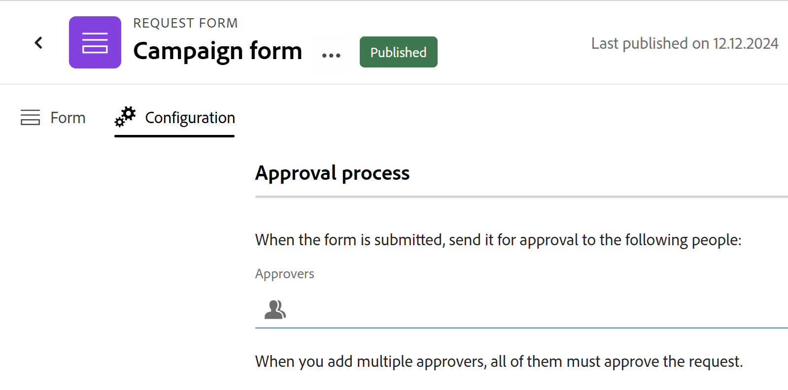

# Een aanvraagformulier maken en beheren in Adobe Workfront Planning

<!--update the metadata with real information when making this available in TOC and in the left nav-->

<!--take Preview and Production references at Production time-->

<!--The highlighted information on this page refers to functionality not yet generally available. It is available only in the Preview environment for all customers. After the monthly releases to Production, the same features are also available in the Production environment for customers who enabled fast releases.    

For information about fast releases, see [Enable or disable fast releases for your organization](/help/quicksilver/administration-and-setup/set-up-workfront/configure-system-defaults/enable-fast-release-process.md). 

-->

{{planning-important-intro}}

U kunt een aanvraagformulier maken en dit koppelen aan een recordtype in Adobe Workfront Planning. Vervolgens kunt u een koppeling naar de koppeling delen met andere interne of externe gebruikers.

Gebruikers met een koppeling naar het formulier kunnen de veldwaarden erop bijwerken en nieuwe records toevoegen door het formulier te verzenden.

In dit artikel wordt beschreven hoe een werkruimtebeheerder een aanvraagformulier kan maken dat is gekoppeld aan een recordtype.

Voor informatie over het voorleggen van een verzoek aan een verslagtype om een verslag tot stand te brengen, zie [ de Verzoeken van de Planning van Adobe Workfront voorleggen om verslagen ](/help/quicksilver/planning/requests/submit-requests.md) tot stand te brengen.

## Toegangsvereisten

+++ Breid uit om de toegangseisen voor de functionaliteit in dit artikel weer te geven.

U moet de volgende toegang hebben om de stappen in dit artikel uit te voeren:

<table style="table-layout:auto">
 <col>
 </col>
 <col>
 </col>
 <tbody>
    <tr>
<tr>
<td>
   
 Producten
 </td>
   <td>
   <ul><li>
 Adobe Workfront
</li>
   <li>
 Adobe Workfront Planning
</li></ul></td>
  </tr>  
 <tr>
   <td role="rowheader">
Adobe Workfront-abonnement*
</td>
   <td>

Een van de volgende Workfront-plannen:

<ul><li>Selecteren</li>
<li>Prime</li>
<li>Ultimate</li></ul>

Workfront Planning is niet beschikbaar voor oudere Workfront-plannen

   </td>

<tr>
   <td role="rowheader">
Adobe Workfront-planningspakket*
</td>
   <td>

Alle 
  

Neem contact op met uw Workfront-accountmanager voor meer informatie over wat er in elk Workfront-planningsplan is opgenomen. </td>

<tr>
   <td role="rowheader">
Adobe Workfront-platform
</td>
   <td>

Het geval van Workfront van uw organisatie moet aan de Adobe Verenigde Ervaring worden bezeten om tot alle mogelijkheden van de Planning van Workfront toegang te hebben.

Voor meer informatie, zie <a href="/help/quicksilver/workfront-basics/navigate-workfront/workfront-navigation/adobe-unified-experience.md"> Adobe Verenigde Ervaring voor Workfront </a>. 

   </td>

</tr>
  </tr>
  <tr>
   <td role="rowheader">
Adobe Workfront-licentie*
</td>
   <td>
   
Standaard

   
Workfront Planning is niet beschikbaar voor oudere Workfront-licenties

  </td>
  </tr>
  <tr>
   <td role="rowheader">
Configuratie op toegangsniveau
</td>
   <td> 
Er zijn geen toegangsniveaucontroles voor de Planning van Adobe Workfront
  
</td>
  </tr>
<tr>
   <td role="rowheader">
Objectmachtigingen
</td>
   <td>
   <ul>
   <li>
Machtigingen beheren in een werkruimte
</li>
    <li>
Systeembeheerders kunnen werkruimten beheren die ze niet hebben gemaakt. 
</li>
    </ul>
   
Voor informatie over het delen van machtigingen voor Workfront Planning-objecten raadpleegt u  
   <a href="/help/quicksilver/planning/access/sharing-permissions-overview.md"> Overzicht van het delen van toestemmingen in de Planning van Adobe Workfront </a> 
  </td>
  </tr>
<tr>
   <td role="rowheader">
Lay-outsjabloon
</td>
   <td> 
Aan alle gebruikers, inclusief Workfront-beheerders, moet een lay-outsjabloon worden toegewezen die het planningsgebied in het hoofdmenu bevat. 
  
</td>
  </tr>
 </tbody>
</table>

*Voor meer informatie over de toegangsvereisten van Workfront, zie [ vereisten van de Toegang in de documentatie van Workfront ](/help/quicksilver/administration-and-setup/add-users/access-levels-and-object-permissions/access-level-requirements-in-documentation.md).

+++

## Beperkingen op veld- en waardenweergave in aanvraagformulieren

<!--

There are limitations in how certain fields display on the request form and how their values later display on the records or the request details page, after you submit a request. 

For information about submitting requests to create records, see [Submit Adobe Workfront Planning requests to create records](/help/quicksilver/planning/requests/submit-requests.md). 

The following are limitations for how certain fields display in request forms, records created by a request form, or on the request details page: -->

* U kunt geen velden van de volgende typen toevoegen aan een aanvraagformulier:

   * Gemaakt door en laatstelijk gewijzigd door
   * Aanmaakdatum en datum van laatste wijziging
   * Formule. Formulervelden worden ondersteund in de voorvertoningsomgeving.
   * Opzoekvelden van Workfront-objecten
   * Workfront Planning connected records lookup fields

<!--at release to Preview, replace the above with this:  
>
>Fields of the following types do not display in the request form:
>* Created by and Last modified by
>* Created date and Last modified date
>* Formula. Formula fields display in request forms in the Preview environment.
>* Workfront objects' lookup fields
>* Workfront Planning connected records' lookup fields-->

* Verschil tussen de manier waarop veldindelingen worden weergegeven in de aanvraagformulierbuilder en de manier waarop de waarden worden opgemaakt op de record of op de pagina met aanvraagdetails:

   * De velden Valuta, Nummer en Percentage worden weergegeven als een tekstveldtype voor één regel in de formulierbuilder.

     De veldindeling blijft echter behouden en de waarden van de getallen in deze velden worden weergegeven als de waarden Valuta, Nummer en Percentage op het recordtype en op de pagina met aanvraagdetails.

<!--
* The following describes how some field values display on request forms and the request details pages: 

   * Special formatting for Currency, Number, and Percentage fields is not preserved. For example, the decimal precision is not preserved for these fields' values in these areas.
   * People field values display as IDs.
   * Formula fields that don't refer to other fields or calculations don't display any values. For example, a field with a `STRING` formula displays a "N/A" value.
   * Formula fields that refer to Currency fields display the values without accounting for exchange rates.
   * The values of Paragraph fields that contain special formatting display a "N/A" value on the request form and they display html tags instead of the formatted text in the request details page.
-->

## Een aanvraagformulier maken voor een recordtype

{{step1-to-planning}}

1. Klik op de werkruimte waar u records wilt toevoegen.

   De werkruimte wordt geopend en de recordtypen worden als kaarten weergegeven.

1. Klik op een opnametype. Voor informatie over het creëren van een verslagtype, zie [ recordtypes ](/help/quicksilver/planning/architecture/create-record-types.md) creëren.

   De pagina met recordtypen wordt geopend in de weergave die u het laatst hebt geopend. Standaard wordt een pagina met recordtypen geopend in de tabelweergave.

1. Klik **Meer** menu  aan het recht van het verslagtype naam in de paginakop, dan klik **creeer verzoekvorm**.
1. Werk de naam van het aanvraagformulier bij. Door gebrek, is de naam van de vorm **Naamloze vorm**. <!--check this; you logged a bug to rename it to 'Untitled request form' but was it fixed?-->
1. (Facultatief) voeg a **Beschrijving** voor de verzoekvorm toe.

   <!--Not possible yet: The Description is visible when you access the request form from the Requests area of Workfront.-->

1. Klik **creëren**. Het aanvraagformulier voor het geselecteerde recordtype wordt geopend op het tabblad Formulier.

   

   Het aanvraagformulier bevat standaard de volgende informatie:

   * De gebieden van het verslag beschikbaar in de lijstmening van het geselecteerde verslagtype. <!--they are working on removing the limitation below-->

   * **Standaard sectie**: Dit is de standaardsectieonderbreking die Workfront op de verzoekvorm van toepassing is. Alle verslaggebieden tonen op het **Standaard sectie** gebied.
   * **Onderwerp** gebied: Het gebied dat het verzoek in Workfront zal identificeren. De configuratie en de waarde van het onderwerpveld kunnen niet worden bewerkt.

     >[!TIP]
     >
     >Het **Onderwerp** gebied vereist een waarde wanneer het op de verzoekvorm zichtbaar is. Nochtans, kunt u het **Onderwerp** gebied verwijderen, indien nodig, en de verzoekers zullen het niet op de vorm zien wanneer zij het verzoek voorleggen.

   * Alle velden die aan het recordtype zijn gekoppeld.

     De velden in het aanvraagformulier zijn zichtbaar voor iedereen die een aanvraag naar dit recordtype indient.

1. (Optioneel) Houd de muisaanwijzer boven alle velden in het formulier die u wilt verwijderen en klik vervolgens op het pictogram **x** om deze te verwijderen. Zij worden toegevoegd aan het **lusje van Gebieden** links van de vorm.

   Bijvoorbeeld, verwijder het **Onderwerp** gebied, aangezien dit niet in de Planning van Workfront zichtbaar is. <!--remove this step when we connect intake with the Requests area in Workfront-->
1. (Facultatief) om de **Standaardsectie** uit de vorm te verwijderen, doe het volgende:

   1. Alle velden verwijderen uit de standaardsectie.
   1. Klik **de elementen van de Inhoud** en voeg een nieuwe sectie toe, dan voeg een naam voor de sectie toe.
   1. Voeg velden toe aan de nieuwe sectie.
   1. Klik het **x** pictogram om de **Standaard sectie** te verwijderen.
1. Klik op een veld en gebruik vervolgens de besturingselementen in het rechterdeelvenster van het formulier om de grootte van het veld te definiëren, of een van de volgende gegevens:

   * **Etiket**: Dit is de naam van het gebied aangezien het op de verzoekvorm zal verschijnen. Hiermee wijzigt u de naam van het recordveld niet.
   * **Instructies**: Voeg meer informatie over het gebied toe.
   * **maak een vereist gebied**: Wanneer geselecteerd, moet het gebied een waarde hebben. Anders kan het formulier niet worden verzonden.
   * **voegt logica** toe: Bepaal welke voorwaarden moeten worden voldaan opdat het gebied tonen of verborgen zijn.

   >[!TIP]
   >
   >   Het veldtype van elk veld wordt boven in het rechtervenster weergegeven, nadat u het veld op het formulier hebt geselecteerd.
   >     

1. (Facultatief) klik de **elementen van de Inhoud** tabel op de linkerkant van de vorm, en voeg om het even welke volgende elementen toe:

   * **Beschrijvende tekst**
   * **de onderbreking van de Sectie**

   Voor meer informatie over de bouw van een douaneformulier, zie [ een douaneformulier ](/help/quicksilver/administration-and-setup/customize-workfront/create-manage-custom-forms/form-designer/design-a-form/design-a-form.md) creëren.

1. (Facultatief) klik **Voorproef** om te bekijken hoe de vorm voor andere gebruikers zal tonen wanneer zij het zullen gebruiken om een nieuw verslag voor te leggen.

1. (Facultatief) klik het **lusje van de Configuratie**, dan voeg minstens één gebruiker aan het **Approvers** gebied toe om nieuwe verzoeken voor deze verslagvorm goed te keuren.

   

   <!--below bullet list is duplicated in the Add approval to a request form article-->

   * Wanneer u een aanvraagformulier aan fiatteurs koppelt, moet elk nieuw verzoek eerst worden goedgekeurd door alle fiatteurs voordat een nieuwe record wordt gegenereerd.
   * U kunt een of meer fiatteurs toevoegen aan een aanvraagformulier.
   * Als ten minste één fiatteur het verzoek afwijst, wordt het verzoek afgewezen en wordt de record niet gemaakt.
   * Elke fiatteur moet een beslissing nemen voordat een verzoek wordt goedgekeurd of afgewezen.

     Voor meer informatie over het toevoegen van goedkeuringen aan aanvraagvormen, zie [ goedkeuring aan een verzoekvorm ](/help/quicksilver/planning/requests/add-approval-to-request-form.md) toevoegen.

1. (Facultatief) klik **Meer** menu  aan het recht van de naam van de vorm in de kopbal, dan klik **uitgeven** om de naam van de vorm bij te werken.
1. Klik **publiceren** om de vorm te publiceren en een unieke verbinding voor het te verkrijgen.

   De volgende dingen doen zich voor:

   * De **Publish** knoop wordt verwijderd.
   * De **unpublish** knoop wordt toegevoegd aan de vorm. Als u erop klikt, is het formulier niet toegankelijk.
   * A **de knoop van het Aandeel** wordt toegevoegd aan de vorm.

1. Klik **Aandeel** om de vorm met anderen te delen.

   

1. Selecteer een van de volgende opties om aan te geven welke typen gebruikers toegang hebben tot dit formulier:

   * Iedereen met weergave of hogere toegang tot de werkruimte
   * Iedereen met een hogere of hogere toegang tot de werkruimte
   * Iedereen met de koppeling

   >[!WARNING]
   >
   >* Wanneer u **iedereen met de verbinding** selecteert, kan iedereen tot de vorm toegang hebben en een nieuw verslag voorleggen, zelfs mensen buiten uw organisatie die geen rekening van Workfront hebben.
   >
   > * Een formulier dat de volgende veldtypen bevat, kan niet openbaar worden gedeeld:
   >
   >     * Workfront- of AEM Assets-verbindingen
   >     * Mensen
   >

1. (Voorwaardelijk) als u **Iedereen met de verbinding** in de vorige stap selecteerde, selecteer de **vervaldatum van de Verbinding** van de beschikbare kalender. Personen ontvangen een fout nadat de koppeling is verlopen en u moet de datum van de koppeling bijwerken en een nieuwe koppeling genereren om te delen voordat ze het formulier weer kunnen openen.

   U kunt toekomstige datums selecteren binnen 180 dagen vanaf de huidige datum.

1. Klik **sparen en kopieer verbinding** om de het delen details voor de vorm te bewaren. Als de vorm eerder werd bewaard, klik **verbinding van het Exemplaar**.

   De opties voor het delen van formulieren worden opgeslagen en de koppeling wordt naar het klembord gekopieerd. U kunt deze nu delen met anderen.

   Voor informatie over het creëren van verslagen die een verbinding aan een verzoekvorm gebruiken, zie [ verzoeken van de Planning van Adobe Workfront voorleggen ](/help/quicksilver/planning/requests/submit-requests.md).

1. Klik **sparen** in de laag-juiste hoek van het **3} lusje van de Vorm {om de vorm te bewaren.**
1. Klik op de pijl die naar links wijst links van de naam van het formulier in de koptekst om het formulier te sluiten.

   De pagina met recordtypen wordt geopend.
1. (Facultatief) klik **Meer** menu  rechts van de naam van het verslagtype in de kopbal, dan doe één van het volgende:
   * Klik **de verzoekvorm van de Update** om het even welke veranderingen in de verzoekvorm aan te brengen.
   * Klik **verbinding van het Exemplaar om vorm** te verzoeken om de verbinding met de vorm met anderen te delen.

   >[!TIP]
   >
   >Er zijn aanwijzingen dat de link in dit geval openbaar wordt gedeeld.
   >
