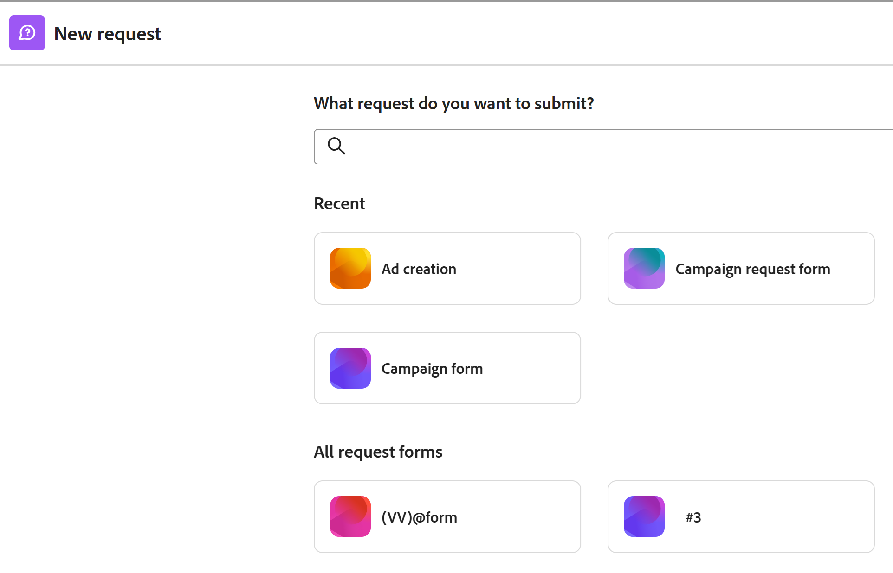

# Adobe Workfront-planningsverzoeken verzenden om records te maken

<!--update title when there will be more functionality added to the Planning requests, besides creating records-->
<!--take Preview and Prod references out when releasing to Prod all-->

 de benadrukte informatie op deze pagina verwijst naar functionaliteit nog niet algemeen beschikbaar. Deze optie is alleen beschikbaar in de voorvertoningsomgeving voor alle klanten. Na de maandelijkse versies aan Productie, zijn de zelfde eigenschappen ook beschikbaar in het milieu van de Productie voor klanten die snelle versies toeliet. 

 voor informatie over snelle versies, zie [ snelle versies voor uw organisatie ](/help/quicksilver/administration-and-setup/set-up-workfront/configure-system-defaults/enable-fast-release-process.md) toelaten of onbruikbaar maken. 

{{planning-important-intro}}

Nadat een werkruimtebeheerder een aanvraagformulier voor een recordtype heeft gemaakt in Adobe Workfront Planning, kunt u het formulier gebruiken om aanvragen in te dienen die records maken voor het recordtype dat aan het formulier is gekoppeld.

U kunt een aanvraag voor Workfront-planning vanuit de volgende gebieden indienen:

* Vanuit het gebied Aanvragen van Workfront of vanuit een directe koppeling naar het aanvraagformulier. In dit artikel wordt beschreven hoe u een verzoek kunt indienen om nieuwe records toe te voegen aan een recordtype vanuit het gebied Verzoeken van Workfront of via een gedeelde koppeling.
*  van de verslagtype pagina, wanneer u toevoegt of om een nieuw verslag verzoekt. Voor informatie, zie [ verslagen ](/help/quicksilver/planning/records/create-records.md) creëren.

Workfront-gebruikers en externe gebruikers kunnen aanvragen indienen bij de planning van recordtypen en records maken. <!--double check on the external users-->

Voor informatie over hoe een werkruimtemanager een verzoekvorm kan tot stand brengen en het met een verslagtype associeert, zie [ een verzoekvorm in de Planning van Adobe Workfront ](/help/quicksilver/planning/requests/create-request-form.md) creëren en beheren.

## Toegangsvereisten

+++ Breid uit om de toegangseisen voor de functionaliteit in dit artikel weer te geven.

U moet de volgende toegang hebben om de stappen in dit artikel uit te voeren:

<table style="table-layout:auto">
 <col>
 </col>
 <col>
 </col>
 <tbody>
    <tr>
<tr>
<td>
   
 Producten
 </td>
   <td>
   <ul><li>
 Adobe Workfront
</li>
   <li>
 Adobe Workfront Planning
</li></ul></td>
  </tr>  
 <tr>
   <td role="rowheader">
Adobe Workfront-abonnement*
</td>
   <td>

Een van de volgende Workfront-plannen:

<ul><li>Selecteren</li>
<li>Prime</li>
<li>Ultimate</li></ul>

Workfront Planning is niet beschikbaar voor oudere Workfront-plannen

   </td>
<tr>
   <td role="rowheader">
Adobe Workfront-planningspakket*
</td>
   <td>

Alle 
  

Neem contact op met uw Workfront-accountmanager voor meer informatie over wat er in elk Workfront-planningsplan is opgenomen. </td>
<tr>
   <td role="rowheader">
Adobe Workfront-platform
</td>
   <td>

Het geval van Workfront van uw organisatie moet aan de Adobe Verenigde Ervaring worden bezeten om tot alle mogelijkheden van de Planning van Workfront toegang te hebben.

Voor meer informatie, zie <a href="/help/quicksilver/workfront-basics/navigate-workfront/workfront-navigation/adobe-unified-experience.md"> Adobe Verenigde Ervaring voor Workfront </a>. 

   </td>

</tr>
  </tr>
  <tr>
   <td role="rowheader">
Adobe Workfront-licentie*
</td>
   <td>
   
Extern, Contributor, Light of Standard-licentie

   
Workfront Planning is niet beschikbaar voor oudere Workfront-licenties

  </td>
  </tr>
  <tr>
   <td role="rowheader">
Configuratie op toegangsniveau
</td>
   <td> 
Er zijn geen toegangsniveaucontroles voor de Planning van Adobe Workfront
  
</td>
  </tr>
<tr>
   <td role="rowheader">
Objectmachtigingen
</td>
   <td>
   
Machtigingen voor een werkruimte weergeven of hoger <!--and record type--> als u een Workfront-gebruiker bent
 
  </td>
  </tr>
<tr>
   <td role="rowheader">
Lay-outsjabloon
</td>
   <td> 
Om tot het planningsgebied in Workfront toegang te hebben, moet u een lay-outmalplaatje worden toegewezen dat het Gebied van de Planning in het Belangrijkste Menu omvat. 

   
 De toegang tot het planningsgebied is echter niet vereist voor het indienen van aanvragen bij Workfront Planning. 
  
</td>
  </tr>
 </tbody>
</table>

*Voor meer informatie over de toegangsvereisten van Workfront, zie [ vereisten van de Toegang in de documentatie van Workfront ](/help/quicksilver/administration-and-setup/add-users/access-levels-and-object-permissions/access-level-requirements-in-documentation.md).

+++

## Vereisten

U moet het volgende opgeven voordat u een aanvraag kunt indienen bij een Workfront-aanvraagformulier voor planning:

* In Workfront Planning moet het volgende bestaan:

   * Een werkruimte
   * Een recordtype.
   * Een aanvraagformulier dat is gekoppeld aan een recordtype.

     Voor informatie, zie [ een verzoekvorm in de Planning van Adobe Workfront ](/help/quicksilver/planning/requests/create-request-form.md) creëren.

* Het aanvraagformulier moet zo worden gedeeld dat u er toegang toe hebt. De volgende scenario&#39;s bestaan:

   * Intern moet het formulier worden gedeeld met gebruikers die beschikken over de machtiging Weergeven of hoger voor de werkruimte.

     De gebruikers van Workfront kunnen of tot de vorm van een verbinding  toegang hebben of de verzoekvorm in het gebied van Verzoeken van Workfront vinden.

   * Als u geen Workfront-account hebt, is een koppeling naar het formulier gedeeld met externe personen.

     Workfront-gebruikers hebben ook toegang tot een koppeling die wordt gedeeld met externe personen.

* De koppeling naar het formulier mag niet verlopen.

## Overwegingen bij het indienen van aanvragen bij de planning van Workfront

* U kunt een aanvraag niet bewerken in Workfront nadat u deze hebt verzonden.
* Elk ingediend verzoek maakt een record voor het recordtype dat is gekoppeld aan het formulier dat u gebruikt, als het formulier niet aan een goedkeuring is gekoppeld of als de goedkeuring door alle fiatteurs is verleend.
* Records die zijn gemaakt door het verzenden van aanvraagformulieren, kunnen niet worden onderscheiden van records die zijn toegevoegd via een andere methode in Workfront Planning.

  Voor informatie, zie [ verslagen ](/help/quicksilver/planning/records/create-records.md) creëren.
* Verzonden verzoeken worden weergegeven op het tabblad Planning van het gedeelte Ingediend in het gebied Verzoeken van Workfront.
* Er zijn beperkingen in de manier waarop bepaalde veldtypen worden weergegeven in een aanvraagformulier, of de pagina met aanvraagdetails nadat een formulier is verzonden.

  Voor informatie, zie [ creeer en beheer een verzoekvorm in de Planning van Adobe Workfront ](/help/quicksilver/planning/requests/create-request-form.md).

<!--Not sure how to change the request status, but dev also said: Changing the names of the statuses might lead to some inconsistency between unified-approvals-service and intake-approvals-flow.-->

## Een verzoek indienen bij Workfront Planning in het gedeelte Aanvragen van Workfront

>[!NOTE]
>
>Na de maandelijkse versies aan Productie, zijn de eigenschappen die in deze sectie worden beschreven ook beschikbaar in de milieu van de Productie voor klanten die snelle versies toeliet.

{{step1-to-requests}}

1. Laat de **Schakelaar aan een nieuwe ervaring** toe plaatsend, in de hoger-juiste hoek van het scherm.
Het toelaten van dit plaatsen maakt de het verzoekvormen van de Planning van Workfront beschikbaar in het **gebied van Verzoeken** van Workfront.

   >[!TIP]
   >
   >Deze instelling is alleen beschikbaar als de volgende opties zijn ingesteld:
   >
   >* Uw bedrijf heeft een pakket voor Workfront-planning aangeschaft.
   >* Uw Workfront-instantie wordt meegerekend bij de Adobe Unified Experience.
   >* U hebt toegang tot minstens één werkruimte.
   >

1. Klik **Nieuw verzoek**.

   

   Het **Nieuwe verzoek** vakje opent met de volgende informatie:

   * De 6 laatst geopende Workfront aanvraagrijen en de aanvraagformulieren voor planning worden weergegeven in de sectie Recent.
   * 50 extra de verzoekrijen van Workfront en van de Planning verzoekvormen tonen in alfabetische orde in **Al verzoekvormen** sectie. U kunt zoeken naar een aanvraagwachtrij die niet standaard wordt weergegeven.

1. Voer een van de volgende handelingen uit:

   * Klik op de kaart voor een van de formulieren voor planningsaanvragen in de secties Recente of Alle aanvraagformulieren
   * Typ de naam van een formulier voor planningsaanvragen in het zoekvak en klik vervolgens op de kaart wanneer deze in de lijst wordt weergegeven.

   Het aanvraagformulier wordt geopend.

1. Werk de velden bij die beschikbaar zijn in het aanvraagformulier. Velden met een rood sterretje zijn vereist.
1. Klik **voorleggen**.

   De verzoekvorm sluit en u keert aan het **gebied van Verzoeken** terug.

   Uw formulier wordt verzonden en de volgende dingen gebeuren:

   * Als het aanvraagformulier niet aan een goedkeuring is gekoppeld, wordt het verzoek toegevoegd aan het tabblad Planning van het gedeelte Verzenden van het gebied Workfront-verzoeken en wordt een nieuwe record toegevoegd aan het recordtype dat aan het formulier is gekoppeld.

   * Als het aanvraagformulier is gekoppeld aan een goedkeuring, wordt het verzoek toegevoegd aan het tabblad Planning van het gedeelte Verzendd van het gebied Workfront Requests. Een nieuwe record wordt pas aan de recordtypepagina toegevoegd nadat alle fiatteurs de record hebben goedgekeurd.

     Voor informatie, zie [ een goedkeuring aan een verzoekvorm ](/help/quicksilver/planning/requests/add-approval-to-request-form.md) toevoegen.

     

     >[!IMPORTANT]
     >
     >Alle gebruikers die toegang tot minstens één werkruimte hebben kunnen het lusje van de Planning in het gebied van Verzoeken bekijken. U kunt alleen de aanvragen weergeven die door u of iemand anders zijn ingediend bij de werkruimten die u minstens gemachtigd zijn weer te geven. Workfront-beheerders kunnen alle aanvragen weergeven die naar elke werkruimte in het systeem worden verzonden.

   * U ontvangt een melding in de app en een e-mail dat de aanvraag met succes is verzonden of ter controle is verzonden.
   * Als het aanvraagformulier aan een goedkeuring is gekoppeld, ontvangen de fiatteurs een in-app en een e-mailmelding om de aanvraag te beoordelen en goed te keuren.

     >[!NOTE]
     >
     >De e-mail en in-app meldingen zijn alleen zichtbaar wanneer het exemplaar van Workfront van uw organisatie is aangemeld bij de Adobe Unified Experience.

1. (Facultatief) klik het **Planning** lusje in het gebied van Verzoeken om uw verzoek te bekijken, dan klik de naam van het verzoek.

   De pagina met aanvraagdetails wordt geopend.

   

1. (Voorwaardelijk) als de verzoekvorm niet met een goedkeuring wordt geassocieerd, of als het verzoek is goedgekeurd, klik de naam van het verzoek, dan klik de naam van het verslag op het **1} gebied van het Verslag {.**

   De pagina van het verslag opent in de Planning van Workfront.

   >[!TIP]
   >
   >* Als het primaire gebied van het verslag niet in de verzoekvorm werd bijgewerkt, de naam van het verslag op het gebied van het Verslag van de verzoekvertoningen als **Naamloos**.
   >
   >* Als het aanvraagformulier is gekoppeld aan een goedkeuring, moet de goedkeuring worden verleend voordat u toegang krijgt tot de record op de aanvraagpagina.

1. (Facultatief) klik de naam van het **type van Verslag**.

   De pagina met recordtypen wordt geopend in Workfront Planning.

## Een aanvraag vanuit een gedeelde koppeling naar een aanvraagformulier indienen bij Workfront Planning

1. Ga naar de verbinding die met u van een het verslagtype van de Planning van Workfront wordt gedeeld.

1. Werk de velden bij die beschikbaar zijn in het formulier. Velden met een sterretje zijn vereist.

   >[!TIP]
   >
   >   Als het **Onderwerp** gebied beschikbaar is, zal het niet in de Planning van Workfront zichtbaar zijn, nadat het verzoek wordt voorgelegd.
   >
   >Wij adviseren dat u zoveel mogelijk gebieden in uw verzoek bijwerkt om het nieuwe verslag identificeerbaar te maken wanneer het aan het verslagtype in de Planning van Workfront wordt toegevoegd.

1. Klik **voorleggen**.

   Uw formulier wordt verzonden en de volgende dingen gebeuren:

   * Als het aanvraagformulier niet aan een goedkeuring is gekoppeld, wordt het verzoek toegevoegd aan het tabblad Planning van het gedeelte Verzenden van het gebied Workfront-verzoeken en wordt een nieuwe record toegevoegd aan het recordtype dat aan het formulier is gekoppeld.

   * Als het aanvraagformulier is gekoppeld aan een goedkeuring, wordt het verzoek toegevoegd aan het tabblad Planning van het gedeelte Verzendd van het gebied Workfront Requests. Een nieuwe record wordt pas aan de recordtypepagina toegevoegd nadat alle fiatteurs de record hebben goedgekeurd.

     Voor informatie, zie [ een goedkeuring aan een verzoekvorm ](/help/quicksilver/planning/requests/add-approval-to-request-form.md) toevoegen.

     

     >[!IMPORTANT]
     >
     >Alle gebruikers die toegang tot minstens één werkruimte hebben kunnen het lusje van de Planning in het gebied van Verzoeken bekijken. U kunt alleen de aanvragen weergeven die door u of iemand anders zijn ingediend bij de werkruimten die u minstens gemachtigd zijn weer te geven. Workfront-beheerders kunnen alle aanvragen weergeven die naar elke werkruimte in het systeem worden verzonden. <!--ensure this is correct; asking team in slack-->

   * U ontvangt een melding in de app en een e-mail dat de aanvraag met succes is verzonden of ter controle is verzonden.
   * Als het aanvraagformulier aan een goedkeuring is gekoppeld, ontvangen de fiatteurs een in-app en een e-mailmelding om de aanvraag te beoordelen en goed te keuren.

     >[!NOTE]
     >
     >De e-mail en in-app meldingen zijn alleen zichtbaar wanneer het exemplaar van Workfront van uw organisatie is aangemeld bij de Adobe Unified Experience.

1. (Facultatief) klik het **Planning** lusje in het gebied van Verzoeken om uw verzoek te bekijken, dan klik de naam van het verzoek.

   De pagina met aanvraagdetails wordt geopend.

   

1. (Voorwaardelijk) als de verzoekvorm niet met een goedkeuring wordt geassocieerd, of als het verzoek is goedgekeurd, klik de naam van het verzoek, dan klik de naam van het verslag op het **1} gebied van het Verslag {.**

   De pagina van het verslag opent in de Planning van Workfront.

   >[!TIP]
   >
   >* Als het verslag naam niet aan de verzoekvorm werd toegevoegd, de naam van het verslag op het gebied van het Verslag van de verzoekvertoningen als **Naamloos**.
   >
   >* Als het aanvraagformulier is gekoppeld aan een goedkeuring, moet de goedkeuring worden verleend voordat u toegang krijgt tot de record op de aanvraagpagina.

1. (Facultatief) klik de naam van het **type van Verslag**.

   De pagina met recordtypen wordt geopend in Workfront Planning.

