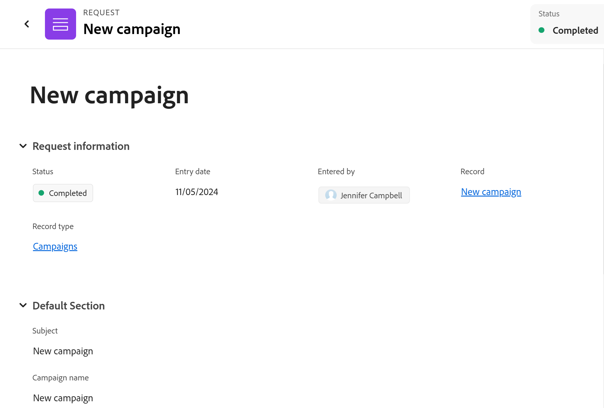

# Adobe Workfront-planningsverzoeken verzenden om records te maken

<!--update title when there will be more functionality added to the Planning requests, besides creating records-->
<!--take Preview and Prod references out when releasing to Prod all-->

<!--The highlighted information on this page refers to functionality not yet generally available. It is available only in the Preview environment for all customers. After the monthly releases to Production, the same features are also available in the Production environment for customers who enabled fast releases.    

For information about fast releases, see [Enable or disable fast releases for your organization](/help/quicksilver/administration-and-setup/set-up-workfront/configure-system-defaults/enable-fast-release-process.md). -->

{{planning-important-intro}}

Nadat iemand een verbinding met een verzoekformulier met u van een verslagtype pagina in de Planning van Adobe Workfront deelt, kunt u een verzoek toevoegen om verslagen voor het verslagtype tot stand te brengen verbonden aan het verzoekformulier.

Workfront-gebruikers en externe gebruikers kunnen aanvragen indienen bij de planning van recordtypen en records maken. <!--double check on the external users-->

In dit artikel wordt beschreven hoe u een verzoek kunt indienen om nieuwe records toe te voegen aan een recordtype.

Voor informatie over hoe een werkruimtemanager een verzoekvorm kan tot stand brengen en het met een verslagtype associeert, zie [ een verzoekvorm in de Planning van Adobe Workfront ](/help/quicksilver/planning/requests/create-request-form.md) creëren en beheren.

## Toegangsvereisten

+++ Breid uit om de toegangseisen voor de functionaliteit in dit artikel weer te geven.

U moet de volgende toegang hebben om de stappen in dit artikel uit te voeren:

<table style="table-layout:auto">
 <col>
 </col>
 <col>
 </col>
 <tbody>
    <tr>
<tr>
<td>
   
 Producten
 </td>
   <td>
   <ul><li>
 Adobe Workfront
</li>
   <li>
 Adobe Workfront Planning
</li></ul></td>
  </tr>  
 <tr>
   <td role="rowheader">
Adobe Workfront-abonnement*
</td>
   <td>

Een van de volgende Workfront-plannen:

<ul><li>Selecteren</li>
<li>Prime</li>
<li>Ultimate</li></ul>

Workfront Planning is niet beschikbaar voor oudere Workfront-plannen

   </td>
<tr>
   <td role="rowheader">
Adobe Workfront-planningspakket*
</td>
   <td>

Alle 
  

Neem contact op met uw Workfront-accountmanager voor meer informatie over wat er in elk Workfront-planningsplan is opgenomen. </td>
<tr>
   <td role="rowheader">
Adobe Workfront-platform
</td>
   <td>

Het geval van Workfront van uw organisatie moet aan de Adobe Verenigde Ervaring worden bezeten om tot alle mogelijkheden van de Planning van Workfront toegang te hebben.

Voor meer informatie, zie <a href="/help/quicksilver/workfront-basics/navigate-workfront/workfront-navigation/adobe-unified-experience.md"> Adobe Verenigde Ervaring voor Workfront </a>. 

   </td>

</tr>
  </tr>
  <tr>
   <td role="rowheader">
Adobe Workfront-licentie*
</td>
   <td>
   
Extern, Contributor, Light of Standard-licentie

   
Workfront Planning is niet beschikbaar voor oudere Workfront-licenties

  </td>
  </tr>
  <tr>
   <td role="rowheader">
Configuratie op toegangsniveau
</td>
   <td> 
Er zijn geen toegangsniveaucontroles voor de Planning van Adobe Workfront
  
</td>
  </tr>
<tr>
   <td role="rowheader">
Objectmachtigingen
</td>
   <td>
   
Machtigingen weergeven of hoger voor een werkruimte als u een Workfront-gebruiker bent
 
  </td>
  </tr>
<tr>
   <td role="rowheader">
Lay-outsjabloon
</td>
   <td> 
Om tot het planningsgebied in Workfront toegang te hebben, moet u een lay-outmalplaatje worden toegewezen dat het Gebied van de Planning in het Belangrijkste Menu omvat. 

   
 De toegang tot het planningsgebied is echter niet vereist voor het indienen van aanvragen bij Workfront Planning. 
  
</td>
  </tr>
 </tbody>
</table>

*Voor meer informatie over de toegangsvereisten van Workfront, zie [ vereisten van de Toegang in de documentatie van Workfront ](/help/quicksilver/administration-and-setup/add-users/access-levels-and-object-permissions/access-level-requirements-in-documentation.md).

+++

## Vereisten

U moet het volgende opgeven voordat u een aanvraag kunt indienen bij een Workfront-aanvraagformulier voor planning:

* In Workfront Planning moet het volgende bestaan:

   * Een werkruimte
   * Een recordtype dat aan een aanvraagformulier is gekoppeld. Voor informatie, zie [ een verzoekvorm in de Planning van Adobe Workfront ](/help/quicksilver/planning/requests/create-request-form.md) creëren.

* Het aanvraagformulier moet zo worden gedeeld dat u er toegang toe hebt. De volgende scenario&#39;s bestaan:

   * Als u een Workfront-account hebt, wordt de koppeling alleen met interne personen gedeeld en hebt u een bijdrage of hogere toegang tot de werkruimte. Mensen buiten Workfront hebben geen toegang tot een koppeling die intern wordt gedeeld.
   * Als u geen Workfront-account hebt, is de koppeling gedeeld met externe personen. Workfront-gebruikers hebben ook toegang tot een koppeling die wordt gedeeld met externe personen.

* De koppeling naar het formulier mag niet verlopen.

## Overwegingen bij het indienen van aanvragen bij de planning van Workfront

* U hebt alleen toegang tot een aanvraagformulier voor Workfront-planningsaanvragen via een specifieke koppeling naar het formulier.
* U kunt een aanvraag niet bewerken in Workfront nadat u deze hebt verzonden naar Workfront Planning.
* Elk ingediend verzoek maakt een record voor het recordtype dat is gekoppeld aan het formulier dat u gebruikt, als het formulier niet aan een goedkeuring is gekoppeld of als de goedkeuring door alle fiatteurs is verleend.
* Records die zijn gemaakt door het verzenden van aanvraagformulieren, kunnen niet worden onderscheiden van records die via een andere methode zijn toegevoegd. Voor informatie, zie [ verslagen ](/help/quicksilver/planning/records/create-records.md) creëren.
* Verzonden verzoeken worden weergegeven op het tabblad Planning van het gedeelte Ingediend in het gebied Verzoeken van Workfront.
* Er zijn beperkingen in de manier waarop bepaalde veldtypen worden weergegeven in een aanvraagformulier, of de pagina met aanvraagdetails nadat een formulier is verzonden. Voor informatie, zie [ creeer en beheer een verzoekvorm in de Planning van Adobe Workfront ](/help/quicksilver/planning/requests/create-request-form.md).

<!--Not sure how to change the request status, but dev also said: Changing the names of the statuses might lead to some inconsistency between unified-approvals-service and intake-approvals-flow.-->

## Een aanvraag indienen bij Workfront Planning

<!--

Submitting requests to Workfront Planning differs depending on what environment you use. 

### Submit a request to Workfront Planning in the Preview Environment

>[!NOTE]
>
>After the monthly releases to Production, the features described in this section are also available in the Production environment for customers who enabled fast releases.

{{step1-to-requests}}

1. Enable the **Switch to a new experience** setting, in the upper-right corner of he screen. 
   Enabling this setting makes the Workfront Planning request forms available in the **Requests** area of Workfront.

   >[!TIP]
   >
   >This setting is available only when the following are in place:
   >
   >* Your company has purchased a Workfront Planning package. 
   >* Your Workfront instance is onboarded to the Adobe Unified Experience. 
   >* You have access to view at least one workspace. 
   >

1. Click **New request**. (********* update screen shot at release ********)

   

   The New request area opens with the following information: 

   * The 6 most recently accessed Workfront request queues and Planning request forms display in the Recent section. 
   * 50 additional Workfront request queues and Planning request forms display in alphabetical order in the **All request forms** section. You can search for a request queue that does not display by default. 

1. Do one of the following:

   * Click the card for one of the Planning request forms in the Recent or All request forms sections
   * Start typing the name of a Planning request form in the search box, then click the card when it displays in the list. 

   The request form opens.

1. Update the fields available in the request form. Fields with a red asterisk are required. 
1. Click **Submit**.
    
   The request form closes and you return to the **Requests** area. 

   Your form is submitted and the following things occur:

   * If the request form was not associated with an approval, the request is added to the Planning tab of the Submitted section of the Workfront Requests area and a new record is added to the record type associated with the form.
   
   * If the request form was associated with an approval, the request is added to the Planning tab of the Submitted section of the Workfront Requests area. A new record is added to the record type page only after all the approvers have approved it.
   
      For information, see [Add an approval to a request form](/help/quicksilver/planning/requests/add-approval-to-request-form.md).

      

      >[!IMPORTANT]
      >
      >All users who have access to at least one workspace can view the Planning tab in the Requests area. You can view only the requests submitted by you or anyone else to the workspaces that you have at least permissions to View. Workfront administrators can view all requests submitted to any workspace in the system. (******** ensure this is correct; asking team in slack **************)

   * You receive an in-app and an email notification that the request has either been submitted successfully or has been sent for review.
   * If the request form was associated with an approval, the approvers receive an in-app and an email notification to review and approve the request.

      >[!NOTE]
      >
      >The email and in-app notifications are visible only when your organization's instance of Workfront is onboarded to the Adobe Unified Experience.

1. (Optional) Click the **Planning** tab in the Requests area to view your request, then click the name of the request. 

   The request details page opens. 

   

1. (Conditional) If the request form is not associated with an approval, or if the request has been approved, click the name of the request, then click the name of the record in the **Record** field. 

   The record's page opens in Workfront Planning. 

   >[!TIP]
   >
   >* If the record name was not added to the request form, the name of the record in the Record field of the request displays as **Untitled**. 
   >
   >* If the request form is associated with an approval, the approval must be granted before you can access the record from the request page. 

1. (Optional) Click the name of the **Record type**. 

   The record type page opens in Workfront Planning. 

### Submit a request to Workfront Planning in the Production environment

-->

1. Ga naar de verbinding die met u van een het verslagtype van de Planning van Workfront wordt gedeeld.

1. Werk de velden bij die beschikbaar zijn in het formulier. Velden met een sterretje zijn vereist.

   >[!TIP]
   >
   >   Als het **Onderwerp** gebied beschikbaar is, zal het niet in de Planning van Workfront zichtbaar zijn, nadat het verzoek wordt voorgelegd.
   >
   >Wij adviseren dat u zoveel mogelijk gebieden in uw verzoek bijwerkt om het nieuwe verslag identificeerbaar te maken wanneer het aan het verslagtype in de Planning van Workfront wordt toegevoegd.

1. Klik **voorleggen**.

   Uw formulier wordt verzonden en de volgende dingen gebeuren:

   * Als het aanvraagformulier niet aan een goedkeuring is gekoppeld, wordt het verzoek toegevoegd aan het tabblad Planning van het gedeelte Verzenden van het gebied Workfront-verzoeken en wordt een nieuwe record toegevoegd aan het recordtype dat aan het formulier is gekoppeld.

   * Als het aanvraagformulier is gekoppeld aan een goedkeuring, wordt het verzoek toegevoegd aan het tabblad Planning van het gedeelte Verzendd van het gebied Workfront Requests. Een nieuwe record wordt pas aan de recordtypepagina toegevoegd nadat alle fiatteurs de record hebben goedgekeurd.

     Voor informatie, zie [ een goedkeuring aan een verzoekvorm ](/help/quicksilver/planning/requests/add-approval-to-request-form.md) toevoegen.

     

     >[!IMPORTANT]
     >
     >Alle gebruikers die toegang tot minstens één werkruimte hebben kunnen het lusje van de Planning in het gebied van Verzoeken bekijken. U kunt alleen de aanvragen weergeven die door u of iemand anders zijn ingediend bij de werkruimten die u minstens gemachtigd zijn weer te geven. Workfront-beheerders kunnen alle aanvragen weergeven die naar elke werkruimte in het systeem worden verzonden. <!--ensure this is correct; asking team in slack-->

   * U ontvangt een melding in de app en een e-mail dat de aanvraag met succes is verzonden of ter controle is verzonden.
   * Als het aanvraagformulier aan een goedkeuring is gekoppeld, ontvangen de fiatteurs een in-app en een e-mailmelding om de aanvraag te beoordelen en goed te keuren.

     >[!NOTE]
     >
     >De e-mail en in-app meldingen zijn alleen zichtbaar wanneer het exemplaar van Workfront van uw organisatie is aangemeld bij de Adobe Unified Experience.

1. (Facultatief) klik het **Planning** lusje in het gebied van Verzoeken om uw verzoek te bekijken, dan klik de naam van het verzoek.

   De pagina met aanvraagdetails wordt geopend.

   

1. (Voorwaardelijk) als de verzoekvorm niet met een goedkeuring wordt geassocieerd, of als het verzoek is goedgekeurd, klik de naam van het verzoek, dan klik de naam van het verslag op het **1} gebied van het Verslag {.**

   De pagina van het verslag opent in de Planning van Workfront.

   >[!TIP]
   >
   >* Als het verslag naam niet aan de verzoekvorm werd toegevoegd, de naam van het verslag op het gebied van het Verslag van de verzoekvertoningen als **Naamloos**.
   >
   >* Als het aanvraagformulier is gekoppeld aan een goedkeuring, moet de goedkeuring worden verleend voordat u toegang krijgt tot de record op de aanvraagpagina.

1. (Facultatief) klik de naam van het **type van Verslag**.

   De pagina met recordtypen wordt geopend in Workfront Planning.

