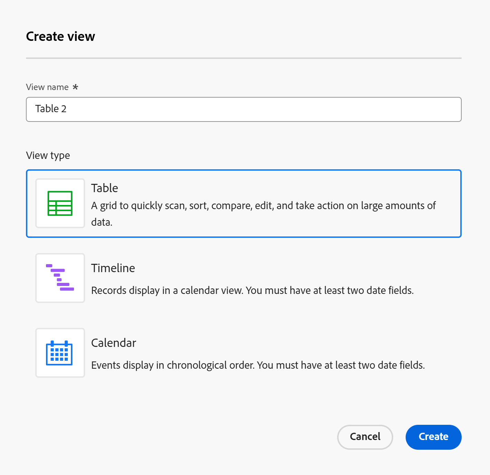

# Recordweergaven beheren

<!--

The highlighted information on this page refers to functionality not yet generally available. It is available only in the Preview environment for all customers. After the monthly releases to Production, the same features are also available in the Production environment for customers who enabled fast releases.    

For information about fast releases, see [Enable or disable fast releases for your organization](/help/quicksilver/administration-and-setup/set-up-workfront/configure-system-defaults/enable-fast-release-process.md). 

-->

{{planning-important-intro}}

Nadat u een recordtype hebt geselecteerd in het gedeelte Adobe Workfront Planning, kunt u alle records van dat type weergeven in de volgende weergaven:

* Tabel

  Voor meer informatie, zie [ de lijstmening ](/help/quicksilver/planning/views/manage-the-table-view.md) leiden.

* Tijdlijn

  Voor meer informatie, zie [ de chronologiemening ](/help/quicksilver/planning/views/manage-the-timeline-view.md) leiden.

* Kalender

  Voor meer informatie, zie [ de kalendermening ](/help/quicksilver/planning/views/manage-the-calendar-view.md) leiden.

In dit artikel wordt de volgende informatie over recordweergaven beschreven:

* [ creeer en geef een mening ](#create-or-edit-record-views) uit
* [ laat de aanwezigheidsindicatoren in real time in een mening toe ](#enable-the-real-time-presence-indicator-in-a-view)
  <!--* [Add a view as a favorite](#add-a-view-as-a-favorite) - not possible yet-->

Raadpleeg ook de volgende artikelen voor meer informatie over het beheren van de opnamen van Workfront Planning:

* [Recordweergaven verwijderen](/help/quicksilver/planning/views/delete-record-views.md)
* [Recordweergaven dupliceren](/help/quicksilver/planning/views/duplicate-record-views.md)
* [Weergaven delen](/help/quicksilver/planning/access/share-views.md)

## Toegangsvereisten

+++ Breid uit om de toegangsvereisten voor de functionaliteit in dit artikel te bekijken. 

<table style="table-layout:auto"> 
<col> 
</col> 
<col> 
</col> 
<tbody> 
    <tr> 
<tr> 
</tr>   
<tr> 
   <td role="rowheader">
Adobe Workfront-pakket
</td> 
   <td> 

Alle Workfront en alle planningspakketten

Willekeurige workflow en planningspakket

Neem voor meer informatie over wat er in elk planningspakket voor Workfront staat, contact op met uw Workfront-accountvertegenwoordiger. 
 
   </td> 
  <tr> 
   <td role="rowheader">
Adobe Workfront-licentie
</td> 
   <td>
 Standaard voor het maken en verwijderen van weergaven

   
Medewerker of hoger om weergave-elementen bij te werken

  </td> 
  </tr> 
  <tr> 
   <td role="rowheader">
Objectmachtigingen
</td> 
   <td>   
Rechten beheren voor een weergave
  
   
Machtigingen weergeven voor een weergave om de weergave-instellingen tijdelijk te wijzigen of te dupliceren
 </td> 
  </tr> 
<tr>
   <td role="rowheader">
Lay-outsjabloon
</td>
   <td> De gebruikers met een Licht of de vergunning van de Medewerker moeten een lay-outmalplaatje worden toegewezen dat Planning omvat.
   
De standaardgebruikers en de Beheerders van het Systeem hebben de Gebieden van de Planning die door gebrek worden toegelaten.

</li></ul>
</td>
  </tr> 
</tbody> 
</table>

Voor meer informatie over de toegangsvereisten van Workfront, zie [ vereisten van de Toegang in de documentatie van Workfront ](/help/quicksilver/administration-and-setup/add-users/access-levels-and-object-permissions/access-level-requirements-in-documentation.md).

+++

<!--Old:
<table style="table-layout:auto"> 
<col> 
</col> 
<col> 
</col> 
<tbody> 
    <tr> 
<tr> 
<td> 
   
 Products
 </td> 
   <td> 
   <ul><li>
 Adobe Workfront
</li> 
   <li>
 Adobe Workfront Planning
</li></ul></td> 
  </tr>   
<tr> 
   <td role="rowheader">
Adobe Workfront plan*
</td> 
   <td> 

Any of the following Workfront plans:
 
<ul><li>Select</li> 
<li>Prime</li> 
<li>Ultimate</li></ul> 

Workfront Planning is not available for legacy Workfront plans
 
   </td> 
<tr> 
   <td role="rowheader">
Adobe Workfront Planning package*
</td> 
   <td> 

Any 
 

For more information about what is included in each Workfront Planning plan, contact your Workfront account manager. 
 
   </td> 
 <tr> 
   <td role="rowheader">
Adobe Workfront platform
</td> 
   <td> 

Your organization's instance of Workfront must be onboarded to the Adobe Unified Experience to be able to access Workfront Planning.
 

For more information, see <a href="/help/quicksilver/workfront-basics/navigate-workfront/workfront-navigation/adobe-unified-experience.md">Adobe Unified Experience for Workfront</a>. 
 
   </td> 
   </tr> 
  </tr> 
  <tr> 
   <td role="rowheader">
Adobe Workfront license*
</td> 
   <td>
 Standard to create and delete views

   
Contributor or higher to update view elements

   
Workfront Planning is not available for legacy Workfront licenses
 
  </td> 
  </tr> 
  <tr> 
   <td role="rowheader">
Access level configuration
</td> 
   <td> 
There are no access level controls for Adobe Workfront Planning
   
</td> 
  </tr> 
<tr> 
   <td role="rowheader">
Object permissions
</td> 
   <td>   
Manage permissions to a view
  
   
View permissions to a view to temporarily change the view settings or to duplicate it
 </td> 
  </tr> 
<tr>
   <td role="rowheader">
Layout template
</td>
   <td> Users with a Light or Contributor license must be assigned a layout template that includes Planning.
   
Standard users and System Administrators have the Planning areas enabled by default.

</li></ul>
</td>
  </tr>
</tbody> 
</table>-->

## Overwegingen bij het werken met recordweergaven

* Weergaven in Workfront Planning zijn specifiek voor records. U kunt niet dezelfde weergave toepassen op twee verschillende recordtypen.
* Weergaven die u maakt, zijn alleen zichtbaar voor u en gebruikers met wie u de weergaven deelt.
* Wanneer u een weergave wijzigt of verwijdert, wordt deze gewijzigd en verwijderd voor alle gebruikers die machtigingen hebben voor de weergave.
* Elke gebruiker kan maximaal 100 weergaven maken. U kunt meer dan 100 weergaven weergeven voor een recordtype, maar één gebruiker kan slechts 100 weergaven maken.
* Hoewel sommige weergave-elementen op meerdere weergaven voor dezelfde record kunnen worden toegepast, zijn ze uniek voor elke recordweergave:

   * Filter
   * Sorteren (voor de tabelweergave)
   * Rijkleuren (voor de tabelweergave)
   * Velden (voor de tabelweergave)
   * Onderverdeling (voor de tijdlijnweergave)
   * Groeperen (voor de tabel- en tijdlijnweergaven)
   * De vormgeving van de balk (voor de tijdlijn- en de kalenderweergave)
   * Rijhoogte (voor de tabel en de maandelijkse kalenderweergave)

  Wanneer u bijvoorbeeld een filter maakt in een tabelweergave, zijn de filterresultaten alleen zichtbaar in de geselecteerde weergave (de tabelweergave) en niet in alle weergaven die aan het recordtype zijn gekoppeld.

  >[!TIP]
  >
  >Niet alle weergave-elementen zijn beschikbaar.

## Gelijksoortigheid en verschillen tussen recordweergaven

In de volgende tabel worden de overeenkomsten en verschillen tussen de tabel-, tijdlijn- en kalenderweergave weergegeven:

<!--some of these are NOT available right now; if you make this public, comment out the ones not there-->

| Functie | Tabelweergave | Tijdlijnweergave | Kalenderweergave |
|-----------------------------------------------------------------------|------------|---------------|--------------|
| Records in een lijst of tabel weergeven | ✓ |              | |
| Alle velden standaard weergeven als kolommen in de tabel | ✓ |              |    |
| Velden (of kolommen) verbergen of weergeven | ✓ |               |    |
| Veldwaarden bewerken voor elke record | ✓ |               |             |
| Records toevoegen als nieuwe rijen in de weergave | ✓ |               |        |
| Velden toevoegen als nieuwe kolommen in de weergave | ✓ |               |         |
| Rijen kopiëren uit een externe lijst en deze in een tabel plakken | ✓ |               |          |
| Records in een tijdlijn weergeven |            | ✓ |             |
| Filterrecords | ✓ | ✓ | ✓ |
| Records weergeven op een kalender |           |              | ✓ |
| Groepsrecords | ✓ | ✓ |  |
| Records sorteren | ✓ |              |  |
| Kleurcoderecords | ✓ | ✓ | ✓ |
| Kleurcodegroepen |           | ✓ |  |
| Specifieke records zoeken | ✓ | ✓ |  |
| De weergave delen met anderen | ✓ | ✓ | ✓ |
| De recordpagina openen vanuit de weergave | ✓ | ✓ |    |
| Records weergeven per jaar en kwartaal |           | ✓ |    |
| Records weergeven per maand |           | ✓ | ✓ |
| Records per week weergeven |           |               | ✓ |
| Informatie exporteren uit een weergave | ✓ |               |    |
| Weergeven op volledig scherm | ✓ | ✓ | ✓ |
| Records maken in de weergave | ✓ | ✓ | ✓ |
| Records onderbreken op basis van hun verbindingen |          | ✓ |    |

## Weergaven maken of bewerken {#create-or-edit-views}

{{step1-to-planning}}

1. Klik op de kaart van een werkruimte.

   De werkruimte wordt geopend en de recordtypen worden als kaarten weergegeven.

1. Klik op een opnametype.

   De pagina met recordtypen wordt geopend.

   Standaard worden alle records van het geselecteerde type weergegeven in de tabelweergave.

1. Klik het drop-down pictogram  naast de huidige meningsnaam, dan klik **+ Nieuwe mening**.

1. Selecteer een van de volgende typen weergaven:

   * Tabel
   * Tijdlijn
   * Kalender

1. Kies een meningstype, dan klik **creeer**. Er wordt een nieuwe weergave toegevoegd aan het vervolgkeuzemenu.

   >[!TIP]
   >
   >Wanneer u een recordtype maakt, wordt de tabelweergave ook standaard gemaakt.
   >
   >Als u een tijdlijn of een kalenderweergave wilt maken, moet het recordtype waarvoor u de weergave maakt, ten minste twee datumvelden hebben.
   >
   >Anders worden de opties Tijdlijn en Kalender grijs weergegeven.
   >  

   

1. (Facultatief) om een bestaande mening uit te geven, klik het drop-down menu rechts van de naam van de huidige mening, dan typ de naam van een mening in het **gebied van het Onderzoek** en druk binnengaan op uw toetsenbord.
1. (Optioneel) Sleep vanuit het vervolgkeuzemenu Weergave en zet de weergaven neer op volgorde van uw voorkeur.

   

1. (Voorwaardelijk) klik **daarna**, wanneer het creëren van een chronologie of een kalendermening.

   Standaard geeft Workfront de weergave een van de volgende namen:

   * `Table < number >`
   * `Timeline < number >`
   * `Calendar < number >`

   Het getal is een automatisch gegenereerde toename.

1. (Voorwaardelijk) selecteer het **Begin** en **Eind data** voor de verslagen die in de chronologie of kalendermening zullen tonen.

   >[!NOTE]
   >
   >    U kunt uit de gebieden van de verslagdatum, of raadplegingsdatumgebieden van verbonden verslag of objecten types selecteren.
   >
   >U moet aggregators voor datumgebieden (MAX of MIN) gebruiken wanneer u raadplegingsgebieden wanneer het verbinden van verslagtypes selecteert. Alleen wanneer u de aggregators toevoegt, kunt u de datums van de verbindingen gebruiken als begin- en einddatum voor de tijdlijn- en kalenderweergave.
   >
   >Voor informatie, zie [ verbind verslagtypes ](/help/quicksilver/planning/architecture/connect-record-types.md).

1. Klik **creëren**.

   De weergave wordt weergegeven als een nieuw tabblad. De weergaven worden in chronologische volgorde weergegeven vanaf het moment waarop ze zijn gemaakt of met u zijn gedeeld.
1. (Facultatief) klik **Meer** menu  naast de laatste mening om alle meningen voor het geselecteerde verslagtype te tonen.

   De extra meningsvertoning onder **Meer** menu na het laatste meningslusje. Het aantal naast **meer** menu toont het aantal extra meningen.
1. (Facultatief) om een mening anders te noemen nadat het wordt gecreeerd, klik het meningsdrop-down menu, dan klik **Meer** menu  > **anders noemen** om de meningsnaam bij te werken

   of

   Dubbelklik op de weergavenaam en typ de nieuwe naam.  <!--ensure there is not another saving step here?!-->

1. (Facultatief) klik het **Volledige het schermpictogram** pictogram  om het even welke mening in volledig scherm te openen, dan de **Uitgang volledig scherm** pictogram  of Escape op uw toetsenbord om het volledige scherm weg te gaan.

1. (Optioneel) Raadpleeg de volgende artikelen voor informatie over het beheren van een bepaald weergavetype:

   * [De tabelweergave beheren](/help/quicksilver/planning/views/manage-the-table-view.md)
   * [De tijdlijnweergave beheren](/help/quicksilver/planning/views/manage-the-timeline-view.md)
   * [De kalenderweergave beheren](/help/quicksilver/planning/views/manage-the-calendar-view.md)

## De real-time aanwezigheidsindicator in een weergave inschakelen

U kunt zien of andere gebruikers records op hetzelfde moment bewerken als u door de aanwezigheidsindicatoren in real time in de weergave te volgen.

De avatars van andere gebruikers die recordinformatie uitgeven tezelfdertijd zoals u in de hoger-juiste hoek van alle verslagmeningen toont, door gebrek.

Wanneer u de tabelweergave weergeeft, kunt u ook bekijken welk veld een andere gebruiker bewerkt op het moment dat u de record weergeeft.

Voor meer informatie, zie [ de lijstmening ](/help/quicksilver/planning/views/manage-the-table-view.md) leiden.

<!--## Add a view as a favorite - this is not possible yet-->
