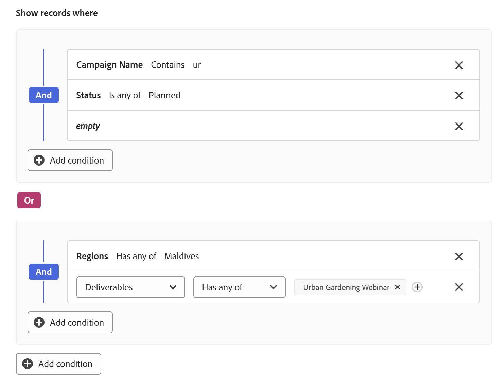
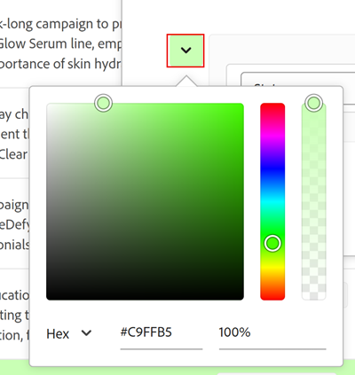

<!--add these to the metadata above when publishing:

author: Alina
recommendations: noDisplay, noCatalog-->

# De lijstweergave beheren in Adobe Workfront Planning

<!--The information highlighted on this page refers to functionality not yet generally available. It is available only in the Preview environment for all customers. After the monthly releases to Production, the same features are also available in the Production environment for customers who enabled fast releases.    

For information about fast releases, see [Enable or disable fast releases for your organization](/help/quicksilver/administration-and-setup/set-up-workfront/configure-system-defaults/enable-fast-release-process.md). -->

{{planning-important-intro}}

U kunt objecten en hun velden in een lijstweergave weergeven, wanneer u ze opent in de Verbonden recordpagina van een record, in Adobe Workfront Planning.

In dit artikel wordt beschreven hoe u een lijstweergave kunt maken of bewerken op de pagina Verbonden records van een record en hoe u de objecten in de weergave kunt bewerken.

## Toegangsvereisten

+++ Breid uit om de toegangsvereisten voor de functionaliteit in dit artikel te bekijken. 

<table style="table-layout:auto"> 
<col> 
</col> 
<col> 
</col> 
<tbody> 
    <tr> 
<tr> 
</tr>   
<tr> 
   <td role="rowheader">
Adobe Workfront-pakket
</td> 
   <td> 

Alle Workfront en alle planningspakketten

Willekeurige workflow en planningspakket

Neem voor meer informatie over wat er in elk planningspakket voor Workfront staat, contact op met uw Workfront-accountvertegenwoordiger. 
 
   </td> 
  <tr> 
   <td role="rowheader">
Adobe Workfront-licentie
</td> 
   <td>
 Standaard voor het maken en verwijderen van weergaven

   
Medewerker of hoger om weergave-elementen bij te werken

  </td> 
  </tr> 
  <tr> 
   <td role="rowheader">
Objectmachtigingen
</td> 
   <td>   
Rechten beheren voor een weergave
  
   
Machtigingen weergeven voor een weergave om de weergave-instellingen tijdelijk te wijzigen of te dupliceren
 </td> 
  </tr> 
<tr>
   <td role="rowheader">
Lay-outsjabloon
</td>
   <td> De gebruikers met een Licht of de vergunning van de Medewerker moeten een lay-outmalplaatje worden toegewezen dat Planning omvat.
   
De standaardgebruikers en de Beheerders van het Systeem hebben de Gebieden van de Planning die door gebrek worden toegelaten.

</li></ul>
</td>
  </tr> 
</tbody> 
</table>

Voor meer informatie over de toegangsvereisten van Workfront, zie [ vereisten van de Toegang in de documentatie van Workfront ](/help/quicksilver/administration-and-setup/add-users/access-levels-and-object-permissions/access-level-requirements-in-documentation.md).

+++ 

## Overwegingen over lijstweergaven

* U kunt geen records weergeven in de recordtypepagina&#39;s in een lijstweergave. U kunt de volgende objecten alleen weergeven in een lijstweergave wanneer u ze bekijkt op de pagina Verbonden records van een record:

   * Workfront-projecten

  Voor informatie over het creëren van een verbonden verslagenpagina, zie [ een Verbonden verslagenpagina aan een verslag ](/help/quicksilver/planning/records/add-a-connected-records-page-to-a-record.md) toevoegen.
* Voordat u een lijstweergave kunt weergeven in een verbonden recordpagina van een record, moet u Workfront-projecten verbinden met de recordtypen Planning. Voor informatie, zie [ verbind verslagtypes ](/help/quicksilver/planning/architecture/connect-record-types.md).
* Lijstweergaven zijn vergelijkbaar met Uitgebreide lijsten. Voor meer informatie, zie [ Gebruik verbeterde lijsten ](/help/quicksilver/workfront-basics/navigate-workfront/use-lists/enhanced-lists.md).

## Een lijstweergave beheren {#manage-a-list-view}

{{step1-to-planning}}

1. Klik op een werkruimtekaart en klik vervolgens op een opnametype.
1. Klik vanuit een willekeurige weergave op de naam van een record om de voorvertoning of detailpagina van de record te openen.
1. Voeg a **Verbonden verslagenpagina** voor verbonden projecten toe zoals die in het artikel [ worden beschreven een Verbonden verslagenpagina aan een verslag ](/help/quicksilver/planning/records/add-a-connected-records-page-to-a-record.md) toevoegen.

   Op de pagina Verbonden records worden projecten weergegeven die zijn verbonden met de record in de lijstweergave.

   

<!--BELOW IS ALL FROM TABLE VIEW - EDIT EVERYTHING-->

1. Creeer een lijstmening, zoals die in artikel [ wordt beschreven beheer verslagmeningen ](/help/quicksilver/planning/views/manage-record-views.md).

   

1. (Facultatief) klik **de hoogte van de Rij**, dan selecteer van de volgende opties om de hoogte van de lijstrijen te wijzigen:
   * Kort
   * Medium
   * Lang

1. (Facultatief) klik het **Volledige het schermpictogram** pictogram  om de mening in volledig scherm te openen, dan de **Uitgang volledig scherm** pictogram  of Escape op uw toetsenbord om het volledige scherm weg te gaan.

1. Werk de volgende weergave-elementen bij zoals in de onderstaande subsecties wordt beschreven:
   * [Kolommen (of velden)](#add-columns-or-fields)
   * [Rijen (of records)](#add-rows-or-records)
   * [ Filters ](#add-filters)
   * [ Soort ](#add-a-sort)
   * [Groepering](#add-groupings)
   * [Rijkleuren](#add-row-colors)
   * [Real-time aanwezigheidsindicator](#enable-the-real-time-presence-indicator)

### Kolommen (of velden) toevoegen {#add-columns}

In de kolomkoppen van een tabelweergave worden de velden weergegeven die zijn gekoppeld aan de records in de weergave. Velden die in de tabelweergave worden weergegeven, worden ook weergegeven in de sectie Details van een record.

Voor meer informatie, zie [ verslagen ](/help/quicksilver/planning/records/edit-records.md) uitgeven.

<!--this is not available yet:You can display record fields (or columns) in both a table and a timeline view. However, the number of columns displayed in the table of the timeline view is limited and you cannot add columns in addition to those selected by default.-->

Het toevoegen van kolommen aan een weergave is hetzelfde als het toevoegen van velden aan een recordtype.

U kunt maximaal 500 velden (of kolommen) toevoegen aan een tabelweergave.

1. Ga naar een verslagtype pagina en klik een lusje van de lijstmening, of klik **+ Mening** om een nieuwe mening toe te voegen, dan **Lijst** te kiezen.

1. Begin toevoegend gebieden (of kolommen), zoals die in het artikel [ worden beschreven creeer gebieden ](/help/quicksilver/planning/fields/create-fields.md).

   De kolommen die u toevoegt, zijn zichtbaar voor alle gebruikers die toegang hebben tot het recordtype en worden toegevoegd als nieuwe velden op de pagina van de record.

1. (Optioneel) Klik op het pictogram **Velden** pictogram 

1. Voer een van de volgende handelingen uit om de kolommen in de tabel opnieuw te ordenen:

   * Pak de kolomkop en sleep deze naar de gewenste positie. De kolom die u kort hebt verplaatst, wordt weergegeven met een blauwe achtergrond totdat u andere aanpassingen in de tabel aanbrengt.

   * Klik **Gebieden** in de toolbar van de lijst, dan belemmering en laat vallen de gebieden in de gewenste orde, dan klik buiten het **zicht en orde van Gebieden** vakje om het te sluiten.

     

     >[!TIP]
     >
     >* Het veld Naam is standaard het eerste veld in de tabelweergave. Dit wordt beschouwd als een primair veld.
     >
     >* U kunt het veld Naam niet naar een andere positie verplaatsen, tenzij u een ander veld als primair veld aanwijst. Ga voor meer informatie verder met stap 4. <!--accurate?-->
     >
     >

   * Vervang het veld in de eerste kolom door een ander veld door het primaire veld te wijzigen. Ga naar stap 4 voor meer informatie. <!--accurate?-->

1. (Facultatief) Beweeg over een gebiedsnaam in de kolomkopbal van om het even welk gebied dat niet in de eerste kolom van de lijst toont, klik de naar beneden wijzende pijl rechts van de gebiedsnaam, dan klik **Reeks als primair gebied**.

   

1. Klik **Vastgesteld gebied** om te bevestigen.

   Het veld wordt een primair veld, wat betekent dat het wordt weergegeven als de eerste kolom van de tabelweergave. Het vorige primaire veld gaat naar de tweede kolom.

   Primaire velden worden de titel van de record en worden weergegeven in het koptekstgebied van de pagina van de record, en overal waar de records worden weergegeven. De recordtitel wordt bijvoorbeeld weergegeven in verbonden velden en in alle weergaven. Voor meer informatie over primaire gebieden, zie [ Primair gebiedsoverzicht ](/help/quicksilver/planning/fields/primary-field-overview.md).

1. Klik en sleep de kolomscheidingslijnen en zet deze op de gewenste plaats neer om de kolommen breder te maken.

   >[!TIP]
   >
   >De wijzigingen die u aanbrengt in de kolombreedte en -volgorde zijn permanent en zichtbaar voor alle gebruikers die toegang hebben tot het recordtype.

1. Plaats over de kolomkopbal, dan klik de naar beneden-richten pijl, dan klik **gebied van de Huid**

   of

   Klik **Gebieden** in de lijsttoolbar en maak knevel verbonden aan de gebieden (of kolommen) onbruikbaar u wilt verbergen. De **zicht van Gebieden en orde** vakvertoningen.

   >[!TIP]
   >
   >Het aantal verborgen velden wordt links van het pictogram Velden op de werkbalk weergegeven.
   >
   > door gebrek, tonen de verborgen gebieden niet in de 1} 2} voorproefdoos van de Details van het verslag {. **** Alle velden worden weergegeven op de pagina Details van de record. Voor informatie, zie [ de lay-out van de verslagpagina beheren ](/help/quicksilver/planning/records/manage-the-record-page.md)

1. Klik het **pictogram van Gebieden** en laat knevel toe verbonden aan de gebieden u in de kolommen van de lijst wilt tonen. Alle velden worden standaard weergegeven.

1. Ga als volgt te werk om snel records te zoeken die overeenkomen met een trefwoord:

   1. In het **vakje van het 1} Onderzoek** pictogram van het Onderzoek  Het aantal juiste overeenkomsten wordt weergegeven naast het zoekitem en het veld met de juiste overeenkomst wordt gemarkeerd.

      

      U kunt elk woord of speciaal teken gebruiken dat op het scherm zichtbaar is.

      U kunt geen trefwoorden gebruiken die zijn gekoppeld aan velden die zijn verborgen in de tabelweergave.

   1. De pers **gaat** op uw toetsenbord binnen om naar het volgende gevonden gebied te gaan.

   1. (Optioneel) Als er meer dan één overeenkomst is, klikt u op de pijl-omhoog of -omlaag rechts van het trefwoord Zoeken om alle overeenkomende items in de tabel te zoeken.

   1. Klik het **x** pictogram in het onderzoeksvakje om het onderzoekssleutelwoord te ontruimen.

### Rijen (of records) toevoegen {#add-rows}

De rijen van een lijstmening tonen individuele verslagen van het geselecteerde verslagtype.

U kunt tot 50.000 verslagen (of rijen) voor recordtypeS hebben.

1. Ga naar een verslagtype pagina en klik een lusje van de lijstmening, of klik **+ Mening** om een nieuwe mening toe te voegen, dan **Lijst** te kiezen.

1. Begin toevoegend verslagen (of rijen), zoals die in het artikel [ worden beschreven creeer verslagen ](/help/quicksilver/planning/records/create-records.md).

   De records die u in de tabelweergave toevoegt, worden direct opgeslagen en zijn zichtbaar voor alle gebruikers met de machtiging Weergave of hoger voor de werkruimte.

1. (Facultatief) voeg een duimnagel aan elk verslag toe, en klik **Gebieden** in de hoger-juiste hoek van de lijst, dan selecteren de knevel voor het **3} gebied van de Duimnagel {om het links van het primaire gebied te tonen.** Deze optie is standaard uitgeschakeld.

   Voor informatie, zie [ een duimnagel aan een verslag ](/help/quicksilver/planning/records/add-thumbnails-to-records.md) toevoegen.

1. (Facultatief) selecteer één of veelvoudige verslagen in een rij, dan belemmering en laat vallen het **pictogram van de handvat** handvat 

   >[!NOTE]
   >
   >U kunt rijen niet opnieuw rangschikken als u ten minste één sortering toepast op de tabelweergave.
   >
   >De wijzigingen die u aanbrengt in de rijvolgorde zijn zichtbaar voor alle gebruikers die toegang hebben tot het recordtype

<!-- this section below links from the timeline view; consider splitting them if they become different-->

### Filters toevoegen {#add-filters}

Met filters vermindert u de hoeveelheid informatie die op het scherm wordt weergegeven.

Houd rekening met het volgende wanneer u werkt met filters in de tabelweergave:

<!-- this list is almost identical to the one for the table view - update both-->

* De filters die u voor de tabelweergave maakt, werken onafhankelijk van de filters in de tijdlijnweergave wanneer deze worden toegepast op hetzelfde recordtype.

* De filters zijn uniek voor de weergave die u selecteert. Op twee tabelweergaven van hetzelfde recordtype kunnen verschillende filters worden toegepast. Twee gebruikers die naar dezelfde tabelweergave kijken, zien hetzelfde filter dat op dat moment wordt toegepast.

* U kunt de filters die u maakt en toepast op een tabelweergave niet een naam geven.

* Als u filters verwijdert, worden deze verwijderd van iedereen die toegang heeft tot hetzelfde recordtype als u en wordt dezelfde weergave gebruikt als u gebruikt.

* U kunt filteren op gekoppelde recordvelden of opzoekvelden.

* U kunt filteren door velden op te zoeken waarin meerdere waarden worden weergegeven.

* U kunt verwijzen naar een veld dat zich op maximaal 4 niveaus van het huidige recordtype bevindt. Bijvoorbeeld, als u een filter voor een type van het verslag van de Activiteit creeert, en de Activiteit wordt verbonden met het type van het Verslag van het Product dat met het type van het verslag van de Campagne wordt verbonden dat met een Project van Workfront wordt verbonden, kunt u het Begroting van het project in het filter van verwijzingen voorzien u voor het type van het verslag van de Activiteit creeert.

Een filter toevoegen aan een tabelweergave:

1. Creeer een lijstmening voor een verslagtype pagina, zoals die in artikel [ wordt beschreven beheer verslagmeningen ](/help/quicksilver/planning/views/manage-record-views.md).
1. Selecteer een lijstmening, dan klik **Filters** in de hoger-juiste hoek van de lijst.
1. Klik **toevoegen voorwaarde** en voeg de volgende informatie toe:

   * Zoek naar een gebied en selecteer het wanneer het in de lijst wanneer toont.

   * **selecteer een optie** (of een filterbepaling) om te bepalen welk soort voorwaarde het gebied moet ontmoeten

     In de onderstaande tabel worden de beschikbare wijzigingstoetsen voor elk veldtype weergegeven.

     <table>
        <thead>
        <tr>
            <th><b>Veldtype</b></th>
            <th><b>Modifiers</b></th>
        </tr>
        </thead>
        <tbody>
        <tr>
            <td>Enkele regel, alinea, formule </td>
            <td>
Bevat

            
Bevat niet

            
Is

            
Is niet

            
Is leeg

            
Is niet leeg
</td>
        </tr>
        <tr><td>Enkel selecteren</td>
            <td>
Is

            
Is niet

            
Is om het even welke

            
Is geen van

            
Is leeg

            
Is niet leeg
</td>
        </tr>
        <tr>
            <td>Meerdere selecties, personen</td>
            <td>
Heeft een van de

            
Bevat alle

            
Is exact

            
Heeft geen van

            
Is leeg

            
Is niet leeg
</td>
        </tr>
        <tr>
            <td>Getal, percentage, valuta</td>
            <td>
=

            
≠

            
 &lt; 

            
&gt;

            
≤

            
≥

            
Is leeg

            
Is niet leeg
</td>
        </tr>
        <tr>
            <td>Datum</td>
            <td>
Is

            
Is niet

            
Is na

            
Is voor

            
Is tussen

Is niet tussen

            
Is leeg

Is niet leeg
</td>
        </tr>

     <tr>
            <td>Selectievakje</td>
            <td>
Is

        </tr>
        </tbody>
        </table>

   * Selecteer een waarde voor het geselecteerde veld.

   

   Er is geen limiet voor het aantal filtervoorwaarden dat u kunt toevoegen.

1. (Facultatief) klik **toevoegen voorwaarde** om een andere het filtreren optie toe te voegen en de bovengenoemde stappen te herhalen. Links van het pictogram Filters ziet u het aantal toegepaste filters.
1. Klik op de volgende operatoren om aan te geven hoe de filtervoorwaarden worden gekoppeld en moeten worden toegepast:

   * **EN**: Alle gespecificeerde voorwaarden moeten worden voldaan aan.
   * **OF**: Om het even welke gespecificeerde voorwaarden moeten worden voldaan aan. Dit is de standaardoptie.

   1. (Facultatief) voeg extra **EN** of **OF** exploitanten tussen veelvoudige voorwaardengroeperingen toe.

      

   De lijst met records wordt automatisch gefilterd.  <!--at this time, you can't name and save the filter - but will this change?!-->
   <!-- asked on the task for the simple filters whether there is a limitation for how many statements a filter can have?!-->

1. (Facultatief) klik het **x** pictogram om een filtervoorwaarde te verwijderen.
1. (Facultatief) klik **Filters** om de filterdoos te sluiten. <!--right now you cannot "clear all" for filters, but this might come later-->

### Een sortering toevoegen {#sort-information}

Door een sortering toe te passen, kunt u informatie in een bepaalde orde organiseren.

U kunt de volgende gegevens sorteren:

* Alle records in een tabelweergave. <!--or timeline view. ***********verify this is the case for the timeline view*********************-->
  <!--* All groupings. - this is not available yet-->

Houd rekening met het volgende wanneer u records in de tabelweergave sorteert:

<!-- if this is available for the timeline view, update both when you update one-->

* Sorteren is uniek voor de weergave die u selecteert. Twee tabelweergaven van hetzelfde recordtype kunnen verschillende sorteercriteria hebben. Twee gebruikers die naar dezelfde tabelweergave kijken, zien dezelfde sortering die momenteel wordt toegepast.

* U kunt de tekenreeksen die u maakt en toepast op een tabelweergave niet een naam geven.

* Het sorteren dat u maakt, blijft behouden wanneer u wegnavigeert.

* U kunt sorteren op zoveel velden als u ziet in de tabelweergave van een recordtype.

* U kunt niet sorteren op verbonden verslaggebieden, maar u kunt door raadplegingsgebieden van verbonden verslagtypes sorteren.

* Wanneer u sorteert op opzoekvelden met meerdere waarden (die niet zijn samengevat door een aggregator), wordt de eerste waarde gebruikt voor sorteren.

* Als u sorteercriteria verwijdert, worden deze verwijderd van iedereen die toegang heeft tot hetzelfde recordtype als u en wordt dezelfde weergave gebruikt als u.

* U kunt verwijzen naar een veld dat zich op maximaal 4 niveaus van het huidige recordtype bevindt. Bijvoorbeeld, als u een soort voor een type van het verslag van de Activiteit creeert, en de Activiteit wordt verbonden met het type van het Verslag van het Product dat met het verslagtype van de Campagne wordt verbonden dat met een Project van Workfront wordt verbonden, kunt u de Status van het project in de soort van verwijzen u voor het type van het verslag van de Activiteit creeert.

Ga als volgt te werk om <!--ungrouped (add this when sorting for groupings will be available--> records te sorteren:

1. Creeer een lijstmening, zoals die in artikel [ wordt beschreven beheer verslagmeningen ](/help/quicksilver/planning/views/manage-record-views.md).
1. Klik het **pictogram van de Soort** van de Soort 

   of

   Beweeg over de naam van een kolom in de lijstmening, klik de naar beneden-richten pijl rechts van de naam van de kolomkopbal, dan klik **Soort door dit gebied**. Het veld wordt als een sorteerselectie toegevoegd in het pictogram Sorteren rechtsboven in de tabelweergave.

1. (Voorwaardelijk) in de **verslagen van de Soort door** doos, klik één van de voorgestelde gebieden, of klik **kies een verschillend gebied** en onderzoek naar een verschillend gebied, dan klik het wanneer het in de lijst toont.

   De sortering wordt automatisch toegepast op de tabelweergave en records worden gesorteerd op de geselecteerde criteria.

   <!-- add a step that you can rearrange the sorting fields here, when this will be possible-->

1. (Optioneel) Klik op **Voorwaarde toevoegen** en herhaal de bovenstaande stappen om te sorteren op aanvullende velden.

   Het aantal velden dat u sorteert, wordt links van het pictogram Sorteren in de rechterbovenhoek van de werkbalk weergegeven. U kunt alleen velden kiezen die in de kolommen van de tabelweergave worden weergegeven.

1. (Facultatief) in de **verslagen van de Soort door** doos, klik het **x** pictogram rechts van een sorterend gebied om de soort te verwijderen

   of

   Klik **ontruimen allen** om alle gebieden uit de soort te verwijderen.

1. Klik buiten de **verslagen van de Soort door** doos om het te sluiten.

   

   De gegevens in de tabel worden gesorteerd op basis van de geselecteerde criteria.

   In de velden die u voor de sortering selecteert, wordt een sorteerpictogram weergegeven, gevolgd door een getal dat de volgorde aangeeft waarin de sortering wordt toegepast.

### Groepen toevoegen {#add-groupings}

<!--this section exists in the timeline view too, but the display is slightly different, so I kept both steps; consider updating both sections if any updates to groupings are introduced-->

U kunt records groeperen aan de hand van vergelijkbare informatie wanneer u een groepering toepast op een weergave.

Overweeg het volgende:

* U kunt groepen toepassen in de tabel- en tijdlijnweergave. De groepen van de tabelweergave zijn onafhankelijk van de groepen in de tijdlijnweergave van hetzelfde recordtype.
* U kunt 3 niveaus van groepering in een mening toepassen. De records worden gegroepeerd in de volgorde van de groepen die u selecteert.
&lt;!—* U kunt tot 4 niveaus van groepering toepassen wanneer het gebruiken van API. —deze nu controleren—>
* De groepen zijn uniek voor de weergave die u selecteert. Op twee tabelweergaven van hetzelfde recordtype kunnen verschillende groepen worden toegepast. Twee gebruikers die naar dezelfde tabelweergave kijken, zien dezelfde groepering die momenteel wordt toegepast.
* U kunt de groepen die u maakt voor een tabelweergave niet een naam geven.
* Als u groepen verwijdert, worden deze verwijderd van iedereen die toegang heeft tot hetzelfde recordtype als u en die dezelfde weergave weergeeft als u.
* U kunt records bewerken die in een groep worden vermeld.
* U kunt groeperen door verbonden verslaggebieden of raadplegingsgebieden.
* Wanneer u door raadplegingsgebieden met veelvoudige waarden groepeert (die niet door een aggregator zijn samengevat), worden de verslagen gegroepeerd door elke unieke combinatie gebiedswaarden.
* U kunt verwijzen naar een veld dat zich op maximaal 4 niveaus van het huidige recordtype bevindt. Bijvoorbeeld, als u een groepering voor een type van het verslag van de Activiteit creeert, en de Activiteit wordt verbonden met het type van het Verslag van het Product dat met het verslagtype van de Campagne wordt verbonden dat met een Project van Workfront wordt verbonden, kunt u de Status van het project in de groepering verwijzen u voor het verslagtype van de Activiteit creeert.
* Groepen worden in alfabetische volgorde van hun waarden weergegeven.
<!--checking into this: * You can apply up to 4 levels of grouping when using the API. -->
<!-- checking also into this: * You cannot group by a Paragraph-type field.-->

Een groep toevoegen:

1. Creeer een chronologiemening voor een verslagtype, zoals die in artikel [ wordt beschreven beheer verslagmeningen ](/help/quicksilver/planning/views/manage-record-views.md).
1. Klik **Groepering** in de hoger-juiste hoek van de lijstmening.

   

1. Klik één van de voorgestelde gebieden, of klik **kies een verschillend gebied**, onderzoek naar een verschillend gebied, dan klik het wanneer het in de lijst toont.

   De groepering wordt automatisch toegepast op de tabel en records worden weergegeven onder de scheidingslijn voor cijfergroepering.

1. (Optioneel) Klik op **Voorwaarde toevoegen** en herhaal de bovenstaande stappen om maximaal 3 groepen toe te voegen.

   Het aantal velden dat voor de groepering is geselecteerd, wordt weergegeven naast het pictogram Groeperen.

   

1. (Facultatief) binnen de **verslagen van de Groep door** doos, klik het **x** pictogram aan het recht van een gebied dat voor de groepering wordt geselecteerd om de groepering te verwijderen

   of

   Klik **ontruimen allen** om alle gebieden te verwijderen.

1. Klik buiten de **verslagen van de Groep door** doos om het te sluiten.
1. (Optioneel) Klik op **+ Nieuwe record** aan het einde van een willekeurige groep om nieuwe records toe te voegen. Vernieuw vervolgens de pagina om de nieuwe record aan de juiste groep toe te voegen. <!--this might need to be changed when they add the Refresh button on the toolbar of the table view-->

1. Voer een van de volgende handelingen uit om groepen uit of samen te vouwen:

   1. Klik het **Groeperen** pictogram, dan **breid allen** uit, of **vouwt allen** samen. Hiermee worden alle groepen en subgroepen in de tabelweergave uitgebreid.

      

   1. Klik met de rechtermuisknop op een van de groeperingsheaders in de tabelweergave en klik vervolgens op een van de volgende opties:
      * **breid groep** uit
      * **Vouw groep** samen
      * **breid allen** uit
      * **Vouw allen** samen
      * **breid subgroups** uit
      * **samenvouwen subgroups**

      Afhankelijk van het aantal groepen dat u op de weergave toepast, zijn sommige opties mogelijk niet beschikbaar.

<!-- this is not available yet: 

To sort grouped records: 

1. Create a view, as described in [Create or edit record views](#create-or-edit-record-views). 
1. ************************* add steps here for sorting grouped records****************

-->

### Rijkleuren toevoegen

1. (Facultatief) klik **de kleuren van de Rij** om voorwaarden te bepalen en verschillende kleuren voor lijstrijen te kiezen.

1. Klik **toevoegen kleur**, dan onderzoek naar een gebied dan het selecteren wanneer het in de lijst toont. Dit is het veld waarvan u de kleur van een rij wilt bepalen.

   Bijvoorbeeld, om campagnes met een status van Actief in groen te tonen, selecteer **Status**, dan een bepaling en een waarde voor het gebied kiezen.

   

1. Klik op het vervolgkeuzemenu voor de kleurkiezer in de linkerbovenhoek van de voorwaarde die u hebt geselecteerd, om de kleur voor de voorwaarde te kiezen en klik vervolgens buiten het kleurkiezervak om deze te sluiten.

   

1. (Facultatief) klik **toevoegt voorwaarde** om meer gebieden en waarden aan de eerste reeks voorwaarden toe te voegen

   of

   Klik **toevoegen kleur** om een nieuwe reeks voorwaarden toe te voegen en een nieuwe kleur te identificeren.

   U kunt bijvoorbeeld campagnes in de status Planning geel weergeven door een nieuwe set voorwaarden te definiëren.

   

1. (Facultatief) zet **toe is op de volledige rij** het plaatsen in de hoger-juiste hoek van de de kleurendoos van de Rij. De volledige rij waaraan aan de voorwaarde wordt voldaan, wordt automatisch weergegeven in de geselecteerde kleur.

   >[!NOTE]
   >
   >* Als Toepassen op de volledige rijinstelling is uitgeschakeld, geeft alleen de linkerzijde van het veld Primair een smalle kleurindicator met de geselecteerde kleur weer. De instelling is standaard uitgeschakeld.
   >
   >* U kunt geen rijkleuren op een volledige rij toepassen wanneer u in de tabelweergave ten minste één groep hebt geselecteerd.

1. Klik buiten de **de kleuren van de Rij** doos om het te sluiten. De kleuren worden automatisch toegepast.