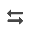

# De lijstweergave beheren in Adobe Workfront Planning

 de informatie die op deze pagina wordt benadrukt verwijst naar functionaliteit nog niet algemeen beschikbaar. Deze optie is alleen beschikbaar in de voorvertoningsomgeving voor alle klanten. Na de maandelijkse versies aan Productie, zijn de zelfde eigenschappen ook beschikbaar in het milieu van de Productie voor klanten die snelle versies toeliet. 

 voor informatie over snelle versies, zie [ snelle versies voor uw organisatie ](/help/quicksilver/administration-and-setup/set-up-workfront/configure-system-defaults/enable-fast-release-process.md) toelaten of onbruikbaar maken. 

{{planning-important-intro}}

U kunt objecten in de lijstweergave bekijken in de volgende gebieden van Workfront Planning:

* Een verbonden registratiepagina voor projecten in het detailsgebied van een verslag

  

* Een lijst met aanvraagformulieren op recordtypeniveau

  

In dit artikel wordt beschreven hoe u door een lijstweergave kunt navigeren, deze kunt maken of bewerken die objecten weergeeft in Workfront Planning. <!--change 'projects' to other objects when they become available and the location of the list view-->

## Toegangsvereisten

+++ Breid uit om de toegangsvereisten voor de functionaliteit in dit artikel te bekijken. 

<table style="table-layout:auto"> 
<col> 
</col> 
<col> 
</col> 
<tbody> 
    <tr> 
<tr> 
</tr>   
<tr> 
   <td role="rowheader">
Adobe Workfront-pakket
</td> 
   <td> 

Alle Workfront en alle planningspakketten

Willekeurige workflow en planningspakket

Neem voor meer informatie over wat er in elk planningspakket voor Workfront staat, contact op met uw Workfront-accountvertegenwoordiger. 
 
   </td> 
  <tr> 
   <td role="rowheader">
Adobe Workfront-licentie
</td> 
   <td>
 Standaard voor het maken en verwijderen van weergaven

   
Medewerker of hoger om weergave-elementen bij te werken

  </td> 
  </tr> 
  <tr> 
   <td role="rowheader">
Objectmachtigingen
</td> 
   <td>   
Rechten beheren voor een weergave
  
   
Machtigingen weergeven voor een weergave om de weergave-instellingen tijdelijk te wijzigen of te dupliceren
 </td> 
  </tr> 
<tr>
   <td role="rowheader">
Lay-outsjabloon
</td>
   <td> De gebruikers met een Licht of de vergunning van de Medewerker moeten een lay-outmalplaatje worden toegewezen dat Planning omvat.
   
De standaardgebruikers en de Beheerders van het Systeem hebben de Gebieden van de Planning die door gebrek worden toegelaten.

</li></ul>
</td>
  </tr> 
</tbody> 
</table>

Voor meer informatie over de toegangsvereisten van Workfront, zie [ vereisten van de Toegang in de documentatie van Workfront ](/help/quicksilver/administration-and-setup/add-users/access-levels-and-object-permissions/access-level-requirements-in-documentation.md).

+++ 

## Overwegingen over lijstweergaven

* Neem het volgende in overweging voor de weergave van de lijst met verbonden records:

   * U kunt projecten in de lijstmening in de verbonden verslagenpagina van een verslag slechts bekijken. De lijstweergave is niet beschikbaar voor andere objecten of recordtypen in een verbonden recordpagina.

  Voor informatie over het creëren van een verbonden verslagenpagina, zie [ een Verbonden verslagenpagina aan een verslag ](/help/quicksilver/planning/records/add-a-connected-records-page-to-a-record.md) toevoegen.
   * Voordat u een lijstweergave kunt weergeven in een verbonden recordpagina van een record, moet u Workfront-projecten verbinden met de recordtypen Planning. Voor informatie, zie [ verbind verslagtypes ](/help/quicksilver/planning/architecture/connect-record-types.md).
   * U kunt veelvoudige lijstmeningen voor projecten in de verbonden verslagenpagina van een verslag tot stand brengen.

* Bekijk het volgende voor de lijstweergave voor aanvraagformulieren:

   * U kunt geen extra lijstweergaven maken of bewerken voor het plannen van aanvraagformulieren. Workfront maakt één lijstweergave voor aanvraagformulieren. <!--this will change-->

     Voor informatie over verzoekvormen, zie [ creeer en beheer een verzoekvorm in de Planning van Adobe Workfront ](/help/quicksilver/planning/requests/create-request-form.md).
* Afhankelijk van waar deze wordt weergegeven, heeft niet elke lijstweergave dezelfde elementen die in dit artikel worden beschreven.

## Een lijstweergave beheren {#manage-a-list-view}

Lijstweergaven lijken op uitgebreide lijsten. De meeste elementen van verbeterde weergaven bestaan ook in lijstweergaven in Workfront Planning.

Voor meer informatie, zie [ Gebruik verbeterde lijsten ](/help/quicksilver/workfront-basics/navigate-workfront/use-lists/enhanced-lists.md).

<!--
{{step1-to-planning}}

1. (Conditional) To access a projects connected page, do the following: 

    1. Click a workspace card, then click a record type card. 
    1. From any view, click the name of a record to open the record's preview or details page. 
    1. Add a **Connected records page** for connected projects as described in the article [Add a Connected records page to a record](/help/quicksilver/planning/records/add-a-connected-records-page-to-a-record.md).

    The Connected records page displays projects connected to the record in the list view. 

    

1. (Conditional) To access a list of request forms, do the following: 

    1. {{step1-to-planning}}

    1. (Conditional) To access a projects connected page, do the following: 

    1. Click a workspace card, then click a record type card.
    1. Click the **More** menu  to the right of the record name in the header, then click **Manage request forms**.

        A list of request forms displays.

-->

1. Ga naar een lijstweergave in een van de volgende gebieden:

   * Verbonden recordpagina in het detailgebied van een record
   * De pagina met aanvraagformulieren van een record

1. (Voorwaardelijk) Voer, indien beschikbaar, een van de volgende handelingen uit om de lijstweergave te wijzigen:

   1. Vouw het menu van dropdown meningen in de upper-left hoek van de lijst uit om een andere mening te selecteren, of klik **Nieuwe mening** en creeer een andere.

      Weergaven worden door het hele systeem gedeeld. Als u een mening van Projecten voor één verslagtype creeert, kunt u het op andere verslagtypes bekijken die verbonden projecten tonen.

   1. Beweeg over de naam van een bestaande mening en klik **Meer** menu , dan klik één van het volgende:
      * **noem** anders, om de mening een nieuwe naam te geven
      * **Aandeel**, om de mening met anderen te delen
      * **Schrapping**, om de mening te schrappen.

      >[!NOTE]
      >
      >* U moet over beheerdersmachtigingen voor een weergave beschikken om de weergave te kunnen bewerken, delen of verwijderen.
      >
      >* U kunt de systeemweergaven niet wijzigen.
      >
      >*  u kunt een mening terugstellen die met u werd gedeeld waaraan u slechts toestemmingen aan Mening hebt, nadat u het wijzigde om zijn originele voorkeur te herstellen, of u kunt het met uw veranderingen kopiëren en het exemplaar delen. Voor meer informatie, zie [ Gebruik verbeterde lijsten ](/help/quicksilver/workfront-basics/navigate-workfront/use-lists/enhanced-lists.md). 

      <!--
        And hide everything else below for these elements, after moving it to the Use enhanced lists article: 
        1. To update one of the following view elements, see [Use enhanced lists](/help/quicksilver/workfront-basics/navigate-workfront/use-lists/enhanced-lists.md):
            

            * Filter
            * Columns
            * Format cells
            * Row height
            

        -->

   1. Klik het **pictogram van de Filter** pictogram  om een filter aan de mening toe te voegen. De resultaten worden direct in de lijst gefilterd. U kunt filters niet opslaan en een naam geven. Filters worden onthouden wanneer u de pagina in de toekomst opent en maken deel uit van gedeelde weergaven.
   1. Klik het **pictogram van Kolommen** pictogram van Kolommen  om te selecteren welke kolommen aan vertoning of in de mening te verbergen.
   1. Houd de cursor boven de naam van een kolom en klik op de pijl omlaag links van de kolomnaam en klik op een van de volgende opties:
      * **noem** anders, om a **Eigen etiket** voor de kolom toe te voegen. De naam van het oorspronkelijke veld in Workfront verandert niet.
      * **Soort**, om de lijst door het geselecteerde gebied te sorteren. Aan de kolomkop wordt een sorteerpictogram toegevoegd dat de richting van het sorteren aangeeft.
   1. Klik het **+** pictogram in de hoger-juiste hoek van de lijst om kolommen aan de lijst toe te voegen of te verwijderen, dan klik **sparen**.

      De **manager van de Kolom** opent.

      U kunt alleen bestaande velden toevoegen aan de lijstweergave.
U kunt het primaire veld niet verwijderen in de lijstweergave die in de eerste kolom wordt weergegeven.

   1.  klik het **pictogram van de cellen van het Formaat** pictogram . Het **vakje van het Formaat** opent. <!--change the name of the box when they update it-->
       doe het volgende: 

      1. Klik **toevoegen voorwaarde**.
      1.  op **als** lijn, selecteer een gebied en kies een gebiedswaarde en voeg een bepaling toe. De opties veranderen, afhankelijk van het gebiedstype u kiest. 

         >[!TIP]
         >
         > slechts zijn de gebieden zichtbaar in de lijstmening beschikbaar voor voorwaardelijk formatteren.

      1.  (Facultatief) in plaats van het toevoegen van een gebiedswaarde, klik **vergelijken met een ander gebied** pictogram  en kies een gebied waarvan waarde u met de waarde van uw geselecteerd gebied wilt vergelijken. U kunt bijvoorbeeld filteren voor projecten waarvan de projecteigenaar overeenkomt met de projectsponsor. 

         >[!TIP]
         >
         > slechts zijn de gebieden zichtbaar in de lijstmening beschikbaar voor voorwaardelijk formatteren.

      1.  (Facultatief) klik **toevoegt voorwaarde** in **als** lijn om meer voorwaarden aan de zelfde regel toe te voegen.

         >[!TIP]
         >
         > u kunt tot 10 voorwaarden in een conditioneringsregel toevoegen en u kunt tot 20 regels voor een gebied hebben.

      

      1. Klik de **of** schakelaar tussen voorwaarden om in **en** te veranderen en erop te wijzen dat de veelvoudige voorwaarden tezelfdertijd moeten worden vervuld. **Of** is de standaardschakelaar.
      1. In de **lijn van het Formaat**, selecteer een gebied om erop te wijzen welke kolom zal worden geformatteerd. <!--edit this area, if it changes names??-->
      1. (Facultatief) klik het **pictogram van de de kleurencirkel** kring van de Kleur . <!--for a cell or the text of the cell that matches your criteria--><!--is this where the bold, italic is? I had no UI for this when I wrote it-->
      1. Zet **toe is op rij** het plaatsen om het formatteren op de volledige rij van het gebied toe te passen dat aan de voorwaarden voldoet.
      1. (Facultatief) klik **toevoegen voorwaarde** in het **vakje van het Formaat** om een andere regel voor een ander gebied toe te voegen en de herhaling hierboven de stappen.
      1. (Optioneel) Klik op **Alles wissen** om alle opmaak te verwijderen.
      1. Klik buiten het **vakje van het Formaat** om het te sluiten.

         Hiermee keert u terug naar de lijstweergave.
De opmaak wordt direct toegepast op de lijstweergave.
Er is een blauw punt naast het **pictogram van de Cellen van het Formaat** om erop te wijzen dat de mening speciale toegepaste het formatteren heeft.

      

   <!--leave these here-->

1. (Optioneel) Voeg een trefwoord toe in het zoekvak rechtsboven in de lijst om naar een item te zoeken.

   Objecten die overeenkomen met de zoekterm worden gemarkeerd in de lijst.

1. (Optioneel) Als u meer items aan de lijst wilt toevoegen en deze automatisch wilt verbinden met de geselecteerde record, voert u een van de volgende handelingen uit:

   * Klik **verbinden verslagen** in de hoger-juiste hoek van de lijst om bestaande punten toe te voegen.
   * Klik **Nieuwe rij** bij de bodem van de lijst om nieuwe punten toe te voegen.
1. Klik op de naam van een verbonden item in de lijst om het te openen op een ander browsertabblad.
1. Dubbelklik in een cel in de lijst om de gegevens van een veld te bewerken en druk vervolgens op Enter om de wijzigingen op te slaan.

   Sommige velden zijn alleen-lezen. Het percentage voltooide van een project is bijvoorbeeld een veld dat door het systeem wordt berekend en u kunt het niet handmatig bewerken.

1. Beweeg over de naam van een punt in de lijst en klik **Meer** menu [ Meer menu ](assets/more-menu.png) en klik **Mening** om het project in een ander lusje te openen

   of

   Selecteer een of meer items, bekijk de actiebalk onder aan de lijst en klik op een van de volgende items, indien beschikbaar:

   * **Schrapping** om het punt te schrappen. Als u een project verwijdert, wordt de verbinding met het project verbroken en verplaatst naar de prullenbak van Workfront. Workfront-beheerders kunnen verwijderde projecten herstellen tot 30 dagen nadat ze zijn verwijderd. Als u een formulier verwijdert, worden de aanvragen of records die bij het verzenden van het formulier zijn gemaakt, niet verwijderd.
   * **maak** los om het project van het verslag los te maken. Als u een project loskoppelt, verwijdert u het project en alle waarden van de opzoekvelden uit de huidige record.

   

