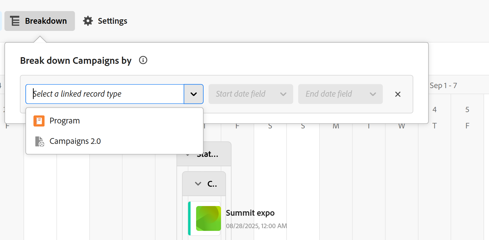

# De tijdlijnweergave beheren

{{planning-important-intro}}

U kunt records weergeven in een tijdlijnweergave wanneer u de pagina met recordtypen opent in Adobe Workfront Planning.

Voor informatie over verslagmeningen, zie [ verslagmeningen ](/help/quicksilver/planning/views/manage-record-views.md) leiden.

## Toegangsvereisten

+++ Breid uit om toegangsvereisten voor de Planning van Workfront te bekijken.

U moet het volgende hebben om tot de Planning van Workfront toegang te hebben:

<table style="table-layout:auto"> 
<col> 
</col> 
<col> 
</col> 
<tbody> 
    <tr> 
<tr> 
<td> 
   
 Producten
 </td> 
   <td> 
   <ul><li>
 Adobe Workfront
</li> 
   <li>
 Adobe Workfront Planning
</li></ul></td> 
  </tr>   
<tr> 
   <td role="rowheader">
Adobe Workfront-abonnement*
</td> 
   <td> 

Een van de volgende Workfront-plannen:
 
<ul><li>Selecteren</li> 
<li>Eerste</li> 
<li>Ultieme</li></ul> 

Workfront Planning is niet beschikbaar voor oudere Workfront-plannen
 
   </td> 
<tr> 
   <td role="rowheader">
Planning van Adobe Workfront*
</td> 
   <td> 

Alle 
 

Neem contact op met uw Workfront-accountmanager voor meer informatie over wat er in elk Workfront-planningsplan is opgenomen. 
 
   </td> 
 <tr> 
   <td role="rowheader">
Adobe Workfront-platform
</td> 
   <td> 

Het geval van Workfront van uw organisatie moet aan de Adobe Verenigde Ervaring worden genegeerd om tot alle mogelijkheden van de Planning van Workfront te kunnen toegang hebben.
 

Voor meer informatie, zie <a href="/help/quicksilver/workfront-basics/navigate-workfront/workfront-navigation/adobe-unified-experience.md"> Adobe Verenigde Ervaring voor Workfront </a>. 
 
   </td> 
   </tr> 
  </tr> 
  <tr> 
   <td role="rowheader">
Adobe Workfront-licentie*
</td> 
   <td>
 Standaard 

   
Workfront Planning is niet beschikbaar voor oudere Workfront-licenties
 
  </td> 
  </tr> 
  <tr> 
   <td role="rowheader">
Configuratie op toegangsniveau
</td> 
   <td> 
Er zijn geen toegangsniveaucontroles voor de Planning van Adobe Workfront
   
</td> 
  </tr> 
<tr> 
   <td role="rowheader">
Objectmachtigingen
</td> 
   <td>   
Rechten beheren voor een weergave
  
   
Machtigingen weergeven voor een weergave om de weergave-instellingen tijdelijk te wijzigen
 </td> 
  </tr> 
<tr> 
   <td role="rowheader">
Lay-outsjabloon
</td> 
   <td> 
Aan alle gebruikers, inclusief Workfront-beheerders, moet een lay-outsjabloon worden toegewezen die het planningsgebied in het hoofdmenu bevat. 
 </td> 
  </tr> 
</tbody> 
</table>

*Voor meer informatie over de toegangsvereisten van Workfront, zie [ vereisten van de Toegang in de documentatie van Workfront ](/help/quicksilver/administration-and-setup/add-users/access-levels-and-object-permissions/access-level-requirements-in-documentation.md).

+++

<!--OLD: 

<table style="table-layout:auto">
 <col>
 </col>
 <col>
 </col>
 <tbody>
    <tr>
<tr>
<td>
   
 Product
 </td>
   <td>
   
 Adobe Workfront
 </td>
  </tr>  
 <td role="rowheader">
Adobe Workfront agreement
</td>
   <td>

Your organization must be enrolled in the early access stage for Workfront Planning 

   </td>
  </tr>
  <tr>
   <td role="rowheader">
Adobe Workfront plan
</td>
   <td>

Any

   </td>
  </tr>
  <tr>
   <td role="rowheader">
Adobe Workfront license*
</td>
   <td>
   
New: Standard

   Or
   
Current: Plan 
 
  </td>
  </tr>
  
  <tr>
   <td role="rowheader">
Access level configurations
</td>
   <td> There are no access controls for Adobe Workfront Planning
  
</td>
  </tr>

  <tr>
   <td role="rowheader">
Permissions
</td>
   <td> 
Manage permissions to a view
  
   
View permissions to a view to temporarily change the view settings

</td>
  </tr>

<tr>
   <td role="rowheader">
Layout template
</td>
   <td> 
All users, including Workfront administrators,  must be assigned a layout template that includes the Planning area in the Main Menu. 
 
For information, see <a href="/help/quicksilver/planning/access/access-overview.md">Access overview</a>. 
 
</td>
  </tr>
 </tbody>
</table>

*For information, see [Access requirements in Workfront documentation](/help/quicksilver/administration-and-setup/add-users/access-levels-and-object-permissions/access-level-requirements-in-documentation.md).-->

## Een tijdlijnweergave beheren {#manage-a-timeline-view}

<!--insert screen shot of timeline view-->

Wanneer u een tijdlijnweergave maakt, worden alle records van het geselecteerde recordtype weergegeven in een chronologische tijdlijn.

Overweeg het volgende:

* U kunt alleen een tijdlijnweergave maken wanneer u ten minste twee datumvelden hebt gekoppeld aan een recordtype. Wanneer u een of geen datumvelden hebt gekoppeld aan een recordtype, wordt de optie voor de tijdlijnweergave grijs weergegeven.

  Bij het maken van een tijdlijnweergave kunt u uit de volgende datumvelden een keuze maken:

   * Recorddatums
   * Door het systeem gegenereerde velden opnemen: Aanmaakdatum, Datum van laatste wijziging
   * Datums opzoeken van verbonden record- of objecttypen.
* Afhankelijk van de datums die aan de records zijn gekoppeld, worden sommige records mogelijk niet in de tijdlijnweergave weergegeven in de volgende scenario&#39;s:

   * Wanneer de begin- en einddatum geen waarden hebben
   * Wanneer de begin- of einddatum geen waarde hebben
   * Wanneer de begindatum na de einddatum ligt

Een tijdlijnweergave beheren:

1. Ga naar de pagina met recordtypen waarvoor u de tijdlijn wilt weergeven.
1. Creeer een chronologiemening, zoals die in artikel [ wordt beschreven beheer verslagmeningen ](/help/quicksilver/planning/views/manage-record-views.md).

   

   De records die zijn gekoppeld aan het geselecteerde recordtype, worden standaard als balken in een tijdlijn weergegeven en gesorteerd in chronologische volgorde van hun begindatum.

   >[!TIP]
   >
   >    Het sorteren van de records in de tijdlijn is niet zichtbaar in de compacte weergave.

1. (Optioneel en voorwaardelijk) Wanneer de naam van de record wordt afgekapt, houdt u de muisaanwijzer boven een recordbalk om de volledige naam van de record en aanvullende informatie weer te geven.

1. Voer een van de volgende handelingen uit om door de tijdlijn te navigeren:

   * Klik op de pictogrammen links en rechts of gebruik de horizontale schuifbalk om naar voren en naar achteren in de tijdlijn te gaan. Als u de pagina vernieuwt, blijft het geselecteerde tijdkader behouden.
   * Klik **vandaag** om de chronologie aan de datum van vandaag te centreren.
   * Selecteer een van de volgende opties in het vervolgkeuzemenu voor het tijdframe om de tijdtoename bij te werken:

      * Jaar
      * Kwart
      * Maand
1. Klik **Schakelaar aan Standaard** mening om verslagen in afzonderlijke lijnen <!--check to see if they updated the name of the setting here--> te tonen

   of

   Klik **Schakelaar aan Compacte mening** om de verslagen te tonen waarvan data niet op de zelfde lijn snijden. <!--check to see if they updated the name of the setting here-->

   Records worden standaard weergegeven in de compacte weergave.

1. Ga als volgt te werk om snel records te zoeken die overeenkomen met een trefwoord:

   1. Klik het **pictogram van het 1} Onderzoek  en begin een sleutelwoord verbonden aan om het even welk gebied van een verslag te typen dat op het scherm toont.** Het aantal juiste overeenkomsten wordt weergegeven naast het zoekitem en de record met de juiste overeenkomst wordt gemarkeerd.

      

      U kunt elk woord of speciaal teken gebruiken dat op het scherm zichtbaar is.

      U kunt geen trefwoorden gebruiken die zijn gekoppeld aan velden die niet worden weergegeven in de tijdlijnweergave.

   1. Druk op Enter op het toetsenbord om naar het volgende gevonden veld te gaan.
   1. (Optioneel) Als er meer dan één overeenkomst is, klikt u op de pijl-omhoog of -omlaag rechts van het trefwoord Zoeken om alle overeenkomende items in de tabel te zoeken.
   1. Klik het **x** pictogram in het onderzoeksvakje om het onderzoekssleutelwoord te ontruimen.

1. Werk de volgende weergave-elementen bij zoals in de onderstaande subsecties wordt beschreven:
   * [Filters](#add-filters)
   * [Groepering](#add-grouping)
   * [ Montages ](#edit-the-timeline-view-settings)
     <!--* [Sort](#add-sort) not yet in timeline; also check the anchor and make sure it's correct-->

1. (Facultatief) klik **Uitsplitsing** om verbonden verslagen op de chronologie te tonen.

   Voor informatie, zie de sectie [ Gebruik de eigenschap van de Onderbreking om verbonden verslagen in de chronologiemening te tonen ](#break-down-connected-records-in-the-timeline-view)

### Filters toevoegen

U kunt de hoeveelheid informatie die op het scherm wordt weergegeven verminderen door filters te gebruiken.

Houd rekening met het volgende wanneer u werkt met filters in de tijdlijnweergave:

<!-- this list is almost identical to the one for the table view - update both-->

* De filters die u voor een tijdlijnweergave maakt, werken onafhankelijk van de filters in een andere weergave die op hetzelfde recordtype is toegepast.

* De filters zijn uniek voor de weergave die u selecteert. Op twee tijdlijnweergaven van hetzelfde recordtype kunnen verschillende filters worden toegepast.

* Twee gebruikers die naar dezelfde tijdlijnweergave kijken, zien hetzelfde filter dat op dat moment wordt toegepast.

* U kunt de filters die u maakt voor een tijdlijnweergave niet een naam geven.

* Als u filters verwijdert, worden deze verwijderd van iedereen die hetzelfde recordtype als u benadert en die dezelfde weergave als u weergeeft.

* Het toevoegen van filters in de tijdlijnweergave is hetzelfde als het toevoegen van filters in de tabelweergave.

  Voor meer informatie, zie &quot;filters&quot;sectie in artikel [ toevoegen de lijstmening ](/help/quicksilver/planning/views/manage-the-table-view.md) leidt.

* U kunt filteren op gekoppelde recordvelden of opzoekvelden.
* U kunt filteren door velden op te zoeken waarin meerdere waarden worden weergegeven.

### Groepering toevoegen

<!-- groupings are almost identical between this view and table  but they display a little differently, so I kept the steps for both; update in both places if they make changes to groupings-->

U kunt records groeperen aan de hand van vergelijkbare informatie wanneer u een groepering toepast op een weergave.

Het toevoegen van groepen in de tijdlijnweergave lijkt op het toevoegen van groepen aan de tabelweergave.

Houd rekening met het volgende wanneer u werkt met groepen in de tijdlijnweergave:

* U kunt groepen toepassen in de tabel- en tijdlijnweergave. De groepen van de tabelweergave zijn onafhankelijk van de groepen in de tijdlijnweergave van hetzelfde recordtype.
* U kunt 3 niveaus van groepering in een mening toepassen. De records worden gegroepeerd in de volgorde van de groepen die u selecteert.
&lt;!—* U kunt tot 4 niveaus van groepering toepassen wanneer het gebruiken van API. —deze nu controleren—>
* De groepen zijn uniek voor de weergave die u selecteert. Op twee tabelweergaven van hetzelfde recordtype kunnen verschillende groepen worden toegepast. Twee gebruikers die naar dezelfde tabelweergave kijken, zien dezelfde groepering die momenteel wordt toegepast.
* U kunt de groepen die u maakt voor een tabelweergave niet een naam geven.
* Als u groepen verwijdert, worden deze verwijderd van iedereen die toegang heeft tot hetzelfde recordtype als u en die dezelfde weergave weergeeft als u.
* U kunt records bewerken die in een groep worden vermeld.
* U kunt groeperen door verbonden verslaggebieden of raadplegingsgebieden.
* Wanneer u door raadplegingsgebieden met veelvoudige waarden groepeert (die niet door een aggregator zijn samengevat), worden de verslagen gegroepeerd door elke unieke combinatie gebiedswaarden.
* U kunt verwijzen naar een veld dat zich op maximaal 4 niveaus van het huidige recordtype bevindt. Bijvoorbeeld, als u een groepering voor een type van het verslag van de Activiteit creeert, en de Activiteit wordt verbonden met het type van het Verslag van het Product dat met het verslagtype van de Campagne wordt verbonden dat met een Project van Workfront wordt verbonden, kunt u de Status van het project in de groepering verwijzen u voor het verslagtype van de Activiteit creeert.
<!--checking into this: * You can apply up to 4 levels of grouping when using the API. -->
<!-- checking also into this: * You cannot group by a Paragraph-type field.-->

Een groep toevoegen in de tijdlijnweergave:

1. Creeer een chronologiemening voor een verslagtype, zoals die in artikel [ wordt beschreven beheer verslagmeningen ](/help/quicksilver/planning/views/manage-record-views.md).
1. Klik **Groepering** in de hoger-juiste hoek van de chronologiemening.

   

1. Klik één van de voorgestelde gebieden, of klik **kies een verschillend gebied**, onderzoek naar een verschillend gebied, dan klik het wanneer het in de lijst toont.

   De groepering wordt automatisch toegepast op de tijdlijn en records worden weergegeven in het groepsvak.

   <!-- add a step that you can rearrange the groupings here, when this will be possible-->

1. (Optioneel) Herhaal de bovenstaande stappen om maximaal drie groepen samen te voegen.

   Het aantal velden dat voor de groepering is geselecteerd, wordt weergegeven naast het pictogram Groeperen.

   <!-- update screen shot with view redesign-->

   

1. (Facultatief) binnen de **verslagen van de Groep door** doos, klik het **x** pictogram aan het recht van een gebied dat voor de groepering wordt geselecteerd om de groepering te verwijderen

   of

   Klik **ontruimen allen** om alle gebieden te verwijderen.

1. Klik buiten de **verslagen van de Groep door** doos om het te sluiten.
1. (Facultatief) klik **Montages**, toen **Kleur** aan kleur-code groeperingen. Voor meer informatie, zie [ uitgeven de sectie van de chronologiemening montages ](#edit-the-timeline-view-settings) in dit artikel.

<!-- 

### Add sort

this is not possible right now; if this is the same functionality as the table view, document it there and link from here. 

-->

### De weergave-instellingen voor de tijdlijn bewerken {#edit-the-timeline-view-settings}

Werk de instellingen van de tijdlijnweergave bij om aan te geven wat en hoe informatie wordt weergegeven in het tijdlijngedeelte van de weergave.

1. Creeer een chronologiemening voor een verslagtype, zoals die in artikel [ wordt beschreven beheer verslagmeningen ](/help/quicksilver/planning/views/manage-record-views.md).
1. Klik **Montages**.
1. Klik **Datum en tijd** in het linkerpaneel, dan de datum van het a **Begin** en een **einddatum** om op de chronologie te tonen. U kunt de standaardbegin- en einddatum kiezen of een datumveld kiezen dat beschikbaar is. De balken die de records weergeven, beginnen op de datum die u aangeeft voor de begindatum en eindigen op de datum die overeenkomt met de einddatum.

   >[!NOTE]
   >
   >Records die geen waarden hebben voor de begin- of einddatum of die later een begindatum hebben dan de einddatum, worden niet weergegeven in de tijdlijnweergave.

1. Klik **stijl van de Bar** in het linkerpaneel, om te wijzen op welke gebieden u op de verslagbars wilt tonen.

   Het primaire veld (of de titel) van de record, zoals gedefinieerd in de tabelweergave van de record, wordt standaard geselecteerd. <!--adjust this when the primary field is released??-->

1. (Optioneel en voorwaardelijk) Als u miniaturen aan records hebt toegevoegd, selecteert u de optie Miniatuur om de afbeelding weer te geven die aan records is gekoppeld in de recordbalk.

   >[!NOTE]
   >
   >    U moet eerst miniaturen toevoegen in de tabelweergave voordat u ze kunt weergeven in de tijdlijnweergave. Voor meer informatie, zie [ een duimnagel aan een verslag ](/help/quicksilver/planning/records/add-thumbnails-to-records.md) toevoegen.

1. Klik **voeg gebied** toe om tot 4 gebieden aan de verslagbars toe te voegen.
1. Klik binnen de **gebieden van het Onderzoek** doos, en klik het gebied u wilt toevoegen.

   >[!TIP]
   >
   >   * U moet de velden maken voordat u deze aan de recordbalken kunt toevoegen.
   > 
   >   * Er moet ten minste één veld zijn geselecteerd. **Naam** wordt geselecteerd door gebrek.

   Aan de rechterkant wordt een voorvertoning weergegeven van hoe de balken eruit zullen zien op de tijdlijn.

   

1. Klik **Kleur** in het linkerpaneel, om de kleuren van de verslagen en de groeperingen in de chronologie aan te passen.

   

1. (Voorwaardelijk en facultatief) als u een groepering aan de chronologiemening toevoegde, selecteer van de volgende opties om een kleur voor de groepering in de **Vastgestelde groeperingskleur** sectie te plaatsen:

   * **Gebrek (grijs)**: De kleur van de groeperingen wordt geplaatst aan grijs. Dit is de standaardinstelling.
   * **waarden van het Gebied**: De kleur van de groeperingen past de kleur van het gebied aan u groepert door.

     >[!NOTE]
     >
     >    * U kunt de kleur alleen aanpassen aan velden met opties voor kleurcodes. U kunt bijvoorbeeld de kleur aanpassen aan statusvelden of aan velden met opties die zijn gekoppeld aan kleuren.
     >    
     >    * U kunt de kleur niet aanpassen aan opzoekvelden van gekoppelde record- of objecttypen.

   Multiselect- of single-select-velden kunnen bijvoorbeeld kleuropties hebben.

   Als u groepeert op velden zonder opties voor kleurcodering, blijft de kleur van de groep grijs.

   >[!TIP]
   >
   >Als u geen groepen hebt toegevoegd aan de tijdlijnweergave, wordt deze sectie niet weergegeven.

1. In de **plaats verslagkleur** sectie, selecteer van de volgende opties om een kleur voor de verslagen te plaatsen:

   * **type van Verslag**: De kleur van de verslagen past de kleur van het verslagtype aan u selecteerde. Dit is de standaardoptie.
   * **waarden van het Gebied**: De kleur van de verslagen past de kleur van een gebied aan dat u specificeert. Ga verder met stap 10. <!--ensure this stays accurate-->
   * **Groepering**: De kleur van de verslagen past de kleur aan die u voor de groeperingen verwees. Deze optie is grijs als er geen groepen zijn toegepast op de tijdlijnweergave.
   * **niets**: De vertoningen van verslagen in een witte bar.

1. (Voorwaardelijk) als u **waarden van het Gebied** voor de verslagkleuren selecteerde, selecteer een gebied van **gelijke de verslagkleur aan** drop-down menu.

   

   Alleen velden met opties voor kleurcodes worden weergegeven in het keuzemenu.

   Multiselect- of single-select-velden kunnen bijvoorbeeld kleuropties hebben.

   Als u geen veld hebt met kleurgecodeerde opties voor het geselecteerde recordtype, wordt deze optie grijs weergegeven.

1. Klik **sparen**.

   De records worden in de tijdlijnweergave weergegeven met de specificaties die u hebt geselecteerd.

### De functie Onderverdeling gebruiken om verbonden records in de tijdlijnweergave weer te geven

U kunt verbonden verslagen in de chronologiemening van een verslag tonen door de eigenschap van de Onderverdeling te gebruiken. Door records op te delen op basis van hun verbindingen kunt u de tijdlijnen van andere verbonden records weergeven en begrijpen hoe deze de prestaties en deadlines van uw records kunnen beïnvloeden.

#### Overwegingen bij het gebruik van de functie Onderverdeling

* U kunt verbonden records of objecten weergeven onder de records van het geselecteerde recordtype in de tijdlijnweergave.
* U kunt het volgende weergeven in de tijdlijnweergave met de functie Onderverdeling:
   * Workfront Planning records die zijn verbonden met het geselecteerde recordtype.
   * Workfront-objecttypen of Experience Manager-elementen die zijn verbonden met het geselecteerde recordtype.
   * Workfront Planning-records of -objecten uit andere toepassingen die zijn verbonden met records die zijn verbonden met het geselecteerde recordtype.

     U kunt bijvoorbeeld campagnes verbinden met portfolio&#39;s. Bovendien zou u een ander verslagtype, producten, met projecten, evenals met campagnes kunnen verbinden. Wanneer u de tijdlijnweergave van de campagne maakt, kunt u de campagnes opsplitsen op portfolio&#39;s, producten en projecten.

* U kunt geen objecttypen weergeven die alleen zijn verbonden met Workfront-objecten in Workfront, maar die niet zijn verbonden met een recordtype voor Workfront Planning. U kunt alleen objecten of recordtypen weergeven die zijn verbonden in Workfront Planning.

  Taken zijn bijvoorbeeld verbonden met projecten in Workfront. Gebruikend de eigenschap van de Onderverdeling, kunt u projecten tonen die met campagnes in Planning, maar geen taken verbonden aan projecten in Workfront worden verbonden.

  Als u zowel portefeuilles als projecten in de chronologiemening van een het verslagtype van de Planning van Workfront wilt tonen, zowel moeten de portefeuilles als de projecten met het verslag van de Planning of met een verslag worden verbonden dat met het verslag van de Planning wordt verbonden waarvan chronologiemening u beheert.
* U kunt alleen recordtypen weergeven die zijn gekoppeld aan ten minste twee datumvelden.
* De datumvelden voor de recordtypen die u in de tijdlijnweergave wilt weergeven, moeten zichtbaar zijn in de tabelweergave van het geselecteerde recordtype, als opzoekvelden.
* De begin- en einddatums van de recordtypen die u in de tijdlijnweergave wilt weergeven, moeten in chronologische volgorde worden weergegeven. Als een record bijvoorbeeld een startdatum van 31 januari en een einddatum van 1 januari heeft, wordt deze niet weergegeven in de tijdlijnweergave. Voor meer informatie, zie de sectie [ een chronologiemening ](#manage-a-timeline-view) in dit artikel beheren.
* Er geldt een limiet van 5 recordtypen die u kunt opnemen in de indeling van een record.

#### Verbonden records in de tijdlijnweergave opsplitsen

1. Creeer een chronologiemening voor een verslagtype, zoals die in artikel [ wordt beschreven beheer verslagmeningen ](/help/quicksilver/planning/views/manage-record-views.md).
1. (Voorwaardelijk) als u de chronologiemening op de Standaardwijze bekijkt, klik **Uitsplitsing**.
1. Vouw **Uitgezocht een verbonden verslagtype** doos uit en selecteer een verbonden verslagtype. <!--add a new screen shot - submitted a bug to remove the "the"-->

   

   >[!TIP]
   >
   >    Als u geen verbonden verslagen hebt, of als de verbonden verslagen minstens twee datumgebieden hebben, **Uitgezocht een verbonden verslagtype** doos is niet beschikbaar.

1. Kies de datum van het a **Begin** en een **de datumgebied van het Eind**.

   >[!TIP]
   >
   >    De begin- en einddatum moeten opeenvolgend zijn. Als de einddatum valt vóór de begindatum, worden er geen records weergegeven in de tijdlijn.

   Er wordt een pijl naar rechts weergegeven op de geselecteerde balk van de record in de tijdlijn als deze zijn verbonden met andere records.
1. Klik op de pijl naar rechts om een recordtype uit te vouwen en de weergave is verbindingen.

   

1. (Optioneel) Herhaal bovenstaande stappen om meer verbonden records toe te voegen.

