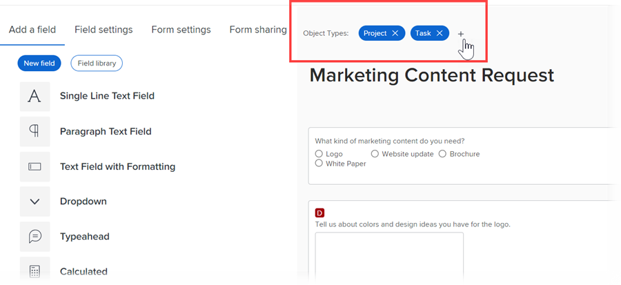

# Verbeteringen voor aangepaste formulieren

De volgende belangrijke verbeteringen zijn aangebracht voor het beheer van aangepaste formulieren in de release 22.2.

## Elementwidgets toevoegen

U kunt de afbeelding insluiten in uw aangepaste formulieren. Op deze manier kunt u interactiever en visueel communiceren met aangepaste formuliergebruikers. Binnenkort zijn er nog meer widgettypen beschikbaar.


Wanneer een aangepast formulier met een widget aan een object is gekoppeld, kunnen gebruikers die met het object werken dit in de volgende gebieden zien:

* Het gebied Details van het object (bijvoorbeeld voor een project, het gebied Projectdetails) &#x200B;

  

* Het vak Bewerken voor het object als dit de nieuwe Adobe Workfront-ervaring bevat (bijvoorbeeld de vakken Project bewerken en Taak bewerken) &#x200B;

  

Gebruikers kunnen de widget momenteel niet zien in de volgende gebieden: &#x200B;

* Lijsten en rapporten
* Home en overzicht
* Het vak Bewerken voor het object, als dit object er anders uitziet dan de nieuwe Adobe Workfront-ervaring (bijvoorbeeld het vak Kosten bewerken)
* De Workfront Mobile-app &#x200B;

Voor meer informatie over het toevoegen van widgets aan douaneformulieren, zie [ een beeld of andere activa widget in een douaneformulier ](/help/quicksilver/administration-and-setup/customize-workfront/create-manage-custom-forms/add-widget-or-edit-its-properties-in-a-custom-form.md) toevoegen of uitgeven.

## Een aangepast formulier koppelen aan meerdere objecttypen

U kunt meerdere objecttypen koppelen aan elk nieuw aangepast formulier:


Of een bestaand aangepast formulier:



Op deze manier kunt u één aangepast formulier maken dat u kunt gebruiken voor projecten, taken, uitgaven en andere typen objecten die worden ondersteund voor aangepaste formulieren.

Dit is vooral handig wanneer u een uitgave of taak converteert, omdat u een aangepast formulier en de bijbehorende gegevens kunt overdragen naar het geconverteerde object. U hoeft niet langer exacte kopieën van hetzelfde aangepaste formulier voor verschillende objecttypen te maken en te onderhouden, het aangepaste formulier handmatig aan het project toe te voegen.

>[!INFO]
>
>**Voorbeeld:**
>
>Iemand verzendt een interne IT-aanvraag (uitgave) en geeft informatie over wat nodig is in een bijgevoegd aangepast formulier.
>
>U zet de uitgave om in een project voor de gebruikers die aan het zullen werken.
>
>Omdat het aangepaste formulier met de details van de verzender is gekoppeld aan zowel het type Issue als het type Project, worden het aangepaste formulier en al deze details tijdens de conversie overgedragen naar het project.

>[!NOTE]
>
>Wanneer de conversie plaatsvindt, moet het aangepaste formulier al zijn gekoppeld aan het objecttype waarnaar u converteert.

Voor instructies bij het toevoegen van een activa widget aan een douanevorm, zie [ een beeld of andere activa widget in een douaneformulier ](/help/quicksilver/administration-and-setup/customize-workfront/create-manage-custom-forms/add-widget-or-edit-its-properties-in-a-custom-form.md) toevoegen of uitgeven.

Houd rekening met het volgende wanneer u een aangepast formulier met meerdere objecten maakt of bewerkt:

* [Machtigingsopties voor sectie-einden](#permission-options-for-section-breaks)
* [Compatibiliteit met aangepaste velden berekenen](#calculated-custom-field-compatibility)
* [Let op het verwijderen van een objecttype uit een aangepast formulier](#caution-about-deleting-an-object-type-from-a-custom-form)

### Machtigingsopties voor sectie-einden

De set opties voor machtigingen voor sectie-einden die beschikbaar zijn voor de typen Uitgave-, Taak-, Project- en Gebruikersobjecten heeft één andere machtigingsoptie dan de set met machtigingsopties voor alle andere objecttypen: Beperkte bewerking.


De reeks toestemmingen van de sectieonderbreking beschikbaar voor alle andere objecten types (Portfolio, Document, Programma, Uitgaven, Bedrijf, Herhaling, het Verslag van de Facturering, en Groep) omvat geen Beperkte Edit:


In een aangepast formulier dat is gekoppeld aan objecttypen uit beide groepen, gebruikt het systeem een algemene set machtigingen voor secties-einden die werken voor alle objecttypen. Met name in plaats van de optie Beperkte bewerkingsmachtigingen te gebruiken, vervangt deze algemene set de optie Bewerken met machtiging door de optie Beperkte bewerkingsmachtigingen. De optie Bewerken is compatibel met alle objecttypen.

Wanneer u een objecttype koppelt dat andere machtigingsopties gebruikt dan de andere objecttypen die al op een aangepast formulier voorkomen, wordt een bericht weergegeven waarin u kunt overschakelen naar de algemene set machtigingsopties voor het formulier. Deze wijziging is van toepassing op alle velden, zelfs als deze niet onder een sectie-einde vallen.

Voor meer informatie, zie [ een sectieonderbreking aan een douanevorm ](/help/quicksilver/administration-and-setup/customize-workfront/create-manage-custom-forms/add-a-section-break-to-a-custom-form.md) toevoegen.

### Compatibiliteit met aangepaste velden berekenen

Als in een aangepast formulier met meerdere objecten een berekend veld verwijst naar velden die beschikbaar zijn voor gebruik met alle gekoppelde objecttypen van het formulier (zoals {name} , {description} en {entryDate} , die beschikbaar zijn voor meerdere objecttypen), worden de gegevens correct berekend, ongeacht het object waaraan u het toevoegt.

Als u bijvoorbeeld een formulier met meerdere objecten hebt voor projecten en uitgaven en u een berekend veld toevoegt met de expressie {name} , wordt in het veld de projectnaam weergegeven wanneer u het formulier aan een project toevoegt en voegt u de taaknaam toe aan het formulier.

Als een berekend veld in het formulier echter verwijst naar een veld dat niet compatibel is met alle objecttypen van het formulier, wordt u in een bericht gewaarschuwd dat u wijzigingen wilt aanbrengen.

>[!INFO]
>
>**Voorbeeld:** in een douaneformulier verbonden aan het de objecten van de Taak type, creeert u een berekend douanegebied dat verwijzingen het ingebouwde gebied Toegewezen aan: Naam zodat het de naam van de primaire aangewezen kan tonen wanneer de vorm aan een taak in bijlage is:
>
>```
>Assigned To: Name{assignedTo}.{name}
>```
>
>Later voegt u het objecttype Project toe aan het aangepaste formulier. Een waarschuwingsbericht geeft aan dat het objecttype Project niet compatibel is met het berekende aangepaste veld. Dit komt doordat het veld Toegewezen aan niet beschikbaar is voor projecten.

Wanneer dit voorkomt, kunt u één van het volgende doen:

* Verwijder een van de twee incompatibele items uit het aangepaste formulier. Dit is het objecttype of het veld waarnaar wordt verwezen.
* Houd beide items en gebruik de variabele voor het jokertekenfilter `$$OBJCODE` als voorwaarde in een IF-expressie om twee verschillende versies van het veld In lading te maken. Hierdoor werkt het veld goed, ongeacht het type object waaraan het formulier is gekoppeld.

  Gebruikend het voorbeeld hierboven, hoewel er geen ingebouwde Toegewezen aan is: Het gebied van de Naam voor projecten, is er een ingebouwd gebied van de Eigenaar (dat automatisch met de naam van de persoon invult die het project creeerde, tenzij iemand manueel dit verandert). Zo kunt u in het veld Aangepast in kosten `$$OBJCODE` gebruiken, zoals hieronder wordt weergegeven, om te verwijzen naar het veld Eigenaar wanneer het aangepaste formulier aan een project is gekoppeld en naar het veld Toegewezen aan: Naam wanneer het formulier aan een taak is gekoppeld:

  ```
  IF($$OBJCODE="PROJ",{owner}.{name},{assignedTo}.{name})
  ```

>[!NOTE]
>
>  Als u een objecttype toevoegt vóór een veldnaam, verwijst het naar het bovenliggende object van het object. U kunt `{project}.{name}` dus niet gebruiken met een project, maar u kunt het wel gebruiken met een taak.

Voor instructies bij het toevoegen van een berekend douanegebied aan een douanevorm, zie [ berekende gegevens aan een douaneformulier ](/help/quicksilver/administration-and-setup/customize-workfront/create-manage-custom-forms/add-calculated-data-to-custom-form.md) toevoegen.

Voor meer informatie over variabelen zoals `$$OBJCODE`, zie [ overzicht van de de filtervariabelen van de Verjaring ](/help/quicksilver/reports-and-dashboards/reports/reporting-elements/understand-wildcard-filter-variables.md).

### Let op het verwijderen van een objecttype uit een aangepast formulier

U kunt op elk gewenst moment een objecttype op een aangepast formulier verwijderen, maar dit moet met de nodige voorzichtigheid gebeuren. Als gebruikers het aangepaste formulier al hebben gekoppeld aan objecten van het type dat u wilt verwijderen, en er gegevens aan hebben toegevoegd, worden die gegevens permanent verwijderd wanneer u dat objecttype op het formulier verwijdert.

Er is ook geen meldingssysteem om mensen die het aangepaste formulier gebruiken te waarschuwen dat het is verwijderd.

Voor meer informatie, zie [ een douanegebied of widget van het systeem ](/help/quicksilver/administration-and-setup/customize-workfront/create-manage-custom-forms/delete-a-custom-field.md) schrappen.
