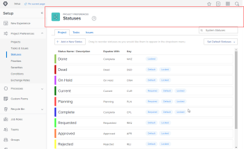

# 21.2 Beheerdersverbeteringen

Op deze pagina worden alle beheerderverbeteringen beschreven die zijn aangebracht met de versie 21.2 voor de voorvertoningsomgeving. Deze verbeteringen zullen beschikbaar worden gesteld in de productieomgeving in de week van 10 mei 2021. Zie voor een lijst met alle wijzigingen die beschikbaar zijn in de release 21.2 [21.2 Overzicht van de release](../../../product-announcements/product-releases/21.2-release-activity/21-2-release-overview.md).

## Voor beheerders: bekijk de informatie van het Logboek van de Controle over vele meer gebieden in Workfront

In het gebied Auditlogboeken, kunt u veranderingen in meer gebieden door Workfront nu volgen en problemen oplossen. Het systeem genereert nu auditlogitems wanneer een gebruiker een van de volgende handelingen uitvoert:

* Hiermee maakt, wijzigt, verwijdert of deelt u een aangepast formulier
* Maakt, wijzigt, verwijdert of deelt een aangepast veld
* Maakt, wijzigt of verwijdert een aangepaste sectie
* Maakt, wijzigt of verwijdert een wisselkoers
* Hiermee wordt een taakrol gemaakt, gewijzigd of verwijderd
* Hiermee maakt, wijzigt of verwijdert u een prioriteit
* Maakt, wijzigt of verwijdert een ernst
* Maakt, wijzigt of verwijdert een voorwaarde
* Hiermee wijzigt u een projectvoorkeur of maakt of verwijdert u een aangepast kwartaal
* Een taak wijzigen en een voorkeur voor een uitgave opgeven

Zie voor meer informatie [Controlelogboeken](../../../administration-and-setup/add-users/create-and-manage-users/audit-logs.md).

Deze functie is nu opgenomen in het dialoogvenster [Grondbeginselen van het beheer voor de nieuwe ervaring van Workfront, Deel 2: de Opstelling van het Project](https://one.workfront.com/s/learningpath3/administrator-fundamentals-in-the-new-workfront-experience-part-1-project-workfl-MCTBVZ3Q3J5RHNLIPPZPFSQRLKUY) leerpad op Workfront One.

## Voor groepsbeheerders: verbeterde besturingselementen voor het verplaatsen van subgroepen en een bijgewerkte werkbalk

>[!NOTE]
>
>Alleen beschikbaar in de nieuwe Adobe Workfront-ervaring.

We hebben de volgende verbeteringen aangebracht in het gebied Subgroepen in Setup.

* Om u een snelle manier te geven om de groepen te reorganiseren u beheert, hebben wij een &quot;Add subgroups&quot;toolbarknoop toegevoegd die u toestaat om nieuwe subgroepen tot stand te brengen en bestaande te bewegen.

  Zie voor meer informatie [Een subgroep beheren](../../../administration-and-setup/manage-groups/create-and-manage-subgroups/manage-subgroups.md).

* De werkbalk in het gebied Subgroepen zorgt er nu voor dat lijsten consistent zijn met andere gemoderniseerde lijsten in de nieuwe Workfront-ervaring. Als u groepen selecteert, vertegenwoordigen pictogrammen de beschikbare functies op de werkbalk.

## Nieuw voor beheerders: Bijgewerkt uiterlijk op de pagina Voorkeuren Timesheets &amp; Uours

Om de ervaring op de pagina van de Voorkeur van Timesheets &amp; van Uren te verbeteren, hebben wij de gebruikersinterface bijgewerkt om de modernere blik aan te passen elders in Workfront.

Secties en afzonderlijke opties zijn beter leesbaar omdat ze worden gescheiden door meer verticale ruimte.

De labels voor de twee keuzerondjes zijn opgesplitst, zodat ze niet zo lang zijn. Het tweede deel van elk label is nu een informatiebericht op een aparte regel.

Voor informatie over de voorkeur Timesheets &amp; van Uren, zie [Voorkeuren voor tijdpagina&#39;s en uren configureren](../../../administration-and-setup/set-up-workfront/configure-timesheets-schedules/timesheet-and-hour-preferences.md).

## Voor groepsbeheerders: lijstverbeteringen in het gebied Groepen

>[!NOTE]
>
>Alleen beschikbaar in de nieuwe Adobe Workfront-ervaring.

Twee verbeteringen in het gebied van Groepen in Opstelling maken lijsten verenigbaar met andere gemoderniseerde lijsten in de nieuwe ervaring van Workfront:

* Als u groepen selecteert, vertegenwoordigen pictogrammen de beschikbare functies op de werkbalk.
* In de lijst met groepen, kolommen, sorteren en hiërarchie hebt u de nieuwere vormgeving en het gevoel dat u in andere lijsten gewend bent. Standaard worden in lijsten ook maximaal 2000 items op één pagina weergegeven in plaats van 100.

Voor informatie over de gemoderniseerde lijsten in Workfront raadpleegt u [De weergave van een lijst wijzigen](../../../workfront-basics/navigate-workfront/use-lists/modify-list-display.md).

Voor informatie over het gebied Groepen raadpleegt u [Groepen beheren](../../../administration-and-setup/manage-groups/manage-groups.md).

## Voor groepsbeheerders: programma&#39;s maken en bewerken vanuit het gebied Groepen in Instellen

>[!NOTE]
>
>Alleen beschikbaar in de nieuwe Adobe Workfront-ervaring.

We maken het nog steeds eenvoudiger om uw groepen en de bijbehorende objecten op één locatie te beheren. Nu kunt u met de programma&#39;s van een groep van het gebied van Groepen in Opstelling bekijken en werken. Hierdoor hoeft u niet naar het gebied Programma&#39;s te gaan om de programma&#39;s van uw groep te beheren. En het houdt de lijst van groepsprogramma&#39;s u met werkt gescheiden van de andere programma&#39;s in het systeem.

Zie voor meer informatie [De programma&#39;s van een groep maken, wijzigen en weergeven](../../../administration-and-setup/manage-groups/work-with-group-objects/create-and-modify-a-groups-programs.md).

## Voor beheerders: vernieuwde kopteksten in het gedeelte Instellen

>[!NOTE]
>
>Alleen beschikbaar in de nieuwe Adobe Workfront-ervaring.

Om beheerders in het gebied van de Opstelling beter te oriënteren en consistentie Adobe Workfront te handhaven, hebben wij de kopballen van de Opstelling met het volgende bijgewerkt:

* Een grote kleurrijke badge die elke pagina van de Opstelling en subpage markeert
* Hiërarchiegegevens boven de naam van elke subpagina (bijvoorbeeld op de pagina voor één groep)
* Moderne lettertypestijlen en -grootten

  

Voor meer informatie over het gebied van de Opstelling, zie [Beheer en installatie](../../../administration-and-setup/administration-and-setup.md).

## Voor groepsbeheerders: meer groepsobjecten weergeven en beheren op de pagina Groepen

>[!NOTE]
>
>Deze functie is alleen beschikbaar in de nieuwe Adobe Workfront-ervaring

We maken het nog steeds eenvoudiger om uw groepen en de bijbehorende objecten op één locatie te beheren. Nu kunt u met de bedrijven van uw groep, de teams, en de portefeuilles van het gebied van Groepen in Opstelling bekijken en werken. Dit bewaart u van het moeten naar de diverse pagina&#39;s van de Opstelling voor deze voorwerpen gaan om hen voor uw groep te beheren. Het houdt de lijst met groepsobjecten die je bekijkt gescheiden van die van de andere groepen in het systeem.

Raadpleeg de volgende artikelen voor meer informatie:

* [Bedrijven van een groep maken en wijzigen](../../../administration-and-setup/manage-groups/work-with-group-objects/create-and-modify-a-groups-companies.md)
* [Projecten van een groep maken en wijzigen](../../../administration-and-setup/manage-groups/work-with-group-objects/create-and-modify-a-groups-portfolios.md)
* [De teams van een groep maken en wijzigen](../../../administration-and-setup/manage-groups/work-with-group-objects/create-and-modify-a-groups-teams.md)

## Nieuw voor groepsbeheerders: Tijdpaginaprofielen voor groepen toewijzen

Nu is het gemakkelijker om timesheet profielen voor een groep te beheren u beheert. U kunt niet alleen timesheet-profielen maken, u kunt deze toewijzen aan uw groepen of aan individuele leden van uw groepen. Dit geldt ook als de optie Timesheets &amp; hours niet is ingeschakeld in uw toegangsniveau.

Tot nu toe was het inschakelen van de optie Timesheets en uren vereist om de tijdbladprofielen toe te wijzen. Maar dit zou niet ideaal voor elke groepsbeheerder kunnen zijn omdat het mening verleent en toegang tot alle timesheet en ureninformatie in het systeem uitgeeft. Als u dit toegangsniveau niet nodig hebt, kunt u nu tijdbladprofielen voor uw groepen beheren.

Zie voor meer informatie [Werkbladprofielen maken, bewerken en toewijzen](../../../timesheets/create-and-manage-timesheets/create-timesheet-profiles.md).

Voor informatie over de optie Timesheets &amp; hours in een toegangsniveau raadpleegt u [Gebruikers administratieve toegang verlenen tot bepaalde gebieden](../../../administration-and-setup/add-users/configure-and-grant-access/grant-users-admin-access-certain-areas.md).

## Voor beheerders: stel de filters, weergave en groepering in die gebruikers in objectlijsten zien

Met een lay-outsjabloon in de nieuwe Workfront-ervaring kunt u nu de standaardfilters, -weergave en -groepering instellen die gebruikers in objectlijsten in Workfront zien.

Bijvoorbeeld, in plaats van het verlaten van de de lijstcontrole van de Filter die aan allen wordt geplaatst, kunt u het in Mijn Team van het Huis veranderen. Op deze manier worden alleen de objecten opgenomen die zijn gekoppeld aan het team van de gebruiker wanneer een gebruiker een lijst met objecten weergeeft.

Eerder, konden deze gebreken niet worden aangepast, zodat werden zij altijd geplaatst als allen voor Filters, Norm voor Weergaven, en niets voor Groepen. Een extra voordeel van de nieuwe functionaliteit is dat u deze drie instellingen kunt verbergen voor uw gebruikers als zij ze niet nodig hebben.

Zie voor meer informatie [Filters, weergaven en groepen aanpassen met een lay-outsjabloon](../../../administration-and-setup/customize-workfront/use-layout-templates/customize-fvg-list-controls-layout-template.md).

Deze functie is nu opgenomen in het dialoogvenster [Grondbeginselen van beheerders in de nieuwe Workfront-ervaring, deel 3: Controle- en interfaceervaring](https://one.workfront.com/s/learningpath3/administrator-fundamentals-control-and-interface-experience-MCNCSSMXLPDFEERGVEM4EWL2I4LI) leerpad op Workfront One.

## Nieuw voor beheerders: maak een lijst met de rapporten die momenteel een aangepast veld gebruiken

>[!NOTE]
>
>Deze functie is op 4 maart 2021 vrijgegeven in de productieomgeving.

Wanneer u een aangepast veld moet bewerken of verwijderen dat mogelijk al is geïmplementeerd in sommige Adobe Workfront-rapporten, is het belangrijk te beoordelen of die rapporten aanpassingen nodig hebben om correct te blijven werken nadat u de wijziging hebt aangebracht.

U kunt een aangepaste weergave in het gebied Aangepaste Forms toevoegen met een nieuwe kolom Rapporten waarin wordt aangegeven in welke rapporten een bepaald aangepast veld wordt gebruikt.

Eerder, zonder deze kolom, moest u manueel een rapport creëren gebruikend tekstwijze of een andere alternerende actie gebruiken om te weten te komen welke douanevelden in rapporten werden gebruikt. Dit was moeilijk en vervelend als uw organisatie veel aangepaste velden gebruikt.

Voor meer informatie, [Alle rapporten weergeven die een bepaald aangepast veld of een bepaalde widget gebruiken](../../../administration-and-setup/customize-workfront/create-manage-custom-forms/view-all-reports-that-use-a-particular-custom-field.md).

## Voor groepsbeheerders: een groep en de bijbehorende objecten op één plaats weergeven en beheren

>[!NOTE]
>
>Deze functie is alleen beschikbaar in de nieuwe Adobe Workfront-ervaring

Nu is het gemakkelijker om een groep te beheren wanneer u een groep in het gebied van Groepen in Opstelling bekijkt. Met het nieuwe menu Meer kunt u de groep snel bewerken, kopiëren of verwijderen zonder terug te gaan naar de pagina Groepen. Zie voor meer informatie [Een groep beheren](../../../administration-and-setup/manage-groups/create-and-manage-groups/manage-a-group.md).

Ook, kunt u met de lay-outmalplaatjes van uw groep, programma&#39;s, timesheet profielen, en subgroup leden van de pagina van de groep bekijken en werken. Dit bewaart u van het moeten naar de diverse pagina&#39;s van de Opstelling voor deze voorwerpen gaan om hen voor uw groep te beheren. En het houdt de lijst van de voorwerpen van uw groep gescheiden van die van de andere groepen in het systeem.

Raadpleeg de volgende artikelen voor meer informatie:

* [De lay-outsjablonen van een groep maken en wijzigen](../../../administration-and-setup/manage-groups/work-with-group-objects/create-and-modify-a-groups-layout-templates.md)
* [De schema&#39;s van een groep maken en wijzigen](../../../administration-and-setup/manage-groups/work-with-group-objects/create-and-modify-a-groups-schedules.md)
* [De profielen van een groep maken en beheren](../../../administration-and-setup/manage-groups/work-with-group-objects/create-and-modify-a-groups-timesheet-profiles.md)
* [Subgroepleden weergeven en beheren](../../../administration-and-setup/manage-groups/create-and-manage-subgroups/view-and-manage-subgroup-members.md)

## Nieuw voor beheerders: meer tekstopmaakopties beschikbaar in aangepaste formuliervelden

Wanneer gebruikers in aangepaste formuliervelden typen die opmaak toestaan, kunnen ze de tekst nu ordenen met opsommingstekens, nummering, hyperlinks en blokaanhalingstekens, naast vet, cursief en onderstrepen.

Zie voor meer informatie [Een aangepast formulier maken of bewerken](../../../administration-and-setup/customize-workfront/create-manage-custom-forms/create-or-edit-a-custom-form.md).

