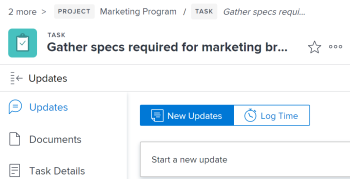

# 21.2 Andere verbeteringen

Op deze pagina worden alle andere verbeteringen beschreven die zijn aangebracht met de release 21.2 voor de voorvertoningsomgeving. Deze verbeteringen zullen beschikbaar worden gesteld in de productieomgeving in de week van 10 mei 2021. Voor een lijst met alle wijzigingen die beschikbaar zijn in de release 21.2 raadpleegt u [21.2 Overzicht van de release](../../../product-announcements/product-releases/21.2-release-activity/21-2-release-overview.md).

## We zijn nu officieel Adobe Workfront

Workfront heeft zijn naam gewijzigd in Adobe Workfront.

De meest prominente gebieden in de Adobe Workfront-toepassing en onze klantgerichte websites worden nu bijgewerkt. Andere gebieden worden binnenkort bijgewerkt.

**Bijgewerkte gebieden**

* Aanmeldingsscherm, Navigatie boven, Proofing
* Layout Templates UI, Main Menu, Custom Forms Export (alleen beschikbaar in de nieuwe Adobe Workfront-ervaring)
* Workfront mobiele app (iOS en Android)

Gebieden die binnenkort worden bijgewerkt

* Apps voor bureaublad en mobiele apparaten controleren
* PDF exporteert voor lijsten en rapporten
* Pictogram voor favicon op het tabblad van de browser

**Later bijwerken gebieden**

* E-mailmeldingen

## Validatie van lijst van gewenste personen e-mail

>[!NOTE]
>
>Alleen beschikbaar in de nieuwe Adobe Workfront-ervaring.

Als u de lijst van gewenste personen van de e-mail gebruikt, worden de nieuwe en bijgewerkte gebruikers e-mailadressen nu bevestigd tegen de lijst van gewenste personen. Wanneer u een nieuwe gebruiker toevoegt of een bestaande gebruiker bewerkt en een e-maildomein invoert dat niet in de lijst van gewenste personen staat, verschijnt er een bericht met de melding dat de gebruiker geen e-mailberichten ontvangt. U kunt het gebruikersprofiel nog steeds opslaan, maar u moet het domein aan de lijst van gewenste personen toevoegen zodat de gebruiker e-mails ontvangt.

Zie voor meer informatie [Gebruikersprofiel bewerken](../../../administration-and-setup/add-users/create-and-manage-users/edit-a-users-profile.md).

## Nieuwe vormgeving voor kopteksten van objecten

>[!NOTE]
>
>Deze functie is op 10 maart 2020 in de productieomgeving geïntroduceerd.
>
>Deze functie is alleen beschikbaar in de nieuwe Adobe Workfront-ervaring.

Om de hiërarchie van informatie verder te versterken en gebruikers te helpen beter begrijpen welke pagina zij zijn, heeft elke objecten kopbal nu:

* Kleurrijke, modernere pictogrammen voor elk objecttype
* Het objecttype dat boven de naam van het object wordt weergegeven
* Een bijgewerkte lettertypestijl en tekstgrootte
* Andere kleine stijlwijzigingen

Eerder was er geen pictogram en werd rechts van de objecttitel een badge met de objectnaam weergegeven.

De paginakoppen van gebieden in de nieuwe ervaring van Workfront—zoals Verbeterde analysemogelijkheden, het Beheer van het Middel, en anderen—hebben ook dit bijgewerkte uiterlijk.

Ga voor meer informatie over de nieuwe objectkoppen in de nieuwe Workfront-ervaring naar [Nieuwe objectkoppen](../../../workfront-basics/the-new-workfront-experience/new-object-headers.md).

## Updates voor reacties op zoekacties naar objectstatus

Workfront slaat nu objectstatussen op een nieuwe manier op.

Deze wijzigingen hebben geen invloed op de manier waarop verzoeken om statuszoekopdrachten worden gedaan. API-aanvragen die een zoekopdracht naar objectstatus bevatten, retourneren echter een onvolledige lijst met groepsstatussen.

Zie voor meer informatie [Core API-wijzigingen: Antwoorden van statuszoekacties](../../../wf-api/api/api-changes-search.md) .

## Betalingen voor abonnementen voor gebeurtenissen bijgewerkt met alle velden die eindigen op de id

Alle payloads met abonnementen voor gebeurtenissen bevatten nu elk veld dat eindigt op &#39;ID&#39;.

Het is belangrijk om op te merken dat elk voorwerp zijn eigen unieke reeks bijbehorende gebieden heeft, die een unieke reeks bijbehorende gebieden omvat die in identiteitskaart beëindigen. Dit betekent dat elke lading alle bijbehorende gebieden van dat voorwerp bevat die in identiteitskaart eindigen, elk voorwerp een verschillende reeks gebieden heeft die in identiteitskaart eindigen.

## Blauwdrukbètaversie is nu beschikbaar in Voorvertoning

>[!NOTE]
>
>Deze functionaliteit zal niet over het algemeen beschikbaar op het milieu van de Productie tot de 21.3 versie, later dit jaar zijn. Alleen beschikbaar in de nieuwe Adobe Workfront-ervaring.

De blauwdrukken verstrekt basisbouwstenen om u te helpen een werkbeheersysteem tot stand brengen dat met u groeit. Systeembeheerders kunnen door de blauwdrukcatalogus bladeren en gebruiksklare projectsjablonen installeren.

Zie voor meer informatie [Blauwdrukken](../../../administration-and-setup/blueprints/blueprints.md).
