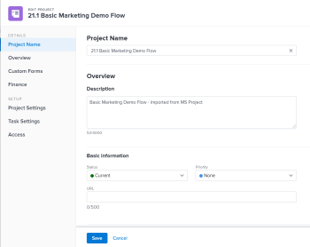

# 21.2 Projectverbeteringen

Op deze pagina worden alle projectverbeteringen beschreven die zijn aangebracht met de release 21.2 voor de voorvertoningsomgeving. Deze verbeteringen zullen beschikbaar worden gesteld in de productieomgeving in de week van 10 mei 2021. Voor een lijst van alle veranderingen beschikbaar met de versie 21.2, zie [ 21.2 Overzicht van de Versie ](../../../product-announcements/product-releases/21.2-release-activity/21-2-release-overview.md).

## Nieuwe interface voor het maken en bewerken van terugkerende taken

>[!NOTE]
>
>Alleen beschikbaar in de nieuwe Adobe Workfront-ervaring.

Als deel van het herontwerp van de Nieuwe en geef Taakdozen uit, hebben wij de capaciteit toegevoegd om een nieuwe taak te maken terugkomend evenals de ouder van een terugkomende taak uit te geven. Deze functionaliteit is niet opgenomen in het nieuwe ontwerp van het taakvak Nieuw en Bewerken dat eerder is uitgebracht.

Voor meer informatie, zie [ terugkomende taken ](../../../manage-work/tasks/create-tasks/create-recurring-tasks.md) creëren.

Deze eigenschap is nu inbegrepen in de [ Grondbeginselen van de Planner voor de nieuwe ervaring van Workfront, Deel 2: Plan een project ](https://one.workfront.com/s/learningpath3/planner-fundamentals-for-the-new-workfront-experience-part-2-plan-a-project-MCDUWIMXC3JRAAFGHX7QYIN2BVDI) het leren weg op Workfront Één.

## Nieuwe knoppen beschikbaar in de koptekst Projecten

>[!NOTE]
>
>Deze functie is nog niet beschikbaar in Voorvertoning. Deze wordt op 29 april 2021 vrijgegeven voor de voorvertoningsomgeving.

Om u toe te staan om de lijst van projecten op de pagina van Projecten snel te filtreren, zijn er twee nieuwe knopen in de kopbal die u toestaan om de Projecten snel toe te passen ik ben of Projecten I Eigen filter.

Deze eigenschap is nu inbegrepen in de [ Grondbeginselen van de Planner voor de nieuwe ervaring van Workfront, Deel 1: Creeer een project ](https://one.workfront.com/s/learningpath5/planner-fundamentals-for-the-new-workfront-experience-MCTOONVRZDLRD3FAIX6SQYSUAHDE) het leren weg op Workfront Één.

## Een artikel of probleem verplaatsen of verwijderen via het Klembord

>[!NOTE]
>
>Alleen beschikbaar in de nieuwe Adobe Workfront-ervaring.

U kunt een artikel of uitgave nu van het Klembord verplaatsen door op het pictogram Meer van een artikel of uitgiftekaart te klikken en Verplaatsen naar te selecteren. Als u herhalingen in de toekomst hebt gedefinieerd, kunt u het item naar een andere herhaling verplaatsen. U kunt het punt aan de achterstand van uw team ook bewegen.

U kunt ook een artikel verwijderen of een uitgave rechtstreeks vanaf het scherm verwijderen door op het pictogram Meer op een kaart te klikken en Verwijderen te selecteren. Wanneer u een artikel of uitgave verwijdert, wordt het artikel of de uitgave 30 dagen naar de prullenbak verplaatst en kan het alleen door de systeembeheerder worden hersteld.

Voor meer informatie, zie [ verhalen en kwesties op het board van het Trommel beheren ](../../../agile/use-scrum-in-an-agile-team/scrum-board/manage-scrum-board.md).

## Nieuw bewerkingsvak

>[!NOTE]
>
>Alleen beschikbaar in de nieuwe Adobe Workfront-ervaring.

Als onderdeel van het bijwerken van de vormgeving van de nieuwe Workfront-ervaring, hebben we het bewerkingsvak Issue opnieuw ontworpen. U kunt het nieuwe vak Uitgave bewerken openen vanuit een afzonderlijke uitgave of wanneer u één uitgave bewerkt vanuit een lijst.

Naast een bijgewerkte look and feel zijn de volgende wijzigingen ook beschikbaar in het vak Uitgave.

* U kunt uw lay-outsjabloon eenmaal aanpassen en deze aanpassingen weerspiegelen op de pagina Details en in het vak Probleem bewerken.
* Afzonderlijke aangepaste formuliernamen zijn nu beschikbaar in het linkervenster in het vak Uitgave bewerken en u kunt elk formulier daar snel openen.
* We hebben het veld Geplande uren toegevoegd aan de sectie Toewijzingen om het gemakkelijker te maken om de tijd bij te werken waarvoor mogelijk bronnen nodig zijn om de kwestie te voltooien.
* We hebben de functionaliteit voor opmerkingen verwijderd uit het scherm Probleem bewerken om redundantie te voorkomen in de sectie Updates.

## De knoppen Opslaan en Annuleren voor de vakken Bewerken en Nieuw object zijn verplaatst

>[!NOTE]
>
>Alleen beschikbaar in de nieuwe Adobe Workfront-ervaring.

Op basis van gebruikersfeedback hebben we de knoppen Opslaan en Annuleren voor projecten en taken naar de linkerbenedenhoek van de vakken Object bewerken en Nieuw object verplaatst.

Vóór deze verbetering, werden deze knopen gevestigd in de hoger-juiste hoek van deze dozen.

Raadpleeg de volgende artikelen voor informatie over het bewerken van projecten of taken:

* [ geeft projecten ](../../../manage-work/projects/manage-projects/edit-projects.md) uit
* [Taken bewerken](../../../manage-work/tasks/manage-tasks/edit-tasks.md)

## Verbetering van aangepaste formulieren

>[!NOTE]
>
>Deze functie is alleen beschikbaar in de nieuwe Adobe Workfront-ervaring.

Voor een betere ervaring bij het invullen van een aangepast formulier hebben we de manier verbeterd waarop lange aangepaste veldlabels worden weergegeven. Wanneer er voldoende horizontale ruimte is om deze in hun geheel weer te geven, worden deze labels niet meer afgekapt.

Voor informatie over het invullen van douaneformulieren, zie [ informatie op de gebieden van de douaneformulier ](../../../workfront-basics/work-with-custom-forms/edit-custom-forms.md) uitgeven.

## De primaire contactpersoon van een probleem is nu zichtbaar in het gebied Projectdetails

>[!NOTE]
>
>Deze functie is op 10 maart 2020 in de productieomgeving geïntroduceerd.

Wanneer het omzetten van een kwestie in een project, wordt de aanvrager van de kwestie overgebracht naar het project en zichtbaar in het Omgezette gebied van de Afgever van de Uitgave. U kunt dit gebied in het gebied van de Details van het Project, evenals in projectrapporten en lijsten bekijken. Deze informatie is ook zichtbaar voor taken, alleen in rapporten en lijsten.

U moet dit veld inschakelen in uw lay-outsjabloon om het te kunnen bekijken in de nieuwe Adobe Workfront-ervaring voor projecten.

Voor informatie over het omzetten van kwesties, zie [ Overzicht van het omzetten van kwesties in Adobe Workfront ](../../../manage-work/issues/convert-issues/convert-issues.md).

## Informatie weergeven over een groep die u wilt toewijzen aan een portfolio, programma of team

>[!NOTE]
>
>Deze functie is alleen beschikbaar in de nieuwe Adobe Workfront-ervaring.

Wanneer u een groep aan een portefeuille, een programma, of een team toewijst, hebben wij het gemakkelijker gemaakt om ervoor te zorgen dat u juiste groep-u het infopictogram naast de naam van de groep kunt klikken om tooltip te tonen die de hiërarchie van groepen boven het, samen met de beheerders van de groep bevat. Afhankelijk van de details die voor de groep worden gevormd, zou u de Bedrijfsleider en beschrijving van de groep kunnen ook zien.

Dit is de zelfde functionaliteit die onlangs werd vrijgegeven om u te helpen een groep identificeren die u aan een project moet toewijzen, zoals die in [ wordt verklaard uitgeeft projecten ](../../../manage-work/projects/manage-projects/edit-projects.md).

Raadpleeg de volgende artikelen voor meer informatie:

* [ creeer een portefeuille ](../../../manage-work/portfolios/create-and-manage-portfolios/create-portfolios.md)
* [ creeer een programma ](../../../manage-work/portfolios/create-and-manage-programs/create-program.md)
* [Een team maken](../../../people-teams-and-groups/create-and-manage-teams/create-a-team.md)

## Tekstopmaak in aangepaste velden wordt nu weergegeven in alle Classic-lijsten en -rapporten van Workfront

>[!NOTE]
>
>Deze functie is alleen beschikbaar in Adobe Workfront Classic.

Gebruikers kunnen nu in aangepaste velden tekstopmaak, zoals vette letters, lijsten met opsommingstekens en hyperlinks, bekijken wanneer ze lijsten en rapporten weergeven.

Eerder in Workfront Classic was tekstopmaak alleen zichtbaar in de lijsten Project, Taak en Uur.

Voor informatie over het formatteren van tekst op een douanegebied, zie [ een douanevorm ](https://one.workfront.com/s/document-item?bundleId=workfront-classic&amp;topicId=Content%2FAdministration_and_Setup%2FCustomize_Workfront%2FCreate_manage_Custom_Forms%2Fcreate-a-custom-form.html) creëren.

Voor informatie over het tonen van informatie in lijsten, zie [ begonnen worden met lijsten ](https://one.workfront.com/s/document-item?bundleId=workfront-classic&amp;topicId=Content%2FWorkfront_basics%2FNavigate_Workfront%2FWorkfront_Navigation%2Fview-items-in-a-list.html&amp;_LANG=en).

## Nieuw taakvenster Bewerken

>[!NOTE]
>
>Alleen beschikbaar in de nieuwe Adobe Workfront-ervaring.

Als onderdeel van het bijwerken van de vormgeving van de nieuwe Workfront-ervaring, hebben we het taakvak Bewerken opnieuw ontworpen. U kunt het nieuwe vak Taak bewerken openen vanuit een afzonderlijke taak of wanneer u één taak bewerkt vanuit een lijst.

>[!NOTE]
>
>Als onderdeel van deze update wordt het veld Bronbereik verwijderd uit de nieuwe Adobe Workfront-ervaring.

Naast een bijgewerkte look and feel zijn de volgende wijzigingen ook beschikbaar in het vak Taak bewerken:

* U kunt uw lay-outsjabloon eenmaal aanpassen en deze aanpassingen weerspiegelen op de pagina Details en in het vak Taak bewerken.
* Afzonderlijke aangepaste formuliernamen zijn nu beschikbaar in het linkerdeelvenster van het vak Taak bewerken en u kunt elk formulier daar snel openen.
* We hebben de velden Duur, Duur en Geplande uren toegevoegd aan de sectie Toewijzingen om consistentie te garanderen bij het bijwerken van toewijzingen voor verschillende soorten tijdsduur en de tijd of duur die ze aan de taak besteden.
* We hebben de functionaliteit voor opmerkingen verwijderd uit het taakscherm Bewerken om redundantie te voorkomen in de sectie Updates.

Voor informatie over het nieuwe Edit vakje van de Taak, zie [ taken ](../../../manage-work/tasks/manage-tasks/edit-tasks.md) uitgeven.

## Nieuw taakvak

>[!NOTE]
>
>Alleen beschikbaar in de nieuwe Adobe Workfront-ervaring.

Als onderdeel van het bijwerken van de vormgeving van de nieuwe Workfront-ervaring, hebben we de New Task Box opnieuw ontworpen. U kunt tot het Nieuwe vakje van de Taak toegang hebben wanneer u een taak aan een project door Nieuwe Taak bij de bovenkant van de taaklijst te klikken toevoegt.

>[!NOTE]
>
>Als onderdeel van deze update wordt het veld Bronbereik verwijderd uit de nieuwe Adobe Workfront-ervaring.

Naast een bijgewerkte look and feel zijn de volgende wijzigingen ook beschikbaar in de werkstroom Nieuwe taak:

* Een kleiner scherm van de Nieuwe Taak is beschikbaar wanneer u eerst op Nieuwe Taak in een projectlijst met een beperkt aantal gebieden klikt om bij te werken om u tijd te besparen wanneer u snel taken aan projecten wilt toevoegen. U kunt het volledige nieuwe taakformulier openen dat alle taakvelden bevat waarvan de naam is gewijzigd in Taak maken.
* U kunt uw Malplaatje van de Lay-out eens aanpassen en die aanpassingen in zowel de pagina van Details als de Nieuwe Taakdoos weerspiegelen.
* We hebben de velden Duur, Duur en Geplande uren toegevoegd aan de sectie Toewijzingen om consistentie te garanderen bij het bijwerken van toewijzingen en de tijd of duur die ze aan de taak besteden.

Voor informatie over de nieuwe doos van de Taak, zie [ tot taken in een project ](../../../manage-work/tasks/create-tasks/create-tasks-in-project.md) leiden.

## Teams deactiveren die niet meer in gebruik zijn

>[!NOTE]
>
>Deze functie wordt op 15 april 2021 voor de release 21.2 uitgebracht aan Production.

U kunt nu teams deactiveren die u niet meer gebruikt. Wanneer u een team deactiveert, verschijnt het niet meer in de meeste typeahead, onderzoeksgebieden, of gemeenschappelijke menu&#39;s binnen Workfront. Nochtans, worden de historische gegevens verbonden aan het team behouden.

Voor meer informatie, zie [ een team ](../../../people-teams-and-groups/create-and-manage-teams/deactivate-a-team.md) deactiveren.

## Bijwerken naar de instelling waarmee gebruikers taken en problemen met geregistreerde uren kunnen verwijderen

>[!NOTE]
>
>Alleen beschikbaar in de nieuwe Adobe Workfront-ervaring.

Om u een consistente ervaring te bieden voor alle objecten, hebben we de manier gewijzigd waarop de instelling Gebruikers toestaan taken en problemen te verwijderen met geregistreerde uren werkt in Workfront. Nu, wanneer uw Workfront of groepsbeheerder de voorkeur van de Taak &amp; van de Uitgave onbruikbaar maakt, kunt u projecten niet meer schrappen die taken of kwesties met geregistreerde uren bevatten.

Voorafgaand aan deze verandering, verhinderde het onbruikbaar maken van het plaatsen gebruikers enkel taken of kwesties te schrappen, niet projecten.

Voor meer informatie, zie [ taak voor het hele systeem vormen en voorkeur uitgeven ](../../../administration-and-setup/set-up-workfront/configure-system-defaults/set-task-issue-preferences.md).

